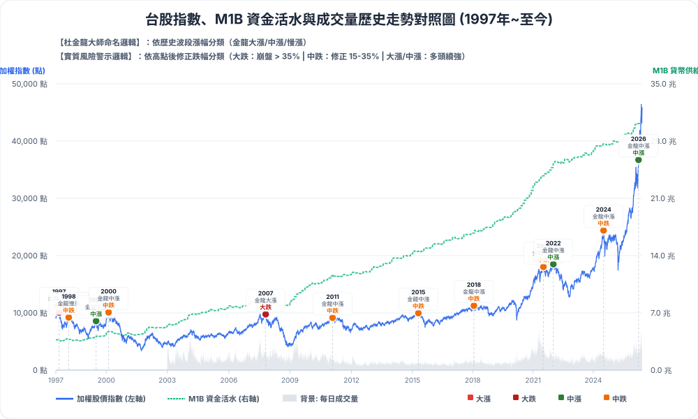
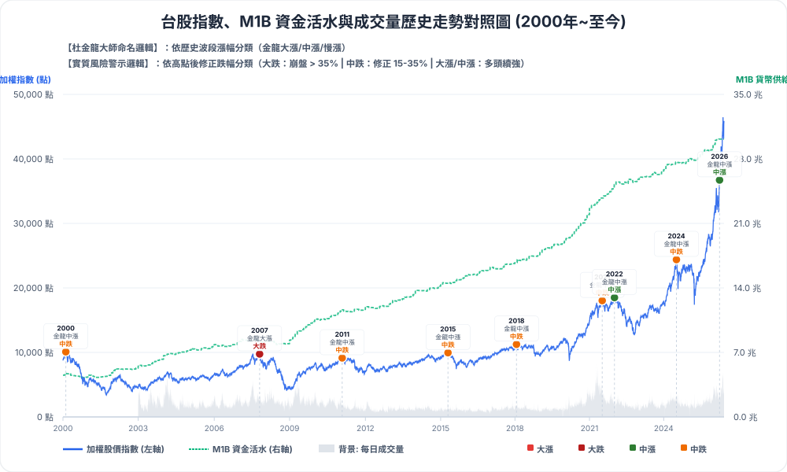
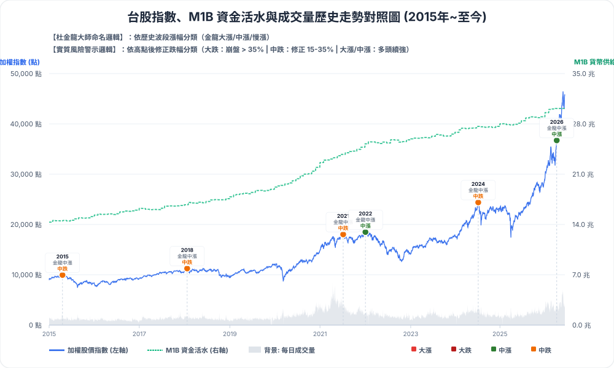
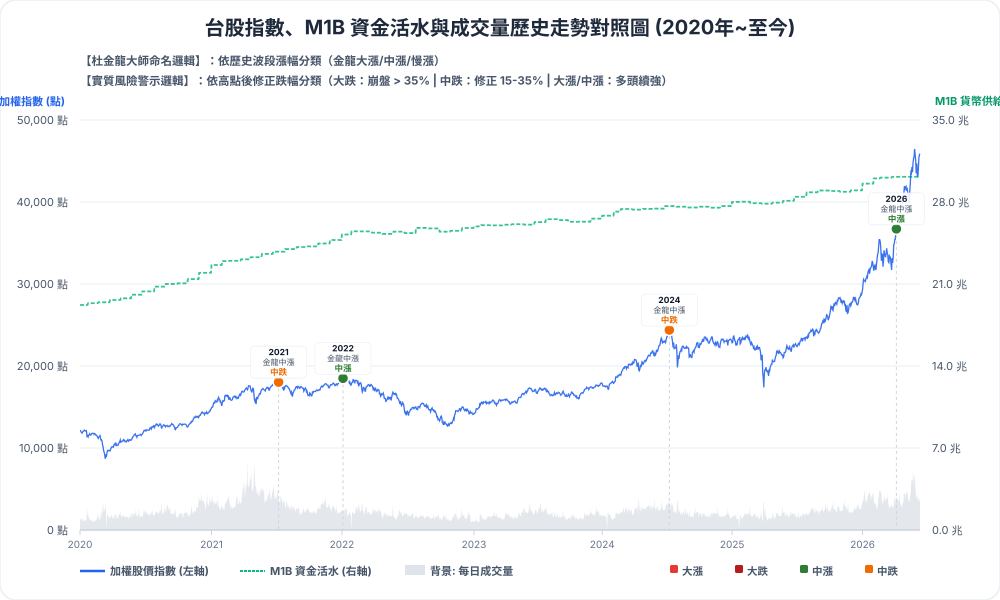

# 表 19-7 頭部第一波最大日成交量佔貨幣供給額 (M1B) 比重分析報告

此報告針對 `m1b_peak_analysis.py` 的執行結果與產生的數據檔 [m1b_peak_result.csv](m1b_peak_result.csv) 進行整理與分析。

> [!NOTE]
> **已修復的 Windows 相容性問題**
> 原本的 `m1b_peak_analysis.py` 在 Windows 環境中執行時，因為預設的標準輸出編碼（如 `cp1252`）無法支援中文字元，會導致 `UnicodeEncodeError`。我們已在腳本中加入 `sys.stdout.reconfigure(encoding='utf-8')` 來動態重設輸出編碼，確保在所有終端機環境中均能順利執行。

---

## 📊 分析結果摘要表

以下為歷史各波段高點（從西元 1989 年至 2026 年）的上市/上櫃最大日成交量與 M1B 日平均比重：

### 📈 歷史走勢對照圖 (提供四種時間跨度對照)
* **1997 年至今 (完整波段歷史數據)**:
  
* **2000 年至今 (聚焦千禧年後歷史數據)**:
  
* **2015 年至今 (聚焦近十年歷史數據)**:
  
* **2020 年至今 (聚焦疫情後歷史數據)**:
  

| 市場 | 金龍類型 | 實質類型 | 波段高點日期 | 波段高點 (點) | 最大日成交量 (億元) | 最大日成交量日期 | M1B 日平均 (億元) | 佔 M1B 比重 % |
| :--- | :--- | :--- | :---: | :---: | :---: | :---: | :---: | :---: |
| **上市** | 金龍大漲 | 大漲 | 1989/09/26 | 10,843.96 | 1,941.71 | 1989/08/28 | 18,675 | **10.40%** |
| **上市** | 金龍大漲 | 大漲 | 1990/02/12 | 12,682.41 | 2,162.02 | 1990/03/16 | 19,658 | **11.00%** |
| **上市** | 金龍大漲 | 大漲 | 1997/08/27 | 10,256.10 | 2,968.88 | 1997/07/17 | 37,161 | 7.99% |
| **上櫃** | 金龍大漲 | 大漲 | 1997/08/06 | 348.50 | 299.20 | 1997/08/05 | 36,965 | 0.81% |
| 📊 **市場小計** | | | **1997/08** | | **3,268.08** | | | **8.79%** |
| **上市** | 金龍慢漲 | 中跌 | 1998/02/27 | 9,378.52 | 2,776.92 | 1998/02/06 | 38,484 | 7.22% |
| **上櫃** | 金龍慢漲 | 中跌 | 1998/02/24 | 286.57 | 196.25 | 1998/02/23 | 38,484 | 0.51% |
| 📊 **市場小計** | | | **1998/02** | | **2,973.17** | | | **7.73%** |
| **上市** | 金龍中漲 | 中漲 | 1999/07/03 | 8,710.71 | 2,298.81 | 1999/06/23 | 40,495 | 5.68% |
| **上櫃** | 金龍中漲 | 中漲 | 1999/05/11 | 184.08 | 120.47 | 1999/04/10 | 39,542 | 0.30% |
| 📊 **市場小計** | | | **1999/05-07** | | **2,419.28** | | | **5.97%** |
| **上市** | 金龍中漲 | 中跌 | 2000/02/18 | 10,393.59 | 3,256.01 | 2000/01/11 | 45,332 | 7.18% |
| **上櫃** | 金龍中漲 | 中跌 | 2000/04/11 | 329.47 | 571.45 | 2000/04/11 | 46,928 | 1.22% |
| 📊 **市場小計** | | | **2000/02-04** | | **3,827.46** | | | **8.44%** |
| **上市** | 金龍大漲 | 大跌 | 2007/10/30 | 9,859.62 | 3,219.16 | 2007/07/26 | 83,378 | 3.86% |
| **上櫃** | 金龍大漲 | 大跌 | 2007/07/26 | 238.35 | 1,067.55 | 2007/07/26 | 83,378 | 1.28% |
| 📊 **市場小計** | | | **2007/07-10** | | **4,286.71** | | | **5.14%** |
| **上市** | 金龍中漲 | 中跌 | 2011/01/28 | 9,220.69 | 1,391.96 | 2011/01/06 | 114,898 | 1.21% |
| **上櫃** | 金龍中漲 | 中跌 | 2011/03/04 | 149.33 | 211.57 | 2011/01/26 | 114,898 | 0.18% |
| 📊 **市場小計** | | | **2011/01-03** | | **1,603.53** | | | **1.40%** |
| **上市** | 金龍中漲 | 中跌 | 2015/04/28 | 10,014.28 | 1,686.37 | 2015/04/24 | 145,014 | 1.16% |
| **上櫃** | 金龍中漲 | 中跌 | 2015/03/24 | 148.66 | 277.22 | 2015/03/24 | 145,171 | 0.19% |
| 📊 **市場小計** | | | **2015/03-04** | | **1,963.59** | | | **1.35%** |
| **上市** | 金龍中漲 | 中跌 | 2018/01/23 | 11,270.18 | 1,649.31 | 2018/01/23 | 167,487 | 0.98% |
| **上櫃** | 金龍中漲 | 中跌 | 2018/01/25 | 154.58 | 480.57 | 2018/01/23 | 167,487 | 0.29% |
| 📊 **市場小計** | | | **2018/01** | | **2,129.88** | | | **1.27%** |
| **上市** | 金龍中漲 | 中跌 | 2021/07/15 | 18,034.19 | 7,828.25 | 2021/05/12 | 232,884 | 3.36% |
| **上櫃** | 金龍中漲 | 中跌 | 2021/07/27 | 225.05 | 1,681.23 | 2021/07/13 | 237,605 | 0.71% |
| 📊 **市場小計** | | | **2021/07** | | **9,509.48** | | | **4.08%** |
| **上市** | 金龍中漲 | 中漲 | 2022/01/05 | 18,619.61 | 3,434.53 | 2022/01/05 | 247,580 | 1.39% |
| **上櫃** | 金龍中漲 | 中漲 | 2022/01/03 | 238.92 | 954.92 | 2022/01/07 | 247,580 | 0.39% |
| 📊 **市場小計** | | | **2022/01** | | **4,389.45** | | | **1.77%** |
| **上市** | 金龍中漲 | 中跌 | 2024/07/11 | 24,416.67 | 7,244.81 | 2024/04/19 | 273,471 | 2.65% |
| **上櫃** | 金龍中漲 | 中跌 | 2024/07/17 | 283.32 | 1,664.16 | 2024/03/07 | 274,026 | 0.61% |
| 📊 **市場小計** | | | **2024/07** | | **8,908.97** | | | **3.26%** |
| **上市** | 金龍中漲 | 中漲 | 2026/04/15 | 42,408.66 | 15,240.13 | 2026/05/06 | 300,861 | **5.07%** |
| **上櫃** | 金龍中漲 | 中漲 | 2026/05/14 | 431.74 | 4,274.49 | 2026/05/06 | 300,861 | **1.42%** |
| 📊 **市場小計** | | | **2026/04-05** | | **19,514.62** | | | **6.49%** |

---

## 💡 什麼是「市場小計」與其總經意義？

在分析中，**「市場小計」**列在每個波段的上市、上櫃數據之後，具有極為關鍵的總體經濟與資金熱度衡量價值。

### 1. 數據上的計算方式
*   **成交量加總**：將該波段中「上市（集中市場）最大單日成交量」與「上櫃（店頭市場）最大單日成交量」直接**相加**。由於兩市場的最大成交量日期不一定在同一天，此加總數值代表整個台灣證券市場在該頭部期間，所能爆出的最大單日資金成交動能的總和。
*   **M1B 比重 %**：
    $$	ext{市場小計比重} = rac{	ext{上市最大日成交量} + 	ext{上櫃最大日成交量}}{	ext{當期市場可動用之 M1B 資金日平均}} 	imes 100\%$$

### 2. 核心分析價值
1.  **消除「上市與上櫃的資金排擠效應」**
    資金在上市集中市場與上櫃店頭市場之間是自由流動的。有時上市大盤股進入高檔整理而量縮，但投機資金可能正瘋狂湧入中小型上櫃股票，爆出天量。如果只單看上市成交量佔 M1B 的比重，可能會嚴重低估整體市場的投機熱度。將兩者相加，能客觀呈現**整體股票市場吸納資金的總胃口**。
2.  **作為終極過熱指標（頭部警戒線）**
    M1B（狹義貨幣供給額）代表民間隨時可投入股市的流動性資金活水。將市場小計成交量與 M1B 進行對比，是研判股市是否見頂的有效工具：
    *   **極度過熱（歷史大頭部）**：當市場小計佔 M1B 的比重達到 **8% ~ 11%** 的極端水位（如 1990 年的 11.00%、1997 年的 8.79%、2000 年的 8.44%）時，代表全市場的投機熱度已經把民間隨時可用的流動性資金高度消耗。一旦後續資金動能難以維持，股市通常面臨大崩盤或大回檔的危機。
    *   **溫和健康（中繼頭部）**：若小計比重僅在 **1% ~ 3%** 左右（如 2011 年的 1.40%、2018 年的 1.27%），則代表資金動能尚屬溫和，此時的高點可能屬於中繼性質而非歷史大頂。

---

## 📈 核心發現與洞察

1. **西元 2026 年最新數據分析**：
   - 集中市場（上市）於 `2026/04/15` 達到波段高點 **42,408.66 點**，最大日成交量發生於 `2026/05/06` 的 **15,240.13 億元**。
   - 店頭市場（上櫃）於 `2026/05/14` 達到高點 **431.74 點**，最大日成交量同為 `2026/05/06` 的 **4,274.49 億元**。
   - 該日的**市場小計成交量達 19,514.62 億元**，佔 2026 年 3 月 M1B（300,861 億元）比重高達 **6.49%**。這比 2021 年度 (4.08%)、2022 年度 (1.77%) 以及 2024 年度 (3.26%) 都來得更高，但尚未達到歷史極端高點（如 1989 年 10.40%、1990 年 11.00% 或 2000 年的 8.44%）的水準。

2. **新增歷史重要波段與分類修正**：
   - 本次更新補齊了 2000 年至 2021 年之間的四個重要循環頭部（2007 年、2011 年、2015 年、2018 年），並正式引入了**「大跌」**與**「中跌」**分類以更貼近歷史實況。
   - 其中，**2007 年 (2007/07-10)** 波段高點隨後發生 2008 年金融海嘯大崩盤（跌幅達 60%），因此歸類為**「大跌」**。在最大成交高峰日，合計成交量達 **4,286.71 億元**，佔當時 M1B 比重高達 **5.14%**，代表海嘯前市場資金過熱的水準。
   - 其他如 1998 年、2000 年、2011 年、2015 年、2018 年、2021 年及 2024 年等波段，其後續皆為中期回檔修正（跌幅介於 17%~33%），因此歸類為**「中跌」**，這有助於區分中繼整理與歷史性大頂。

3. **潛在最大成交量推估**：
   - 以 2026 年 3 月 M1B 規模為基準，若未來達到歷史高檔熱度（如 2000/02-04 波段的 8.40% 水準），推估市場最大單日成交量可能會達到 **25,272 億元** 左右。

> [!TIP]
> **資料來源與 API**：
> - **M1B 供給額**：來自中央銀行 [CBC EF15M01](https://www.cbc.gov.tw/public/data/OpenData/%E7%B6%93%E7%A0%94%E8%99%95/EF15M01.csv) 開放資料。
> - **上市成交金額**：透過證交所 (TWSE) FMTQIK API 取得。
> - **上櫃成交金額**：透過櫃買中心 (TPEX) st41 API 取得。
