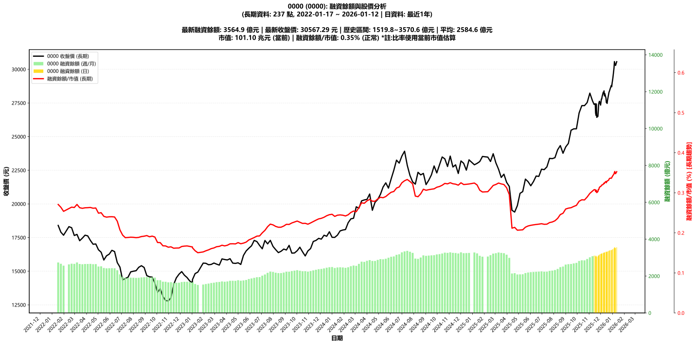

# :chart_with_upwards_trend: 0000 (0000) 融資餘額報告

!!! info "基本資訊"
    **:building_construction: 名稱**: 0000
    **:identification_card: 代號**: 0000
    **:calendar: 分析期間**: 2025-07-18 ~ 2026-01-09 (共 242 個交易日)
    **:clock3: 最新資料**: 2026-01-09
    **🕒 更新時間**: 2026-01-11 20:28:48 CST

## :moneybag: 融資餘額現況

| :chart: 指標 | :1234: 數值 | :traffic_light: 狀態 |
|:------------:|:----------:|:-------------------:|
| **最新融資餘額** | 3514.9 億元 (-0 張) | - |
| **最新收盤價** | 30288.96 元 | - |
| **市值** | 101.10 兆元 | - |
| **融資餘額/市值** | 0.35% | 🟡 正常 |
| **日變化 (DoD)** | -9.0 億元 (-0.25%) | 📉 |
| **週變化 (WoW)** | +48.6 億元 (+1.40%) | 📈 |
| **月變化 (MoM)** | +238.0 億元 (+7.26%) | 📈 |

---

## :bar_chart: 歷史統計

| :chart: 指標 | :1234: 數值 |
|:------------:|:----------:|
| **歷史最高** | 3570.6 億元 |
| **歷史最低** | 2081.5 億元 |
| **平均值** | 2732.6 億元 |
| **標準差** | 451.0 億元 |
| **當前相對位置** | 96.3% |

---

## :chart_with_upwards_trend: 融資餘額趨勢圖

    

---

## :clipboard: 詳細歷史記錄 (最近30日)

<table class="sortable-table">
<thead>
<tr>
<th>:calendar: 日期</th>
<th>:money_with_wings: 收盤價(元)</th>
<th>:chart: 漲跌(元)</th>
<th>:chart_with_upwards_trend: 漲跌(%)</th>
<th>:package: 融資餘額(億元)</th>
<th>:package: 融資餘額(張)</th>
<th>:arrow_up_down: 融資增減(張)</th>
<th>:chart: 融券餘額(張)</th>
<th>:balance_scale: 券資比(%)</th>
</tr>
</thead>
<tbody>
<tr>
<td>2026-01-09</td>
<td>30288.96</td>
<td>🔻 -71.59</td>
<td>-0.24%</td>
<td>3514.9</td>
<td>-0</td>
<td>📉 -9</td>
<td>-7</td>
<td>3.99%</td>
</tr>
<tr>
<td>2026-01-08</td>
<td>30360.55</td>
<td>🔻 -74.92</td>
<td>-0.25%</td>
<td>3523.9</td>
<td>-1</td>
<td>📉 -47</td>
<td>-1</td>
<td>4.28%</td>
</tr>
<tr>
<td>2026-01-07</td>
<td>30435.47</td>
<td>🔻 -140.83</td>
<td>-0.46%</td>
<td>3570.6</td>
<td>1</td>
<td>📈 +25</td>
<td>-3</td>
<td>4.27%</td>
</tr>
<tr>
<td>2026-01-06</td>
<td>30576.30</td>
<td>🔺 +471.26</td>
<td>+1.57%</td>
<td>3545.5</td>
<td>1</td>
<td>📈 +36</td>
<td>8</td>
<td>4.41%</td>
</tr>
<tr>
<td>2026-01-05</td>
<td>30105.04</td>
<td>🔺 +755.23</td>
<td>+2.57%</td>
<td>3509.5</td>
<td>1</td>
<td>📈 +43</td>
<td>1</td>
<td>4.11%</td>
</tr>
<tr>
<td>2026-01-02</td>
<td>29349.81</td>
<td>🔺 +386.21</td>
<td>+1.33%</td>
<td>3466.3</td>
<td>1</td>
<td>📈 +32</td>
<td>4</td>
<td>4.11%</td>
</tr>
<tr>
<td>2025-12-31</td>
<td>28963.60</td>
<td>🔺 +256.47</td>
<td>+0.89%</td>
<td>3434.1</td>
<td>1</td>
<td>📈 +20</td>
<td>0</td>
<td>3.97%</td>
</tr>
<tr>
<td>2025-12-30</td>
<td>28707.13</td>
<td>🔻 -103.76</td>
<td>-0.36%</td>
<td>3413.7</td>
<td>0</td>
<td>📈 +15</td>
<td>2</td>
<td>4.00%</td>
</tr>
<tr>
<td>2025-12-29</td>
<td>28810.89</td>
<td>🔺 +254.87</td>
<td>+0.89%</td>
<td>3398.9</td>
<td>-0</td>
<td>📉 -4</td>
<td>0</td>
<td>3.94%</td>
</tr>
<tr>
<td>2025-12-26</td>
<td>28556.02</td>
<td>🔺 +184.04</td>
<td>+0.65%</td>
<td>3403.4</td>
<td>0</td>
<td>📈 +14</td>
<td>5</td>
<td>3.92%</td>
</tr>
<tr>
<td>2025-12-24</td>
<td>28371.98</td>
<td>🔺 +61.51</td>
<td>+0.22%</td>
<td>3389.0</td>
<td>0</td>
<td>📈 +13</td>
<td>4</td>
<td>3.75%</td>
</tr>
<tr>
<td>2025-12-23</td>
<td>28310.47</td>
<td>🔺 +160.83</td>
<td>+0.57%</td>
<td>3375.9</td>
<td>1</td>
<td>📈 +24</td>
<td>-1</td>
<td>3.63%</td>
</tr>
<tr>
<td>2025-12-22</td>
<td>28149.64</td>
<td>🔺 +453.29</td>
<td>+1.64%</td>
<td>3352.0</td>
<td>1</td>
<td>📈 +19</td>
<td>-7</td>
<td>3.66%</td>
</tr>
<tr>
<td>2025-12-19</td>
<td>27696.35</td>
<td>🔺 +227.82</td>
<td>+0.83%</td>
<td>3333.1</td>
<td>0</td>
<td>📈 +9</td>
<td>0</td>
<td>3.93%</td>
</tr>
<tr>
<td>2025-12-18</td>
<td>27468.53</td>
<td>🔻 -56.64</td>
<td>-0.21%</td>
<td>3323.8</td>
<td>0</td>
<td>📈 +2</td>
<td>-0</td>
<td>3.93%</td>
</tr>
<tr>
<td>2025-12-17</td>
<td>27525.17</td>
<td>🔻 -11.49</td>
<td>-0.04%</td>
<td>3321.8</td>
<td>1</td>
<td>📈 +34</td>
<td>2</td>
<td>3.94%</td>
</tr>
<tr>
<td>2025-12-16</td>
<td>27536.66</td>
<td>🔻 -330.28</td>
<td>-1.19%</td>
<td>3287.9</td>
<td>-1</td>
<td>📉 -31</td>
<td>-2</td>
<td>3.89%</td>
</tr>
<tr>
<td>2025-12-15</td>
<td>27866.94</td>
<td>🔻 -331.08</td>
<td>-1.17%</td>
<td>3318.6</td>
<td>1</td>
<td>📈 +25</td>
<td>-1</td>
<td>3.99%</td>
</tr>
<tr>
<td>2025-12-12</td>
<td>28198.02</td>
<td>🔺 +173.27</td>
<td>+0.62%</td>
<td>3293.5</td>
<td>1</td>
<td>📈 +27</td>
<td>-0</td>
<td>4.05%</td>
</tr>
<tr>
<td>2025-12-11</td>
<td>28024.75</td>
<td>🔻 -375.98</td>
<td>-1.32%</td>
<td>3266.7</td>
<td>-0</td>
<td>📉 -10</td>
<td>2</td>
<td>4.07%</td>
</tr>
<tr>
<td>2025-12-10</td>
<td>28400.73</td>
<td>🔺 +218.13</td>
<td>+0.77%</td>
<td>3276.9</td>
<td>0</td>
<td>📈 +8</td>
<td>-3</td>
<td>4.00%</td>
</tr>
<tr>
<td>2025-12-09</td>
<td>28182.60</td>
<td>🔻 -121.18</td>
<td>-0.43%</td>
<td>3268.8</td>
<td>1</td>
<td>📈 +22</td>
<td>1</td>
<td>4.12%</td>
</tr>
<tr>
<td>2025-12-08</td>
<td>28303.78</td>
<td>🔺 +322.89</td>
<td>+1.15%</td>
<td>3247.4</td>
<td>1</td>
<td>📈 +18</td>
<td>2</td>
<td>4.10%</td>
</tr>
<tr>
<td>2025-12-05</td>
<td>27980.89</td>
<td>🔺 +185.18</td>
<td>+0.67%</td>
<td>3229.2</td>
<td>0</td>
<td>📈 +1</td>
<td>1</td>
<td>4.03%</td>
</tr>
<tr>
<td>2025-12-04</td>
<td>27795.71</td>
<td>🔺 +2.67</td>
<td>+0.01%</td>
<td>3228.3</td>
<td>0</td>
<td>📈 +14</td>
<td>-1</td>
<td>3.98%</td>
</tr>
<tr>
<td>2025-12-03</td>
<td>27793.04</td>
<td>🔺 +228.77</td>
<td>+0.83%</td>
<td>3214.2</td>
<td>1</td>
<td>📈 +17</td>
<td>-1</td>
<td>4.03%</td>
</tr>
<tr>
<td>2025-12-02</td>
<td>27564.27</td>
<td>🔺 +221.74</td>
<td>+0.81%</td>
<td>3197.4</td>
<td>0</td>
<td>📈 +4</td>
<td>1</td>
<td>4.07%</td>
</tr>
<tr>
<td>2025-12-01</td>
<td>27342.53</td>
<td>🔻 -283.95</td>
<td>-1.03%</td>
<td>3193.6</td>
<td>1</td>
<td>📈 +22</td>
<td>-1</td>
<td>4.02%</td>
</tr>
<tr>
<td>2025-11-28</td>
<td>27626.48</td>
<td>🔺 +71.95</td>
<td>+0.26%</td>
<td>3171.8</td>
<td>1</td>
<td>📈 +32</td>
<td>0</td>
<td>4.06%</td>
</tr>
<tr>
<td>2025-11-27</td>
<td>27554.53</td>
<td>🔺 +144.99</td>
<td>+0.53%</td>
<td>3140.1</td>
<td>1</td>
<td>📈 +30</td>
<td>3</td>
<td>4.04%</td>
</tr>
</tbody>
</table>

---

## :information_source: 資料來源與方法

!!! note "資料來源說明"
    - **主要來源**: `raw_margin_daily.csv` (Type 13: ShowMarginChart)
    - **資料頻率**: 每日更新
    - **資料範圍**: 近1年交易日資料

!!! info "報告元資訊"
    - **報告產生時間**: 2026-01-11 20:28:48
    - **分析期間**: 242 個交易日
    - **資料來源**: Stage 1 Raw Margin Daily Data

---

:material-information-outline: **本報告僅供參考，投資決策請審慎評估**

