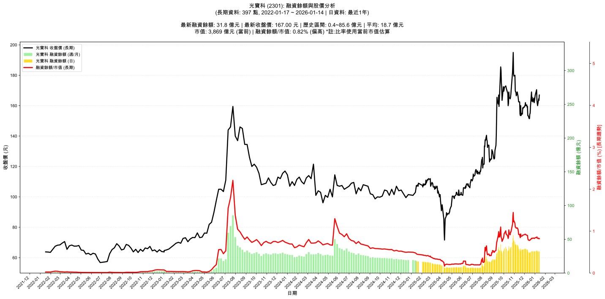

# 📈 光寶科 (2301) 融資餘額報告

!!! info "基本資訊"
    **🏗️ 名稱**: 光寶科
    **🪪 代號**: 2301
    **📅 分析期間**: 2025-07-18 ~ 2026-01-09 (共 242 個交易日)
    **🕒 最新資料**: 2026-01-09
    **🕒 更新時間**: 2026-01-12 17:18:04 CST

## 💰 融資餘額現況

| 📊 指標 | 🔢 數值 | 🚦 狀態 |
|:------------:|:----------:|:-------------------:|
| **最新融資餘額** | 32.0 億元 (19,982 張) | - |
| **最新收盤價** | 160.00 元 | - |
| **市值** | 3,707 億元 | - |
| **融資餘額/市值** | 0.86% | 🟠 偏高 |
| **日變化 (DoD)** | -0.4 億元 (-1.38%) | 📉 |
| **週變化 (WoW)** | -0.6 億元 (-1.78%) | 📉 |
| **月變化 (MoM)** | -2.8 億元 (-8.03%) | 📉 |

---

## 📊 歷史統計

| 📊 指標 | 🔢 數值 |
|:------------:|:----------:|
| **歷史最高** | 55.9 億元 |
| **歷史最低** | 6.4 億元 |
| **平均值** | 20.1 億元 |
| **標準差** | 12.2 億元 |
| **當前相對位置** | 51.6% |

---

## 📈 融資餘額趨勢圖

{: style="max-width: 100%; height: auto;"}

---

## 📋 詳細歷史記錄 (最近30日)

<table class="sortable-table">
<thead>
<tr>
<th markdown="span">📅 日期</th>
<th markdown="span">💸 收盤價(元)</th>
<th markdown="span">📊 漲跌(元)</th>
<th markdown="span">📈 漲跌(%)</th>
<th markdown="span">📦 融資餘額(億元)</th>
<th markdown="span">📦 融資餘額(張)</th>
<th markdown="span">↕️ 融資增減(張)</th>
<th markdown="span">📊 融券餘額(張)</th>
<th markdown="span">⚖️ 券資比(%)</th>
</tr>
</thead>
<tbody>
<tr>
<td>2026-01-09</td>
<td>160.00</td>
<td>🔻 -1.50</td>
<td>-0.93%</td>
<td>32.0</td>
<td>19,982</td>
<td>📉 -91</td>
<td>400</td>
<td>2.00%</td>
</tr>
<tr>
<td>2026-01-08</td>
<td>161.50</td>
<td>🔻 -2.00</td>
<td>-1.22%</td>
<td>32.4</td>
<td>20,073</td>
<td>📉 -308</td>
<td>455</td>
<td>2.27%</td>
</tr>
<tr>
<td>2026-01-07</td>
<td>163.50</td>
<td>🔻 -7.00</td>
<td>-4.11%</td>
<td>33.3</td>
<td>20,381</td>
<td>📈 +1,243</td>
<td>451</td>
<td>2.21%</td>
</tr>
<tr>
<td>2026-01-06</td>
<td>170.50</td>
<td>🔺 +1.00</td>
<td>+0.59%</td>
<td>32.6</td>
<td>19,138</td>
<td>📉 -272</td>
<td>519</td>
<td>2.71%</td>
</tr>
<tr>
<td>2026-01-05</td>
<td>169.50</td>
<td>🔺 +2.50</td>
<td>+1.50%</td>
<td>32.9</td>
<td>19,410</td>
<td>📉 -82</td>
<td>528</td>
<td>2.72%</td>
</tr>
<tr>
<td>2026-01-02</td>
<td>167.00</td>
<td>🔺 +3.50</td>
<td>+2.14%</td>
<td>32.6</td>
<td>19,492</td>
<td>📉 -155</td>
<td>556</td>
<td>2.85%</td>
</tr>
<tr>
<td>2025-12-31</td>
<td>163.50</td>
<td>🔺 +1.50</td>
<td>+0.93%</td>
<td>32.1</td>
<td>19,647</td>
<td>📉 -18</td>
<td>533</td>
<td>2.71%</td>
</tr>
<tr>
<td>2025-12-30</td>
<td>162.00</td>
<td>🔻 -3.00</td>
<td>-1.82%</td>
<td>31.9</td>
<td>19,665</td>
<td>📈 +76</td>
<td>534</td>
<td>2.72%</td>
</tr>
<tr>
<td>2025-12-29</td>
<td>165.00</td>
<td>🔺 +2.50</td>
<td>+1.54%</td>
<td>32.3</td>
<td>19,589</td>
<td>📉 -185</td>
<td>542</td>
<td>2.77%</td>
</tr>
<tr>
<td>2025-12-26</td>
<td>162.50</td>
<td>🔻 -3.00</td>
<td>-1.81%</td>
<td>32.1</td>
<td>19,774</td>
<td>📈 +295</td>
<td>564</td>
<td>2.85%</td>
</tr>
<tr>
<td>2025-12-24</td>
<td>165.50</td>
<td>🔺 +2.50</td>
<td>+1.53%</td>
<td>32.2</td>
<td>19,479</td>
<td>📈 +24</td>
<td>560</td>
<td>2.87%</td>
</tr>
<tr>
<td>2025-12-23</td>
<td>163.00</td>
<td>🔻 -6.00</td>
<td>-3.55%</td>
<td>31.7</td>
<td>19,455</td>
<td>📈 +528</td>
<td>565</td>
<td>2.90%</td>
</tr>
<tr>
<td>2025-12-22</td>
<td>169.00</td>
<td>🔺 +9.50</td>
<td>+5.96%</td>
<td>32.0</td>
<td>18,927</td>
<td>📉 -426</td>
<td>649</td>
<td>3.43%</td>
</tr>
<tr>
<td>2025-12-19</td>
<td>159.50</td>
<td>🔺 +4.50</td>
<td>+2.90%</td>
<td>30.9</td>
<td>19,353</td>
<td>📉 -332</td>
<td>743</td>
<td>3.84%</td>
</tr>
<tr>
<td>2025-12-18</td>
<td>155.00</td>
<td>🔺 +0.50</td>
<td>+0.32%</td>
<td>30.5</td>
<td>19,685</td>
<td>📉 -104</td>
<td>724</td>
<td>3.68%</td>
</tr>
<tr>
<td>2025-12-17</td>
<td>154.50</td>
<td>🔺 +3.00</td>
<td>+1.98%</td>
<td>30.6</td>
<td>19,789</td>
<td>📉 -85</td>
<td>705</td>
<td>3.56%</td>
</tr>
<tr>
<td>2025-12-16</td>
<td>151.50</td>
<td>➖ +0.00</td>
<td>+0.00%</td>
<td>30.1</td>
<td>19,874</td>
<td>📉 -3</td>
<td>702</td>
<td>3.53%</td>
</tr>
<tr>
<td>2025-12-15</td>
<td>151.50</td>
<td>🔻 -2.00</td>
<td>-1.30%</td>
<td>30.1</td>
<td>19,877</td>
<td>📉 -165</td>
<td>634</td>
<td>3.19%</td>
</tr>
<tr>
<td>2025-12-12</td>
<td>153.50</td>
<td>➖ +0.00</td>
<td>+0.00%</td>
<td>30.8</td>
<td>20,042</td>
<td>📉 -936</td>
<td>767</td>
<td>3.83%</td>
</tr>
<tr>
<td>2025-12-11</td>
<td>153.50</td>
<td>🔻 -6.00</td>
<td>-3.76%</td>
<td>32.2</td>
<td>20,978</td>
<td>📉 -817</td>
<td>828</td>
<td>3.95%</td>
</tr>
<tr>
<td>2025-12-10</td>
<td>159.50</td>
<td>🔺 +0.50</td>
<td>+0.31%</td>
<td>34.8</td>
<td>21,795</td>
<td>📉 -63</td>
<td>791</td>
<td>3.63%</td>
</tr>
<tr>
<td>2025-12-09</td>
<td>159.00</td>
<td>🔻 -1.50</td>
<td>-0.93%</td>
<td>34.8</td>
<td>21,858</td>
<td>📈 +69</td>
<td>756</td>
<td>3.46%</td>
</tr>
<tr>
<td>2025-12-08</td>
<td>160.50</td>
<td>🔺 +0.50</td>
<td>+0.31%</td>
<td>35.0</td>
<td>21,789</td>
<td>📉 -333</td>
<td>770</td>
<td>3.53%</td>
</tr>
<tr>
<td>2025-12-05</td>
<td>160.00</td>
<td>🔻 -2.00</td>
<td>-1.23%</td>
<td>35.4</td>
<td>22,122</td>
<td>📉 -20</td>
<td>773</td>
<td>3.49%</td>
</tr>
<tr>
<td>2025-12-04</td>
<td>162.00</td>
<td>🔺 +2.00</td>
<td>+1.25%</td>
<td>35.9</td>
<td>22,142</td>
<td>📉 -210</td>
<td>742</td>
<td>3.35%</td>
</tr>
<tr>
<td>2025-12-03</td>
<td>160.00</td>
<td>➖ +0.00</td>
<td>+0.00%</td>
<td>35.8</td>
<td>22,352</td>
<td>📈 +18</td>
<td>856</td>
<td>3.83%</td>
</tr>
<tr>
<td>2025-12-02</td>
<td>160.00</td>
<td>🔺 +1.00</td>
<td>+0.63%</td>
<td>35.7</td>
<td>22,334</td>
<td>📈 +23</td>
<td>875</td>
<td>3.92%</td>
</tr>
<tr>
<td>2025-12-01</td>
<td>159.00</td>
<td>➖ +0.00</td>
<td>+0.00%</td>
<td>35.5</td>
<td>22,311</td>
<td>📈 +247</td>
<td>826</td>
<td>3.70%</td>
</tr>
<tr>
<td>2025-11-28</td>
<td>159.00</td>
<td>🔺 +1.00</td>
<td>+0.63%</td>
<td>35.1</td>
<td>22,064</td>
<td>📉 -79</td>
<td>792</td>
<td>3.59%</td>
</tr>
<tr>
<td>2025-11-27</td>
<td>158.00</td>
<td>🔻 -0.50</td>
<td>-0.32%</td>
<td>35.0</td>
<td>22,143</td>
<td>📈 +59</td>
<td>695</td>
<td>3.14%</td>
</tr>
</tbody>
</table>

---

## ℹ️ 資料來源與方法

!!! note "資料來源說明"
    - **主要來源**: `raw_margin_daily.csv` (Type 13: ShowMarginChart)
    - **資料頻率**: 每日更新
    - **資料範圍**: 近1年交易日資料

!!! info "報告元資訊"
    - **報告產生時間**: 2026-01-12 17:18:04
    - **分析期間**: 242 個交易日
    - **資料來源**: Stage 1 Raw Margin Daily Data

---

:material-information-outline: **本報告僅供參考，投資決策請審慎評估**

