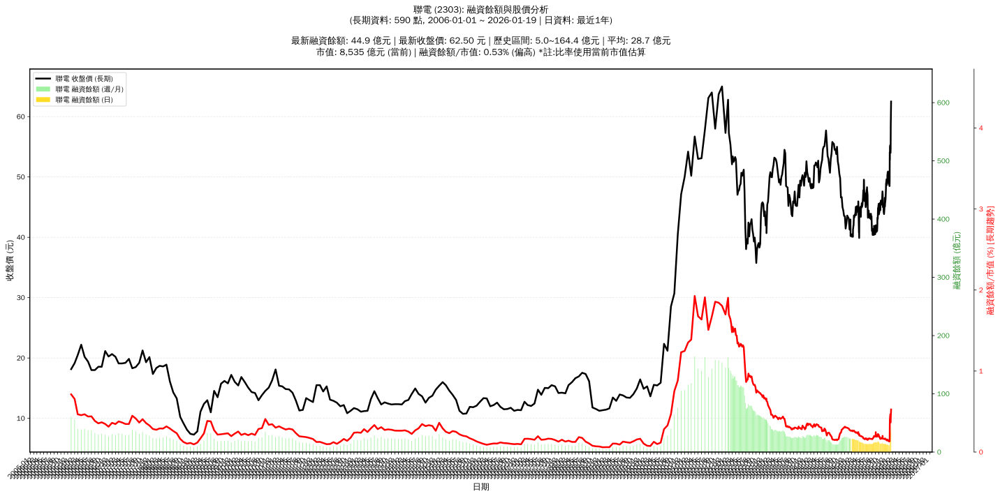

# :chart_with_upwards_trend: 聯電 (2303) 融資餘額報告

!!! info "基本資訊"
    **:building_construction: 名稱**: 聯電
    **:identification_card: 代號**: 2303
    **:calendar: 分析期間**: 2025-07-18 ~ 2026-01-09 (共 242 個交易日)
    **:clock3: 最新資料**: 2026-01-09
    **🕒 更新時間**: 2026-01-12 12:08:30 CST

## :moneybag: 融資餘額現況

| :chart: 指標 | :1234: 數值 | :traffic_light: 狀態 |
|:------------:|:----------:|:-------------------:|
| **最新融資餘額** | 35.7 億元 (64,759 張) | - |
| **最新收盤價** | 55.10 元 | - |
| **市值** | 6,936 億元 | - |
| **融資餘額/市值** | 0.51% | 🟠 偏高 |
| **日變化 (DoD)** | +1.5 億元 (+4.54%) | 📈 |
| **週變化 (WoW)** | +24.4 億元 (+216.28%) | 📈 |
| **月變化 (MoM)** | +22.7 億元 (+175.11%) | 📈 |

---

## :bar_chart: 歷史統計

| :chart: 指標 | :1234: 數值 |
|:------------:|:----------:|
| **歷史最高** | 35.7 億元 |
| **歷史最低** | 11.2 億元 |
| **平均值** | 16.4 億元 |
| **標準差** | 3.7 億元 |
| **當前相對位置** | 100.0% |

---

## :chart_with_upwards_trend: 融資餘額趨勢圖

    

---

## :clipboard: 詳細歷史記錄 (最近30日)

<table class="sortable-table">
<thead>
<tr>
<th>:calendar: 日期</th>
<th>:money_with_wings: 收盤價(元)</th>
<th>:chart: 漲跌(元)</th>
<th>:chart_with_upwards_trend: 漲跌(%)</th>
<th>:package: 融資餘額(億元)</th>
<th>:package: 融資餘額(張)</th>
<th>:arrow_up_down: 融資增減(張)</th>
<th>:chart: 融券餘額(張)</th>
<th>:balance_scale: 券資比(%)</th>
</tr>
</thead>
<tbody>
<tr>
<td>2026-01-09</td>
<td>55.10</td>
<td>🔺 +2.30</td>
<td>+4.36%</td>
<td>35.7</td>
<td>64,759</td>
<td>📈 +114</td>
<td>1,440</td>
<td>2.22%</td>
</tr>
<tr>
<td>2026-01-08</td>
<td>52.80</td>
<td>🔻 -1.30</td>
<td>-2.40%</td>
<td>34.1</td>
<td>64,645</td>
<td>📈 +13,346</td>
<td>1,003</td>
<td>1.55%</td>
</tr>
<tr>
<td>2026-01-07</td>
<td>54.10</td>
<td>🔺 +4.90</td>
<td>+9.96%</td>
<td>27.8</td>
<td>51,299</td>
<td>📈 +27,907</td>
<td>1,107</td>
<td>2.16%</td>
</tr>
<tr>
<td>2026-01-06</td>
<td>49.20</td>
<td>🔺 +0.70</td>
<td>+1.44%</td>
<td>11.5</td>
<td>23,392</td>
<td>📈 +303</td>
<td>887</td>
<td>3.79%</td>
</tr>
<tr>
<td>2026-01-05</td>
<td>48.50</td>
<td>🔻 -0.20</td>
<td>-0.41%</td>
<td>11.2</td>
<td>23,089</td>
<td>📉 -77</td>
<td>884</td>
<td>3.83%</td>
</tr>
<tr>
<td>2026-01-02</td>
<td>48.70</td>
<td>🔻 -0.55</td>
<td>-1.12%</td>
<td>11.3</td>
<td>23,166</td>
<td>📈 +265</td>
<td>970</td>
<td>4.19%</td>
</tr>
<tr>
<td>2025-12-31</td>
<td>49.25</td>
<td>🔻 -0.25</td>
<td>-0.51%</td>
<td>11.3</td>
<td>22,901</td>
<td>📉 -454</td>
<td>1,033</td>
<td>4.51%</td>
</tr>
<tr>
<td>2025-12-30</td>
<td>49.50</td>
<td>🔻 -0.15</td>
<td>-0.30%</td>
<td>11.6</td>
<td>23,355</td>
<td>📈 +233</td>
<td>1,055</td>
<td>4.52%</td>
</tr>
<tr>
<td>2025-12-29</td>
<td>49.65</td>
<td>🔻 -0.30</td>
<td>-0.60%</td>
<td>11.5</td>
<td>23,122</td>
<td>📉 -378</td>
<td>1,055</td>
<td>4.56%</td>
</tr>
<tr>
<td>2025-12-26</td>
<td>49.95</td>
<td>🔺 +0.30</td>
<td>+0.60%</td>
<td>11.7</td>
<td>23,500</td>
<td>📉 -317</td>
<td>1,067</td>
<td>4.54%</td>
</tr>
<tr>
<td>2025-12-24</td>
<td>49.65</td>
<td>🔻 -0.35</td>
<td>-0.70%</td>
<td>11.8</td>
<td>23,817</td>
<td>📉 -1,355</td>
<td>1,045</td>
<td>4.39%</td>
</tr>
<tr>
<td>2025-12-23</td>
<td>50.00</td>
<td>🔻 -0.90</td>
<td>-1.77%</td>
<td>12.6</td>
<td>25,172</td>
<td>📈 +347</td>
<td>1,083</td>
<td>4.30%</td>
</tr>
<tr>
<td>2025-12-22</td>
<td>50.90</td>
<td>🔺 +0.20</td>
<td>+0.39%</td>
<td>12.6</td>
<td>24,825</td>
<td>📉 -286</td>
<td>1,116</td>
<td>4.50%</td>
</tr>
<tr>
<td>2025-12-19</td>
<td>50.70</td>
<td>🔺 +0.40</td>
<td>+0.80%</td>
<td>12.7</td>
<td>25,111</td>
<td>📉 -779</td>
<td>1,107</td>
<td>4.41%</td>
</tr>
<tr>
<td>2025-12-18</td>
<td>50.30</td>
<td>🔻 -0.10</td>
<td>-0.20%</td>
<td>13.0</td>
<td>25,890</td>
<td>📉 -430</td>
<td>1,160</td>
<td>4.48%</td>
</tr>
<tr>
<td>2025-12-17</td>
<td>50.40</td>
<td>🔺 +1.20</td>
<td>+2.44%</td>
<td>13.3</td>
<td>26,320</td>
<td>📈 +1,367</td>
<td>1,758</td>
<td>6.68%</td>
</tr>
<tr>
<td>2025-12-16</td>
<td>49.20</td>
<td>🔺 +0.35</td>
<td>+0.72%</td>
<td>12.3</td>
<td>24,953</td>
<td>📉 -170</td>
<td>1,855</td>
<td>7.43%</td>
</tr>
<tr>
<td>2025-12-15</td>
<td>48.85</td>
<td>🔺 +0.05</td>
<td>+0.10%</td>
<td>12.3</td>
<td>25,123</td>
<td>📉 -38</td>
<td>1,833</td>
<td>7.30%</td>
</tr>
<tr>
<td>2025-12-12</td>
<td>48.80</td>
<td>🔺 +0.15</td>
<td>+0.31%</td>
<td>12.3</td>
<td>25,161</td>
<td>📉 -19</td>
<td>1,836</td>
<td>7.30%</td>
</tr>
<tr>
<td>2025-12-11</td>
<td>48.65</td>
<td>🔻 -0.70</td>
<td>-1.42%</td>
<td>12.3</td>
<td>25,180</td>
<td>📉 -1,102</td>
<td>1,817</td>
<td>7.22%</td>
</tr>
<tr>
<td>2025-12-10</td>
<td>49.35</td>
<td>🔻 -0.25</td>
<td>-0.50%</td>
<td>13.0</td>
<td>26,282</td>
<td>📉 -29</td>
<td>1,269</td>
<td>4.83%</td>
</tr>
<tr>
<td>2025-12-09</td>
<td>49.60</td>
<td>🔺 +0.30</td>
<td>+0.61%</td>
<td>13.1</td>
<td>26,311</td>
<td>📉 -534</td>
<td>1,239</td>
<td>4.71%</td>
</tr>
<tr>
<td>2025-12-08</td>
<td>49.30</td>
<td>🔺 +0.40</td>
<td>+0.82%</td>
<td>13.2</td>
<td>26,845</td>
<td>📈 +538</td>
<td>1,197</td>
<td>4.46%</td>
</tr>
<tr>
<td>2025-12-05</td>
<td>48.90</td>
<td>🔺 +0.90</td>
<td>+1.88%</td>
<td>12.9</td>
<td>26,307</td>
<td>📉 -1,230</td>
<td>1,153</td>
<td>4.38%</td>
</tr>
<tr>
<td>2025-12-04</td>
<td>48.00</td>
<td>🔺 +0.50</td>
<td>+1.05%</td>
<td>13.2</td>
<td>27,537</td>
<td>📉 -646</td>
<td>977</td>
<td>3.55%</td>
</tr>
<tr>
<td>2025-12-03</td>
<td>47.50</td>
<td>🔺 +0.30</td>
<td>+0.64%</td>
<td>13.4</td>
<td>28,183</td>
<td>📉 -312</td>
<td>916</td>
<td>3.25%</td>
</tr>
<tr>
<td>2025-12-02</td>
<td>47.20</td>
<td>🔺 +0.70</td>
<td>+1.51%</td>
<td>13.4</td>
<td>28,495</td>
<td>📉 -786</td>
<td>831</td>
<td>2.92%</td>
</tr>
<tr>
<td>2025-12-01</td>
<td>46.50</td>
<td>🔺 +0.70</td>
<td>+1.53%</td>
<td>13.6</td>
<td>29,281</td>
<td>📉 -1,307</td>
<td>808</td>
<td>2.76%</td>
</tr>
<tr>
<td>2025-11-28</td>
<td>45.80</td>
<td>🔻 -0.15</td>
<td>-0.33%</td>
<td>14.0</td>
<td>30,588</td>
<td>📈 +109</td>
<td>768</td>
<td>2.51%</td>
</tr>
<tr>
<td>2025-11-27</td>
<td>45.95</td>
<td>🔺 +0.50</td>
<td>+1.10%</td>
<td>14.0</td>
<td>30,479</td>
<td>📉 -1,004</td>
<td>743</td>
<td>2.44%</td>
</tr>
</tbody>
</table>

---

## :information_source: 資料來源與方法

!!! note "資料來源說明"
    - **主要來源**: `raw_margin_daily.csv` (Type 13: ShowMarginChart)
    - **資料頻率**: 每日更新
    - **資料範圍**: 近1年交易日資料

!!! info "報告元資訊"
    - **報告產生時間**: 2026-01-12 12:08:30
    - **分析期間**: 242 個交易日
    - **資料來源**: Stage 1 Raw Margin Daily Data

---

:material-information-outline: **本報告僅供參考，投資決策請審慎評估**

