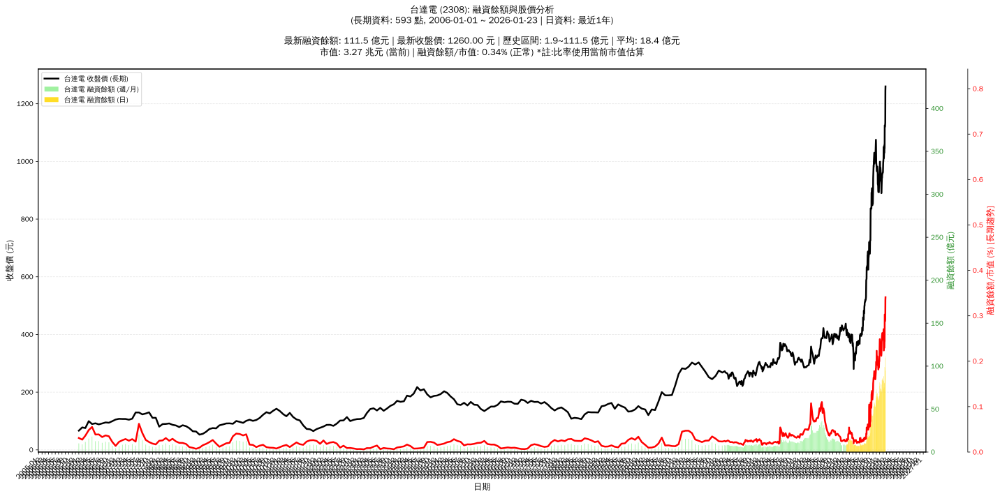

# :chart_with_upwards_trend: 台達電 (2308) 融資餘額報告

!!! info "基本資訊"
    **:building_construction: 名稱**: 台達電
    **:identification_card: 代號**: 2308
    **:calendar: 分析期間**: 2025-07-18 ~ 2026-01-09 (共 242 個交易日)
    **:clock3: 最新資料**: 2026-01-09
    **🕒 更新時間**: 2026-01-12 13:14:06 CST

## :moneybag: 融資餘額現況

| :chart: 指標 | :1234: 數值 | :traffic_light: 狀態 |
|:------------:|:----------:|:-------------------:|
| **最新融資餘額** | 75.2 億元 (7,411 張) | - |
| **最新收盤價** | 1015.00 元 | - |
| **市值** | 2.64 兆元 | - |
| **融資餘額/市值** | 0.28% | 🟢 低風險 |
| **日變化 (DoD)** | +2.1 億元 (+2.81%) | 📈 |
| **週變化 (WoW)** | -7.8 億元 (-9.37%) | 📉 |
| **月變化 (MoM)** | +1.9 億元 (+2.61%) | 📈 |

---

## :bar_chart: 歷史統計

| :chart: 指標 | :1234: 數值 |
|:------------:|:----------:|
| **歷史最高** | 88.5 億元 |
| **歷史最低** | 6.3 億元 |
| **平均值** | 28.6 億元 |
| **標準差** | 26.1 億元 |
| **當前相對位置** | 83.9% |

---

## :chart_with_upwards_trend: 融資餘額趨勢圖

    

---

## :clipboard: 詳細歷史記錄 (最近30日)

<table class="sortable-table">
<thead>
<tr>
<th markdown="span">:calendar: 日期</th>
<th markdown="span">:money_with_wings: 收盤價(元)</th>
<th markdown="span">:chart: 漲跌(元)</th>
<th markdown="span">:chart_with_upwards_trend: 漲跌(%)</th>
<th markdown="span">:package: 融資餘額(億元)</th>
<th markdown="span">:package: 融資餘額(張)</th>
<th markdown="span">:arrow_up_down: 融資增減(張)</th>
<th markdown="span">:chart: 融券餘額(張)</th>
<th markdown="span">:balance_scale: 券資比(%)</th>
</tr>
</thead>
<tbody>
<tr>
<td>2026-01-09</td>
<td>1015.00</td>
<td>🔺 +5.00</td>
<td>+0.50%</td>
<td>75.2</td>
<td>7,411</td>
<td>📈 +167</td>
<td>768</td>
<td>10.40%</td>
</tr>
<tr>
<td>2026-01-08</td>
<td>1010.00</td>
<td>🔻 -20.00</td>
<td>-1.94%</td>
<td>73.2</td>
<td>7,244</td>
<td>📉 -792</td>
<td>769</td>
<td>10.60%</td>
</tr>
<tr>
<td>2026-01-07</td>
<td>1030.00</td>
<td>🔻 -20.00</td>
<td>-1.90%</td>
<td>82.8</td>
<td>8,036</td>
<td>📉 -391</td>
<td>770</td>
<td>9.58%</td>
</tr>
<tr>
<td>2026-01-06</td>
<td>1050.00</td>
<td>🔺 +40.00</td>
<td>+3.96%</td>
<td>88.5</td>
<td>8,427</td>
<td>📉 -278</td>
<td>778</td>
<td>9.23%</td>
</tr>
<tr>
<td>2026-01-05</td>
<td>1010.00</td>
<td>🔺 +15.00</td>
<td>+1.51%</td>
<td>87.9</td>
<td>8,705</td>
<td>📈 +363</td>
<td>769</td>
<td>8.83%</td>
</tr>
<tr>
<td>2026-01-02</td>
<td>995.00</td>
<td>🔺 +32.00</td>
<td>+3.32%</td>
<td>83.0</td>
<td>8,342</td>
<td>📉 -60</td>
<td>770</td>
<td>9.23%</td>
</tr>
<tr>
<td>2025-12-31</td>
<td>963.00</td>
<td>🔺 +2.00</td>
<td>+0.21%</td>
<td>80.9</td>
<td>8,402</td>
<td>📉 -276</td>
<td>738</td>
<td>8.78%</td>
</tr>
<tr>
<td>2025-12-30</td>
<td>961.00</td>
<td>🔻 -1.00</td>
<td>-0.10%</td>
<td>83.4</td>
<td>8,678</td>
<td>📉 -70</td>
<td>736</td>
<td>8.48%</td>
</tr>
<tr>
<td>2025-12-29</td>
<td>962.00</td>
<td>🔺 +6.00</td>
<td>+0.63%</td>
<td>84.2</td>
<td>8,748</td>
<td>📉 -219</td>
<td>741</td>
<td>8.47%</td>
</tr>
<tr>
<td>2025-12-26</td>
<td>956.00</td>
<td>🔺 +1.00</td>
<td>+0.10%</td>
<td>85.7</td>
<td>8,967</td>
<td>📈 +7</td>
<td>733</td>
<td>8.17%</td>
</tr>
<tr>
<td>2025-12-24</td>
<td>955.00</td>
<td>🔺 +12.00</td>
<td>+1.27%</td>
<td>85.6</td>
<td>8,960</td>
<td>📈 +106</td>
<td>727</td>
<td>8.11%</td>
</tr>
<tr>
<td>2025-12-23</td>
<td>943.00</td>
<td>🔻 -10.00</td>
<td>-1.05%</td>
<td>83.5</td>
<td>8,854</td>
<td>📈 +44</td>
<td>718</td>
<td>8.11%</td>
</tr>
<tr>
<td>2025-12-22</td>
<td>953.00</td>
<td>🔺 +42.00</td>
<td>+4.61%</td>
<td>84.0</td>
<td>8,810</td>
<td>📈 +187</td>
<td>721</td>
<td>8.18%</td>
</tr>
<tr>
<td>2025-12-19</td>
<td>911.00</td>
<td>🔺 +20.00</td>
<td>+2.24%</td>
<td>78.6</td>
<td>8,623</td>
<td>📈 +475</td>
<td>692</td>
<td>8.03%</td>
</tr>
<tr>
<td>2025-12-18</td>
<td>891.00</td>
<td>🔺 +1.00</td>
<td>+0.11%</td>
<td>72.6</td>
<td>8,148</td>
<td>📈 +237</td>
<td>676</td>
<td>8.30%</td>
</tr>
<tr>
<td>2025-12-17</td>
<td>890.00</td>
<td>🔻 -11.00</td>
<td>-1.22%</td>
<td>70.4</td>
<td>7,911</td>
<td>📈 +218</td>
<td>677</td>
<td>8.56%</td>
</tr>
<tr>
<td>2025-12-16</td>
<td>901.00</td>
<td>🔻 -21.00</td>
<td>-2.28%</td>
<td>69.3</td>
<td>7,693</td>
<td>📈 +82</td>
<td>686</td>
<td>8.92%</td>
</tr>
<tr>
<td>2025-12-15</td>
<td>922.00</td>
<td>🔻 -16.00</td>
<td>-1.71%</td>
<td>70.2</td>
<td>7,611</td>
<td>📈 +86</td>
<td>724</td>
<td>9.51%</td>
</tr>
<tr>
<td>2025-12-12</td>
<td>938.00</td>
<td>🔻 -7.00</td>
<td>-0.74%</td>
<td>70.6</td>
<td>7,525</td>
<td>📉 -26</td>
<td>751</td>
<td>9.98%</td>
</tr>
<tr>
<td>2025-12-11</td>
<td>945.00</td>
<td>🔻 -23.00</td>
<td>-2.38%</td>
<td>71.4</td>
<td>7,551</td>
<td>📉 -22</td>
<td>749</td>
<td>9.92%</td>
</tr>
<tr>
<td>2025-12-10</td>
<td>968.00</td>
<td>🔻 -3.00</td>
<td>-0.31%</td>
<td>73.3</td>
<td>7,573</td>
<td>📈 +13</td>
<td>796</td>
<td>10.50%</td>
</tr>
<tr>
<td>2025-12-09</td>
<td>971.00</td>
<td>🔻 -8.00</td>
<td>-0.82%</td>
<td>73.4</td>
<td>7,560</td>
<td>📈 +87</td>
<td>796</td>
<td>10.50%</td>
</tr>
<tr>
<td>2025-12-08</td>
<td>979.00</td>
<td>➖ +0.00</td>
<td>+0.00%</td>
<td>73.2</td>
<td>7,473</td>
<td>📉 -147</td>
<td>803</td>
<td>10.70%</td>
</tr>
<tr>
<td>2025-12-05</td>
<td>979.00</td>
<td>🔻 -20.00</td>
<td>-2.00%</td>
<td>74.6</td>
<td>7,620</td>
<td>📉 -274</td>
<td>813</td>
<td>10.70%</td>
</tr>
<tr>
<td>2025-12-04</td>
<td>999.00</td>
<td>🔺 +2.00</td>
<td>+0.20%</td>
<td>78.9</td>
<td>7,894</td>
<td>📉 -159</td>
<td>841</td>
<td>10.70%</td>
</tr>
<tr>
<td>2025-12-03</td>
<td>997.00</td>
<td>🔺 +8.00</td>
<td>+0.81%</td>
<td>80.3</td>
<td>8,053</td>
<td>📉 -161</td>
<td>826</td>
<td>10.30%</td>
</tr>
<tr>
<td>2025-12-02</td>
<td>989.00</td>
<td>🔺 +16.00</td>
<td>+1.64%</td>
<td>81.2</td>
<td>8,214</td>
<td>📈 +301</td>
<td>831</td>
<td>10.10%</td>
</tr>
<tr>
<td>2025-12-01</td>
<td>973.00</td>
<td>🔺 +41.00</td>
<td>+4.40%</td>
<td>77.0</td>
<td>7,913</td>
<td>📈 +899</td>
<td>826</td>
<td>10.40%</td>
</tr>
<tr>
<td>2025-11-28</td>
<td>932.00</td>
<td>🔻 -10.00</td>
<td>-1.06%</td>
<td>65.4</td>
<td>7,014</td>
<td>📈 +96</td>
<td>813</td>
<td>11.60%</td>
</tr>
<tr>
<td>2025-11-27</td>
<td>942.00</td>
<td>🔻 -3.00</td>
<td>-0.32%</td>
<td>65.2</td>
<td>6,918</td>
<td>📈 +55</td>
<td>850</td>
<td>12.30%</td>
</tr>
</tbody>
</table>

---

## :information_source: 資料來源與方法

!!! note "資料來源說明"
    - **主要來源**: `raw_margin_daily.csv` (Type 13: ShowMarginChart)
    - **資料頻率**: 每日更新
    - **資料範圍**: 近1年交易日資料

!!! info "報告元資訊"
    - **報告產生時間**: 2026-01-12 13:14:06
    - **分析期間**: 242 個交易日
    - **資料來源**: Stage 1 Raw Margin Daily Data

---

:material-information-outline: **本報告僅供參考，投資決策請審慎評估**

