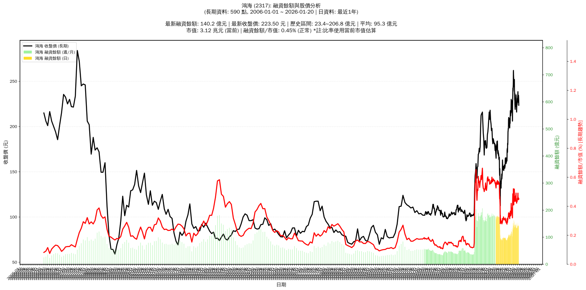

# :chart_with_upwards_trend: 鴻海 (2317) 融資餘額報告

!!! info "基本資訊"
    **:building_construction: 名稱**: 鴻海
    **:identification_card: 代號**: 2317
    **:calendar: 分析期間**: 2025-07-18 ~ 2026-01-09 (共 242 個交易日)
    **:clock3: 最新資料**: 2026-01-09
    **🕒 更新時間**: 2026-01-12 12:08:51 CST

## :moneybag: 融資餘額現況

| :chart: 指標 | :1234: 數值 | :traffic_light: 狀態 |
|:------------:|:----------:|:-------------------:|
| **最新融資餘額** | 144.3 億元 (62,605 張) | - |
| **最新收盤價** | 230.50 元 | - |
| **市值** | 3.22 兆元 | - |
| **融資餘額/市值** | 0.45% | 🟡 正常 |
| **日變化 (DoD)** | +0.1 億元 (+0.09%) | 📈 |
| **週變化 (WoW)** | +4.0 億元 (+2.82%) | 📈 |
| **月變化 (MoM)** | -2.0 億元 (-1.36%) | 📉 |

---

## :bar_chart: 歷史統計

| :chart: 指標 | :1234: 數值 |
|:------------:|:----------:|
| **歷史最高** | 180.3 億元 |
| **歷史最低** | 86.4 億元 |
| **平均值** | 124.8 億元 |
| **標準差** | 30.9 億元 |
| **當前相對位置** | 61.6% |

---

## :chart_with_upwards_trend: 融資餘額趨勢圖

    

---

## :clipboard: 詳細歷史記錄 (最近30日)

<table class="sortable-table">
<thead>
<tr>
<th>:calendar: 日期</th>
<th>:money_with_wings: 收盤價(元)</th>
<th>:chart: 漲跌(元)</th>
<th>:chart_with_upwards_trend: 漲跌(%)</th>
<th>:package: 融資餘額(億元)</th>
<th>:package: 融資餘額(張)</th>
<th>:arrow_up_down: 融資增減(張)</th>
<th>:chart: 融券餘額(張)</th>
<th>:balance_scale: 券資比(%)</th>
</tr>
</thead>
<tbody>
<tr>
<td>2026-01-09</td>
<td>230.50</td>
<td>🔺 +1.00</td>
<td>+0.44%</td>
<td>144.3</td>
<td>62,605</td>
<td>📉 -217</td>
<td>2,139</td>
<td>3.42%</td>
</tr>
<tr>
<td>2026-01-08</td>
<td>229.50</td>
<td>🔻 -9.00</td>
<td>-3.77%</td>
<td>144.2</td>
<td>62,822</td>
<td>📉 -1,388</td>
<td>2,082</td>
<td>3.31%</td>
</tr>
<tr>
<td>2026-01-07</td>
<td>238.50</td>
<td>🔺 +2.50</td>
<td>+1.06%</td>
<td>153.1</td>
<td>64,210</td>
<td>📈 +1,756</td>
<td>2,171</td>
<td>3.38%</td>
</tr>
<tr>
<td>2026-01-06</td>
<td>236.00</td>
<td>🔺 +1.50</td>
<td>+0.64%</td>
<td>147.4</td>
<td>62,454</td>
<td>📈 +595</td>
<td>2,115</td>
<td>3.39%</td>
</tr>
<tr>
<td>2026-01-05</td>
<td>234.50</td>
<td>🔺 +2.50</td>
<td>+1.08%</td>
<td>145.1</td>
<td>61,859</td>
<td>📈 +1,363</td>
<td>2,100</td>
<td>3.39%</td>
</tr>
<tr>
<td>2026-01-02</td>
<td>232.00</td>
<td>🔺 +1.50</td>
<td>+0.65%</td>
<td>140.4</td>
<td>60,496</td>
<td>📉 -429</td>
<td>2,144</td>
<td>3.54%</td>
</tr>
<tr>
<td>2025-12-31</td>
<td>230.50</td>
<td>🔺 +2.50</td>
<td>+1.10%</td>
<td>140.4</td>
<td>60,925</td>
<td>📉 -656</td>
<td>2,159</td>
<td>3.54%</td>
</tr>
<tr>
<td>2025-12-30</td>
<td>228.00</td>
<td>🔻 -3.00</td>
<td>-1.30%</td>
<td>140.4</td>
<td>61,581</td>
<td>📈 +246</td>
<td>2,085</td>
<td>3.39%</td>
</tr>
<tr>
<td>2025-12-29</td>
<td>231.00</td>
<td>🔺 +5.50</td>
<td>+2.44%</td>
<td>141.7</td>
<td>61,335</td>
<td>📈 +1,371</td>
<td>2,134</td>
<td>3.48%</td>
</tr>
<tr>
<td>2025-12-26</td>
<td>225.50</td>
<td>🔺 +1.50</td>
<td>+0.67%</td>
<td>135.2</td>
<td>59,964</td>
<td>📉 -296</td>
<td>2,032</td>
<td>3.39%</td>
</tr>
<tr>
<td>2025-12-24</td>
<td>224.00</td>
<td>➖ +0.00</td>
<td>+0.00%</td>
<td>135.0</td>
<td>60,260</td>
<td>📈 +166</td>
<td>1,999</td>
<td>3.32%</td>
</tr>
<tr>
<td>2025-12-23</td>
<td>224.00</td>
<td>➖ +0.00</td>
<td>+0.00%</td>
<td>134.6</td>
<td>60,094</td>
<td>📉 -432</td>
<td>2,022</td>
<td>3.36%</td>
</tr>
<tr>
<td>2025-12-22</td>
<td>224.00</td>
<td>🔺 +2.50</td>
<td>+1.13%</td>
<td>135.6</td>
<td>60,526</td>
<td>📈 +12</td>
<td>1,975</td>
<td>3.26%</td>
</tr>
<tr>
<td>2025-12-19</td>
<td>221.50</td>
<td>🔺 +5.50</td>
<td>+2.55%</td>
<td>134.0</td>
<td>60,514</td>
<td>📉 -388</td>
<td>2,005</td>
<td>3.31%</td>
</tr>
<tr>
<td>2025-12-18</td>
<td>216.00</td>
<td>🔻 -0.50</td>
<td>-0.23%</td>
<td>131.5</td>
<td>60,902</td>
<td>📉 -744</td>
<td>1,923</td>
<td>3.16%</td>
</tr>
<tr>
<td>2025-12-17</td>
<td>216.50</td>
<td>🔻 -1.50</td>
<td>-0.69%</td>
<td>133.5</td>
<td>61,646</td>
<td>📈 +939</td>
<td>1,920</td>
<td>3.11%</td>
</tr>
<tr>
<td>2025-12-16</td>
<td>218.00</td>
<td>🔻 -3.50</td>
<td>-1.58%</td>
<td>132.3</td>
<td>60,707</td>
<td>📉 -430</td>
<td>2,006</td>
<td>3.30%</td>
</tr>
<tr>
<td>2025-12-15</td>
<td>221.50</td>
<td>🔻 -5.50</td>
<td>-2.42%</td>
<td>135.4</td>
<td>61,137</td>
<td>📈 +1,244</td>
<td>2,080</td>
<td>3.40%</td>
</tr>
<tr>
<td>2025-12-12</td>
<td>227.00</td>
<td>🔺 +1.00</td>
<td>+0.44%</td>
<td>136.0</td>
<td>59,893</td>
<td>📉 -35</td>
<td>2,427</td>
<td>4.05%</td>
</tr>
<tr>
<td>2025-12-11</td>
<td>226.00</td>
<td>🔻 -7.50</td>
<td>-3.21%</td>
<td>135.4</td>
<td>59,928</td>
<td>📉 -2,727</td>
<td>2,730</td>
<td>4.56%</td>
</tr>
<tr>
<td>2025-12-10</td>
<td>233.50</td>
<td>🔻 -1.50</td>
<td>-0.64%</td>
<td>146.3</td>
<td>62,655</td>
<td>📉 -2,528</td>
<td>2,466</td>
<td>3.94%</td>
</tr>
<tr>
<td>2025-12-09</td>
<td>235.00</td>
<td>🔺 +3.00</td>
<td>+1.29%</td>
<td>153.2</td>
<td>65,183</td>
<td>📈 +2,169</td>
<td>2,469</td>
<td>3.79%</td>
</tr>
<tr>
<td>2025-12-08</td>
<td>232.00</td>
<td>🔺 +1.00</td>
<td>+0.43%</td>
<td>146.2</td>
<td>63,014</td>
<td>📉 -1,463</td>
<td>2,372</td>
<td>3.76%</td>
</tr>
<tr>
<td>2025-12-05</td>
<td>231.00</td>
<td>🔺 +2.50</td>
<td>+1.09%</td>
<td>148.9</td>
<td>64,477</td>
<td>📈 +582</td>
<td>2,389</td>
<td>3.71%</td>
</tr>
<tr>
<td>2025-12-04</td>
<td>228.50</td>
<td>🔺 +1.50</td>
<td>+0.66%</td>
<td>146.0</td>
<td>63,895</td>
<td>📈 +29</td>
<td>2,364</td>
<td>3.70%</td>
</tr>
<tr>
<td>2025-12-03</td>
<td>227.00</td>
<td>🔺 +5.00</td>
<td>+2.25%</td>
<td>145.0</td>
<td>63,866</td>
<td>📈 +1,233</td>
<td>2,357</td>
<td>3.69%</td>
</tr>
<tr>
<td>2025-12-02</td>
<td>222.00</td>
<td>➖ +0.00</td>
<td>+0.00%</td>
<td>139.0</td>
<td>62,633</td>
<td>📉 -564</td>
<td>2,294</td>
<td>3.66%</td>
</tr>
<tr>
<td>2025-12-01</td>
<td>222.00</td>
<td>🔻 -3.50</td>
<td>-1.55%</td>
<td>140.3</td>
<td>63,197</td>
<td>📈 +323</td>
<td>2,266</td>
<td>3.59%</td>
</tr>
<tr>
<td>2025-11-28</td>
<td>225.50</td>
<td>🔻 -5.50</td>
<td>-2.38%</td>
<td>141.8</td>
<td>62,874</td>
<td>📈 +529</td>
<td>2,295</td>
<td>3.65%</td>
</tr>
<tr>
<td>2025-11-27</td>
<td>231.00</td>
<td>🔺 +4.00</td>
<td>+1.76%</td>
<td>144.0</td>
<td>62,345</td>
<td>📉 -1,769</td>
<td>2,461</td>
<td>3.95%</td>
</tr>
</tbody>
</table>

---

## :information_source: 資料來源與方法

!!! note "資料來源說明"
    - **主要來源**: `raw_margin_daily.csv` (Type 13: ShowMarginChart)
    - **資料頻率**: 每日更新
    - **資料範圍**: 近1年交易日資料

!!! info "報告元資訊"
    - **報告產生時間**: 2026-01-12 12:08:51
    - **分析期間**: 242 個交易日
    - **資料來源**: Stage 1 Raw Margin Daily Data

---

:material-information-outline: **本報告僅供參考，投資決策請審慎評估**

