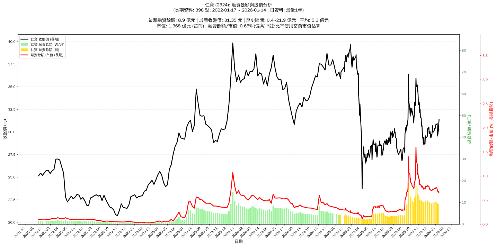

# 📈 仁寶 (2324) 融資餘額報告

!!! info "基本資訊"
    **🏗️ 名稱**: 仁寶
    **🪪 代號**: 2324
    **📅 分析期間**: 2025-07-18 ~ 2026-01-09 (共 242 個交易日)
    **🕒 最新資料**: 2026-01-09
    **🕒 更新時間**: 2026-01-12 20:30:29 CST

## 💰 融資餘額現況

| 📊 指標 | 🔢 數值 | 🚦 狀態 |
|:------------:|:----------:|:-------------------:|
| **最新融資餘額** | 9.4 億元 (31,720 張) | - |
| **最新收盤價** | 29.55 元 | - |
| **市值** | 1,302 億元 | - |
| **融資餘額/市值** | 0.72% | 🟠 偏高 |
| **日變化 (DoD)** | -0.3 億元 (-2.62%) | 📉 |
| **週變化 (WoW)** | -1.0 億元 (-9.27%) | 📉 |
| **月變化 (MoM)** | -0.8 億元 (-7.95%) | 📉 |

---

## 📊 歷史統計

| 📊 指標 | 🔢 數值 |
|:------------:|:----------:|
| **歷史最高** | 21.9 億元 |
| **歷史最低** | 1.4 億元 |
| **平均值** | 6.2 億元 |
| **標準差** | 3.9 億元 |
| **當前相對位置** | 38.9% |

---

## 📈 融資餘額趨勢圖

{: style="max-width: 100%; height: auto;"}

---

## 📋 詳細歷史記錄 (最近30日)

<table class="sortable-table">
<thead>
<tr>
<th markdown="span">📅 日期</th>
<th markdown="span">💸 收盤價(元)</th>
<th markdown="span">📊 漲跌(元)</th>
<th markdown="span">📈 漲跌(%)</th>
<th markdown="span">📦 融資餘額(億元)</th>
<th markdown="span">📦 融資餘額(張)</th>
<th markdown="span">↕️ 融資增減(張)</th>
<th markdown="span">📊 融券餘額(張)</th>
<th markdown="span">⚖️ 券資比(%)</th>
</tr>
</thead>
<tbody>
<tr>
<td>2026-01-09</td>
<td>29.55</td>
<td>🔻 -0.50</td>
<td>-1.66%</td>
<td>9.4</td>
<td>31,720</td>
<td>📉 -313</td>
<td>468</td>
<td>1.48%</td>
</tr>
<tr>
<td>2026-01-08</td>
<td>30.05</td>
<td>🔻 -0.90</td>
<td>-2.91%</td>
<td>9.6</td>
<td>32,033</td>
<td>📉 -198</td>
<td>572</td>
<td>1.79%</td>
</tr>
<tr>
<td>2026-01-07</td>
<td>30.95</td>
<td>🔺 +0.15</td>
<td>+0.49%</td>
<td>10.0</td>
<td>32,231</td>
<td>📉 -1,060</td>
<td>609</td>
<td>1.89%</td>
</tr>
<tr>
<td>2026-01-06</td>
<td>30.80</td>
<td>➖ +0.00</td>
<td>+0.00%</td>
<td>10.3</td>
<td>33,291</td>
<td>📉 -379</td>
<td>601</td>
<td>1.81%</td>
</tr>
<tr>
<td>2026-01-05</td>
<td>30.80</td>
<td>➖ +0.00</td>
<td>+0.00%</td>
<td>10.4</td>
<td>33,670</td>
<td>📈 +129</td>
<td>553</td>
<td>1.64%</td>
</tr>
<tr>
<td>2026-01-02</td>
<td>30.80</td>
<td>🔺 +0.40</td>
<td>+1.32%</td>
<td>10.3</td>
<td>33,541</td>
<td>📈 +301</td>
<td>531</td>
<td>1.58%</td>
</tr>
<tr>
<td>2025-12-31</td>
<td>30.40</td>
<td>🔺 +0.05</td>
<td>+0.16%</td>
<td>10.1</td>
<td>33,240</td>
<td>📈 +203</td>
<td>529</td>
<td>1.59%</td>
</tr>
<tr>
<td>2025-12-30</td>
<td>30.35</td>
<td>🔻 -0.05</td>
<td>-0.16%</td>
<td>10.0</td>
<td>33,037</td>
<td>📉 -494</td>
<td>536</td>
<td>1.62%</td>
</tr>
<tr>
<td>2025-12-29</td>
<td>30.40</td>
<td>🔺 +0.40</td>
<td>+1.33%</td>
<td>10.2</td>
<td>33,531</td>
<td>📈 +482</td>
<td>546</td>
<td>1.63%</td>
</tr>
<tr>
<td>2025-12-26</td>
<td>30.00</td>
<td>➖ +0.00</td>
<td>+0.00%</td>
<td>9.9</td>
<td>33,049</td>
<td>📉 -48</td>
<td>525</td>
<td>1.59%</td>
</tr>
<tr>
<td>2025-12-24</td>
<td>30.00</td>
<td>➖ +0.00</td>
<td>+0.00%</td>
<td>9.9</td>
<td>33,097</td>
<td>📉 -311</td>
<td>529</td>
<td>1.60%</td>
</tr>
<tr>
<td>2025-12-23</td>
<td>30.00</td>
<td>🔻 -0.70</td>
<td>-2.28%</td>
<td>10.0</td>
<td>33,408</td>
<td>📈 +932</td>
<td>522</td>
<td>1.56%</td>
</tr>
<tr>
<td>2025-12-22</td>
<td>30.70</td>
<td>🔺 +1.00</td>
<td>+3.37%</td>
<td>10.0</td>
<td>32,476</td>
<td>📈 +289</td>
<td>560</td>
<td>1.72%</td>
</tr>
<tr>
<td>2025-12-19</td>
<td>29.70</td>
<td>➖ +0.00</td>
<td>+0.00%</td>
<td>9.6</td>
<td>32,187</td>
<td>📈 +52</td>
<td>540</td>
<td>1.68%</td>
</tr>
<tr>
<td>2025-12-18</td>
<td>29.70</td>
<td>🔺 +0.15</td>
<td>+0.51%</td>
<td>9.5</td>
<td>32,135</td>
<td>📉 -252</td>
<td>549</td>
<td>1.71%</td>
</tr>
<tr>
<td>2025-12-17</td>
<td>29.55</td>
<td>🔺 +0.15</td>
<td>+0.51%</td>
<td>9.6</td>
<td>32,387</td>
<td>📉 -193</td>
<td>514</td>
<td>1.59%</td>
</tr>
<tr>
<td>2025-12-16</td>
<td>29.40</td>
<td>🔺 +0.05</td>
<td>+0.17%</td>
<td>9.6</td>
<td>32,580</td>
<td>📉 -398</td>
<td>505</td>
<td>1.55%</td>
</tr>
<tr>
<td>2025-12-15</td>
<td>29.35</td>
<td>🔻 -0.70</td>
<td>-2.33%</td>
<td>9.7</td>
<td>32,978</td>
<td>📈 +155</td>
<td>517</td>
<td>1.57%</td>
</tr>
<tr>
<td>2025-12-12</td>
<td>30.05</td>
<td>🔺 +0.20</td>
<td>+0.67%</td>
<td>9.9</td>
<td>32,823</td>
<td>📉 -401</td>
<td>538</td>
<td>1.64%</td>
</tr>
<tr>
<td>2025-12-11</td>
<td>29.85</td>
<td>🔻 -0.10</td>
<td>-0.33%</td>
<td>9.9</td>
<td>33,224</td>
<td>📉 -775</td>
<td>549</td>
<td>1.65%</td>
</tr>
<tr>
<td>2025-12-10</td>
<td>29.95</td>
<td>🔺 +0.15</td>
<td>+0.50%</td>
<td>10.2</td>
<td>33,999</td>
<td>📉 -905</td>
<td>547</td>
<td>1.61%</td>
</tr>
<tr>
<td>2025-12-09</td>
<td>29.80</td>
<td>🔻 -0.75</td>
<td>-2.45%</td>
<td>10.4</td>
<td>34,904</td>
<td>📉 -509</td>
<td>530</td>
<td>1.52%</td>
</tr>
<tr>
<td>2025-12-08</td>
<td>30.55</td>
<td>🔺 +0.25</td>
<td>+0.83%</td>
<td>10.8</td>
<td>35,413</td>
<td>📉 -89</td>
<td>543</td>
<td>1.53%</td>
</tr>
<tr>
<td>2025-12-05</td>
<td>30.30</td>
<td>🔻 -0.10</td>
<td>-0.33%</td>
<td>10.8</td>
<td>35,502</td>
<td>📉 -776</td>
<td>565</td>
<td>1.59%</td>
</tr>
<tr>
<td>2025-12-04</td>
<td>30.40</td>
<td>🔺 +0.25</td>
<td>+0.83%</td>
<td>11.0</td>
<td>36,278</td>
<td>📈 +99</td>
<td>587</td>
<td>1.62%</td>
</tr>
<tr>
<td>2025-12-03</td>
<td>30.15</td>
<td>🔺 +0.65</td>
<td>+2.20%</td>
<td>10.9</td>
<td>36,179</td>
<td>📉 -325</td>
<td>603</td>
<td>1.67%</td>
</tr>
<tr>
<td>2025-12-02</td>
<td>29.50</td>
<td>🔺 +0.05</td>
<td>+0.17%</td>
<td>10.8</td>
<td>36,504</td>
<td>📉 -78</td>
<td>592</td>
<td>1.62%</td>
</tr>
<tr>
<td>2025-12-01</td>
<td>29.45</td>
<td>🔺 +0.10</td>
<td>+0.34%</td>
<td>10.8</td>
<td>36,582</td>
<td>📈 +326</td>
<td>589</td>
<td>1.61%</td>
</tr>
<tr>
<td>2025-11-28</td>
<td>29.35</td>
<td>🔻 -0.25</td>
<td>-0.84%</td>
<td>10.6</td>
<td>36,256</td>
<td>📈 +221</td>
<td>579</td>
<td>1.60%</td>
</tr>
<tr>
<td>2025-11-27</td>
<td>29.60</td>
<td>🔺 +0.10</td>
<td>+0.34%</td>
<td>10.7</td>
<td>36,035</td>
<td>📉 -562</td>
<td>589</td>
<td>1.63%</td>
</tr>
</tbody>
</table>

---

## ℹ️ 資料來源與方法

!!! note "資料來源說明"
    - **主要來源**: `raw_margin_daily.csv` (Type 13: ShowMarginChart)
    - **資料頻率**: 每日更新
    - **資料範圍**: 近1年交易日資料

!!! info "報告元資訊"
    - **報告產生時間**: 2026-01-12 20:30:29
    - **分析期間**: 242 個交易日
    - **資料來源**: Stage 1 Raw Margin Daily Data

---

:material-information-outline: **本報告僅供參考，投資決策請審慎評估**

