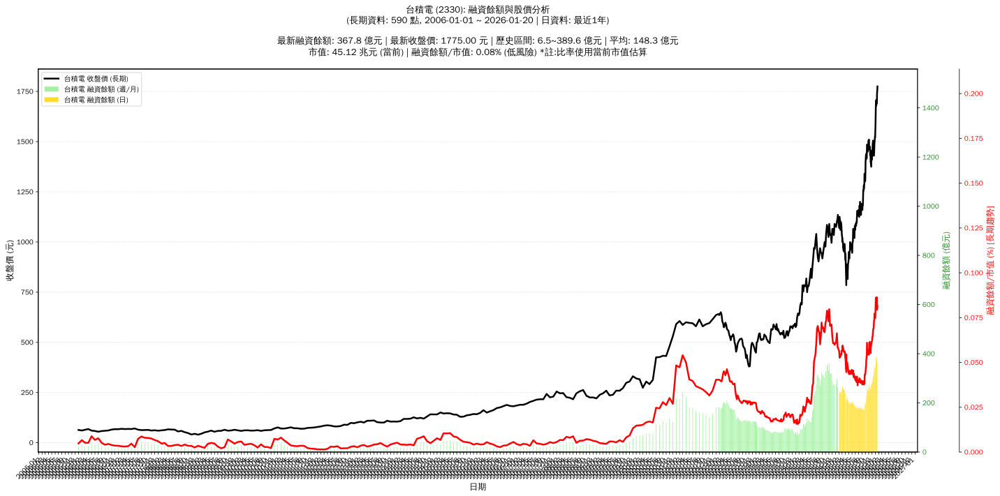

# :chart_with_upwards_trend: 台積電 (2330) 融資餘額報告

!!! info "基本資訊"
    **:building_construction: 名稱**: 台積電
    **:identification_card: 代號**: 2330
    **:calendar: 分析期間**: 2025-07-18 ~ 2026-01-09 (共 242 個交易日)
    **:clock3: 最新資料**: 2026-01-09
    **🕒 更新時間**: 2026-01-11 23:12:10 CST

## :moneybag: 融資餘額現況

| :chart: 指標 | :1234: 數值 | :traffic_light: 狀態 |
|:------------:|:----------:|:-------------------:|
| **最新融資餘額** | 369.0 億元 (21,967 張) | - |
| **最新收盤價** | 1680.00 元 | - |
| **市值** | 43.57 兆元 | - |
| **融資餘額/市值** | 0.08% | 🟢 低風險 |
| **日變化 (DoD)** | -13.1 億元 (-3.44%) | 📉 |
| **週變化 (WoW)** | +8.9 億元 (+2.48%) | 📈 |
| **月變化 (MoM)** | +65.7 億元 (+21.65%) | 📈 |

---

## :bar_chart: 歷史統計

| :chart: 指標 | :1234: 數值 |
|:------------:|:----------:|
| **歷史最高** | 388.7 億元 |
| **歷史最低** | 167.8 億元 |
| **平均值** | 229.7 億元 |
| **標準差** | 50.1 億元 |
| **當前相對位置** | 91.1% |

---

## :chart_with_upwards_trend: 融資餘額趨勢圖

    

---

## :clipboard: 詳細歷史記錄 (最近30日)

<table class="sortable-table">
<thead>
<tr>
<th>:calendar: 日期</th>
<th>:money_with_wings: 收盤價(元)</th>
<th>:chart: 漲跌(元)</th>
<th>:chart_with_upwards_trend: 漲跌(%)</th>
<th>:package: 融資餘額(億元)</th>
<th>:package: 融資餘額(張)</th>
<th>:arrow_up_down: 融資增減(張)</th>
<th>:chart: 融券餘額(張)</th>
<th>:balance_scale: 券資比(%)</th>
</tr>
</thead>
<tbody>
<tr>
<td>2026-01-09</td>
<td>1680.00</td>
<td>🔻 -5.00</td>
<td>-0.30%</td>
<td>369.0</td>
<td>21,967</td>
<td>📉 -715</td>
<td>344</td>
<td>1.57%</td>
</tr>
<tr>
<td>2026-01-08</td>
<td>1685.00</td>
<td>🔺 +10.00</td>
<td>+0.60%</td>
<td>382.2</td>
<td>22,682</td>
<td>📉 -424</td>
<td>435</td>
<td>1.92%</td>
</tr>
<tr>
<td>2026-01-07</td>
<td>1675.00</td>
<td>🔻 -30.00</td>
<td>-1.76%</td>
<td>387.0</td>
<td>23,106</td>
<td>📈 +488</td>
<td>360</td>
<td>1.56%</td>
</tr>
<tr>
<td>2026-01-06</td>
<td>1705.00</td>
<td>🔺 +35.00</td>
<td>+2.10%</td>
<td>385.6</td>
<td>22,618</td>
<td>📉 -658</td>
<td>330</td>
<td>1.46%</td>
</tr>
<tr>
<td>2026-01-05</td>
<td>1670.00</td>
<td>🔺 +85.00</td>
<td>+5.36%</td>
<td>388.7</td>
<td>23,276</td>
<td>📈 +556</td>
<td>311</td>
<td>1.34%</td>
</tr>
<tr>
<td>2026-01-02</td>
<td>1585.00</td>
<td>🔺 +35.00</td>
<td>+2.26%</td>
<td>360.1</td>
<td>22,720</td>
<td>📈 +954</td>
<td>249</td>
<td>1.10%</td>
</tr>
<tr>
<td>2025-12-31</td>
<td>1550.00</td>
<td>🔺 +30.00</td>
<td>+1.97%</td>
<td>337.4</td>
<td>21,766</td>
<td>📉 -666</td>
<td>166</td>
<td>0.76%</td>
</tr>
<tr>
<td>2025-12-30</td>
<td>1520.00</td>
<td>🔻 -10.00</td>
<td>-0.65%</td>
<td>341.0</td>
<td>22,432</td>
<td>📈 +102</td>
<td>146</td>
<td>0.65%</td>
</tr>
<tr>
<td>2025-12-29</td>
<td>1530.00</td>
<td>🔺 +20.00</td>
<td>+1.32%</td>
<td>341.6</td>
<td>22,330</td>
<td>📉 -445</td>
<td>130</td>
<td>0.58%</td>
</tr>
<tr>
<td>2025-12-26</td>
<td>1510.00</td>
<td>🔺 +15.00</td>
<td>+1.00%</td>
<td>343.9</td>
<td>22,775</td>
<td>📉 -541</td>
<td>90</td>
<td>0.40%</td>
</tr>
<tr>
<td>2025-12-24</td>
<td>1495.00</td>
<td>🔺 +5.00</td>
<td>+0.34%</td>
<td>348.6</td>
<td>23,316</td>
<td>📈 +71</td>
<td>61</td>
<td>0.26%</td>
</tr>
<tr>
<td>2025-12-23</td>
<td>1490.00</td>
<td>🔺 +25.00</td>
<td>+1.71%</td>
<td>346.4</td>
<td>23,245</td>
<td>📈 +525</td>
<td>52</td>
<td>0.22%</td>
</tr>
<tr>
<td>2025-12-22</td>
<td>1465.00</td>
<td>🔺 +35.00</td>
<td>+2.45%</td>
<td>332.8</td>
<td>22,720</td>
<td>📉 -356</td>
<td>36</td>
<td>0.16%</td>
</tr>
<tr>
<td>2025-12-19</td>
<td>1430.00</td>
<td>➖ +0.00</td>
<td>+0.00%</td>
<td>330.0</td>
<td>23,076</td>
<td>📈 +330</td>
<td>24</td>
<td>0.10%</td>
</tr>
<tr>
<td>2025-12-18</td>
<td>1430.00</td>
<td>➖ +0.00</td>
<td>+0.00%</td>
<td>325.3</td>
<td>22,746</td>
<td>📈 +597</td>
<td>25</td>
<td>0.11%</td>
</tr>
<tr>
<td>2025-12-17</td>
<td>1430.00</td>
<td>🔻 -5.00</td>
<td>-0.35%</td>
<td>316.7</td>
<td>22,149</td>
<td>📈 +495</td>
<td>20</td>
<td>0.09%</td>
</tr>
<tr>
<td>2025-12-16</td>
<td>1435.00</td>
<td>🔻 -15.00</td>
<td>-1.03%</td>
<td>310.7</td>
<td>21,654</td>
<td>📈 +203</td>
<td>22</td>
<td>0.10%</td>
</tr>
<tr>
<td>2025-12-15</td>
<td>1450.00</td>
<td>🔻 -30.00</td>
<td>-2.03%</td>
<td>311.0</td>
<td>21,451</td>
<td>📈 +521</td>
<td>16</td>
<td>0.07%</td>
</tr>
<tr>
<td>2025-12-12</td>
<td>1480.00</td>
<td>🔺 +10.00</td>
<td>+0.68%</td>
<td>309.8</td>
<td>20,930</td>
<td>📈 +221</td>
<td>17</td>
<td>0.08%</td>
</tr>
<tr>
<td>2025-12-11</td>
<td>1470.00</td>
<td>🔻 -30.00</td>
<td>-2.00%</td>
<td>304.4</td>
<td>20,709</td>
<td>📈 +552</td>
<td>42</td>
<td>0.20%</td>
</tr>
<tr>
<td>2025-12-10</td>
<td>1505.00</td>
<td>🔺 +25.00</td>
<td>+1.69%</td>
<td>303.4</td>
<td>20,157</td>
<td>📉 -247</td>
<td>0</td>
<td>0.00%</td>
</tr>
<tr>
<td>2025-12-09</td>
<td>1480.00</td>
<td>🔻 -15.00</td>
<td>-1.00%</td>
<td>302.0</td>
<td>20,404</td>
<td>📈 +728</td>
<td>0</td>
<td>0.00%</td>
</tr>
<tr>
<td>2025-12-08</td>
<td>1495.00</td>
<td>🔺 +35.00</td>
<td>+2.40%</td>
<td>294.2</td>
<td>19,676</td>
<td>📉 -133</td>
<td>0</td>
<td>0.00%</td>
</tr>
<tr>
<td>2025-12-05</td>
<td>1460.00</td>
<td>🔺 +15.00</td>
<td>+1.04%</td>
<td>289.2</td>
<td>19,809</td>
<td>📉 -219</td>
<td>13</td>
<td>0.07%</td>
</tr>
<tr>
<td>2025-12-04</td>
<td>1445.00</td>
<td>🔻 -5.00</td>
<td>-0.34%</td>
<td>289.4</td>
<td>20,028</td>
<td>📈 +384</td>
<td>124</td>
<td>0.62%</td>
</tr>
<tr>
<td>2025-12-03</td>
<td>1450.00</td>
<td>🔺 +20.00</td>
<td>+1.40%</td>
<td>284.8</td>
<td>19,644</td>
<td>📈 +10</td>
<td>145</td>
<td>0.74%</td>
</tr>
<tr>
<td>2025-12-02</td>
<td>1430.00</td>
<td>🔺 +20.00</td>
<td>+1.42%</td>
<td>280.8</td>
<td>19,634</td>
<td>📉 -169</td>
<td>145</td>
<td>0.74%</td>
</tr>
<tr>
<td>2025-12-01</td>
<td>1410.00</td>
<td>🔻 -30.00</td>
<td>-2.08%</td>
<td>279.2</td>
<td>19,803</td>
<td>📈 +458</td>
<td>180</td>
<td>0.91%</td>
</tr>
<tr>
<td>2025-11-28</td>
<td>1440.00</td>
<td>🔺 +5.00</td>
<td>+0.35%</td>
<td>278.6</td>
<td>19,345</td>
<td>📈 +156</td>
<td>213</td>
<td>1.10%</td>
</tr>
<tr>
<td>2025-11-27</td>
<td>1435.00</td>
<td>🔻 -5.00</td>
<td>-0.35%</td>
<td>275.4</td>
<td>19,189</td>
<td>📈 +225</td>
<td>221</td>
<td>1.15%</td>
</tr>
</tbody>
</table>

---

## :information_source: 資料來源與方法

!!! note "資料來源說明"
    - **主要來源**: `raw_margin_daily.csv` (Type 13: ShowMarginChart)
    - **資料頻率**: 每日更新
    - **資料範圍**: 近1年交易日資料

!!! info "報告元資訊"
    - **報告產生時間**: 2026-01-11 23:12:10
    - **分析期間**: 242 個交易日
    - **資料來源**: Stage 1 Raw Margin Daily Data

---

:material-information-outline: **本報告僅供參考，投資決策請審慎評估**

