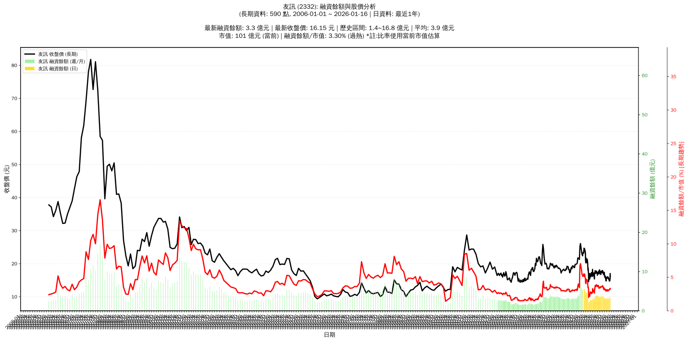

# :chart_with_upwards_trend: 友訊 (2332) 融資餘額報告

!!! info "基本資訊"
    **:building_construction: 名稱**: 友訊
    **:identification_card: 代號**: 2332
    **:calendar: 分析期間**: 2025-07-18 ~ 2026-01-09 (共 242 個交易日)
    **:clock3: 最新資料**: 2026-01-09
    **🕒 更新時間**: 2026-01-12 12:09:52 CST

## :moneybag: 融資餘額現況

| :chart: 指標 | :1234: 數值 | :traffic_light: 狀態 |
|:------------:|:----------:|:-------------------:|
| **最新融資餘額** | 3.2 億元 (21,552 張) | - |
| **最新收盤價** | 14.80 元 | - |
| **市值** | 89 億元 | - |
| **融資餘額/市值** | 3.58% | 🔴 過熱 |
| **日變化 (DoD)** | -0.0 億元 (-1.40%) | 📉 |
| **週變化 (WoW)** | +0.0 億元 (+0.37%) | 📈 |
| **月變化 (MoM)** | +0.2 億元 (+5.34%) | 📈 |

---

## :bar_chart: 歷史統計

| :chart: 指標 | :1234: 數值 |
|:------------:|:----------:|
| **歷史最高** | 5.6 億元 |
| **歷史最低** | 2.0 億元 |
| **平均值** | 3.6 億元 |
| **標準差** | 0.8 億元 |
| **當前相對位置** | 32.7% |

---

## :chart_with_upwards_trend: 融資餘額趨勢圖

    

---

## :clipboard: 詳細歷史記錄 (最近30日)

<table class="sortable-table">
<thead>
<tr>
<th>:calendar: 日期</th>
<th>:money_with_wings: 收盤價(元)</th>
<th>:chart: 漲跌(元)</th>
<th>:chart_with_upwards_trend: 漲跌(%)</th>
<th>:package: 融資餘額(億元)</th>
<th>:package: 融資餘額(張)</th>
<th>:arrow_up_down: 融資增減(張)</th>
<th>:chart: 融券餘額(張)</th>
<th>:balance_scale: 券資比(%)</th>
</tr>
</thead>
<tbody>
<tr>
<td>2026-01-09</td>
<td>14.80</td>
<td>🔻 -0.35</td>
<td>-2.31%</td>
<td>3.2</td>
<td>21,552</td>
<td>📈 +199</td>
<td>131</td>
<td>0.61%</td>
</tr>
<tr>
<td>2026-01-08</td>
<td>15.15</td>
<td>🔻 -0.25</td>
<td>-1.62%</td>
<td>3.2</td>
<td>21,353</td>
<td>📈 +16</td>
<td>124</td>
<td>0.58%</td>
</tr>
<tr>
<td>2026-01-07</td>
<td>15.40</td>
<td>🔺 +0.15</td>
<td>+0.98%</td>
<td>3.3</td>
<td>21,337</td>
<td>📉 -45</td>
<td>124</td>
<td>0.58%</td>
</tr>
<tr>
<td>2026-01-06</td>
<td>15.25</td>
<td>🔺 +0.50</td>
<td>+3.39%</td>
<td>3.3</td>
<td>21,382</td>
<td>📉 -23</td>
<td>133</td>
<td>0.62%</td>
</tr>
<tr>
<td>2026-01-05</td>
<td>14.75</td>
<td>🔻 -0.20</td>
<td>-1.34%</td>
<td>3.2</td>
<td>21,405</td>
<td>📈 +147</td>
<td>148</td>
<td>0.69%</td>
</tr>
<tr>
<td>2026-01-02</td>
<td>14.95</td>
<td>🔻 -0.10</td>
<td>-0.66%</td>
<td>3.2</td>
<td>21,258</td>
<td>📈 +248</td>
<td>143</td>
<td>0.67%</td>
</tr>
<tr>
<td>2025-12-31</td>
<td>15.05</td>
<td>🔻 -0.05</td>
<td>-0.33%</td>
<td>3.2</td>
<td>21,010</td>
<td>📈 +23</td>
<td>143</td>
<td>0.68%</td>
</tr>
<tr>
<td>2025-12-30</td>
<td>15.10</td>
<td>🔻 -0.15</td>
<td>-0.98%</td>
<td>3.2</td>
<td>20,987</td>
<td>📈 +349</td>
<td>143</td>
<td>0.68%</td>
</tr>
<tr>
<td>2025-12-29</td>
<td>15.25</td>
<td>➖ +0.00</td>
<td>+0.00%</td>
<td>3.1</td>
<td>20,638</td>
<td>📉 -12</td>
<td>143</td>
<td>0.69%</td>
</tr>
<tr>
<td>2025-12-26</td>
<td>15.25</td>
<td>🔻 -0.35</td>
<td>-2.24%</td>
<td>3.1</td>
<td>20,650</td>
<td>📈 +833</td>
<td>142</td>
<td>0.69%</td>
</tr>
<tr>
<td>2025-12-24</td>
<td>15.60</td>
<td>🔻 -0.10</td>
<td>-0.64%</td>
<td>3.1</td>
<td>19,817</td>
<td>📈 +342</td>
<td>158</td>
<td>0.80%</td>
</tr>
<tr>
<td>2025-12-23</td>
<td>15.70</td>
<td>🔻 -0.20</td>
<td>-1.26%</td>
<td>3.1</td>
<td>19,475</td>
<td>📉 -149</td>
<td>154</td>
<td>0.79%</td>
</tr>
<tr>
<td>2025-12-22</td>
<td>15.90</td>
<td>🔺 +0.05</td>
<td>+0.32%</td>
<td>3.1</td>
<td>19,624</td>
<td>📉 -152</td>
<td>154</td>
<td>0.78%</td>
</tr>
<tr>
<td>2025-12-19</td>
<td>15.85</td>
<td>🔺 +0.25</td>
<td>+1.60%</td>
<td>3.1</td>
<td>19,776</td>
<td>📉 -7</td>
<td>155</td>
<td>0.78%</td>
</tr>
<tr>
<td>2025-12-18</td>
<td>15.60</td>
<td>🔻 -0.15</td>
<td>-0.95%</td>
<td>3.1</td>
<td>19,783</td>
<td>📈 +353</td>
<td>152</td>
<td>0.77%</td>
</tr>
<tr>
<td>2025-12-17</td>
<td>15.75</td>
<td>🔻 -0.10</td>
<td>-0.63%</td>
<td>3.1</td>
<td>19,430</td>
<td>📈 +152</td>
<td>137</td>
<td>0.71%</td>
</tr>
<tr>
<td>2025-12-16</td>
<td>15.85</td>
<td>🔻 -0.15</td>
<td>-0.94%</td>
<td>3.1</td>
<td>19,278</td>
<td>📈 +555</td>
<td>133</td>
<td>0.69%</td>
</tr>
<tr>
<td>2025-12-15</td>
<td>16.00</td>
<td>🔺 +0.05</td>
<td>+0.31%</td>
<td>3.0</td>
<td>18,723</td>
<td>📉 -31</td>
<td>136</td>
<td>0.73%</td>
</tr>
<tr>
<td>2025-12-12</td>
<td>15.95</td>
<td>🔺 +0.30</td>
<td>+1.92%</td>
<td>3.0</td>
<td>18,754</td>
<td>📉 -740</td>
<td>138</td>
<td>0.74%</td>
</tr>
<tr>
<td>2025-12-11</td>
<td>15.65</td>
<td>🔻 -0.15</td>
<td>-0.95%</td>
<td>3.1</td>
<td>19,494</td>
<td>📈 +330</td>
<td>137</td>
<td>0.70%</td>
</tr>
<tr>
<td>2025-12-10</td>
<td>15.80</td>
<td>🔻 -0.15</td>
<td>-0.94%</td>
<td>3.0</td>
<td>19,164</td>
<td>📉 -743</td>
<td>137</td>
<td>0.71%</td>
</tr>
<tr>
<td>2025-12-09</td>
<td>15.95</td>
<td>🔻 -0.10</td>
<td>-0.62%</td>
<td>3.2</td>
<td>19,907</td>
<td>📉 -48</td>
<td>140</td>
<td>0.70%</td>
</tr>
<tr>
<td>2025-12-08</td>
<td>16.05</td>
<td>🔺 +0.20</td>
<td>+1.26%</td>
<td>3.2</td>
<td>19,955</td>
<td>📈 +32</td>
<td>141</td>
<td>0.71%</td>
</tr>
<tr>
<td>2025-12-05</td>
<td>15.85</td>
<td>➖ +0.00</td>
<td>+0.00%</td>
<td>3.2</td>
<td>19,923</td>
<td>📉 -24</td>
<td>135</td>
<td>0.68%</td>
</tr>
<tr>
<td>2025-12-04</td>
<td>15.85</td>
<td>➖ +0.00</td>
<td>+0.00%</td>
<td>3.2</td>
<td>19,947</td>
<td>📈 +23</td>
<td>135</td>
<td>0.68%</td>
</tr>
<tr>
<td>2025-12-03</td>
<td>15.85</td>
<td>🔻 -0.05</td>
<td>-0.31%</td>
<td>3.2</td>
<td>19,924</td>
<td>📈 +40</td>
<td>148</td>
<td>0.74%</td>
</tr>
<tr>
<td>2025-12-02</td>
<td>15.90</td>
<td>🔺 +0.10</td>
<td>+0.63%</td>
<td>3.2</td>
<td>19,884</td>
<td>📈 +103</td>
<td>148</td>
<td>0.74%</td>
</tr>
<tr>
<td>2025-12-01</td>
<td>15.80</td>
<td>🔻 -0.10</td>
<td>-0.63%</td>
<td>3.1</td>
<td>19,781</td>
<td>📈 +45</td>
<td>146</td>
<td>0.74%</td>
</tr>
<tr>
<td>2025-11-28</td>
<td>15.90</td>
<td>🔺 +0.15</td>
<td>+0.95%</td>
<td>3.1</td>
<td>19,736</td>
<td>📉 -125</td>
<td>147</td>
<td>0.74%</td>
</tr>
<tr>
<td>2025-11-27</td>
<td>15.75</td>
<td>🔺 +0.15</td>
<td>+0.96%</td>
<td>3.1</td>
<td>19,861</td>
<td>📉 -56</td>
<td>146</td>
<td>0.74%</td>
</tr>
</tbody>
</table>

---

## :information_source: 資料來源與方法

!!! note "資料來源說明"
    - **主要來源**: `raw_margin_daily.csv` (Type 13: ShowMarginChart)
    - **資料頻率**: 每日更新
    - **資料範圍**: 近1年交易日資料

!!! info "報告元資訊"
    - **報告產生時間**: 2026-01-12 12:09:52
    - **分析期間**: 242 個交易日
    - **資料來源**: Stage 1 Raw Margin Daily Data

---

:material-information-outline: **本報告僅供參考，投資決策請審慎評估**

