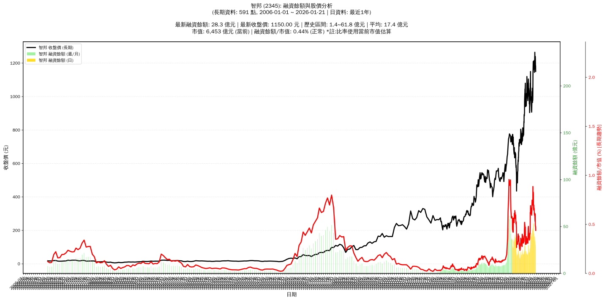

# :chart_with_upwards_trend: 智邦 (2345) 融資餘額報告

!!! info "基本資訊"
    **:building_construction: 名稱**: 智邦
    **:identification_card: 代號**: 2345
    **:calendar: 分析期間**: 2025-07-18 ~ 2026-01-09 (共 242 個交易日)
    **:clock3: 最新資料**: 2026-01-09
    **🕒 更新時間**: 2026-01-12 13:15:29 CST

## :moneybag: 融資餘額現況

| :chart: 指標 | :1234: 數值 | :traffic_light: 狀態 |
|:------------:|:----------:|:-------------------:|
| **最新融資餘額** | 35.6 億元 (2,926 張) | - |
| **最新收盤價** | 1215.00 元 | - |
| **市值** | 6,818 億元 | - |
| **融資餘額/市值** | 0.52% | 🟠 偏高 |
| **日變化 (DoD)** | -1.1 億元 (-2.89%) | 📉 |
| **週變化 (WoW)** | -2.8 億元 (-7.21%) | 📉 |
| **月變化 (MoM)** | -21.6 億元 (-37.83%) | 📉 |

---

## :bar_chart: 歷史統計

| :chart: 指標 | :1234: 數值 |
|:------------:|:----------:|
| **歷史最高** | 57.2 億元 |
| **歷史最低** | 15.1 億元 |
| **平均值** | 29.3 億元 |
| **標準差** | 9.6 億元 |
| **當前相對位置** | 48.6% |

---

## :chart_with_upwards_trend: 融資餘額趨勢圖

    

---

## :clipboard: 詳細歷史記錄 (最近30日)

<table class="sortable-table">
<thead>
<tr>
<th markdown="span">:calendar: 日期</th>
<th markdown="span">:money_with_wings: 收盤價(元)</th>
<th markdown="span">:chart: 漲跌(元)</th>
<th markdown="span">:chart_with_upwards_trend: 漲跌(%)</th>
<th markdown="span">:package: 融資餘額(億元)</th>
<th markdown="span">:package: 融資餘額(張)</th>
<th markdown="span">:arrow_up_down: 融資增減(張)</th>
<th markdown="span">:chart: 融券餘額(張)</th>
<th markdown="span">:balance_scale: 券資比(%)</th>
</tr>
</thead>
<tbody>
<tr>
<td>2026-01-09</td>
<td>1215.00</td>
<td>🔻 -50.00</td>
<td>-3.95%</td>
<td>35.6</td>
<td>2,926</td>
<td>📈 +32</td>
<td>144</td>
<td>4.92%</td>
</tr>
<tr>
<td>2026-01-08</td>
<td>1265.00</td>
<td>🔺 +60.00</td>
<td>+4.98%</td>
<td>36.6</td>
<td>2,894</td>
<td>📉 -267</td>
<td>162</td>
<td>5.60%</td>
</tr>
<tr>
<td>2026-01-07</td>
<td>1205.00</td>
<td>🔻 -35.00</td>
<td>-2.82%</td>
<td>38.1</td>
<td>3,161</td>
<td>📉 -32</td>
<td>160</td>
<td>5.06%</td>
</tr>
<tr>
<td>2026-01-06</td>
<td>1240.00</td>
<td>🔺 +55.00</td>
<td>+4.64%</td>
<td>39.6</td>
<td>3,193</td>
<td>📉 -122</td>
<td>174</td>
<td>5.45%</td>
</tr>
<tr>
<td>2026-01-05</td>
<td>1185.00</td>
<td>🔺 +40.00</td>
<td>+3.49%</td>
<td>39.3</td>
<td>3,315</td>
<td>📉 -31</td>
<td>174</td>
<td>5.25%</td>
</tr>
<tr>
<td>2026-01-02</td>
<td>1145.00</td>
<td>🔻 -40.00</td>
<td>-3.38%</td>
<td>38.3</td>
<td>3,346</td>
<td>📈 +14</td>
<td>175</td>
<td>5.23%</td>
</tr>
<tr>
<td>2025-12-31</td>
<td>1185.00</td>
<td>🔻 -5.00</td>
<td>-0.42%</td>
<td>39.5</td>
<td>3,332</td>
<td>📉 -46</td>
<td>196</td>
<td>5.88%</td>
</tr>
<tr>
<td>2025-12-30</td>
<td>1190.00</td>
<td>🔻 -25.00</td>
<td>-2.06%</td>
<td>40.2</td>
<td>3,378</td>
<td>📉 -126</td>
<td>201</td>
<td>5.95%</td>
</tr>
<tr>
<td>2025-12-29</td>
<td>1215.00</td>
<td>➖ +0.00</td>
<td>+0.00%</td>
<td>42.6</td>
<td>3,504</td>
<td>📉 -45</td>
<td>218</td>
<td>6.22%</td>
</tr>
<tr>
<td>2025-12-26</td>
<td>1215.00</td>
<td>🔺 +25.00</td>
<td>+2.10%</td>
<td>43.1</td>
<td>3,549</td>
<td>📉 -73</td>
<td>212</td>
<td>5.97%</td>
</tr>
<tr>
<td>2025-12-24</td>
<td>1190.00</td>
<td>🔺 +5.00</td>
<td>+0.42%</td>
<td>43.1</td>
<td>3,622</td>
<td>📉 -172</td>
<td>216</td>
<td>5.96%</td>
</tr>
<tr>
<td>2025-12-23</td>
<td>1185.00</td>
<td>🔺 +15.00</td>
<td>+1.28%</td>
<td>45.0</td>
<td>3,794</td>
<td>📈 +232</td>
<td>217</td>
<td>5.72%</td>
</tr>
<tr>
<td>2025-12-22</td>
<td>1170.00</td>
<td>🔻 -5.00</td>
<td>-0.43%</td>
<td>41.7</td>
<td>3,562</td>
<td>📉 -67</td>
<td>209</td>
<td>5.87%</td>
</tr>
<tr>
<td>2025-12-19</td>
<td>1175.00</td>
<td>🔻 -5.00</td>
<td>-0.42%</td>
<td>42.6</td>
<td>3,629</td>
<td>📉 -762</td>
<td>227</td>
<td>6.26%</td>
</tr>
<tr>
<td>2025-12-18</td>
<td>1180.00</td>
<td>🔻 -5.00</td>
<td>-0.42%</td>
<td>51.8</td>
<td>4,391</td>
<td>📉 -89</td>
<td>232</td>
<td>5.28%</td>
</tr>
<tr>
<td>2025-12-17</td>
<td>1185.00</td>
<td>🔺 +25.00</td>
<td>+2.16%</td>
<td>53.1</td>
<td>4,480</td>
<td>📉 -127</td>
<td>229</td>
<td>5.11%</td>
</tr>
<tr>
<td>2025-12-16</td>
<td>1160.00</td>
<td>🔻 -50.00</td>
<td>-4.13%</td>
<td>53.4</td>
<td>4,607</td>
<td>📈 +230</td>
<td>222</td>
<td>4.82%</td>
</tr>
<tr>
<td>2025-12-15</td>
<td>1210.00</td>
<td>🔺 +55.00</td>
<td>+4.76%</td>
<td>53.0</td>
<td>4,377</td>
<td>📈 +54</td>
<td>251</td>
<td>5.73%</td>
</tr>
<tr>
<td>2025-12-12</td>
<td>1155.00</td>
<td>🔺 +20.00</td>
<td>+1.76%</td>
<td>49.9</td>
<td>4,323</td>
<td>📈 +181</td>
<td>220</td>
<td>5.09%</td>
</tr>
<tr>
<td>2025-12-11</td>
<td>1135.00</td>
<td>🔺 +45.00</td>
<td>+4.13%</td>
<td>47.0</td>
<td>4,142</td>
<td>📉 -1,104</td>
<td>213</td>
<td>5.14%</td>
</tr>
<tr>
<td>2025-12-10</td>
<td>1090.00</td>
<td>🔺 +95.00</td>
<td>+9.55%</td>
<td>57.2</td>
<td>5,246</td>
<td>📈 +426</td>
<td>187</td>
<td>3.56%</td>
</tr>
<tr>
<td>2025-12-09</td>
<td>995.00</td>
<td>🔺 +18.00</td>
<td>+1.84%</td>
<td>48.0</td>
<td>4,820</td>
<td>📈 +110</td>
<td>146</td>
<td>3.03%</td>
</tr>
<tr>
<td>2025-12-08</td>
<td>977.00</td>
<td>🔻 -13.00</td>
<td>-1.31%</td>
<td>46.0</td>
<td>4,710</td>
<td>📈 +74</td>
<td>159</td>
<td>3.38%</td>
</tr>
<tr>
<td>2025-12-05</td>
<td>990.00</td>
<td>🔺 +25.00</td>
<td>+2.59%</td>
<td>45.9</td>
<td>4,636</td>
<td>📉 -29</td>
<td>160</td>
<td>3.45%</td>
</tr>
<tr>
<td>2025-12-04</td>
<td>965.00</td>
<td>🔻 -21.00</td>
<td>-2.13%</td>
<td>45.0</td>
<td>4,665</td>
<td>📉 -2</td>
<td>166</td>
<td>3.56%</td>
</tr>
<tr>
<td>2025-12-03</td>
<td>986.00</td>
<td>🔻 -64.00</td>
<td>-6.10%</td>
<td>46.0</td>
<td>4,667</td>
<td>📈 +107</td>
<td>147</td>
<td>3.15%</td>
</tr>
<tr>
<td>2025-12-02</td>
<td>1050.00</td>
<td>🔺 +30.00</td>
<td>+2.94%</td>
<td>47.9</td>
<td>4,560</td>
<td>📉 -167</td>
<td>163</td>
<td>3.57%</td>
</tr>
<tr>
<td>2025-12-01</td>
<td>1020.00</td>
<td>🔻 -5.00</td>
<td>-0.49%</td>
<td>48.2</td>
<td>4,727</td>
<td>📈 +23</td>
<td>163</td>
<td>3.45%</td>
</tr>
<tr>
<td>2025-11-28</td>
<td>1025.00</td>
<td>🔻 -5.00</td>
<td>-0.49%</td>
<td>48.2</td>
<td>4,704</td>
<td>📈 +202</td>
<td>165</td>
<td>3.51%</td>
</tr>
<tr>
<td>2025-11-27</td>
<td>1030.00</td>
<td>🔺 +31.00</td>
<td>+3.10%</td>
<td>46.4</td>
<td>4,502</td>
<td>📈 +150</td>
<td>170</td>
<td>3.78%</td>
</tr>
</tbody>
</table>

---

## :information_source: 資料來源與方法

!!! note "資料來源說明"
    - **主要來源**: `raw_margin_daily.csv` (Type 13: ShowMarginChart)
    - **資料頻率**: 每日更新
    - **資料範圍**: 近1年交易日資料

!!! info "報告元資訊"
    - **報告產生時間**: 2026-01-12 13:15:29
    - **分析期間**: 242 個交易日
    - **資料來源**: Stage 1 Raw Margin Daily Data

---

:material-information-outline: **本報告僅供參考，投資決策請審慎評估**

