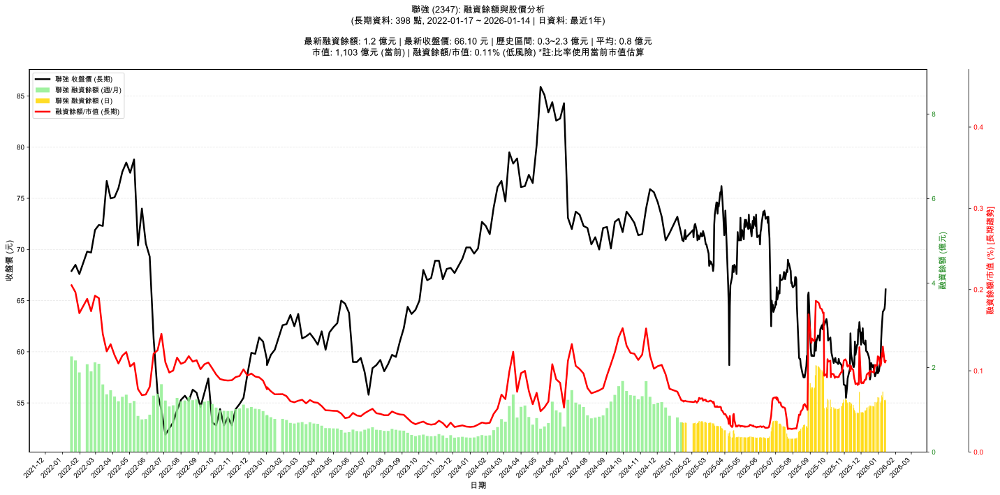

# :chart_with_upwards_trend: 聯強 (2347) 融資餘額報告

!!! info "基本資訊"
    **:building_construction: 名稱**: 聯強
    **:identification_card: 代號**: 2347
    **:calendar: 分析期間**: 2025-07-18 ~ 2026-01-09 (共 242 個交易日)
    **:clock3: 最新資料**: 2026-01-09
    **🕒 更新時間**: 2026-01-11 23:11:33 CST

## :moneybag: 融資餘額現況

| :chart: 指標 | :1234: 數值 | :traffic_light: 狀態 |
|:------------:|:----------:|:-------------------:|
| **最新融資餘額** | 1.4 億元 (2,239 張) | - |
| **最新收盤價** | 63.90 元 | - |
| **市值** | 1,066 億元 | - |
| **融資餘額/市值** | 0.13% | 🟢 低風險 |
| **日變化 (DoD)** | +0.1 億元 (+10.60%) | 📈 |
| **週變化 (WoW)** | +0.1 億元 (+11.02%) | 📈 |
| **月變化 (MoM)** | +0.4 億元 (+44.10%) | 📈 |

---

## :bar_chart: 歷史統計

| :chart: 指標 | :1234: 數值 |
|:------------:|:----------:|
| **歷史最高** | 2.1 億元 |
| **歷史最低** | 0.3 億元 |
| **平均值** | 0.8 億元 |
| **標準差** | 0.4 億元 |
| **當前相對位置** | 64.3% |

---

## :chart_with_upwards_trend: 融資餘額趨勢圖

{: style="max-width: 100%; height: auto;"}

---

## :clipboard: 詳細歷史記錄 (最近30日)

<table class="sortable-table">
<thead>
<tr>
<th>:calendar: 日期</th>
<th>:money_with_wings: 收盤價(元)</th>
<th>:chart: 漲跌(元)</th>
<th>:chart_with_upwards_trend: 漲跌(%)</th>
<th>:package: 融資餘額(億元)</th>
<th>:package: 融資餘額(張)</th>
<th>:arrow_up_down: 融資增減(張)</th>
<th>:chart: 融券餘額(張)</th>
<th>:balance_scale: 券資比(%)</th>
</tr>
</thead>
<tbody>
<tr>
<td>2026-01-09</td>
<td>63.90</td>
<td>🔺 +0.80</td>
<td>+1.27%</td>
<td>1.4</td>
<td>2,239</td>
<td>📈 +189</td>
<td>14</td>
<td>0.63%</td>
</tr>
<tr>
<td>2026-01-08</td>
<td>63.10</td>
<td>🔺 +0.80</td>
<td>+1.28%</td>
<td>1.3</td>
<td>2,050</td>
<td>📉 -102</td>
<td>11</td>
<td>0.54%</td>
</tr>
<tr>
<td>2026-01-07</td>
<td>62.30</td>
<td>🔺 +1.20</td>
<td>+1.96%</td>
<td>1.3</td>
<td>2,152</td>
<td>📈 +178</td>
<td>10</td>
<td>0.46%</td>
</tr>
<tr>
<td>2026-01-06</td>
<td>61.10</td>
<td>🔺 +1.80</td>
<td>+3.04%</td>
<td>1.2</td>
<td>1,974</td>
<td>📈 +1</td>
<td>10</td>
<td>0.51%</td>
</tr>
<tr>
<td>2026-01-05</td>
<td>59.30</td>
<td>🔺 +1.20</td>
<td>+2.07%</td>
<td>1.2</td>
<td>1,973</td>
<td>📉 -245</td>
<td>13</td>
<td>0.66%</td>
</tr>
<tr>
<td>2026-01-02</td>
<td>58.10</td>
<td>🔺 +0.20</td>
<td>+0.35%</td>
<td>1.3</td>
<td>2,218</td>
<td>📉 -25</td>
<td>13</td>
<td>0.59%</td>
</tr>
<tr>
<td>2025-12-31</td>
<td>57.90</td>
<td>🔻 -0.80</td>
<td>-1.36%</td>
<td>1.3</td>
<td>2,243</td>
<td>📈 +214</td>
<td>13</td>
<td>0.58%</td>
</tr>
<tr>
<td>2025-12-30</td>
<td>58.70</td>
<td>🔺 +0.60</td>
<td>+1.03%</td>
<td>1.2</td>
<td>2,029</td>
<td>📈 +14</td>
<td>21</td>
<td>1.03%</td>
</tr>
<tr>
<td>2025-12-29</td>
<td>58.10</td>
<td>🔺 +0.50</td>
<td>+0.87%</td>
<td>1.2</td>
<td>2,015</td>
<td>📉 -38</td>
<td>25</td>
<td>1.24%</td>
</tr>
<tr>
<td>2025-12-26</td>
<td>57.60</td>
<td>🔻 -0.70</td>
<td>-1.20%</td>
<td>1.2</td>
<td>2,053</td>
<td>📈 +205</td>
<td>24</td>
<td>1.17%</td>
</tr>
<tr>
<td>2025-12-24</td>
<td>58.30</td>
<td>🔻 -0.40</td>
<td>-0.68%</td>
<td>1.1</td>
<td>1,848</td>
<td>📉 -1</td>
<td>22</td>
<td>1.19%</td>
</tr>
<tr>
<td>2025-12-23</td>
<td>58.70</td>
<td>🔺 +0.20</td>
<td>+0.34%</td>
<td>1.1</td>
<td>1,849</td>
<td>📉 -11</td>
<td>153</td>
<td>8.27%</td>
</tr>
<tr>
<td>2025-12-22</td>
<td>58.50</td>
<td>🔻 -0.40</td>
<td>-0.68%</td>
<td>1.1</td>
<td>1,860</td>
<td>📈 +3</td>
<td>154</td>
<td>8.28%</td>
</tr>
<tr>
<td>2025-12-19</td>
<td>58.90</td>
<td>🔺 +1.30</td>
<td>+2.26%</td>
<td>1.1</td>
<td>1,857</td>
<td>📉 -35</td>
<td>155</td>
<td>8.35%</td>
</tr>
<tr>
<td>2025-12-18</td>
<td>57.60</td>
<td>🔺 +0.30</td>
<td>+0.52%</td>
<td>1.1</td>
<td>1,892</td>
<td>📉 -34</td>
<td>142</td>
<td>7.51%</td>
</tr>
<tr>
<td>2025-12-17</td>
<td>57.30</td>
<td>🔻 -1.90</td>
<td>-3.21%</td>
<td>1.1</td>
<td>1,926</td>
<td>📈 +192</td>
<td>143</td>
<td>7.42%</td>
</tr>
<tr>
<td>2025-12-16</td>
<td>59.20</td>
<td>🔻 -0.30</td>
<td>-0.50%</td>
<td>1.0</td>
<td>1,734</td>
<td>📉 -77</td>
<td>162</td>
<td>9.34%</td>
</tr>
<tr>
<td>2025-12-15</td>
<td>59.50</td>
<td>🔻 -0.50</td>
<td>-0.83%</td>
<td>1.1</td>
<td>1,811</td>
<td>📈 +46</td>
<td>162</td>
<td>8.95%</td>
</tr>
<tr>
<td>2025-12-12</td>
<td>60.00</td>
<td>➖ +0.00</td>
<td>+0.00%</td>
<td>1.1</td>
<td>1,765</td>
<td>📈 +19</td>
<td>162</td>
<td>9.18%</td>
</tr>
<tr>
<td>2025-12-11</td>
<td>60.00</td>
<td>🔻 -0.10</td>
<td>-0.17%</td>
<td>1.0</td>
<td>1,746</td>
<td>📈 +94</td>
<td>162</td>
<td>9.28%</td>
</tr>
<tr>
<td>2025-12-10</td>
<td>60.10</td>
<td>🔻 -1.00</td>
<td>-1.64%</td>
<td>1.0</td>
<td>1,652</td>
<td>📈 +49</td>
<td>165</td>
<td>9.99%</td>
</tr>
<tr>
<td>2025-12-09</td>
<td>61.10</td>
<td>🔺 +0.40</td>
<td>+0.66%</td>
<td>1.0</td>
<td>1,603</td>
<td>📉 -16</td>
<td>165</td>
<td>10.30%</td>
</tr>
<tr>
<td>2025-12-08</td>
<td>60.70</td>
<td>🔻 -0.20</td>
<td>-0.33%</td>
<td>1.0</td>
<td>1,619</td>
<td>📈 +86</td>
<td>165</td>
<td>10.20%</td>
</tr>
<tr>
<td>2025-12-05</td>
<td>60.90</td>
<td>🔻 -1.40</td>
<td>-2.25%</td>
<td>0.9</td>
<td>1,533</td>
<td>📈 +27</td>
<td>164</td>
<td>10.70%</td>
</tr>
<tr>
<td>2025-12-04</td>
<td>62.30</td>
<td>🔺 +1.00</td>
<td>+1.63%</td>
<td>0.9</td>
<td>1,506</td>
<td>📉 -38</td>
<td>166</td>
<td>11.00%</td>
</tr>
<tr>
<td>2025-12-03</td>
<td>61.30</td>
<td>🔻 -0.60</td>
<td>-0.97%</td>
<td>0.9</td>
<td>1,544</td>
<td>📈 +38</td>
<td>195</td>
<td>12.60%</td>
</tr>
<tr>
<td>2025-12-02</td>
<td>61.90</td>
<td>🔺 +1.20</td>
<td>+1.98%</td>
<td>0.9</td>
<td>1,506</td>
<td>📉 -47</td>
<td>653</td>
<td>43.40%</td>
</tr>
<tr>
<td>2025-12-01</td>
<td>60.70</td>
<td>🔻 -2.20</td>
<td>-3.50%</td>
<td>0.9</td>
<td>1,553</td>
<td>📉 -708</td>
<td>555</td>
<td>35.70%</td>
</tr>
<tr>
<td>2025-11-28</td>
<td>62.90</td>
<td>🔺 +0.90</td>
<td>+1.45%</td>
<td>1.4</td>
<td>2,261</td>
<td>📈 +774</td>
<td>41</td>
<td>1.81%</td>
</tr>
<tr>
<td>2025-11-27</td>
<td>62.00</td>
<td>🔻 -0.20</td>
<td>-0.32%</td>
<td>0.9</td>
<td>1,487</td>
<td>📉 -10</td>
<td>38</td>
<td>2.56%</td>
</tr>
</tbody>
</table>

---

## :information_source: 資料來源與方法

!!! note "資料來源說明"
    - **主要來源**: `raw_margin_daily.csv` (Type 13: ShowMarginChart)
    - **資料頻率**: 每日更新
    - **資料範圍**: 近1年交易日資料

!!! info "報告元資訊"
    - **報告產生時間**: 2026-01-11 23:11:33
    - **分析期間**: 242 個交易日
    - **資料來源**: Stage 1 Raw Margin Daily Data

---

:material-information-outline: **本報告僅供參考，投資決策請審慎評估**

