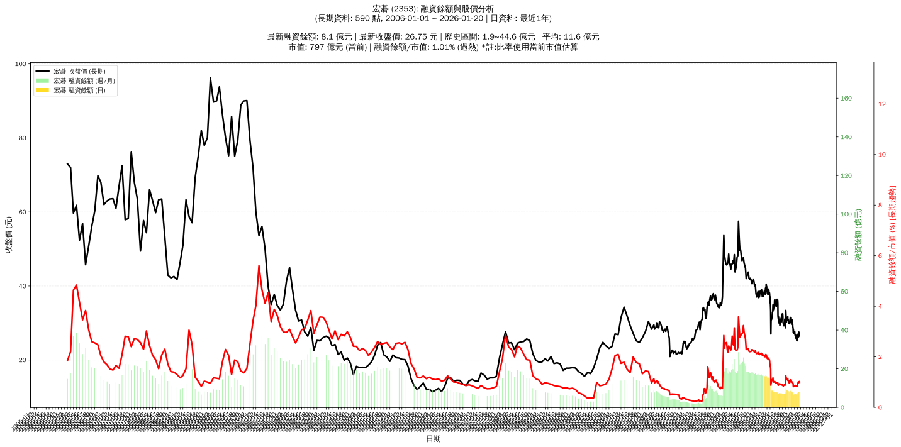

# :chart_with_upwards_trend: 宏碁 (2353) 融資餘額報告

!!! info "基本資訊"
    **:building_construction: 名稱**: 宏碁
    **:identification_card: 代號**: 2353
    **:calendar: 分析期間**: 2025-07-18 ~ 2026-01-09 (共 242 個交易日)
    **:clock3: 最新資料**: 2026-01-09
    **🕒 更新時間**: 2026-01-11 20:28:23 CST

## :moneybag: 融資餘額現況

| :chart: 指標 | :1234: 數值 | :traffic_light: 狀態 |
|:------------:|:----------:|:-------------------:|
| **最新融資餘額** | 7.8 億元 (29,649 張) | - |
| **最新收盤價** | 26.25 元 | - |
| **市值** | 800 億元 | - |
| **融資餘額/市值** | 0.97% | 🟠 偏高 |
| **日變化 (DoD)** | -0.2 億元 (-1.96%) | 📉 |
| **週變化 (WoW)** | +0.3 億元 (+3.85%) | 📈 |
| **月變化 (MoM)** | +0.9 億元 (+12.30%) | 📈 |

---

## :bar_chart: 歷史統計

| :chart: 指標 | :1234: 數值 |
|:------------:|:----------:|
| **歷史最高** | 16.7 億元 |
| **歷史最低** | 6.6 億元 |
| **平均值** | 9.4 億元 |
| **標準差** | 3.4 億元 |
| **當前相對位置** | 12.1% |

---

## :chart_with_upwards_trend: 融資餘額趨勢圖

    

---

## :clipboard: 詳細歷史記錄 (最近30日)

<table class="sortable-table">
<thead>
<tr>
<th>:calendar: 日期</th>
<th>:money_with_wings: 收盤價(元)</th>
<th>:chart: 漲跌(元)</th>
<th>:chart_with_upwards_trend: 漲跌(%)</th>
<th>:package: 融資餘額(億元)</th>
<th>:package: 融資餘額(張)</th>
<th>:arrow_up_down: 融資增減(張)</th>
<th>:chart: 融券餘額(張)</th>
<th>:balance_scale: 券資比(%)</th>
</tr>
</thead>
<tbody>
<tr>
<td>2026-01-09</td>
<td>26.25</td>
<td>🔻 -0.10</td>
<td>-0.38%</td>
<td>7.8</td>
<td>29,649</td>
<td>📉 -478</td>
<td>363</td>
<td>1.22%</td>
</tr>
<tr>
<td>2026-01-08</td>
<td>26.35</td>
<td>🔻 -0.70</td>
<td>-2.59%</td>
<td>7.9</td>
<td>30,127</td>
<td>📈 +694</td>
<td>370</td>
<td>1.23%</td>
</tr>
<tr>
<td>2026-01-07</td>
<td>27.05</td>
<td>🔺 +0.85</td>
<td>+3.24%</td>
<td>8.0</td>
<td>29,433</td>
<td>📉 -151</td>
<td>391</td>
<td>1.33%</td>
</tr>
<tr>
<td>2026-01-06</td>
<td>26.20</td>
<td>🔻 -0.40</td>
<td>-1.50%</td>
<td>7.8</td>
<td>29,584</td>
<td>📈 +809</td>
<td>421</td>
<td>1.42%</td>
</tr>
<tr>
<td>2026-01-05</td>
<td>26.60</td>
<td>🔺 +0.20</td>
<td>+0.76%</td>
<td>7.7</td>
<td>28,775</td>
<td>📈 +387</td>
<td>407</td>
<td>1.41%</td>
</tr>
<tr>
<td>2026-01-02</td>
<td>26.40</td>
<td>➖ +0.00</td>
<td>+0.00%</td>
<td>7.5</td>
<td>28,388</td>
<td>📈 +247</td>
<td>489</td>
<td>1.72%</td>
</tr>
<tr>
<td>2025-12-31</td>
<td>26.40</td>
<td>🔻 -0.30</td>
<td>-1.12%</td>
<td>7.4</td>
<td>28,141</td>
<td>📈 +709</td>
<td>859</td>
<td>3.05%</td>
</tr>
<tr>
<td>2025-12-30</td>
<td>26.70</td>
<td>🔺 +1.35</td>
<td>+5.33%</td>
<td>7.3</td>
<td>27,432</td>
<td>📈 +1,276</td>
<td>501</td>
<td>1.83%</td>
</tr>
<tr>
<td>2025-12-29</td>
<td>25.35</td>
<td>🔺 +0.15</td>
<td>+0.60%</td>
<td>6.6</td>
<td>26,156</td>
<td>📉 -34</td>
<td>421</td>
<td>1.61%</td>
</tr>
<tr>
<td>2025-12-26</td>
<td>25.20</td>
<td>🔻 -0.05</td>
<td>-0.20%</td>
<td>6.6</td>
<td>26,190</td>
<td>📉 -104</td>
<td>402</td>
<td>1.53%</td>
</tr>
<tr>
<td>2025-12-24</td>
<td>25.25</td>
<td>🔻 -0.35</td>
<td>-1.37%</td>
<td>6.6</td>
<td>26,294</td>
<td>📉 -304</td>
<td>331</td>
<td>1.26%</td>
</tr>
<tr>
<td>2025-12-23</td>
<td>25.60</td>
<td>🔻 -0.50</td>
<td>-1.92%</td>
<td>6.8</td>
<td>26,598</td>
<td>📈 +491</td>
<td>324</td>
<td>1.22%</td>
</tr>
<tr>
<td>2025-12-22</td>
<td>26.10</td>
<td>🔺 +0.20</td>
<td>+0.77%</td>
<td>6.8</td>
<td>26,107</td>
<td>📈 +90</td>
<td>435</td>
<td>1.67%</td>
</tr>
<tr>
<td>2025-12-19</td>
<td>25.90</td>
<td>🔺 +0.20</td>
<td>+0.78%</td>
<td>6.7</td>
<td>26,017</td>
<td>📉 -97</td>
<td>323</td>
<td>1.24%</td>
</tr>
<tr>
<td>2025-12-18</td>
<td>25.70</td>
<td>🔻 -0.35</td>
<td>-1.34%</td>
<td>6.7</td>
<td>26,114</td>
<td>➡️ +0</td>
<td>1,515</td>
<td>5.80%</td>
</tr>
<tr>
<td>2025-12-17</td>
<td>26.05</td>
<td>🔻 -0.40</td>
<td>-1.51%</td>
<td>6.8</td>
<td>26,114</td>
<td>📈 +695</td>
<td>1,439</td>
<td>5.51%</td>
</tr>
<tr>
<td>2025-12-16</td>
<td>26.45</td>
<td>🔻 -0.25</td>
<td>-0.94%</td>
<td>6.7</td>
<td>25,419</td>
<td>📉 -344</td>
<td>1,577</td>
<td>6.20%</td>
</tr>
<tr>
<td>2025-12-15</td>
<td>26.70</td>
<td>🔺 +0.10</td>
<td>+0.38%</td>
<td>6.9</td>
<td>25,763</td>
<td>📉 -167</td>
<td>3,589</td>
<td>13.90%</td>
</tr>
<tr>
<td>2025-12-12</td>
<td>26.60</td>
<td>🔺 +0.10</td>
<td>+0.38%</td>
<td>6.9</td>
<td>25,930</td>
<td>📉 -90</td>
<td>4,712</td>
<td>18.20%</td>
</tr>
<tr>
<td>2025-12-11</td>
<td>26.50</td>
<td>🔺 +0.05</td>
<td>+0.19%</td>
<td>6.9</td>
<td>26,020</td>
<td>📉 -183</td>
<td>5,424</td>
<td>20.80%</td>
</tr>
<tr>
<td>2025-12-10</td>
<td>26.45</td>
<td>🔻 -0.35</td>
<td>-1.31%</td>
<td>6.9</td>
<td>26,203</td>
<td>📈 +343</td>
<td>5,422</td>
<td>20.70%</td>
</tr>
<tr>
<td>2025-12-09</td>
<td>26.80</td>
<td>🔺 +0.10</td>
<td>+0.37%</td>
<td>6.9</td>
<td>25,860</td>
<td>📈 +275</td>
<td>5,529</td>
<td>21.40%</td>
</tr>
<tr>
<td>2025-12-08</td>
<td>26.70</td>
<td>🔻 -0.35</td>
<td>-1.29%</td>
<td>6.8</td>
<td>25,585</td>
<td>📈 +349</td>
<td>5,722</td>
<td>22.40%</td>
</tr>
<tr>
<td>2025-12-05</td>
<td>27.05</td>
<td>🔻 -0.45</td>
<td>-1.64%</td>
<td>6.8</td>
<td>25,236</td>
<td>📈 +392</td>
<td>5,868</td>
<td>23.30%</td>
</tr>
<tr>
<td>2025-12-04</td>
<td>27.50</td>
<td>🔻 -0.20</td>
<td>-0.72%</td>
<td>6.8</td>
<td>24,844</td>
<td>📈 +554</td>
<td>5,948</td>
<td>23.90%</td>
</tr>
<tr>
<td>2025-12-03</td>
<td>27.70</td>
<td>🔺 +0.35</td>
<td>+1.28%</td>
<td>6.7</td>
<td>24,290</td>
<td>📉 -196</td>
<td>5,908</td>
<td>24.30%</td>
</tr>
<tr>
<td>2025-12-02</td>
<td>27.35</td>
<td>🔺 +0.05</td>
<td>+0.18%</td>
<td>6.7</td>
<td>24,486</td>
<td>📉 -136</td>
<td>5,983</td>
<td>24.40%</td>
</tr>
<tr>
<td>2025-12-01</td>
<td>27.30</td>
<td>🔺 +0.05</td>
<td>+0.18%</td>
<td>6.7</td>
<td>24,622</td>
<td>📉 -473</td>
<td>6,091</td>
<td>24.70%</td>
</tr>
<tr>
<td>2025-11-28</td>
<td>27.25</td>
<td>➖ +0.00</td>
<td>+0.00%</td>
<td>6.8</td>
<td>25,095</td>
<td>📈 +374</td>
<td>6,468</td>
<td>25.80%</td>
</tr>
<tr>
<td>2025-11-27</td>
<td>27.25</td>
<td>🔻 -0.05</td>
<td>-0.18%</td>
<td>6.7</td>
<td>24,721</td>
<td>📈 +8</td>
<td>6,496</td>
<td>26.30%</td>
</tr>
</tbody>
</table>

---

## :information_source: 資料來源與方法

!!! note "資料來源說明"
    - **主要來源**: `raw_margin_daily.csv` (Type 13: ShowMarginChart)
    - **資料頻率**: 每日更新
    - **資料範圍**: 近1年交易日資料

!!! info "報告元資訊"
    - **報告產生時間**: 2026-01-11 20:28:23
    - **分析期間**: 242 個交易日
    - **資料來源**: Stage 1 Raw Margin Daily Data

---

:material-information-outline: **本報告僅供參考，投資決策請審慎評估**

