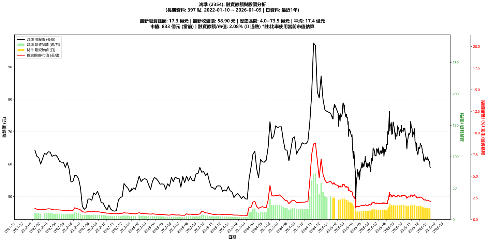

# :chart_with_upwards_trend: 鴻準 (2354) 融資餘額報告

!!! info "基本資訊"
    **:building_construction: 名稱**: 鴻準
    **:identification_card: 代號**: 2354
    **:calendar: 分析期間**: 2025-07-18 ~ 2026-01-09 (共 242 個交易日)
    **:clock3: 最新資料**: 2026-01-09
    **🕒 更新時間**: 2026-01-12 12:09:18 CST

## :moneybag: 融資餘額現況

| :chart: 指標 | :1234: 數值 | :traffic_light: 狀態 |
|:------------:|:----------:|:-------------------:|
| **最新融資餘額** | 17.3 億元 (29,357 張) | - |
| **最新收盤價** | 58.90 元 | - |
| **市值** | 833 億元 | - |
| **融資餘額/市值** | 2.08% | 🔴 過熱 |
| **日變化 (DoD)** | -0.2 億元 (-1.21%) | 📉 |
| **週變化 (WoW)** | -1.0 億元 (-5.67%) | 📉 |
| **月變化 (MoM)** | -3.5 億元 (-16.77%) | 📉 |

---

## :bar_chart: 歷史統計

| :chart: 指標 | :1234: 數值 |
|:------------:|:----------:|
| **歷史最高** | 35.3 億元 |
| **歷史最低** | 11.0 億元 |
| **平均值** | 21.0 億元 |
| **標準差** | 6.2 億元 |
| **當前相對位置** | 26.0% |

---

## :chart_with_upwards_trend: 融資餘額趨勢圖

    

---

## :clipboard: 詳細歷史記錄 (最近30日)

<table class="sortable-table">
<thead>
<tr>
<th>:calendar: 日期</th>
<th>:money_with_wings: 收盤價(元)</th>
<th>:chart: 漲跌(元)</th>
<th>:chart_with_upwards_trend: 漲跌(%)</th>
<th>:package: 融資餘額(億元)</th>
<th>:package: 融資餘額(張)</th>
<th>:arrow_up_down: 融資增減(張)</th>
<th>:chart: 融券餘額(張)</th>
<th>:balance_scale: 券資比(%)</th>
</tr>
</thead>
<tbody>
<tr>
<td>2026-01-09</td>
<td>58.90</td>
<td>🔻 -0.30</td>
<td>-0.51%</td>
<td>17.3</td>
<td>29,357</td>
<td>📉 -209</td>
<td>33</td>
<td>0.11%</td>
</tr>
<tr>
<td>2026-01-08</td>
<td>59.20</td>
<td>🔻 -1.60</td>
<td>-2.63%</td>
<td>17.5</td>
<td>29,566</td>
<td>📈 +329</td>
<td>31</td>
<td>0.10%</td>
</tr>
<tr>
<td>2026-01-07</td>
<td>60.80</td>
<td>🔺 +0.50</td>
<td>+0.83%</td>
<td>17.8</td>
<td>29,237</td>
<td>📉 -137</td>
<td>22</td>
<td>0.08%</td>
</tr>
<tr>
<td>2026-01-06</td>
<td>60.30</td>
<td>🔻 -0.50</td>
<td>-0.82%</td>
<td>17.7</td>
<td>29,374</td>
<td>📈 +155</td>
<td>43</td>
<td>0.15%</td>
</tr>
<tr>
<td>2026-01-05</td>
<td>60.80</td>
<td>🔻 -0.70</td>
<td>-1.14%</td>
<td>17.8</td>
<td>29,219</td>
<td>📉 -586</td>
<td>51</td>
<td>0.17%</td>
</tr>
<tr>
<td>2026-01-02</td>
<td>61.50</td>
<td>🔻 -0.20</td>
<td>-0.32%</td>
<td>18.3</td>
<td>29,805</td>
<td>📉 -320</td>
<td>69</td>
<td>0.23%</td>
</tr>
<tr>
<td>2025-12-31</td>
<td>61.70</td>
<td>🔺 +0.20</td>
<td>+0.33%</td>
<td>18.6</td>
<td>30,125</td>
<td>📉 -80</td>
<td>71</td>
<td>0.24%</td>
</tr>
<tr>
<td>2025-12-30</td>
<td>61.50</td>
<td>🔻 -0.70</td>
<td>-1.13%</td>
<td>18.6</td>
<td>30,205</td>
<td>📈 +171</td>
<td>65</td>
<td>0.22%</td>
</tr>
<tr>
<td>2025-12-29</td>
<td>62.20</td>
<td>🔺 +0.90</td>
<td>+1.47%</td>
<td>18.7</td>
<td>30,034</td>
<td>📉 -46</td>
<td>78</td>
<td>0.26%</td>
</tr>
<tr>
<td>2025-12-26</td>
<td>61.30</td>
<td>🔻 -0.10</td>
<td>-0.16%</td>
<td>18.4</td>
<td>30,080</td>
<td>📉 -367</td>
<td>98</td>
<td>0.33%</td>
</tr>
<tr>
<td>2025-12-24</td>
<td>61.40</td>
<td>🔻 -0.30</td>
<td>-0.49%</td>
<td>18.7</td>
<td>30,447</td>
<td>📈 +67</td>
<td>98</td>
<td>0.32%</td>
</tr>
<tr>
<td>2025-12-23</td>
<td>61.70</td>
<td>🔻 -0.50</td>
<td>-0.80%</td>
<td>18.7</td>
<td>30,380</td>
<td>📉 -211</td>
<td>96</td>
<td>0.32%</td>
</tr>
<tr>
<td>2025-12-22</td>
<td>62.20</td>
<td>🔺 +0.90</td>
<td>+1.47%</td>
<td>19.0</td>
<td>30,591</td>
<td>📉 -129</td>
<td>111</td>
<td>0.36%</td>
</tr>
<tr>
<td>2025-12-19</td>
<td>61.30</td>
<td>🔺 +0.40</td>
<td>+0.66%</td>
<td>18.8</td>
<td>30,720</td>
<td>📉 -33</td>
<td>106</td>
<td>0.35%</td>
</tr>
<tr>
<td>2025-12-18</td>
<td>60.90</td>
<td>➖ +0.00</td>
<td>+0.00%</td>
<td>18.7</td>
<td>30,753</td>
<td>📉 -15</td>
<td>106</td>
<td>0.34%</td>
</tr>
<tr>
<td>2025-12-17</td>
<td>60.90</td>
<td>🔻 -0.30</td>
<td>-0.49%</td>
<td>18.7</td>
<td>30,768</td>
<td>📉 -36</td>
<td>116</td>
<td>0.38%</td>
</tr>
<tr>
<td>2025-12-16</td>
<td>61.20</td>
<td>🔻 -1.20</td>
<td>-1.92%</td>
<td>18.9</td>
<td>30,804</td>
<td>📉 -617</td>
<td>128</td>
<td>0.42%</td>
</tr>
<tr>
<td>2025-12-15</td>
<td>62.40</td>
<td>🔻 -1.30</td>
<td>-2.04%</td>
<td>19.6</td>
<td>31,421</td>
<td>📉 -80</td>
<td>395</td>
<td>1.26%</td>
</tr>
<tr>
<td>2025-12-12</td>
<td>63.70</td>
<td>🔺 +0.10</td>
<td>+0.16%</td>
<td>20.1</td>
<td>31,501</td>
<td>📈 +8</td>
<td>547</td>
<td>1.74%</td>
</tr>
<tr>
<td>2025-12-11</td>
<td>63.60</td>
<td>🔻 -1.10</td>
<td>-1.70%</td>
<td>20.0</td>
<td>31,493</td>
<td>📉 -619</td>
<td>594</td>
<td>1.89%</td>
</tr>
<tr>
<td>2025-12-10</td>
<td>64.70</td>
<td>🔻 -0.50</td>
<td>-0.77%</td>
<td>20.8</td>
<td>32,112</td>
<td>📈 +23</td>
<td>690</td>
<td>2.15%</td>
</tr>
<tr>
<td>2025-12-09</td>
<td>65.20</td>
<td>🔻 -0.50</td>
<td>-0.76%</td>
<td>20.9</td>
<td>32,089</td>
<td>📉 -125</td>
<td>710</td>
<td>2.21%</td>
</tr>
<tr>
<td>2025-12-08</td>
<td>65.70</td>
<td>🔻 -0.30</td>
<td>-0.45%</td>
<td>21.2</td>
<td>32,214</td>
<td>📉 -330</td>
<td>731</td>
<td>2.27%</td>
</tr>
<tr>
<td>2025-12-05</td>
<td>66.00</td>
<td>🔻 -0.30</td>
<td>-0.45%</td>
<td>21.5</td>
<td>32,544</td>
<td>📉 -91</td>
<td>732</td>
<td>2.25%</td>
</tr>
<tr>
<td>2025-12-04</td>
<td>66.30</td>
<td>🔺 +0.30</td>
<td>+0.45%</td>
<td>21.6</td>
<td>32,635</td>
<td>📉 -122</td>
<td>735</td>
<td>2.25%</td>
</tr>
<tr>
<td>2025-12-03</td>
<td>66.00</td>
<td>🔺 +0.70</td>
<td>+1.07%</td>
<td>21.6</td>
<td>32,757</td>
<td>📈 +32</td>
<td>763</td>
<td>2.33%</td>
</tr>
<tr>
<td>2025-12-02</td>
<td>65.30</td>
<td>🔺 +0.50</td>
<td>+0.77%</td>
<td>21.4</td>
<td>32,725</td>
<td>📉 -26</td>
<td>780</td>
<td>2.38%</td>
</tr>
<tr>
<td>2025-12-01</td>
<td>64.80</td>
<td>🔻 -0.40</td>
<td>-0.61%</td>
<td>21.2</td>
<td>32,751</td>
<td>📉 -318</td>
<td>786</td>
<td>2.40%</td>
</tr>
<tr>
<td>2025-11-28</td>
<td>65.20</td>
<td>🔺 +0.30</td>
<td>+0.46%</td>
<td>21.6</td>
<td>33,069</td>
<td>📉 -34</td>
<td>781</td>
<td>2.36%</td>
</tr>
<tr>
<td>2025-11-27</td>
<td>64.90</td>
<td>🔺 +0.50</td>
<td>+0.78%</td>
<td>21.5</td>
<td>33,103</td>
<td>📉 -17</td>
<td>744</td>
<td>2.25%</td>
</tr>
</tbody>
</table>

---

## :information_source: 資料來源與方法

!!! note "資料來源說明"
    - **主要來源**: `raw_margin_daily.csv` (Type 13: ShowMarginChart)
    - **資料頻率**: 每日更新
    - **資料範圍**: 近1年交易日資料

!!! info "報告元資訊"
    - **報告產生時間**: 2026-01-12 12:09:18
    - **分析期間**: 242 個交易日
    - **資料來源**: Stage 1 Raw Margin Daily Data

---

:material-information-outline: **本報告僅供參考，投資決策請審慎評估**

