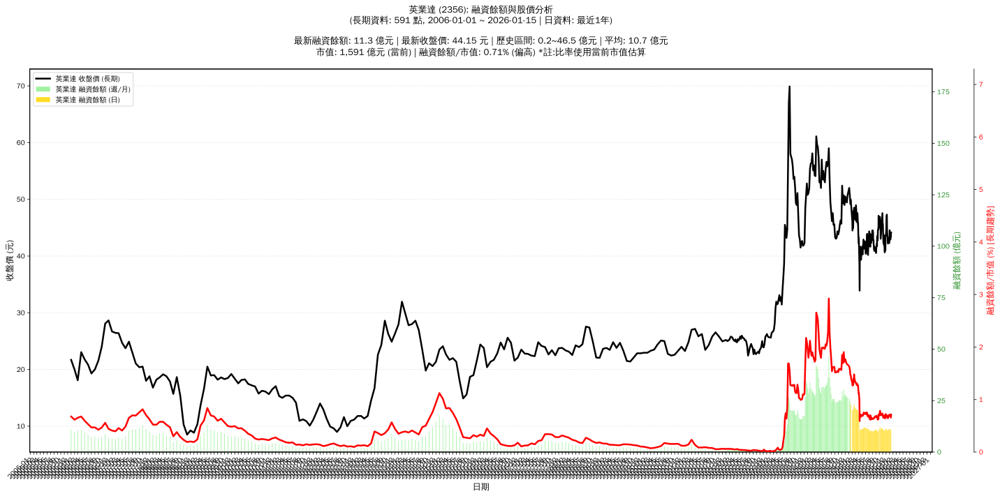

# :chart_with_upwards_trend: 英業達 (2356) 融資餘額報告

!!! info "基本資訊"
    **:building_construction: 名稱**: 英業達
    **:identification_card: 代號**: 2356
    **:calendar: 分析期間**: 2025-07-18 ~ 2026-01-09 (共 242 個交易日)
    **:clock3: 最新資料**: 2026-01-09
    **🕒 更新時間**: 2026-01-11 20:28:36 CST

## :moneybag: 融資餘額現況

| :chart: 指標 | :1234: 數值 | :traffic_light: 狀態 |
|:------------:|:----------:|:-------------------:|
| **最新融資餘額** | 10.7 億元 (24,901 張) | - |
| **最新收盤價** | 42.90 元 | - |
| **市值** | 1,539 億元 | - |
| **融資餘額/市值** | 0.69% | 🟠 偏高 |
| **日變化 (DoD)** | -0.1 億元 (-0.62%) | 📉 |
| **週變化 (WoW)** | -0.7 億元 (-5.90%) | 📉 |
| **月變化 (MoM)** | +0.0 億元 (+0.26%) | 📈 |

---

## :bar_chart: 歷史統計

| :chart: 指標 | :1234: 數值 |
|:------------:|:----------:|
| **歷史最高** | 24.1 億元 |
| **歷史最低** | 9.4 億元 |
| **平均值** | 13.0 億元 |
| **標準差** | 4.3 億元 |
| **當前相對位置** | 8.7% |

---

## :chart_with_upwards_trend: 融資餘額趨勢圖

    

---

## :clipboard: 詳細歷史記錄 (最近30日)

<table class="sortable-table">
<thead>
<tr>
<th>:calendar: 日期</th>
<th>:money_with_wings: 收盤價(元)</th>
<th>:chart: 漲跌(元)</th>
<th>:chart_with_upwards_trend: 漲跌(%)</th>
<th>:package: 融資餘額(億元)</th>
<th>:package: 融資餘額(張)</th>
<th>:arrow_up_down: 融資增減(張)</th>
<th>:chart: 融券餘額(張)</th>
<th>:balance_scale: 券資比(%)</th>
</tr>
</thead>
<tbody>
<tr>
<td>2026-01-09</td>
<td>42.90</td>
<td>➖ +0.00</td>
<td>+0.00%</td>
<td>10.7</td>
<td>24,901</td>
<td>📉 -155</td>
<td>521</td>
<td>2.09%</td>
</tr>
<tr>
<td>2026-01-08</td>
<td>42.90</td>
<td>🔻 -0.95</td>
<td>-2.17%</td>
<td>10.7</td>
<td>25,056</td>
<td>📈 +222</td>
<td>528</td>
<td>2.11%</td>
</tr>
<tr>
<td>2026-01-07</td>
<td>43.85</td>
<td>🔺 +0.65</td>
<td>+1.50%</td>
<td>10.9</td>
<td>24,834</td>
<td>📉 -441</td>
<td>527</td>
<td>2.12%</td>
</tr>
<tr>
<td>2026-01-06</td>
<td>43.20</td>
<td>🔻 -0.65</td>
<td>-1.48%</td>
<td>10.9</td>
<td>25,275</td>
<td>📈 +185</td>
<td>532</td>
<td>2.10%</td>
</tr>
<tr>
<td>2026-01-05</td>
<td>43.85</td>
<td>🔻 -0.70</td>
<td>-1.57%</td>
<td>11.0</td>
<td>25,090</td>
<td>📉 -392</td>
<td>509</td>
<td>2.03%</td>
</tr>
<tr>
<td>2026-01-02</td>
<td>44.55</td>
<td>🔺 +1.65</td>
<td>+3.85%</td>
<td>11.4</td>
<td>25,482</td>
<td>📉 -393</td>
<td>505</td>
<td>1.98%</td>
</tr>
<tr>
<td>2025-12-31</td>
<td>42.90</td>
<td>🔺 +0.60</td>
<td>+1.42%</td>
<td>11.1</td>
<td>25,875</td>
<td>📉 -202</td>
<td>485</td>
<td>1.87%</td>
</tr>
<tr>
<td>2025-12-30</td>
<td>42.30</td>
<td>🔻 -0.20</td>
<td>-0.47%</td>
<td>11.0</td>
<td>26,077</td>
<td>📉 -215</td>
<td>482</td>
<td>1.85%</td>
</tr>
<tr>
<td>2025-12-29</td>
<td>42.50</td>
<td>➖ +0.00</td>
<td>+0.00%</td>
<td>11.2</td>
<td>26,292</td>
<td>📈 +272</td>
<td>487</td>
<td>1.85%</td>
</tr>
<tr>
<td>2025-12-26</td>
<td>42.50</td>
<td>🔻 -0.65</td>
<td>-1.51%</td>
<td>11.1</td>
<td>26,020</td>
<td>📈 +120</td>
<td>557</td>
<td>2.14%</td>
</tr>
<tr>
<td>2025-12-24</td>
<td>43.15</td>
<td>🔺 +0.10</td>
<td>+0.23%</td>
<td>11.2</td>
<td>25,900</td>
<td>📈 +207</td>
<td>502</td>
<td>1.94%</td>
</tr>
<tr>
<td>2025-12-23</td>
<td>43.05</td>
<td>🔻 -0.05</td>
<td>-0.12%</td>
<td>11.1</td>
<td>25,693</td>
<td>📈 +1,030</td>
<td>494</td>
<td>1.92%</td>
</tr>
<tr>
<td>2025-12-22</td>
<td>43.10</td>
<td>🔺 +0.10</td>
<td>+0.23%</td>
<td>10.6</td>
<td>24,663</td>
<td>📈 +173</td>
<td>547</td>
<td>2.22%</td>
</tr>
<tr>
<td>2025-12-19</td>
<td>43.00</td>
<td>🔺 +0.80</td>
<td>+1.90%</td>
<td>10.5</td>
<td>24,490</td>
<td>📈 +201</td>
<td>551</td>
<td>2.25%</td>
</tr>
<tr>
<td>2025-12-18</td>
<td>42.20</td>
<td>🔻 -0.15</td>
<td>-0.35%</td>
<td>10.2</td>
<td>24,289</td>
<td>📉 -46</td>
<td>557</td>
<td>2.29%</td>
</tr>
<tr>
<td>2025-12-17</td>
<td>42.35</td>
<td>🔻 -0.15</td>
<td>-0.35%</td>
<td>10.3</td>
<td>24,335</td>
<td>📈 +89</td>
<td>590</td>
<td>2.42%</td>
</tr>
<tr>
<td>2025-12-16</td>
<td>42.50</td>
<td>🔻 -0.85</td>
<td>-1.96%</td>
<td>10.3</td>
<td>24,246</td>
<td>📈 +38</td>
<td>588</td>
<td>2.43%</td>
</tr>
<tr>
<td>2025-12-15</td>
<td>43.35</td>
<td>🔻 -0.30</td>
<td>-0.69%</td>
<td>10.5</td>
<td>24,208</td>
<td>📈 +267</td>
<td>624</td>
<td>2.58%</td>
</tr>
<tr>
<td>2025-12-12</td>
<td>43.65</td>
<td>🔻 -0.40</td>
<td>-0.91%</td>
<td>10.5</td>
<td>23,941</td>
<td>📈 +9</td>
<td>621</td>
<td>2.59%</td>
</tr>
<tr>
<td>2025-12-11</td>
<td>44.05</td>
<td>🔻 -0.45</td>
<td>-1.01%</td>
<td>10.5</td>
<td>23,932</td>
<td>📉 -12</td>
<td>637</td>
<td>2.66%</td>
</tr>
<tr>
<td>2025-12-10</td>
<td>44.50</td>
<td>🔻 -0.90</td>
<td>-1.98%</td>
<td>10.7</td>
<td>23,944</td>
<td>📉 -5</td>
<td>711</td>
<td>2.97%</td>
</tr>
<tr>
<td>2025-12-09</td>
<td>45.40</td>
<td>🔻 -1.90</td>
<td>-4.02%</td>
<td>10.9</td>
<td>23,949</td>
<td>📈 +578</td>
<td>682</td>
<td>2.85%</td>
</tr>
<tr>
<td>2025-12-08</td>
<td>47.30</td>
<td>🔺 +0.20</td>
<td>+0.42%</td>
<td>11.1</td>
<td>23,371</td>
<td>📉 -7</td>
<td>2,167</td>
<td>9.27%</td>
</tr>
<tr>
<td>2025-12-05</td>
<td>47.10</td>
<td>🔺 +1.05</td>
<td>+2.28%</td>
<td>11.0</td>
<td>23,378</td>
<td>📉 -778</td>
<td>2,148</td>
<td>9.19%</td>
</tr>
<tr>
<td>2025-12-04</td>
<td>46.05</td>
<td>🔺 +0.95</td>
<td>+2.11%</td>
<td>11.1</td>
<td>24,156</td>
<td>📉 -428</td>
<td>2,075</td>
<td>8.59%</td>
</tr>
<tr>
<td>2025-12-03</td>
<td>45.10</td>
<td>🔺 +0.95</td>
<td>+2.15%</td>
<td>11.1</td>
<td>24,584</td>
<td>📉 -1,073</td>
<td>2,186</td>
<td>8.89%</td>
</tr>
<tr>
<td>2025-12-02</td>
<td>44.15</td>
<td>🔺 +0.10</td>
<td>+0.23%</td>
<td>11.3</td>
<td>25,657</td>
<td>📉 -115</td>
<td>1,996</td>
<td>7.78%</td>
</tr>
<tr>
<td>2025-12-01</td>
<td>44.05</td>
<td>🔺 +0.45</td>
<td>+1.03%</td>
<td>11.4</td>
<td>25,772</td>
<td>📉 -524</td>
<td>1,992</td>
<td>7.73%</td>
</tr>
<tr>
<td>2025-11-28</td>
<td>43.60</td>
<td>🔺 +0.10</td>
<td>+0.23%</td>
<td>11.5</td>
<td>26,296</td>
<td>📉 -151</td>
<td>2,020</td>
<td>7.68%</td>
</tr>
<tr>
<td>2025-11-27</td>
<td>43.50</td>
<td>🔺 +0.10</td>
<td>+0.23%</td>
<td>11.5</td>
<td>26,447</td>
<td>📈 +267</td>
<td>1,622</td>
<td>6.13%</td>
</tr>
</tbody>
</table>

---

## :information_source: 資料來源與方法

!!! note "資料來源說明"
    - **主要來源**: `raw_margin_daily.csv` (Type 13: ShowMarginChart)
    - **資料頻率**: 每日更新
    - **資料範圍**: 近1年交易日資料

!!! info "報告元資訊"
    - **報告產生時間**: 2026-01-11 20:28:36
    - **分析期間**: 242 個交易日
    - **資料來源**: Stage 1 Raw Margin Daily Data

---

:material-information-outline: **本報告僅供參考，投資決策請審慎評估**

