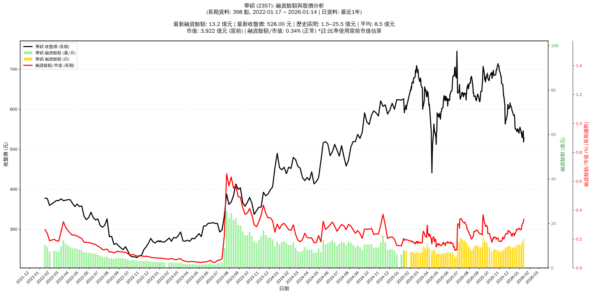

# :chart_with_upwards_trend: 華碩 (2357) 融資餘額報告

!!! info "基本資訊"
    **:building_construction: 名稱**: 華碩
    **:identification_card: 代號**: 2357
    **:calendar: 分析期間**: 2025-07-18 ~ 2026-01-09 (共 242 個交易日)
    **:clock3: 最新資料**: 2026-01-09
    **🕒 更新時間**: 2026-01-11 20:28:55 CST

## :moneybag: 融資餘額現況

| :chart: 指標 | :1234: 數值 | :traffic_light: 狀態 |
|:------------:|:----------:|:-------------------:|
| **最新融資餘額** | 11.9 億元 (2,257 張) | - |
| **最新收盤價** | 529.00 元 | - |
| **市值** | 3,929 億元 | - |
| **融資餘額/市值** | 0.30% | 🟡 正常 |
| **日變化 (DoD)** | +0.3 億元 (+2.82%) | 📈 |
| **週變化 (WoW)** | +1.4 億元 (+12.75%) | 📈 |
| **月變化 (MoM)** | +3.1 億元 (+35.58%) | 📈 |

---

## :bar_chart: 歷史統計

| :chart: 指標 | :1234: 數值 |
|:------------:|:----------:|
| **歷史最高** | 14.4 億元 |
| **歷史最低** | 4.7 億元 |
| **平均值** | 8.7 億元 |
| **標準差** | 2.0 億元 |
| **當前相對位置** | 74.3% |

---

## :chart_with_upwards_trend: 融資餘額趨勢圖

    

---

## :clipboard: 詳細歷史記錄 (最近30日)

<table class="sortable-table">
<thead>
<tr>
<th>:calendar: 日期</th>
<th>:money_with_wings: 收盤價(元)</th>
<th>:chart: 漲跌(元)</th>
<th>:chart_with_upwards_trend: 漲跌(%)</th>
<th>:package: 融資餘額(億元)</th>
<th>:package: 融資餘額(張)</th>
<th>:arrow_up_down: 融資增減(張)</th>
<th>:chart: 融券餘額(張)</th>
<th>:balance_scale: 券資比(%)</th>
</tr>
</thead>
<tbody>
<tr>
<td>2026-01-09</td>
<td>529.00</td>
<td>🔻 -1.00</td>
<td>-0.19%</td>
<td>11.9</td>
<td>2,257</td>
<td>📈 +66</td>
<td>27</td>
<td>1.20%</td>
</tr>
<tr>
<td>2026-01-08</td>
<td>530.00</td>
<td>🔻 -13.00</td>
<td>-2.39%</td>
<td>11.6</td>
<td>2,191</td>
<td>📈 +188</td>
<td>23</td>
<td>1.05%</td>
</tr>
<tr>
<td>2026-01-07</td>
<td>543.00</td>
<td>🔺 +4.00</td>
<td>+0.74%</td>
<td>10.9</td>
<td>2,003</td>
<td>📈 +53</td>
<td>17</td>
<td>0.85%</td>
</tr>
<tr>
<td>2026-01-06</td>
<td>539.00</td>
<td>🔻 -7.00</td>
<td>-1.28%</td>
<td>10.5</td>
<td>1,950</td>
<td>📈 +56</td>
<td>13</td>
<td>0.67%</td>
</tr>
<tr>
<td>2026-01-05</td>
<td>546.00</td>
<td>🔻 -9.00</td>
<td>-1.62%</td>
<td>10.3</td>
<td>1,894</td>
<td>📉 -14</td>
<td>16</td>
<td>0.84%</td>
</tr>
<tr>
<td>2026-01-02</td>
<td>555.00</td>
<td>🔺 +7.00</td>
<td>+1.28%</td>
<td>10.6</td>
<td>1,908</td>
<td>📉 -7</td>
<td>15</td>
<td>0.79%</td>
</tr>
<tr>
<td>2025-12-31</td>
<td>548.00</td>
<td>🔺 +8.00</td>
<td>+1.48%</td>
<td>10.5</td>
<td>1,915</td>
<td>📉 -75</td>
<td>9</td>
<td>0.47%</td>
</tr>
<tr>
<td>2025-12-30</td>
<td>540.00</td>
<td>🔻 -3.00</td>
<td>-0.55%</td>
<td>10.7</td>
<td>1,990</td>
<td>📈 +13</td>
<td>8</td>
<td>0.40%</td>
</tr>
<tr>
<td>2025-12-29</td>
<td>543.00</td>
<td>🔻 -8.00</td>
<td>-1.45%</td>
<td>10.7</td>
<td>1,977</td>
<td>📈 +92</td>
<td>8</td>
<td>0.40%</td>
</tr>
<tr>
<td>2025-12-26</td>
<td>551.00</td>
<td>🔺 +7.00</td>
<td>+1.29%</td>
<td>10.4</td>
<td>1,885</td>
<td>📉 -33</td>
<td>17</td>
<td>0.90%</td>
</tr>
<tr>
<td>2025-12-24</td>
<td>544.00</td>
<td>🔻 -2.00</td>
<td>-0.37%</td>
<td>10.4</td>
<td>1,918</td>
<td>📉 -13</td>
<td>11</td>
<td>0.57%</td>
</tr>
<tr>
<td>2025-12-23</td>
<td>546.00</td>
<td>🔻 -4.00</td>
<td>-0.73%</td>
<td>10.5</td>
<td>1,931</td>
<td>📈 +96</td>
<td>11</td>
<td>0.57%</td>
</tr>
<tr>
<td>2025-12-22</td>
<td>550.00</td>
<td>➖ +0.00</td>
<td>+0.00%</td>
<td>10.1</td>
<td>1,835</td>
<td>📈 +111</td>
<td>29</td>
<td>1.58%</td>
</tr>
<tr>
<td>2025-12-19</td>
<td>550.00</td>
<td>🔻 -4.00</td>
<td>-0.72%</td>
<td>9.5</td>
<td>1,724</td>
<td>📈 +67</td>
<td>22</td>
<td>1.28%</td>
</tr>
<tr>
<td>2025-12-18</td>
<td>554.00</td>
<td>🔻 -23.00</td>
<td>-3.99%</td>
<td>9.2</td>
<td>1,657</td>
<td>📈 +65</td>
<td>22</td>
<td>1.33%</td>
</tr>
<tr>
<td>2025-12-17</td>
<td>577.00</td>
<td>🔻 -9.00</td>
<td>-1.54%</td>
<td>9.2</td>
<td>1,592</td>
<td>📈 +98</td>
<td>12</td>
<td>0.75%</td>
</tr>
<tr>
<td>2025-12-16</td>
<td>586.00</td>
<td>🔺 +2.00</td>
<td>+0.34%</td>
<td>8.8</td>
<td>1,494</td>
<td>📉 -109</td>
<td>14</td>
<td>0.94%</td>
</tr>
<tr>
<td>2025-12-15</td>
<td>584.00</td>
<td>🔻 -4.00</td>
<td>-0.68%</td>
<td>9.4</td>
<td>1,603</td>
<td>📈 +18</td>
<td>22</td>
<td>1.37%</td>
</tr>
<tr>
<td>2025-12-12</td>
<td>588.00</td>
<td>🔻 -4.00</td>
<td>-0.68%</td>
<td>9.3</td>
<td>1,585</td>
<td>📉 -1</td>
<td>24</td>
<td>1.51%</td>
</tr>
<tr>
<td>2025-12-11</td>
<td>592.00</td>
<td>🔻 -3.00</td>
<td>-0.50%</td>
<td>9.4</td>
<td>1,586</td>
<td>📈 +106</td>
<td>25</td>
<td>1.58%</td>
</tr>
<tr>
<td>2025-12-10</td>
<td>595.00</td>
<td>🔻 -1.00</td>
<td>-0.17%</td>
<td>8.8</td>
<td>1,480</td>
<td>📈 +30</td>
<td>30</td>
<td>2.03%</td>
</tr>
<tr>
<td>2025-12-09</td>
<td>596.00</td>
<td>🔻 -6.00</td>
<td>-1.00%</td>
<td>8.6</td>
<td>1,450</td>
<td>📈 +15</td>
<td>28</td>
<td>1.93%</td>
</tr>
<tr>
<td>2025-12-08</td>
<td>602.00</td>
<td>🔻 -7.00</td>
<td>-1.15%</td>
<td>8.6</td>
<td>1,435</td>
<td>📉 -134</td>
<td>30</td>
<td>2.09%</td>
</tr>
<tr>
<td>2025-12-05</td>
<td>609.00</td>
<td>🔺 +2.00</td>
<td>+0.33%</td>
<td>9.6</td>
<td>1,569</td>
<td>📉 -5</td>
<td>29</td>
<td>1.85%</td>
</tr>
<tr>
<td>2025-12-04</td>
<td>607.00</td>
<td>🔻 -9.00</td>
<td>-1.46%</td>
<td>9.6</td>
<td>1,574</td>
<td>📈 +5</td>
<td>28</td>
<td>1.78%</td>
</tr>
<tr>
<td>2025-12-03</td>
<td>616.00</td>
<td>🔺 +9.00</td>
<td>+1.48%</td>
<td>9.7</td>
<td>1,569</td>
<td>📉 -61</td>
<td>29</td>
<td>1.85%</td>
</tr>
<tr>
<td>2025-12-02</td>
<td>607.00</td>
<td>🔺 +4.00</td>
<td>+0.66%</td>
<td>9.9</td>
<td>1,630</td>
<td>➡️ +0</td>
<td>30</td>
<td>1.84%</td>
</tr>
<tr>
<td>2025-12-01</td>
<td>603.00</td>
<td>🔺 +2.00</td>
<td>+0.33%</td>
<td>9.8</td>
<td>1,630</td>
<td>📉 -15</td>
<td>27</td>
<td>1.66%</td>
</tr>
<tr>
<td>2025-11-28</td>
<td>601.00</td>
<td>🔻 -10.00</td>
<td>-1.64%</td>
<td>9.9</td>
<td>1,645</td>
<td>📉 -30</td>
<td>26</td>
<td>1.58%</td>
</tr>
<tr>
<td>2025-11-27</td>
<td>611.00</td>
<td>🔻 -1.00</td>
<td>-0.16%</td>
<td>10.2</td>
<td>1,675</td>
<td>📈 +125</td>
<td>26</td>
<td>1.55%</td>
</tr>
</tbody>
</table>

---

## :information_source: 資料來源與方法

!!! note "資料來源說明"
    - **主要來源**: `raw_margin_daily.csv` (Type 13: ShowMarginChart)
    - **資料頻率**: 每日更新
    - **資料範圍**: 近1年交易日資料

!!! info "報告元資訊"
    - **報告產生時間**: 2026-01-11 20:28:55
    - **分析期間**: 242 個交易日
    - **資料來源**: Stage 1 Raw Margin Daily Data

---

:material-information-outline: **本報告僅供參考，投資決策請審慎評估**

