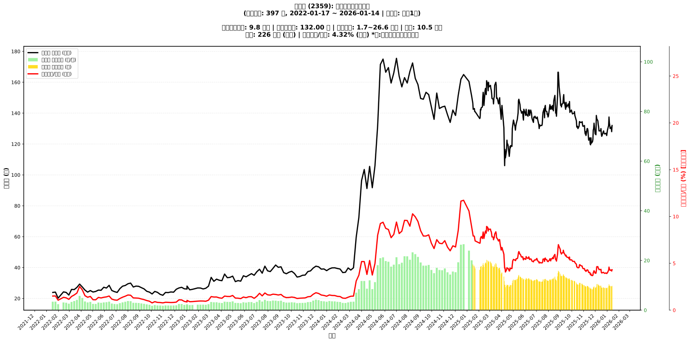

# :chart_with_upwards_trend: 所羅門 (2359) 融資餘額報告

!!! info "基本資訊"
    **:building_construction: 名稱**: 所羅門
    **:identification_card: 代號**: 2359
    **:calendar: 分析期間**: 2025-07-18 ~ 2026-01-09 (共 242 個交易日)
    **:clock3: 最新資料**: 2026-01-09
    **🕒 更新時間**: 2026-01-12 13:14:01 CST

## :moneybag: 融資餘額現況

| :chart: 指標 | :1234: 數值 | :traffic_light: 狀態 |
|:------------:|:----------:|:-------------------:|
| **最新融資餘額** | 9.6 億元 (7,400 張) | - |
| **最新收盤價** | 130.00 元 | - |
| **市值** | 223 億元 | - |
| **融資餘額/市值** | 4.32% | 🔴 過熱 |
| **日變化 (DoD)** | -0.2 億元 (-2.27%) | 📉 |
| **週變化 (WoW)** | +0.6 億元 (+6.40%) | 📈 |
| **月變化 (MoM)** | -0.4 億元 (-4.31%) | 📉 |

---

## :bar_chart: 歷史統計

| :chart: 指標 | :1234: 數值 |
|:------------:|:----------:|
| **歷史最高** | 20.2 億元 |
| **歷史最低** | 8.3 億元 |
| **平均值** | 12.8 億元 |
| **標準差** | 3.0 億元 |
| **當前相對位置** | 10.7% |

---

## :chart_with_upwards_trend: 融資餘額趨勢圖

    

---

## :clipboard: 詳細歷史記錄 (最近30日)

<table class="sortable-table">
<thead>
<tr>
<th markdown="span">:calendar: 日期</th>
<th markdown="span">:money_with_wings: 收盤價(元)</th>
<th markdown="span">:chart: 漲跌(元)</th>
<th markdown="span">:chart_with_upwards_trend: 漲跌(%)</th>
<th markdown="span">:package: 融資餘額(億元)</th>
<th markdown="span">:package: 融資餘額(張)</th>
<th markdown="span">:arrow_up_down: 融資增減(張)</th>
<th markdown="span">:chart: 融券餘額(張)</th>
<th markdown="span">:balance_scale: 券資比(%)</th>
</tr>
</thead>
<tbody>
<tr>
<td>2026-01-09</td>
<td>130.00</td>
<td>🔻 -2.00</td>
<td>-1.52%</td>
<td>9.6</td>
<td>7,400</td>
<td>📉 -57</td>
<td>734</td>
<td>9.92%</td>
</tr>
<tr>
<td>2026-01-08</td>
<td>132.00</td>
<td>🔻 -1.50</td>
<td>-1.12%</td>
<td>9.8</td>
<td>7,457</td>
<td>📈 +41</td>
<td>735</td>
<td>9.86%</td>
</tr>
<tr>
<td>2026-01-07</td>
<td>133.50</td>
<td>🔻 -4.00</td>
<td>-2.91%</td>
<td>9.9</td>
<td>7,416</td>
<td>📉 -148</td>
<td>756</td>
<td>10.20%</td>
</tr>
<tr>
<td>2026-01-06</td>
<td>137.50</td>
<td>🔺 +5.50</td>
<td>+4.17%</td>
<td>10.4</td>
<td>7,564</td>
<td>📈 +260</td>
<td>750</td>
<td>9.92%</td>
</tr>
<tr>
<td>2026-01-05</td>
<td>132.00</td>
<td>🔺 +3.00</td>
<td>+2.33%</td>
<td>9.6</td>
<td>7,304</td>
<td>📈 +295</td>
<td>721</td>
<td>9.87%</td>
</tr>
<tr>
<td>2026-01-02</td>
<td>129.00</td>
<td>🔺 +3.50</td>
<td>+2.79%</td>
<td>9.0</td>
<td>7,009</td>
<td>📉 -36</td>
<td>744</td>
<td>10.60%</td>
</tr>
<tr>
<td>2025-12-31</td>
<td>125.50</td>
<td>🔻 -1.00</td>
<td>-0.79%</td>
<td>8.8</td>
<td>7,045</td>
<td>📉 -5</td>
<td>743</td>
<td>10.50%</td>
</tr>
<tr>
<td>2025-12-30</td>
<td>126.50</td>
<td>🔻 -0.50</td>
<td>-0.39%</td>
<td>8.9</td>
<td>7,050</td>
<td>📉 -37</td>
<td>741</td>
<td>10.50%</td>
</tr>
<tr>
<td>2025-12-29</td>
<td>127.00</td>
<td>🔺 +0.50</td>
<td>+0.40%</td>
<td>9.0</td>
<td>7,087</td>
<td>📈 +59</td>
<td>735</td>
<td>10.40%</td>
</tr>
<tr>
<td>2025-12-26</td>
<td>126.50</td>
<td>🔻 -0.50</td>
<td>-0.39%</td>
<td>8.9</td>
<td>7,028</td>
<td>📉 -52</td>
<td>741</td>
<td>10.50%</td>
</tr>
<tr>
<td>2025-12-24</td>
<td>127.00</td>
<td>🔻 -1.50</td>
<td>-1.17%</td>
<td>9.0</td>
<td>7,080</td>
<td>📉 -11</td>
<td>751</td>
<td>10.60%</td>
</tr>
<tr>
<td>2025-12-23</td>
<td>128.50</td>
<td>🔺 +0.50</td>
<td>+0.39%</td>
<td>9.1</td>
<td>7,091</td>
<td>📉 -47</td>
<td>742</td>
<td>10.50%</td>
</tr>
<tr>
<td>2025-12-22</td>
<td>128.00</td>
<td>🔺 +2.50</td>
<td>+1.99%</td>
<td>9.1</td>
<td>7,138</td>
<td>📉 -42</td>
<td>747</td>
<td>10.50%</td>
</tr>
<tr>
<td>2025-12-19</td>
<td>125.50</td>
<td>🔺 +0.50</td>
<td>+0.40%</td>
<td>9.0</td>
<td>7,180</td>
<td>📉 -15</td>
<td>783</td>
<td>10.90%</td>
</tr>
<tr>
<td>2025-12-18</td>
<td>125.00</td>
<td>🔻 -1.50</td>
<td>-1.19%</td>
<td>9.0</td>
<td>7,195</td>
<td>📉 -17</td>
<td>777</td>
<td>10.80%</td>
</tr>
<tr>
<td>2025-12-17</td>
<td>126.50</td>
<td>🔻 -3.50</td>
<td>-2.69%</td>
<td>9.1</td>
<td>7,212</td>
<td>📉 -380</td>
<td>784</td>
<td>10.90%</td>
</tr>
<tr>
<td>2025-12-16</td>
<td>130.00</td>
<td>🔺 +1.50</td>
<td>+1.17%</td>
<td>9.9</td>
<td>7,592</td>
<td>📉 -7</td>
<td>766</td>
<td>10.10%</td>
</tr>
<tr>
<td>2025-12-15</td>
<td>128.50</td>
<td>➖ +0.00</td>
<td>+0.00%</td>
<td>9.8</td>
<td>7,599</td>
<td>📉 -49</td>
<td>767</td>
<td>10.10%</td>
</tr>
<tr>
<td>2025-12-12</td>
<td>128.50</td>
<td>➖ +0.00</td>
<td>+0.00%</td>
<td>9.8</td>
<td>7,648</td>
<td>📈 +39</td>
<td>762</td>
<td>9.96%</td>
</tr>
<tr>
<td>2025-12-11</td>
<td>128.50</td>
<td>🔻 -2.50</td>
<td>-1.91%</td>
<td>9.8</td>
<td>7,609</td>
<td>📉 -65</td>
<td>774</td>
<td>10.20%</td>
</tr>
<tr>
<td>2025-12-10</td>
<td>131.00</td>
<td>🔻 -1.50</td>
<td>-1.13%</td>
<td>10.1</td>
<td>7,674</td>
<td>📈 +8</td>
<td>779</td>
<td>10.20%</td>
</tr>
<tr>
<td>2025-12-09</td>
<td>132.50</td>
<td>🔻 -2.50</td>
<td>-1.85%</td>
<td>10.2</td>
<td>7,666</td>
<td>📉 -119</td>
<td>793</td>
<td>10.30%</td>
</tr>
<tr>
<td>2025-12-08</td>
<td>135.00</td>
<td>🔻 -1.50</td>
<td>-1.10%</td>
<td>10.5</td>
<td>7,785</td>
<td>📈 +98</td>
<td>809</td>
<td>10.40%</td>
</tr>
<tr>
<td>2025-12-05</td>
<td>136.50</td>
<td>🔻 -2.00</td>
<td>-1.44%</td>
<td>10.5</td>
<td>7,687</td>
<td>📈 +844</td>
<td>824</td>
<td>10.70%</td>
</tr>
<tr>
<td>2025-12-04</td>
<td>138.50</td>
<td>🔺 +12.50</td>
<td>+9.92%</td>
<td>9.5</td>
<td>6,843</td>
<td>📉 -236</td>
<td>801</td>
<td>11.70%</td>
</tr>
<tr>
<td>2025-12-03</td>
<td>126.00</td>
<td>🔻 -1.00</td>
<td>-0.79%</td>
<td>8.9</td>
<td>7,079</td>
<td>📉 -131</td>
<td>747</td>
<td>10.60%</td>
</tr>
<tr>
<td>2025-12-02</td>
<td>127.00</td>
<td>🔺 +0.50</td>
<td>+0.40%</td>
<td>9.2</td>
<td>7,210</td>
<td>📈 +155</td>
<td>759</td>
<td>10.50%</td>
</tr>
<tr>
<td>2025-12-01</td>
<td>126.50</td>
<td>🔻 -7.00</td>
<td>-5.24%</td>
<td>8.9</td>
<td>7,055</td>
<td>📉 -82</td>
<td>752</td>
<td>10.70%</td>
</tr>
<tr>
<td>2025-11-28</td>
<td>133.50</td>
<td>🔺 +3.50</td>
<td>+2.69%</td>
<td>9.5</td>
<td>7,137</td>
<td>📉 -13</td>
<td>778</td>
<td>10.90%</td>
</tr>
<tr>
<td>2025-11-27</td>
<td>130.00</td>
<td>🔺 +1.00</td>
<td>+0.78%</td>
<td>9.3</td>
<td>7,150</td>
<td>📈 +148</td>
<td>775</td>
<td>10.80%</td>
</tr>
</tbody>
</table>

---

## :information_source: 資料來源與方法

!!! note "資料來源說明"
    - **主要來源**: `raw_margin_daily.csv` (Type 13: ShowMarginChart)
    - **資料頻率**: 每日更新
    - **資料範圍**: 近1年交易日資料

!!! info "報告元資訊"
    - **報告產生時間**: 2026-01-12 13:14:01
    - **分析期間**: 242 個交易日
    - **資料來源**: Stage 1 Raw Margin Daily Data

---

:material-information-outline: **本報告僅供參考，投資決策請審慎評估**

