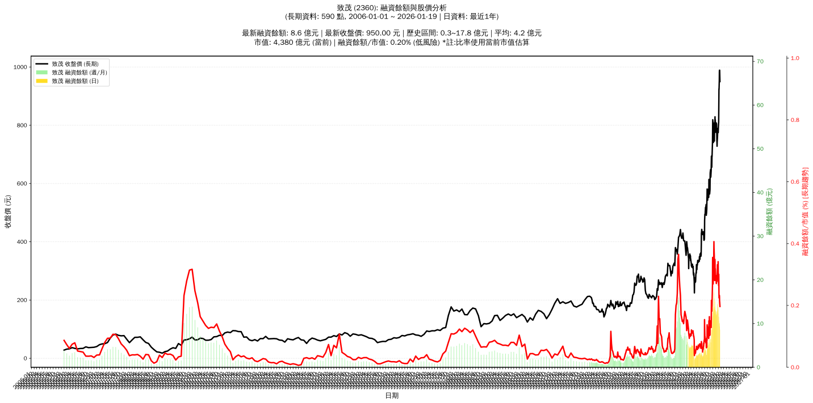

# :chart_with_upwards_trend: 致茂 (2360) 融資餘額報告

!!! info "基本資訊"
    **:building_construction: 名稱**: 致茂
    **:identification_card: 代號**: 2360
    **:calendar: 分析期間**: 2025-07-18 ~ 2026-01-09 (共 242 個交易日)
    **:clock3: 最新資料**: 2026-01-09
    **🕒 更新時間**: 2026-01-11 23:12:14 CST

## :moneybag: 融資餘額現況

| :chart: 指標 | :1234: 數值 | :traffic_light: 狀態 |
|:------------:|:----------:|:-------------------:|
| **最新融資餘額** | 9.8 億元 (1,065 張) | - |
| **最新收盤價** | 923.00 元 | - |
| **市值** | 3,925 億元 | - |
| **融資餘額/市值** | 0.25% | 🟢 低風險 |
| **日變化 (DoD)** | -0.8 億元 (-7.75%) | 📉 |
| **週變化 (WoW)** | -2.5 億元 (-20.02%) | 📉 |
| **月變化 (MoM)** | -2.0 億元 (-17.14%) | 📉 |

---

## :bar_chart: 歷史統計

| :chart: 指標 | :1234: 數值 |
|:------------:|:----------:|
| **歷史最高** | 17.8 億元 |
| **歷史最低** | 1.7 億元 |
| **平均值** | 6.2 億元 |
| **標準差** | 4.1 億元 |
| **當前相對位置** | 50.6% |

---

## :chart_with_upwards_trend: 融資餘額趨勢圖

    

---

## :clipboard: 詳細歷史記錄 (最近30日)

<table class="sortable-table">
<thead>
<tr>
<th>:calendar: 日期</th>
<th>:money_with_wings: 收盤價(元)</th>
<th>:chart: 漲跌(元)</th>
<th>:chart_with_upwards_trend: 漲跌(%)</th>
<th>:package: 融資餘額(億元)</th>
<th>:package: 融資餘額(張)</th>
<th>:arrow_up_down: 融資增減(張)</th>
<th>:chart: 融券餘額(張)</th>
<th>:balance_scale: 券資比(%)</th>
</tr>
</thead>
<tbody>
<tr>
<td>2026-01-09</td>
<td>923.00</td>
<td>🔻 -2.00</td>
<td>-0.22%</td>
<td>9.8</td>
<td>1,065</td>
<td>📉 -87</td>
<td>45</td>
<td>4.23%</td>
</tr>
<tr>
<td>2026-01-08</td>
<td>925.00</td>
<td>🔺 +3.00</td>
<td>+0.33%</td>
<td>10.7</td>
<td>1,152</td>
<td>📉 -99</td>
<td>47</td>
<td>4.08%</td>
</tr>
<tr>
<td>2026-01-07</td>
<td>922.00</td>
<td>🔺 +66.00</td>
<td>+7.71%</td>
<td>11.5</td>
<td>1,251</td>
<td>📉 -288</td>
<td>48</td>
<td>3.84%</td>
</tr>
<tr>
<td>2026-01-06</td>
<td>856.00</td>
<td>🔺 +45.00</td>
<td>+5.55%</td>
<td>13.2</td>
<td>1,539</td>
<td>📈 +113</td>
<td>48</td>
<td>3.12%</td>
</tr>
<tr>
<td>2026-01-05</td>
<td>811.00</td>
<td>🔺 +15.00</td>
<td>+1.88%</td>
<td>11.6</td>
<td>1,426</td>
<td>📉 -118</td>
<td>39</td>
<td>2.73%</td>
</tr>
<tr>
<td>2026-01-02</td>
<td>796.00</td>
<td>🔺 +21.00</td>
<td>+2.71%</td>
<td>12.3</td>
<td>1,544</td>
<td>📉 -232</td>
<td>41</td>
<td>2.66%</td>
</tr>
<tr>
<td>2025-12-31</td>
<td>775.00</td>
<td>🔻 -15.00</td>
<td>-1.90%</td>
<td>13.8</td>
<td>1,776</td>
<td>📉 -118</td>
<td>41</td>
<td>2.31%</td>
</tr>
<tr>
<td>2025-12-30</td>
<td>790.00</td>
<td>🔺 +9.00</td>
<td>+1.15%</td>
<td>15.0</td>
<td>1,894</td>
<td>📈 +178</td>
<td>42</td>
<td>2.22%</td>
</tr>
<tr>
<td>2025-12-29</td>
<td>781.00</td>
<td>🔻 -8.00</td>
<td>-1.01%</td>
<td>13.4</td>
<td>1,716</td>
<td>📉 -27</td>
<td>42</td>
<td>2.45%</td>
</tr>
<tr>
<td>2025-12-26</td>
<td>789.00</td>
<td>🔺 +18.00</td>
<td>+2.33%</td>
<td>13.8</td>
<td>1,743</td>
<td>📉 -103</td>
<td>42</td>
<td>2.41%</td>
</tr>
<tr>
<td>2025-12-24</td>
<td>771.00</td>
<td>🔺 +8.00</td>
<td>+1.05%</td>
<td>14.2</td>
<td>1,846</td>
<td>📉 -48</td>
<td>41</td>
<td>2.22%</td>
</tr>
<tr>
<td>2025-12-23</td>
<td>763.00</td>
<td>🔺 +7.00</td>
<td>+0.93%</td>
<td>14.5</td>
<td>1,894</td>
<td>📉 -28</td>
<td>39</td>
<td>2.06%</td>
</tr>
<tr>
<td>2025-12-22</td>
<td>756.00</td>
<td>🔺 +15.00</td>
<td>+2.02%</td>
<td>14.5</td>
<td>1,922</td>
<td>📈 +171</td>
<td>39</td>
<td>2.03%</td>
</tr>
<tr>
<td>2025-12-19</td>
<td>741.00</td>
<td>🔺 +13.00</td>
<td>+1.79%</td>
<td>13.0</td>
<td>1,751</td>
<td>📈 +41</td>
<td>39</td>
<td>2.23%</td>
</tr>
<tr>
<td>2025-12-18</td>
<td>728.00</td>
<td>🔻 -12.00</td>
<td>-1.62%</td>
<td>12.4</td>
<td>1,710</td>
<td>📉 -28</td>
<td>39</td>
<td>2.28%</td>
</tr>
<tr>
<td>2025-12-17</td>
<td>740.00</td>
<td>🔻 -6.00</td>
<td>-0.80%</td>
<td>12.9</td>
<td>1,738</td>
<td>📈 +107</td>
<td>37</td>
<td>2.13%</td>
</tr>
<tr>
<td>2025-12-16</td>
<td>746.00</td>
<td>🔻 -23.00</td>
<td>-2.99%</td>
<td>12.2</td>
<td>1,631</td>
<td>📉 -24</td>
<td>41</td>
<td>2.51%</td>
</tr>
<tr>
<td>2025-12-15</td>
<td>769.00</td>
<td>🔻 -36.00</td>
<td>-4.47%</td>
<td>12.7</td>
<td>1,655</td>
<td>📈 +159</td>
<td>39</td>
<td>2.36%</td>
</tr>
<tr>
<td>2025-12-12</td>
<td>805.00</td>
<td>🔺 +9.00</td>
<td>+1.13%</td>
<td>12.0</td>
<td>1,496</td>
<td>📉 -34</td>
<td>53</td>
<td>3.54%</td>
</tr>
<tr>
<td>2025-12-11</td>
<td>796.00</td>
<td>🔻 -4.00</td>
<td>-0.50%</td>
<td>12.2</td>
<td>1,530</td>
<td>📈 +47</td>
<td>52</td>
<td>3.40%</td>
</tr>
<tr>
<td>2025-12-10</td>
<td>800.00</td>
<td>🔻 -8.00</td>
<td>-0.99%</td>
<td>11.9</td>
<td>1,483</td>
<td>📈 +10</td>
<td>52</td>
<td>3.51%</td>
</tr>
<tr>
<td>2025-12-09</td>
<td>808.00</td>
<td>🔺 +3.00</td>
<td>+0.37%</td>
<td>11.9</td>
<td>1,473</td>
<td>📉 -89</td>
<td>54</td>
<td>3.67%</td>
</tr>
<tr>
<td>2025-12-08</td>
<td>805.00</td>
<td>🔺 +9.00</td>
<td>+1.13%</td>
<td>12.6</td>
<td>1,562</td>
<td>📉 -64</td>
<td>59</td>
<td>3.78%</td>
</tr>
<tr>
<td>2025-12-05</td>
<td>796.00</td>
<td>🔺 +20.00</td>
<td>+2.58%</td>
<td>12.9</td>
<td>1,626</td>
<td>📉 -52</td>
<td>60</td>
<td>3.69%</td>
</tr>
<tr>
<td>2025-12-04</td>
<td>776.00</td>
<td>🔻 -29.00</td>
<td>-3.60%</td>
<td>13.0</td>
<td>1,678</td>
<td>📈 +151</td>
<td>50</td>
<td>2.98%</td>
</tr>
<tr>
<td>2025-12-03</td>
<td>805.00</td>
<td>🔺 +27.00</td>
<td>+3.47%</td>
<td>12.3</td>
<td>1,527</td>
<td>📉 -99</td>
<td>51</td>
<td>3.34%</td>
</tr>
<tr>
<td>2025-12-02</td>
<td>778.00</td>
<td>🔻 -7.00</td>
<td>-0.89%</td>
<td>12.7</td>
<td>1,626</td>
<td>📉 -38</td>
<td>51</td>
<td>3.14%</td>
</tr>
<tr>
<td>2025-12-01</td>
<td>785.00</td>
<td>🔻 -34.00</td>
<td>-4.15%</td>
<td>13.1</td>
<td>1,664</td>
<td>📉 -42</td>
<td>45</td>
<td>2.70%</td>
</tr>
<tr>
<td>2025-11-28</td>
<td>819.00</td>
<td>🔺 +8.00</td>
<td>+0.99%</td>
<td>14.0</td>
<td>1,706</td>
<td>📈 +23</td>
<td>68</td>
<td>3.99%</td>
</tr>
<tr>
<td>2025-11-27</td>
<td>811.00</td>
<td>🔺 +11.00</td>
<td>+1.38%</td>
<td>13.6</td>
<td>1,683</td>
<td>📉 -4</td>
<td>67</td>
<td>3.98%</td>
</tr>
</tbody>
</table>

---

## :information_source: 資料來源與方法

!!! note "資料來源說明"
    - **主要來源**: `raw_margin_daily.csv` (Type 13: ShowMarginChart)
    - **資料頻率**: 每日更新
    - **資料範圍**: 近1年交易日資料

!!! info "報告元資訊"
    - **報告產生時間**: 2026-01-11 23:12:14
    - **分析期間**: 242 個交易日
    - **資料來源**: Stage 1 Raw Margin Daily Data

---

:material-information-outline: **本報告僅供參考，投資決策請審慎評估**

