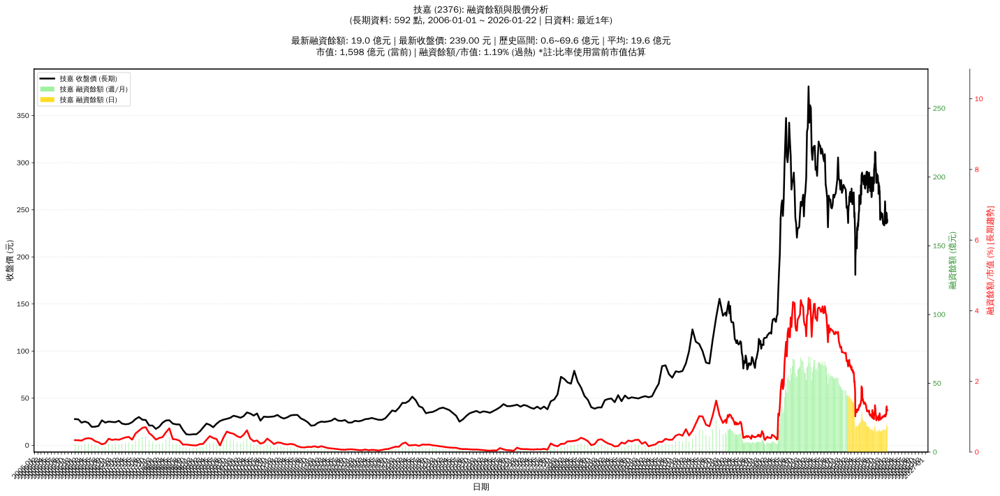

# :chart_with_upwards_trend: 技嘉 (2376) 融資餘額報告

!!! info "基本資訊"
    **:building_construction: 名稱**: 技嘉
    **:identification_card: 代號**: 2376
    **:calendar: 分析期間**: 2025-07-18 ~ 2026-01-09 (共 242 個交易日)
    **:clock3: 最新資料**: 2026-01-09
    **🕒 更新時間**: 2026-01-11 20:28:22 CST

## :moneybag: 融資餘額現況

| :chart: 指標 | :1234: 數值 | :traffic_light: 狀態 |
|:------------:|:----------:|:-------------------:|
| **最新融資餘額** | 16.7 億元 (6,942 張) | - |
| **最新收盤價** | 240.00 元 | - |
| **市值** | 1,608 億元 | - |
| **融資餘額/市值** | 1.04% | 🔴 過熱 |
| **日變化 (DoD)** | +0.1 億元 (+0.48%) | 📈 |
| **週變化 (WoW)** | +0.4 億元 (+2.25%) | 📈 |
| **月變化 (MoM)** | +0.6 億元 (+3.50%) | 📈 |

---

## :bar_chart: 歷史統計

| :chart: 指標 | :1234: 數值 |
|:------------:|:----------:|
| **歷史最高** | 42.8 億元 |
| **歷史最低** | 14.3 億元 |
| **平均值** | 22.5 億元 |
| **標準差** | 8.7 億元 |
| **當前相對位置** | 8.2% |

---

## :chart_with_upwards_trend: 融資餘額趨勢圖

    

---

## :clipboard: 詳細歷史記錄 (最近30日)

<table class="sortable-table">
<thead>
<tr>
<th>:calendar: 日期</th>
<th>:money_with_wings: 收盤價(元)</th>
<th>:chart: 漲跌(元)</th>
<th>:chart_with_upwards_trend: 漲跌(%)</th>
<th>:package: 融資餘額(億元)</th>
<th>:package: 融資餘額(張)</th>
<th>:arrow_up_down: 融資增減(張)</th>
<th>:chart: 融券餘額(張)</th>
<th>:balance_scale: 券資比(%)</th>
</tr>
</thead>
<tbody>
<tr>
<td>2026-01-09</td>
<td>240.00</td>
<td>🔻 -5.00</td>
<td>-2.04%</td>
<td>16.7</td>
<td>6,942</td>
<td>📈 +174</td>
<td>304</td>
<td>4.38%</td>
</tr>
<tr>
<td>2026-01-08</td>
<td>245.00</td>
<td>➖ +0.00</td>
<td>+0.00%</td>
<td>16.6</td>
<td>6,768</td>
<td>📈 +51</td>
<td>303</td>
<td>4.48%</td>
</tr>
<tr>
<td>2026-01-07</td>
<td>245.00</td>
<td>➖ +0.00</td>
<td>+0.00%</td>
<td>16.5</td>
<td>6,717</td>
<td>📈 +116</td>
<td>301</td>
<td>4.48%</td>
</tr>
<tr>
<td>2026-01-06</td>
<td>245.00</td>
<td>🔻 -3.00</td>
<td>-1.21%</td>
<td>16.2</td>
<td>6,601</td>
<td>📈 +121</td>
<td>306</td>
<td>4.64%</td>
</tr>
<tr>
<td>2026-01-05</td>
<td>248.00</td>
<td>🔻 -11.00</td>
<td>-4.25%</td>
<td>16.1</td>
<td>6,480</td>
<td>📈 +189</td>
<td>315</td>
<td>4.86%</td>
</tr>
<tr>
<td>2026-01-02</td>
<td>259.00</td>
<td>🔺 +9.50</td>
<td>+3.81%</td>
<td>16.3</td>
<td>6,291</td>
<td>📉 -230</td>
<td>320</td>
<td>5.09%</td>
</tr>
<tr>
<td>2025-12-31</td>
<td>249.50</td>
<td>🔺 +3.50</td>
<td>+1.42%</td>
<td>16.3</td>
<td>6,521</td>
<td>📉 -332</td>
<td>336</td>
<td>5.15%</td>
</tr>
<tr>
<td>2025-12-30</td>
<td>246.00</td>
<td>🔺 +7.50</td>
<td>+3.14%</td>
<td>16.9</td>
<td>6,853</td>
<td>📉 -32</td>
<td>284</td>
<td>4.14%</td>
</tr>
<tr>
<td>2025-12-29</td>
<td>238.50</td>
<td>🔺 +5.00</td>
<td>+2.14%</td>
<td>16.4</td>
<td>6,885</td>
<td>📉 -12</td>
<td>325</td>
<td>4.72%</td>
</tr>
<tr>
<td>2025-12-26</td>
<td>233.50</td>
<td>➖ +0.00</td>
<td>+0.00%</td>
<td>16.1</td>
<td>6,897</td>
<td>📉 -55</td>
<td>329</td>
<td>4.77%</td>
</tr>
<tr>
<td>2025-12-24</td>
<td>233.50</td>
<td>🔻 -0.50</td>
<td>-0.21%</td>
<td>16.2</td>
<td>6,952</td>
<td>📈 +15</td>
<td>330</td>
<td>4.75%</td>
</tr>
<tr>
<td>2025-12-23</td>
<td>234.00</td>
<td>🔻 -3.00</td>
<td>-1.27%</td>
<td>16.2</td>
<td>6,937</td>
<td>📈 +37</td>
<td>402</td>
<td>5.80%</td>
</tr>
<tr>
<td>2025-12-22</td>
<td>237.00</td>
<td>🔻 -1.00</td>
<td>-0.42%</td>
<td>16.4</td>
<td>6,900</td>
<td>📈 +59</td>
<td>333</td>
<td>4.83%</td>
</tr>
<tr>
<td>2025-12-19</td>
<td>238.00</td>
<td>🔺 +1.00</td>
<td>+0.42%</td>
<td>16.3</td>
<td>6,841</td>
<td>📈 +49</td>
<td>269</td>
<td>3.93%</td>
</tr>
<tr>
<td>2025-12-18</td>
<td>237.00</td>
<td>🔺 +1.00</td>
<td>+0.42%</td>
<td>16.1</td>
<td>6,792</td>
<td>📉 -32</td>
<td>268</td>
<td>3.95%</td>
</tr>
<tr>
<td>2025-12-17</td>
<td>236.00</td>
<td>🔺 +0.50</td>
<td>+0.21%</td>
<td>16.1</td>
<td>6,824</td>
<td>📈 +47</td>
<td>260</td>
<td>3.81%</td>
</tr>
<tr>
<td>2025-12-16</td>
<td>235.50</td>
<td>🔺 +0.50</td>
<td>+0.21%</td>
<td>16.0</td>
<td>6,777</td>
<td>📈 +79</td>
<td>256</td>
<td>3.78%</td>
</tr>
<tr>
<td>2025-12-15</td>
<td>235.00</td>
<td>🔻 -4.00</td>
<td>-1.67%</td>
<td>15.7</td>
<td>6,698</td>
<td>📈 +35</td>
<td>243</td>
<td>3.63%</td>
</tr>
<tr>
<td>2025-12-12</td>
<td>239.00</td>
<td>🔻 -4.50</td>
<td>-1.85%</td>
<td>15.9</td>
<td>6,663</td>
<td>📈 +86</td>
<td>229</td>
<td>3.44%</td>
</tr>
<tr>
<td>2025-12-11</td>
<td>243.50</td>
<td>🔻 -1.00</td>
<td>-0.41%</td>
<td>16.0</td>
<td>6,577</td>
<td>📉 -7</td>
<td>258</td>
<td>3.92%</td>
</tr>
<tr>
<td>2025-12-10</td>
<td>244.50</td>
<td>🔺 +1.50</td>
<td>+0.62%</td>
<td>16.1</td>
<td>6,584</td>
<td>📉 -13</td>
<td>251</td>
<td>3.81%</td>
</tr>
<tr>
<td>2025-12-09</td>
<td>243.00</td>
<td>🔻 -3.00</td>
<td>-1.22%</td>
<td>16.0</td>
<td>6,597</td>
<td>📈 +214</td>
<td>258</td>
<td>3.91%</td>
</tr>
<tr>
<td>2025-12-08</td>
<td>246.00</td>
<td>🔺 +2.00</td>
<td>+0.82%</td>
<td>15.7</td>
<td>6,383</td>
<td>📉 -4</td>
<td>264</td>
<td>4.14%</td>
</tr>
<tr>
<td>2025-12-05</td>
<td>244.00</td>
<td>🔻 -0.50</td>
<td>-0.20%</td>
<td>15.6</td>
<td>6,387</td>
<td>📈 +76</td>
<td>265</td>
<td>4.15%</td>
</tr>
<tr>
<td>2025-12-04</td>
<td>244.50</td>
<td>🔻 -0.50</td>
<td>-0.20%</td>
<td>15.4</td>
<td>6,311</td>
<td>📈 +5</td>
<td>270</td>
<td>4.28%</td>
</tr>
<tr>
<td>2025-12-03</td>
<td>245.00</td>
<td>🔺 +3.00</td>
<td>+1.24%</td>
<td>15.4</td>
<td>6,306</td>
<td>📉 -35</td>
<td>271</td>
<td>4.30%</td>
</tr>
<tr>
<td>2025-12-02</td>
<td>242.00</td>
<td>🔻 -1.00</td>
<td>-0.41%</td>
<td>15.3</td>
<td>6,341</td>
<td>📈 +104</td>
<td>259</td>
<td>4.08%</td>
</tr>
<tr>
<td>2025-12-01</td>
<td>243.00</td>
<td>🔻 -0.50</td>
<td>-0.21%</td>
<td>15.2</td>
<td>6,237</td>
<td>📉 -59</td>
<td>266</td>
<td>4.26%</td>
</tr>
<tr>
<td>2025-11-28</td>
<td>243.50</td>
<td>🔻 -3.50</td>
<td>-1.42%</td>
<td>15.3</td>
<td>6,296</td>
<td>📈 +107</td>
<td>271</td>
<td>4.30%</td>
</tr>
<tr>
<td>2025-11-27</td>
<td>247.00</td>
<td>🔺 +1.00</td>
<td>+0.41%</td>
<td>15.3</td>
<td>6,189</td>
<td>📈 +26</td>
<td>279</td>
<td>4.51%</td>
</tr>
</tbody>
</table>

---

## :information_source: 資料來源與方法

!!! note "資料來源說明"
    - **主要來源**: `raw_margin_daily.csv` (Type 13: ShowMarginChart)
    - **資料頻率**: 每日更新
    - **資料範圍**: 近1年交易日資料

!!! info "報告元資訊"
    - **報告產生時間**: 2026-01-11 20:28:22
    - **分析期間**: 242 個交易日
    - **資料來源**: Stage 1 Raw Margin Daily Data

---

:material-information-outline: **本報告僅供參考，投資決策請審慎評估**

