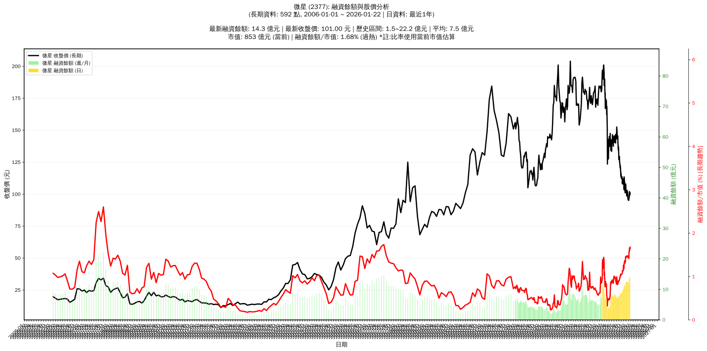

# :chart_with_upwards_trend: 微星 (2377) 融資餘額報告

!!! info "基本資訊"
    **:building_construction: 名稱**: 微星
    **:identification_card: 代號**: 2377
    **:calendar: 分析期間**: 2025-07-18 ~ 2026-01-09 (共 242 個交易日)
    **:clock3: 最新資料**: 2026-01-09
    **🕒 更新時間**: 2026-01-12 12:08:55 CST

## :moneybag: 融資餘額現況

| :chart: 指標 | :1234: 數值 | :traffic_light: 狀態 |
|:------------:|:----------:|:-------------------:|
| **最新融資餘額** | 13.5 億元 (13,881 張) | - |
| **最新收盤價** | 97.40 元 | - |
| **市值** | 823 億元 | - |
| **融資餘額/市值** | 1.64% | 🔴 過熱 |
| **日變化 (DoD)** | +0.4 億元 (+3.36%) | 📈 |
| **週變化 (WoW)** | +1.3 億元 (+10.88%) | 📈 |
| **月變化 (MoM)** | +1.1 億元 (+8.69%) | 📈 |

---

## :bar_chart: 歷史統計

| :chart: 指標 | :1234: 數值 |
|:------------:|:----------:|
| **歷史最高** | 13.5 億元 |
| **歷史最低** | 2.7 億元 |
| **平均值** | 8.5 億元 |
| **標準差** | 2.5 億元 |
| **當前相對位置** | 100.0% |

---

## :chart_with_upwards_trend: 融資餘額趨勢圖

    

---

## :clipboard: 詳細歷史記錄 (最近30日)

<table class="sortable-table">
<thead>
<tr>
<th>:calendar: 日期</th>
<th>:money_with_wings: 收盤價(元)</th>
<th>:chart: 漲跌(元)</th>
<th>:chart_with_upwards_trend: 漲跌(%)</th>
<th>:package: 融資餘額(億元)</th>
<th>:package: 融資餘額(張)</th>
<th>:arrow_up_down: 融資增減(張)</th>
<th>:chart: 融券餘額(張)</th>
<th>:balance_scale: 券資比(%)</th>
</tr>
</thead>
<tbody>
<tr>
<td>2026-01-09</td>
<td>97.40</td>
<td>🔺 +0.90</td>
<td>+0.93%</td>
<td>13.5</td>
<td>13,881</td>
<td>📈 +326</td>
<td>259</td>
<td>1.87%</td>
</tr>
<tr>
<td>2026-01-08</td>
<td>96.50</td>
<td>🔺 +0.20</td>
<td>+0.21%</td>
<td>13.1</td>
<td>13,555</td>
<td>📈 +696</td>
<td>200</td>
<td>1.48%</td>
</tr>
<tr>
<td>2026-01-07</td>
<td>96.30</td>
<td>🔺 +0.50</td>
<td>+0.52%</td>
<td>12.4</td>
<td>12,859</td>
<td>📈 +222</td>
<td>212</td>
<td>1.65%</td>
</tr>
<tr>
<td>2026-01-06</td>
<td>95.80</td>
<td>🔺 +0.70</td>
<td>+0.74%</td>
<td>12.1</td>
<td>12,637</td>
<td>📉 -139</td>
<td>233</td>
<td>1.84%</td>
</tr>
<tr>
<td>2026-01-05</td>
<td>95.10</td>
<td>🔻 -0.70</td>
<td>-0.73%</td>
<td>12.1</td>
<td>12,776</td>
<td>📈 +48</td>
<td>230</td>
<td>1.80%</td>
</tr>
<tr>
<td>2026-01-02</td>
<td>95.80</td>
<td>🔻 -0.30</td>
<td>-0.31%</td>
<td>12.2</td>
<td>12,728</td>
<td>📈 +1</td>
<td>229</td>
<td>1.80%</td>
</tr>
<tr>
<td>2025-12-31</td>
<td>96.10</td>
<td>🔺 +0.10</td>
<td>+0.10%</td>
<td>12.2</td>
<td>12,727</td>
<td>📉 -6</td>
<td>212</td>
<td>1.67%</td>
</tr>
<tr>
<td>2025-12-30</td>
<td>96.00</td>
<td>🔺 +0.50</td>
<td>+0.52%</td>
<td>12.2</td>
<td>12,733</td>
<td>📉 -47</td>
<td>208</td>
<td>1.63%</td>
</tr>
<tr>
<td>2025-12-29</td>
<td>95.50</td>
<td>🔻 -0.70</td>
<td>-0.73%</td>
<td>12.2</td>
<td>12,780</td>
<td>📈 +36</td>
<td>215</td>
<td>1.68%</td>
</tr>
<tr>
<td>2025-12-26</td>
<td>96.20</td>
<td>🔻 -1.80</td>
<td>-1.84%</td>
<td>12.3</td>
<td>12,744</td>
<td>📉 -2</td>
<td>208</td>
<td>1.63%</td>
</tr>
<tr>
<td>2025-12-24</td>
<td>98.00</td>
<td>🔻 -0.60</td>
<td>-0.61%</td>
<td>12.5</td>
<td>12,746</td>
<td>📈 +51</td>
<td>179</td>
<td>1.40%</td>
</tr>
<tr>
<td>2025-12-23</td>
<td>98.60</td>
<td>🔻 -2.40</td>
<td>-2.38%</td>
<td>12.5</td>
<td>12,695</td>
<td>📈 +223</td>
<td>410</td>
<td>3.23%</td>
</tr>
<tr>
<td>2025-12-22</td>
<td>101.00</td>
<td>🔻 -1.00</td>
<td>-0.98%</td>
<td>12.6</td>
<td>12,472</td>
<td>📈 +96</td>
<td>169</td>
<td>1.36%</td>
</tr>
<tr>
<td>2025-12-19</td>
<td>102.00</td>
<td>🔺 +2.00</td>
<td>+2.00%</td>
<td>12.6</td>
<td>12,376</td>
<td>📉 -95</td>
<td>196</td>
<td>1.58%</td>
</tr>
<tr>
<td>2025-12-18</td>
<td>100.00</td>
<td>🔻 -0.50</td>
<td>-0.50%</td>
<td>12.5</td>
<td>12,471</td>
<td>📈 +81</td>
<td>198</td>
<td>1.59%</td>
</tr>
<tr>
<td>2025-12-17</td>
<td>100.50</td>
<td>🔻 -2.50</td>
<td>-2.43%</td>
<td>12.5</td>
<td>12,390</td>
<td>📈 +184</td>
<td>260</td>
<td>2.10%</td>
</tr>
<tr>
<td>2025-12-16</td>
<td>103.00</td>
<td>🔺 +2.00</td>
<td>+1.98%</td>
<td>12.6</td>
<td>12,206</td>
<td>📉 -279</td>
<td>215</td>
<td>1.76%</td>
</tr>
<tr>
<td>2025-12-15</td>
<td>101.00</td>
<td>🔺 +1.70</td>
<td>+1.71%</td>
<td>12.6</td>
<td>12,485</td>
<td>📉 -193</td>
<td>259</td>
<td>2.07%</td>
</tr>
<tr>
<td>2025-12-12</td>
<td>99.30</td>
<td>➖ +0.00</td>
<td>+0.00%</td>
<td>12.6</td>
<td>12,678</td>
<td>📈 +18</td>
<td>257</td>
<td>2.03%</td>
</tr>
<tr>
<td>2025-12-11</td>
<td>99.30</td>
<td>🔺 +0.70</td>
<td>+0.71%</td>
<td>12.6</td>
<td>12,660</td>
<td>📈 +44</td>
<td>266</td>
<td>2.10%</td>
</tr>
<tr>
<td>2025-12-10</td>
<td>98.60</td>
<td>🔻 -0.90</td>
<td>-0.90%</td>
<td>12.4</td>
<td>12,616</td>
<td>📉 -2</td>
<td>255</td>
<td>2.02%</td>
</tr>
<tr>
<td>2025-12-09</td>
<td>99.50</td>
<td>🔻 -1.50</td>
<td>-1.49%</td>
<td>12.6</td>
<td>12,618</td>
<td>📈 +237</td>
<td>217</td>
<td>1.72%</td>
</tr>
<tr>
<td>2025-12-08</td>
<td>101.00</td>
<td>🔻 -0.50</td>
<td>-0.49%</td>
<td>12.5</td>
<td>12,381</td>
<td>📈 +124</td>
<td>182</td>
<td>1.47%</td>
</tr>
<tr>
<td>2025-12-05</td>
<td>101.50</td>
<td>🔻 -1.00</td>
<td>-0.98%</td>
<td>12.4</td>
<td>12,257</td>
<td>📈 +103</td>
<td>183</td>
<td>1.49%</td>
</tr>
<tr>
<td>2025-12-04</td>
<td>102.50</td>
<td>➖ +0.00</td>
<td>+0.00%</td>
<td>12.5</td>
<td>12,154</td>
<td>📉 -19</td>
<td>193</td>
<td>1.59%</td>
</tr>
<tr>
<td>2025-12-03</td>
<td>102.50</td>
<td>🔺 +0.50</td>
<td>+0.49%</td>
<td>12.5</td>
<td>12,173</td>
<td>📉 -18</td>
<td>192</td>
<td>1.58%</td>
</tr>
<tr>
<td>2025-12-02</td>
<td>102.00</td>
<td>🔻 -0.50</td>
<td>-0.49%</td>
<td>12.4</td>
<td>12,191</td>
<td>📈 +265</td>
<td>191</td>
<td>1.57%</td>
</tr>
<tr>
<td>2025-12-01</td>
<td>102.50</td>
<td>🔻 -5.00</td>
<td>-4.65%</td>
<td>12.2</td>
<td>11,926</td>
<td>📈 +463</td>
<td>179</td>
<td>1.50%</td>
</tr>
<tr>
<td>2025-11-28</td>
<td>107.50</td>
<td>🔺 +0.50</td>
<td>+0.47%</td>
<td>12.3</td>
<td>11,463</td>
<td>📉 -16</td>
<td>212</td>
<td>1.85%</td>
</tr>
<tr>
<td>2025-11-27</td>
<td>107.00</td>
<td>🔻 -1.00</td>
<td>-0.93%</td>
<td>12.3</td>
<td>11,479</td>
<td>📉 -42</td>
<td>181</td>
<td>1.58%</td>
</tr>
</tbody>
</table>

---

## :information_source: 資料來源與方法

!!! note "資料來源說明"
    - **主要來源**: `raw_margin_daily.csv` (Type 13: ShowMarginChart)
    - **資料頻率**: 每日更新
    - **資料範圍**: 近1年交易日資料

!!! info "報告元資訊"
    - **報告產生時間**: 2026-01-12 12:08:55
    - **分析期間**: 242 個交易日
    - **資料來源**: Stage 1 Raw Margin Daily Data

---

:material-information-outline: **本報告僅供參考，投資決策請審慎評估**

