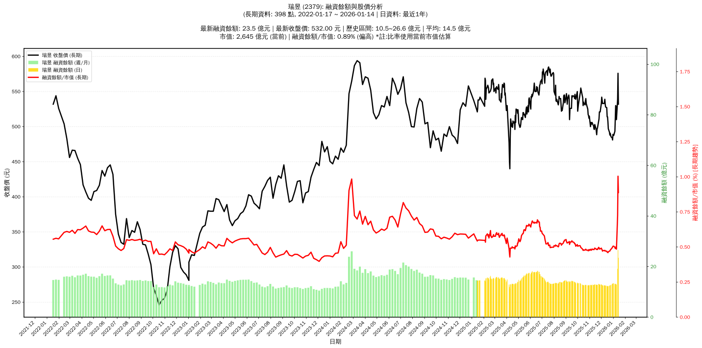

# :chart_with_upwards_trend: 瑞昱 (2379) 融資餘額報告

!!! info "基本資訊"
    **:building_construction: 名稱**: 瑞昱
    **:identification_card: 代號**: 2379
    **:calendar: 分析期間**: 2025-07-18 ~ 2026-01-09 (共 242 個交易日)
    **:clock3: 最新資料**: 2026-01-09
    **🕒 更新時間**: 2026-01-11 23:12:47 CST

## :moneybag: 融資餘額現況

| :chart: 指標 | :1234: 數值 | :traffic_light: 狀態 |
|:------------:|:----------:|:-------------------:|
| **最新融資餘額** | 12.8 億元 (2,515 張) | - |
| **最新收盤價** | 510.00 元 | - |
| **市值** | 2,629 億元 | - |
| **融資餘額/市值** | 0.49% | 🟡 正常 |
| **日變化 (DoD)** | -0.3 億元 (-2.31%) | 📉 |
| **週變化 (WoW)** | -0.6 億元 (-4.19%) | 📉 |
| **月變化 (MoM)** | +0.2 億元 (+1.83%) | 📈 |

---

## :bar_chart: 歷史統計

| :chart: 指標 | :1234: 數值 |
|:------------:|:----------:|
| **歷史最高** | 18.3 億元 |
| **歷史最低** | 11.3 億元 |
| **平均值** | 14.3 億元 |
| **標準差** | 1.6 億元 |
| **當前相對位置** | 21.2% |

---

## :chart_with_upwards_trend: 融資餘額趨勢圖

    

---

## :clipboard: 詳細歷史記錄 (最近30日)

<table class="sortable-table">
<thead>
<tr>
<th>:calendar: 日期</th>
<th>:money_with_wings: 收盤價(元)</th>
<th>:chart: 漲跌(元)</th>
<th>:chart_with_upwards_trend: 漲跌(%)</th>
<th>:package: 融資餘額(億元)</th>
<th>:package: 融資餘額(張)</th>
<th>:arrow_up_down: 融資增減(張)</th>
<th>:chart: 融券餘額(張)</th>
<th>:balance_scale: 券資比(%)</th>
</tr>
</thead>
<tbody>
<tr>
<td>2026-01-09</td>
<td>510.00</td>
<td>🔻 -19.00</td>
<td>-3.59%</td>
<td>12.8</td>
<td>2,515</td>
<td>📈 +33</td>
<td>9</td>
<td>0.36%</td>
</tr>
<tr>
<td>2026-01-08</td>
<td>529.00</td>
<td>🔻 -1.00</td>
<td>-0.19%</td>
<td>13.1</td>
<td>2,482</td>
<td>📉 -12</td>
<td>10</td>
<td>0.40%</td>
</tr>
<tr>
<td>2026-01-07</td>
<td>530.00</td>
<td>🔺 +18.00</td>
<td>+3.52%</td>
<td>13.2</td>
<td>2,494</td>
<td>📉 -33</td>
<td>10</td>
<td>0.40%</td>
</tr>
<tr>
<td>2026-01-06</td>
<td>512.00</td>
<td>🔺 +18.50</td>
<td>+3.75%</td>
<td>12.9</td>
<td>2,527</td>
<td>📉 -136</td>
<td>10</td>
<td>0.40%</td>
</tr>
<tr>
<td>2026-01-05</td>
<td>493.50</td>
<td>🔺 +6.00</td>
<td>+1.23%</td>
<td>13.1</td>
<td>2,663</td>
<td>📉 -83</td>
<td>9</td>
<td>0.34%</td>
</tr>
<tr>
<td>2026-01-02</td>
<td>487.50</td>
<td>🔻 -1.50</td>
<td>-0.31%</td>
<td>13.4</td>
<td>2,746</td>
<td>📈 +12</td>
<td>7</td>
<td>0.25%</td>
</tr>
<tr>
<td>2025-12-31</td>
<td>489.00</td>
<td>🔺 +8.00</td>
<td>+1.66%</td>
<td>13.4</td>
<td>2,734</td>
<td>📉 -18</td>
<td>7</td>
<td>0.26%</td>
</tr>
<tr>
<td>2025-12-30</td>
<td>481.00</td>
<td>🔻 -3.00</td>
<td>-0.62%</td>
<td>13.2</td>
<td>2,752</td>
<td>📈 +49</td>
<td>8</td>
<td>0.29%</td>
</tr>
<tr>
<td>2025-12-29</td>
<td>484.00</td>
<td>🔻 -1.50</td>
<td>-0.31%</td>
<td>13.1</td>
<td>2,703</td>
<td>📈 +62</td>
<td>7</td>
<td>0.26%</td>
</tr>
<tr>
<td>2025-12-26</td>
<td>485.50</td>
<td>🔻 -5.00</td>
<td>-1.02%</td>
<td>12.8</td>
<td>2,641</td>
<td>📈 +64</td>
<td>7</td>
<td>0.27%</td>
</tr>
<tr>
<td>2025-12-24</td>
<td>490.50</td>
<td>🔺 +2.50</td>
<td>+0.51%</td>
<td>12.6</td>
<td>2,577</td>
<td>📈 +23</td>
<td>23</td>
<td>0.89%</td>
</tr>
<tr>
<td>2025-12-23</td>
<td>488.00</td>
<td>🔻 -4.00</td>
<td>-0.81%</td>
<td>12.5</td>
<td>2,554</td>
<td>📈 +20</td>
<td>23</td>
<td>0.90%</td>
</tr>
<tr>
<td>2025-12-22</td>
<td>492.00</td>
<td>🔻 -5.00</td>
<td>-1.01%</td>
<td>12.5</td>
<td>2,534</td>
<td>📈 +56</td>
<td>46</td>
<td>1.82%</td>
</tr>
<tr>
<td>2025-12-19</td>
<td>497.00</td>
<td>🔻 -10.00</td>
<td>-1.97%</td>
<td>12.3</td>
<td>2,478</td>
<td>📈 +80</td>
<td>49</td>
<td>1.98%</td>
</tr>
<tr>
<td>2025-12-18</td>
<td>507.00</td>
<td>🔻 -7.00</td>
<td>-1.36%</td>
<td>12.2</td>
<td>2,398</td>
<td>📈 +9</td>
<td>35</td>
<td>1.46%</td>
</tr>
<tr>
<td>2025-12-17</td>
<td>514.00</td>
<td>➖ +0.00</td>
<td>+0.00%</td>
<td>12.3</td>
<td>2,389</td>
<td>📈 +3</td>
<td>38</td>
<td>1.59%</td>
</tr>
<tr>
<td>2025-12-16</td>
<td>514.00</td>
<td>🔻 -13.00</td>
<td>-2.47%</td>
<td>12.3</td>
<td>2,386</td>
<td>📈 +26</td>
<td>15</td>
<td>0.63%</td>
</tr>
<tr>
<td>2025-12-15</td>
<td>527.00</td>
<td>🔻 -1.00</td>
<td>-0.19%</td>
<td>12.4</td>
<td>2,360</td>
<td>📈 +3</td>
<td>14</td>
<td>0.59%</td>
</tr>
<tr>
<td>2025-12-12</td>
<td>528.00</td>
<td>🔻 -4.00</td>
<td>-0.75%</td>
<td>12.4</td>
<td>2,357</td>
<td>📈 +2</td>
<td>14</td>
<td>0.59%</td>
</tr>
<tr>
<td>2025-12-11</td>
<td>532.00</td>
<td>🔻 -7.00</td>
<td>-1.30%</td>
<td>12.5</td>
<td>2,355</td>
<td>📈 +18</td>
<td>14</td>
<td>0.59%</td>
</tr>
<tr>
<td>2025-12-10</td>
<td>539.00</td>
<td>🔺 +5.00</td>
<td>+0.94%</td>
<td>12.6</td>
<td>2,337</td>
<td>📉 -4</td>
<td>14</td>
<td>0.60%</td>
</tr>
<tr>
<td>2025-12-09</td>
<td>534.00</td>
<td>🔺 +1.00</td>
<td>+0.19%</td>
<td>12.5</td>
<td>2,341</td>
<td>📉 -16</td>
<td>14</td>
<td>0.60%</td>
</tr>
<tr>
<td>2025-12-08</td>
<td>533.00</td>
<td>➖ +0.00</td>
<td>+0.00%</td>
<td>12.6</td>
<td>2,357</td>
<td>📈 +2</td>
<td>14</td>
<td>0.59%</td>
</tr>
<tr>
<td>2025-12-05</td>
<td>533.00</td>
<td>➖ +0.00</td>
<td>+0.00%</td>
<td>12.6</td>
<td>2,355</td>
<td>📈 +20</td>
<td>14</td>
<td>0.59%</td>
</tr>
<tr>
<td>2025-12-04</td>
<td>533.00</td>
<td>🔻 -5.00</td>
<td>-0.93%</td>
<td>12.4</td>
<td>2,335</td>
<td>📉 -26</td>
<td>14</td>
<td>0.60%</td>
</tr>
<tr>
<td>2025-12-03</td>
<td>538.00</td>
<td>🔻 -4.00</td>
<td>-0.74%</td>
<td>12.7</td>
<td>2,361</td>
<td>📉 -2</td>
<td>16</td>
<td>0.68%</td>
</tr>
<tr>
<td>2025-12-02</td>
<td>542.00</td>
<td>🔺 +9.00</td>
<td>+1.69%</td>
<td>12.8</td>
<td>2,363</td>
<td>📉 -78</td>
<td>17</td>
<td>0.72%</td>
</tr>
<tr>
<td>2025-12-01</td>
<td>533.00</td>
<td>🔺 +12.00</td>
<td>+2.30%</td>
<td>13.0</td>
<td>2,441</td>
<td>📉 -28</td>
<td>14</td>
<td>0.57%</td>
</tr>
<tr>
<td>2025-11-28</td>
<td>521.00</td>
<td>➖ +0.00</td>
<td>+0.00%</td>
<td>12.9</td>
<td>2,469</td>
<td>📉 -10</td>
<td>16</td>
<td>0.65%</td>
</tr>
<tr>
<td>2025-11-27</td>
<td>521.00</td>
<td>➖ +0.00</td>
<td>+0.00%</td>
<td>12.9</td>
<td>2,479</td>
<td>📈 +14</td>
<td>16</td>
<td>0.65%</td>
</tr>
</tbody>
</table>

---

## :information_source: 資料來源與方法

!!! note "資料來源說明"
    - **主要來源**: `raw_margin_daily.csv` (Type 13: ShowMarginChart)
    - **資料頻率**: 每日更新
    - **資料範圍**: 近1年交易日資料

!!! info "報告元資訊"
    - **報告產生時間**: 2026-01-11 23:12:47
    - **分析期間**: 242 個交易日
    - **資料來源**: Stage 1 Raw Margin Daily Data

---

:material-information-outline: **本報告僅供參考，投資決策請審慎評估**

