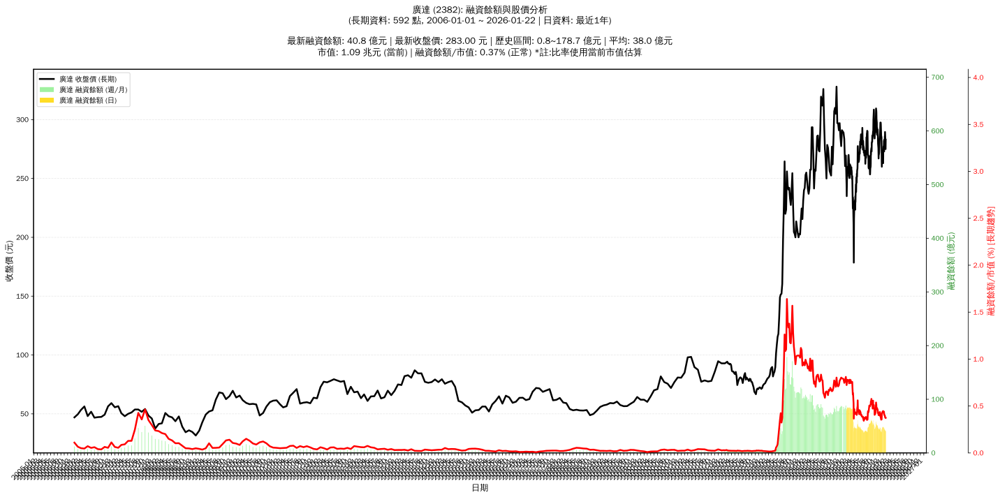

# :chart_with_upwards_trend: 廣達 (2382) 融資餘額報告

!!! info "基本資訊"
    **:building_construction: 名稱**: 廣達
    **:identification_card: 代號**: 2382
    **:calendar: 分析期間**: 2025-07-18 ~ 2026-01-09 (共 242 個交易日)
    **:clock3: 最新資料**: 2026-01-09
    **🕒 更新時間**: 2026-01-12 12:09:43 CST

## :moneybag: 融資餘額現況

| :chart: 指標 | :1234: 數值 | :traffic_light: 狀態 |
|:------------:|:----------:|:-------------------:|
| **最新融資餘額** | 44.1 億元 (15,594 張) | - |
| **最新收盤價** | 283.00 元 | - |
| **市值** | 1.09 兆元 | - |
| **融資餘額/市值** | 0.40% | 🟡 正常 |
| **日變化 (DoD)** | -1.7 億元 (-3.67%) | 📉 |
| **週變化 (WoW)** | -3.3 億元 (-6.99%) | 📉 |
| **月變化 (MoM)** | +4.0 億元 (+10.07%) | 📈 |

---

## :bar_chart: 歷史統計

| :chart: 指標 | :1234: 數值 |
|:------------:|:----------:|
| **歷史最高** | 88.8 億元 |
| **歷史最低** | 37.4 億元 |
| **平均值** | 54.4 億元 |
| **標準差** | 15.1 億元 |
| **當前相對位置** | 13.1% |

---

## :chart_with_upwards_trend: 融資餘額趨勢圖

    

---

## :clipboard: 詳細歷史記錄 (最近30日)

<table class="sortable-table">
<thead>
<tr>
<th>:calendar: 日期</th>
<th>:money_with_wings: 收盤價(元)</th>
<th>:chart: 漲跌(元)</th>
<th>:chart_with_upwards_trend: 漲跌(%)</th>
<th>:package: 融資餘額(億元)</th>
<th>:package: 融資餘額(張)</th>
<th>:arrow_up_down: 融資增減(張)</th>
<th>:chart: 融券餘額(張)</th>
<th>:balance_scale: 券資比(%)</th>
</tr>
</thead>
<tbody>
<tr>
<td>2026-01-09</td>
<td>283.00</td>
<td>🔺 +10.00</td>
<td>+3.66%</td>
<td>44.1</td>
<td>15,594</td>
<td>📉 -1,187</td>
<td>464</td>
<td>2.98%</td>
</tr>
<tr>
<td>2026-01-08</td>
<td>273.00</td>
<td>🔻 -9.00</td>
<td>-3.19%</td>
<td>45.8</td>
<td>16,781</td>
<td>📈 +207</td>
<td>406</td>
<td>2.42%</td>
</tr>
<tr>
<td>2026-01-07</td>
<td>282.00</td>
<td>➖ +0.00</td>
<td>+0.00%</td>
<td>46.7</td>
<td>16,574</td>
<td>📉 -433</td>
<td>400</td>
<td>2.41%</td>
</tr>
<tr>
<td>2026-01-06</td>
<td>282.00</td>
<td>🔺 +4.00</td>
<td>+1.44%</td>
<td>48.0</td>
<td>17,007</td>
<td>📈 +116</td>
<td>396</td>
<td>2.33%</td>
</tr>
<tr>
<td>2026-01-05</td>
<td>278.00</td>
<td>🔺 +1.00</td>
<td>+0.36%</td>
<td>47.0</td>
<td>16,891</td>
<td>📉 -239</td>
<td>402</td>
<td>2.38%</td>
</tr>
<tr>
<td>2026-01-02</td>
<td>277.00</td>
<td>🔺 +5.00</td>
<td>+1.84%</td>
<td>47.5</td>
<td>17,130</td>
<td>📉 -720</td>
<td>416</td>
<td>2.43%</td>
</tr>
<tr>
<td>2025-12-31</td>
<td>272.00</td>
<td>🔺 +9.00</td>
<td>+3.42%</td>
<td>48.6</td>
<td>17,850</td>
<td>📉 -640</td>
<td>385</td>
<td>2.16%</td>
</tr>
<tr>
<td>2025-12-30</td>
<td>263.00</td>
<td>➖ +0.00</td>
<td>+0.00%</td>
<td>48.6</td>
<td>18,490</td>
<td>📈 +301</td>
<td>377</td>
<td>2.04%</td>
</tr>
<tr>
<td>2025-12-29</td>
<td>263.00</td>
<td>➖ +0.00</td>
<td>+0.00%</td>
<td>47.8</td>
<td>18,189</td>
<td>📉 -157</td>
<td>330</td>
<td>1.81%</td>
</tr>
<tr>
<td>2025-12-26</td>
<td>263.00</td>
<td>🔻 -1.00</td>
<td>-0.38%</td>
<td>48.2</td>
<td>18,346</td>
<td>📈 +282</td>
<td>353</td>
<td>1.92%</td>
</tr>
<tr>
<td>2025-12-24</td>
<td>264.00</td>
<td>🔻 -0.50</td>
<td>-0.19%</td>
<td>47.7</td>
<td>18,064</td>
<td>📈 +180</td>
<td>365</td>
<td>2.02%</td>
</tr>
<tr>
<td>2025-12-23</td>
<td>264.50</td>
<td>🔻 -2.50</td>
<td>-0.94%</td>
<td>47.3</td>
<td>17,884</td>
<td>📈 +315</td>
<td>400</td>
<td>2.24%</td>
</tr>
<tr>
<td>2025-12-22</td>
<td>267.00</td>
<td>🔺 +2.00</td>
<td>+0.75%</td>
<td>46.9</td>
<td>17,569</td>
<td>📈 +498</td>
<td>432</td>
<td>2.46%</td>
</tr>
<tr>
<td>2025-12-19</td>
<td>265.00</td>
<td>🔺 +5.00</td>
<td>+1.92%</td>
<td>45.2</td>
<td>17,071</td>
<td>📈 +38</td>
<td>442</td>
<td>2.59%</td>
</tr>
<tr>
<td>2025-12-18</td>
<td>260.00</td>
<td>🔻 -5.00</td>
<td>-1.89%</td>
<td>44.3</td>
<td>17,033</td>
<td>📈 +792</td>
<td>446</td>
<td>2.62%</td>
</tr>
<tr>
<td>2025-12-17</td>
<td>265.00</td>
<td>🔻 -8.00</td>
<td>-2.93%</td>
<td>43.0</td>
<td>16,241</td>
<td>📈 +1,985</td>
<td>495</td>
<td>3.05%</td>
</tr>
<tr>
<td>2025-12-16</td>
<td>273.00</td>
<td>🔻 -12.00</td>
<td>-4.21%</td>
<td>38.9</td>
<td>14,256</td>
<td>📈 +661</td>
<td>542</td>
<td>3.80%</td>
</tr>
<tr>
<td>2025-12-15</td>
<td>285.00</td>
<td>🔻 -1.50</td>
<td>-0.52%</td>
<td>38.7</td>
<td>13,595</td>
<td>📈 +96</td>
<td>582</td>
<td>4.28%</td>
</tr>
<tr>
<td>2025-12-12</td>
<td>286.50</td>
<td>🔻 -1.50</td>
<td>-0.52%</td>
<td>38.7</td>
<td>13,499</td>
<td>📉 -76</td>
<td>587</td>
<td>4.35%</td>
</tr>
<tr>
<td>2025-12-11</td>
<td>288.00</td>
<td>🔻 -4.50</td>
<td>-1.54%</td>
<td>39.1</td>
<td>13,575</td>
<td>📉 -132</td>
<td>603</td>
<td>4.44%</td>
</tr>
<tr>
<td>2025-12-10</td>
<td>292.50</td>
<td>🔻 -3.50</td>
<td>-1.18%</td>
<td>40.1</td>
<td>13,707</td>
<td>📉 -3</td>
<td>597</td>
<td>4.36%</td>
</tr>
<tr>
<td>2025-12-09</td>
<td>296.00</td>
<td>🔻 -1.50</td>
<td>-0.50%</td>
<td>40.6</td>
<td>13,710</td>
<td>📉 -210</td>
<td>606</td>
<td>4.42%</td>
</tr>
<tr>
<td>2025-12-08</td>
<td>297.50</td>
<td>➖ +0.00</td>
<td>+0.00%</td>
<td>41.4</td>
<td>13,920</td>
<td>📉 -463</td>
<td>613</td>
<td>4.40%</td>
</tr>
<tr>
<td>2025-12-05</td>
<td>297.50</td>
<td>🔺 +3.00</td>
<td>+1.02%</td>
<td>42.8</td>
<td>14,383</td>
<td>📉 -1,158</td>
<td>647</td>
<td>4.50%</td>
</tr>
<tr>
<td>2025-12-04</td>
<td>294.50</td>
<td>🔺 +2.00</td>
<td>+0.68%</td>
<td>45.8</td>
<td>15,541</td>
<td>📉 -180</td>
<td>604</td>
<td>3.89%</td>
</tr>
<tr>
<td>2025-12-03</td>
<td>292.50</td>
<td>🔺 +4.00</td>
<td>+1.39%</td>
<td>46.0</td>
<td>15,721</td>
<td>📉 -557</td>
<td>582</td>
<td>3.70%</td>
</tr>
<tr>
<td>2025-12-02</td>
<td>288.50</td>
<td>🔺 +1.50</td>
<td>+0.52%</td>
<td>47.0</td>
<td>16,278</td>
<td>📉 -256</td>
<td>563</td>
<td>3.46%</td>
</tr>
<tr>
<td>2025-12-01</td>
<td>287.00</td>
<td>🔺 +5.00</td>
<td>+1.77%</td>
<td>47.5</td>
<td>16,534</td>
<td>📉 -164</td>
<td>591</td>
<td>3.57%</td>
</tr>
<tr>
<td>2025-11-28</td>
<td>282.00</td>
<td>🔺 +0.50</td>
<td>+0.18%</td>
<td>47.1</td>
<td>16,698</td>
<td>📈 +1,230</td>
<td>595</td>
<td>3.56%</td>
</tr>
<tr>
<td>2025-11-27</td>
<td>281.50</td>
<td>🔺 +2.00</td>
<td>+0.72%</td>
<td>43.5</td>
<td>15,468</td>
<td>📉 -404</td>
<td>627</td>
<td>4.05%</td>
</tr>
</tbody>
</table>

---

## :information_source: 資料來源與方法

!!! note "資料來源說明"
    - **主要來源**: `raw_margin_daily.csv` (Type 13: ShowMarginChart)
    - **資料頻率**: 每日更新
    - **資料範圍**: 近1年交易日資料

!!! info "報告元資訊"
    - **報告產生時間**: 2026-01-12 12:09:43
    - **分析期間**: 242 個交易日
    - **資料來源**: Stage 1 Raw Margin Daily Data

---

:material-information-outline: **本報告僅供參考，投資決策請審慎評估**

