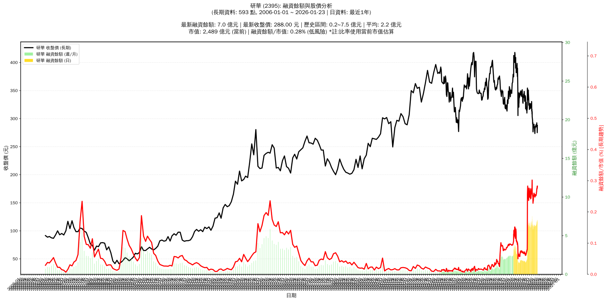

# :chart_with_upwards_trend: 研華 (2395) 融資餘額報告

!!! info "基本資訊"
    **:building_construction: 名稱**: 研華
    **:identification_card: 代號**: 2395
    **:calendar: 分析期間**: 2025-07-18 ~ 2026-01-09 (共 242 個交易日)
    **:clock3: 最新資料**: 2026-01-09
    **🕒 更新時間**: 2026-01-11 23:11:32 CST

## :moneybag: 融資餘額現況

| :chart: 指標 | :1234: 數值 | :traffic_light: 狀態 |
|:------------:|:----------:|:-------------------:|
| **最新融資餘額** | 6.5 億元 (2,264 張) | - |
| **最新收盤價** | 288.50 元 | - |
| **市值** | 2,493 億元 | - |
| **融資餘額/市值** | 0.26% | 🟢 低風險 |
| **日變化 (DoD)** | +0.1 億元 (+1.77%) | 📈 |
| **週變化 (WoW)** | +0.3 億元 (+4.05%) | 📈 |
| **月變化 (MoM)** | +0.2 億元 (+2.90%) | 📈 |

---

## :bar_chart: 歷史統計

| :chart: 指標 | :1234: 數值 |
|:------------:|:----------:|
| **歷史最高** | 7.5 億元 |
| **歷史最低** | 1.2 億元 |
| **平均值** | 3.7 億元 |
| **標準差** | 2.1 億元 |
| **當前相對位置** | 84.3% |

---

## :chart_with_upwards_trend: 融資餘額趨勢圖

    

---

## :clipboard: 詳細歷史記錄 (最近30日)

<table class="sortable-table">
<thead>
<tr>
<th>:calendar: 日期</th>
<th>:money_with_wings: 收盤價(元)</th>
<th>:chart: 漲跌(元)</th>
<th>:chart_with_upwards_trend: 漲跌(%)</th>
<th>:package: 融資餘額(億元)</th>
<th>:package: 融資餘額(張)</th>
<th>:arrow_up_down: 融資增減(張)</th>
<th>:chart: 融券餘額(張)</th>
<th>:balance_scale: 券資比(%)</th>
</tr>
</thead>
<tbody>
<tr>
<td>2026-01-09</td>
<td>288.50</td>
<td>🔺 +3.00</td>
<td>+1.05%</td>
<td>6.5</td>
<td>2,264</td>
<td>📈 +16</td>
<td>8</td>
<td>0.35%</td>
</tr>
<tr>
<td>2026-01-08</td>
<td>285.50</td>
<td>🔻 -3.00</td>
<td>-1.04%</td>
<td>6.4</td>
<td>2,248</td>
<td>📈 +28</td>
<td>6</td>
<td>0.27%</td>
</tr>
<tr>
<td>2026-01-07</td>
<td>288.50</td>
<td>🔺 +0.50</td>
<td>+0.17%</td>
<td>6.4</td>
<td>2,220</td>
<td>📉 -2</td>
<td>7</td>
<td>0.32%</td>
</tr>
<tr>
<td>2026-01-06</td>
<td>288.00</td>
<td>🔻 -1.50</td>
<td>-0.52%</td>
<td>6.4</td>
<td>2,222</td>
<td>📈 +42</td>
<td>9</td>
<td>0.41%</td>
</tr>
<tr>
<td>2026-01-05</td>
<td>289.50</td>
<td>🔺 +3.00</td>
<td>+1.05%</td>
<td>6.3</td>
<td>2,180</td>
<td>📉 -11</td>
<td>10</td>
<td>0.46%</td>
</tr>
<tr>
<td>2026-01-02</td>
<td>286.50</td>
<td>🔻 -1.50</td>
<td>-0.52%</td>
<td>6.3</td>
<td>2,191</td>
<td>📈 +11</td>
<td>8</td>
<td>0.37%</td>
</tr>
<tr>
<td>2025-12-31</td>
<td>288.00</td>
<td>🔺 +1.00</td>
<td>+0.35%</td>
<td>6.3</td>
<td>2,180</td>
<td>📈 +1</td>
<td>6</td>
<td>0.28%</td>
</tr>
<tr>
<td>2025-12-30</td>
<td>287.00</td>
<td>🔺 +0.50</td>
<td>+0.17%</td>
<td>6.3</td>
<td>2,179</td>
<td>📉 -14</td>
<td>7</td>
<td>0.32%</td>
</tr>
<tr>
<td>2025-12-29</td>
<td>286.50</td>
<td>🔺 +2.00</td>
<td>+0.70%</td>
<td>6.3</td>
<td>2,193</td>
<td>📉 -9</td>
<td>7</td>
<td>0.32%</td>
</tr>
<tr>
<td>2025-12-26</td>
<td>284.50</td>
<td>🔻 -1.50</td>
<td>-0.52%</td>
<td>6.3</td>
<td>2,202</td>
<td>📉 -13</td>
<td>8</td>
<td>0.36%</td>
</tr>
<tr>
<td>2025-12-24</td>
<td>286.00</td>
<td>🔺 +1.50</td>
<td>+0.53%</td>
<td>6.3</td>
<td>2,215</td>
<td>📉 -20</td>
<td>8</td>
<td>0.36%</td>
</tr>
<tr>
<td>2025-12-23</td>
<td>284.50</td>
<td>🔺 +1.50</td>
<td>+0.53%</td>
<td>6.4</td>
<td>2,235</td>
<td>📈 +20</td>
<td>7</td>
<td>0.31%</td>
</tr>
<tr>
<td>2025-12-22</td>
<td>283.00</td>
<td>🔺 +0.50</td>
<td>+0.18%</td>
<td>6.3</td>
<td>2,215</td>
<td>📈 +1</td>
<td>8</td>
<td>0.36%</td>
</tr>
<tr>
<td>2025-12-19</td>
<td>282.50</td>
<td>🔺 +7.50</td>
<td>+2.73%</td>
<td>6.3</td>
<td>2,214</td>
<td>📉 -27</td>
<td>10</td>
<td>0.45%</td>
</tr>
<tr>
<td>2025-12-18</td>
<td>275.00</td>
<td>🔺 +1.50</td>
<td>+0.55%</td>
<td>6.2</td>
<td>2,241</td>
<td>📉 -14</td>
<td>7</td>
<td>0.31%</td>
</tr>
<tr>
<td>2025-12-17</td>
<td>273.50</td>
<td>🔻 -0.50</td>
<td>-0.18%</td>
<td>6.2</td>
<td>2,255</td>
<td>📈 +2</td>
<td>9</td>
<td>0.40%</td>
</tr>
<tr>
<td>2025-12-16</td>
<td>274.00</td>
<td>🔻 -2.50</td>
<td>-0.90%</td>
<td>6.2</td>
<td>2,253</td>
<td>📈 +17</td>
<td>8</td>
<td>0.36%</td>
</tr>
<tr>
<td>2025-12-15</td>
<td>276.50</td>
<td>🔻 -3.50</td>
<td>-1.25%</td>
<td>6.2</td>
<td>2,236</td>
<td>📉 -6</td>
<td>5</td>
<td>0.22%</td>
</tr>
<tr>
<td>2025-12-12</td>
<td>280.00</td>
<td>🔻 -1.50</td>
<td>-0.53%</td>
<td>6.3</td>
<td>2,242</td>
<td>📉 -14</td>
<td>9</td>
<td>0.40%</td>
</tr>
<tr>
<td>2025-12-11</td>
<td>281.50</td>
<td>🔻 -1.00</td>
<td>-0.35%</td>
<td>6.4</td>
<td>2,256</td>
<td>📈 +9</td>
<td>9</td>
<td>0.40%</td>
</tr>
<tr>
<td>2025-12-10</td>
<td>282.50</td>
<td>🔻 -2.00</td>
<td>-0.70%</td>
<td>6.3</td>
<td>2,247</td>
<td>📉 -7</td>
<td>9</td>
<td>0.40%</td>
</tr>
<tr>
<td>2025-12-09</td>
<td>284.50</td>
<td>🔻 -1.50</td>
<td>-0.52%</td>
<td>6.4</td>
<td>2,254</td>
<td>📈 +29</td>
<td>9</td>
<td>0.40%</td>
</tr>
<tr>
<td>2025-12-08</td>
<td>286.00</td>
<td>🔻 -1.00</td>
<td>-0.35%</td>
<td>6.4</td>
<td>2,225</td>
<td>📉 -27</td>
<td>10</td>
<td>0.45%</td>
</tr>
<tr>
<td>2025-12-05</td>
<td>287.00</td>
<td>🔻 -3.00</td>
<td>-1.03%</td>
<td>6.5</td>
<td>2,252</td>
<td>📈 +19</td>
<td>11</td>
<td>0.49%</td>
</tr>
<tr>
<td>2025-12-04</td>
<td>290.00</td>
<td>🔺 +2.50</td>
<td>+0.87%</td>
<td>6.5</td>
<td>2,233</td>
<td>📈 +17</td>
<td>13</td>
<td>0.58%</td>
</tr>
<tr>
<td>2025-12-03</td>
<td>287.50</td>
<td>🔺 +0.50</td>
<td>+0.17%</td>
<td>6.4</td>
<td>2,216</td>
<td>📈 +3</td>
<td>13</td>
<td>0.59%</td>
</tr>
<tr>
<td>2025-12-02</td>
<td>287.00</td>
<td>🔻 -1.00</td>
<td>-0.35%</td>
<td>6.4</td>
<td>2,213</td>
<td>📈 +10</td>
<td>13</td>
<td>0.59%</td>
</tr>
<tr>
<td>2025-12-01</td>
<td>288.00</td>
<td>➖ +0.00</td>
<td>+0.00%</td>
<td>6.3</td>
<td>2,203</td>
<td>📈 +31</td>
<td>11</td>
<td>0.50%</td>
</tr>
<tr>
<td>2025-11-28</td>
<td>288.00</td>
<td>➖ +0.00</td>
<td>+0.00%</td>
<td>6.3</td>
<td>2,172</td>
<td>📈 +19</td>
<td>12</td>
<td>0.55%</td>
</tr>
<tr>
<td>2025-11-27</td>
<td>288.00</td>
<td>🔻 -1.50</td>
<td>-0.52%</td>
<td>6.2</td>
<td>2,153</td>
<td>📈 +17</td>
<td>13</td>
<td>0.60%</td>
</tr>
</tbody>
</table>

---

## :information_source: 資料來源與方法

!!! note "資料來源說明"
    - **主要來源**: `raw_margin_daily.csv` (Type 13: ShowMarginChart)
    - **資料頻率**: 每日更新
    - **資料範圍**: 近1年交易日資料

!!! info "報告元資訊"
    - **報告產生時間**: 2026-01-11 23:11:32
    - **分析期間**: 242 個交易日
    - **資料來源**: Stage 1 Raw Margin Daily Data

---

:material-information-outline: **本報告僅供參考，投資決策請審慎評估**

