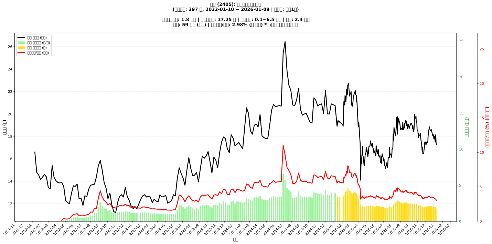

# 📈 輔信 (2405) 融資餘額報告

!!! info "基本資訊"
    **🏗️ 名稱**: 輔信
    **🪪 代號**: 2405
    **📅 分析期間**: 2025-07-23 ~ 2026-01-14 (共 243 個交易日)
    **🕒 最新資料**: 2026-01-14
    **🕒 更新時間**: 2026-01-15 12:03:28 CST

## 💰 融資餘額現況

| 📊 指標 | 🔢 數值 | 🚦 狀態 |
|:------------:|:----------:|:-------------------:|
| **最新融資餘額** | 1.7 億元 (9,676 張) | - |
| **最新收盤價** | 17.70 元 | - |
| **市值** | 61 億元 | - |
| **融資餘額/市值** | 2.82% | 🔴 過熱 |
| **日變化 (DoD)** | +0.1 億元 (+3.28%) | 📈 |
| **週變化 (WoW)** | -0.2 億元 (-10.45%) | 📉 |
| **月變化 (MoM)** | -0.4 億元 (-20.22%) | 📉 |

---

## 📊 歷史統計

| 📊 指標 | 🔢 數值 |
|:------------:|:----------:|
| **歷史最高** | 4.8 億元 |
| **歷史最低** | 1.7 億元 |
| **平均值** | 2.5 億元 |
| **標準差** | 0.7 億元 |
| **當前相對位置** | 1.7% |

---

## 📈 融資餘額趨勢圖

{: style="max-width: 100%; height: auto;"}

---

## 📋 詳細歷史記錄 (最近30日)

<table class="sortable-table">
<thead>
<tr>
<th markdown="span">📅 日期</th>
<th markdown="span">💸 收盤價(元)</th>
<th markdown="span">📊 漲跌(元)</th>
<th markdown="span">📈 漲跌(%)</th>
<th markdown="span">📦 融資餘額(億元)</th>
<th markdown="span">📦 融資餘額(張)</th>
<th markdown="span">↕️ 融資增減(張)</th>
<th markdown="span">📊 融券餘額(張)</th>
<th markdown="span">⚖️ 券資比(%)</th>
</tr>
</thead>
<tbody>
<tr>
<td>2026-01-14</td>
<td>17.70</td>
<td>🔺 +0.65</td>
<td>+3.81%</td>
<td>1.7</td>
<td>9,676</td>
<td>📉 -50</td>
<td>69</td>
<td>0.71%</td>
</tr>
<tr>
<td>2026-01-13</td>
<td>17.05</td>
<td>🔻 -0.05</td>
<td>-0.29%</td>
<td>1.7</td>
<td>9,726</td>
<td>📈 +21</td>
<td>34</td>
<td>0.35%</td>
</tr>
<tr>
<td>2026-01-12</td>
<td>17.10</td>
<td>🔻 -0.15</td>
<td>-0.87%</td>
<td>1.7</td>
<td>9,705</td>
<td>📉 -521</td>
<td>34</td>
<td>0.35%</td>
</tr>
<tr>
<td>2026-01-09</td>
<td>17.25</td>
<td>🔻 -0.20</td>
<td>-1.15%</td>
<td>1.8</td>
<td>10,226</td>
<td>📉 -381</td>
<td>34</td>
<td>0.33%</td>
</tr>
<tr>
<td>2026-01-08</td>
<td>17.45</td>
<td>🔻 -0.70</td>
<td>-3.86%</td>
<td>1.9</td>
<td>10,607</td>
<td>📈 +70</td>
<td>24</td>
<td>0.23%</td>
</tr>
<tr>
<td>2026-01-07</td>
<td>18.15</td>
<td>🔺 +0.35</td>
<td>+1.97%</td>
<td>1.9</td>
<td>10,537</td>
<td>📉 -255</td>
<td>24</td>
<td>0.23%</td>
</tr>
<tr>
<td>2026-01-06</td>
<td>17.80</td>
<td>🔺 +0.30</td>
<td>+1.71%</td>
<td>1.9</td>
<td>10,792</td>
<td>📉 -82</td>
<td>24</td>
<td>0.22%</td>
</tr>
<tr>
<td>2026-01-05</td>
<td>17.50</td>
<td>🔻 -0.50</td>
<td>-2.78%</td>
<td>1.9</td>
<td>10,874</td>
<td>📉 -139</td>
<td>24</td>
<td>0.22%</td>
</tr>
<tr>
<td>2026-01-02</td>
<td>18.00</td>
<td>🔺 +0.20</td>
<td>+1.12%</td>
<td>2.0</td>
<td>11,013</td>
<td>📉 -211</td>
<td>24</td>
<td>0.22%</td>
</tr>
<tr>
<td>2025-12-31</td>
<td>17.80</td>
<td>🔻 -0.20</td>
<td>-1.11%</td>
<td>2.0</td>
<td>11,224</td>
<td>📈 +13</td>
<td>24</td>
<td>0.21%</td>
</tr>
<tr>
<td>2025-12-30</td>
<td>18.00</td>
<td>🔻 -0.15</td>
<td>-0.83%</td>
<td>2.0</td>
<td>11,211</td>
<td>📈 +21</td>
<td>35</td>
<td>0.31%</td>
</tr>
<tr>
<td>2025-12-29</td>
<td>18.15</td>
<td>🔺 +0.05</td>
<td>+0.28%</td>
<td>2.0</td>
<td>11,190</td>
<td>📉 -32</td>
<td>35</td>
<td>0.31%</td>
</tr>
<tr>
<td>2025-12-26</td>
<td>18.10</td>
<td>🔻 -0.30</td>
<td>-1.63%</td>
<td>2.0</td>
<td>11,222</td>
<td>📉 -10</td>
<td>25</td>
<td>0.22%</td>
</tr>
<tr>
<td>2025-12-24</td>
<td>18.40</td>
<td>🔻 -0.05</td>
<td>-0.27%</td>
<td>2.1</td>
<td>11,232</td>
<td>📈 +61</td>
<td>33</td>
<td>0.29%</td>
</tr>
<tr>
<td>2025-12-23</td>
<td>18.45</td>
<td>🔻 -0.15</td>
<td>-0.81%</td>
<td>2.1</td>
<td>11,171</td>
<td>📉 -54</td>
<td>34</td>
<td>0.30%</td>
</tr>
<tr>
<td>2025-12-22</td>
<td>18.60</td>
<td>🔺 +0.10</td>
<td>+0.54%</td>
<td>2.1</td>
<td>11,225</td>
<td>📈 +40</td>
<td>40</td>
<td>0.36%</td>
</tr>
<tr>
<td>2025-12-19</td>
<td>18.50</td>
<td>➖ +0.00</td>
<td>+0.00%</td>
<td>2.1</td>
<td>11,185</td>
<td>📈 +83</td>
<td>27</td>
<td>0.24%</td>
</tr>
<tr>
<td>2025-12-18</td>
<td>18.50</td>
<td>🔻 -0.15</td>
<td>-0.80%</td>
<td>2.1</td>
<td>11,102</td>
<td>📉 -38</td>
<td>29</td>
<td>0.26%</td>
</tr>
<tr>
<td>2025-12-17</td>
<td>18.65</td>
<td>➖ +0.00</td>
<td>+0.00%</td>
<td>2.1</td>
<td>11,140</td>
<td>📉 -116</td>
<td>45</td>
<td>0.40%</td>
</tr>
<tr>
<td>2025-12-16</td>
<td>18.65</td>
<td>🔻 -0.20</td>
<td>-1.06%</td>
<td>2.1</td>
<td>11,256</td>
<td>📉 -133</td>
<td>45</td>
<td>0.40%</td>
</tr>
<tr>
<td>2025-12-15</td>
<td>18.85</td>
<td>🔺 +0.40</td>
<td>+2.17%</td>
<td>2.1</td>
<td>11,389</td>
<td>📉 -68</td>
<td>50</td>
<td>0.44%</td>
</tr>
<tr>
<td>2025-12-12</td>
<td>18.45</td>
<td>🔺 +0.15</td>
<td>+0.82%</td>
<td>2.1</td>
<td>11,457</td>
<td>📉 -134</td>
<td>28</td>
<td>0.24%</td>
</tr>
<tr>
<td>2025-12-11</td>
<td>18.30</td>
<td>🔺 +0.30</td>
<td>+1.67%</td>
<td>2.1</td>
<td>11,591</td>
<td>📉 -62</td>
<td>27</td>
<td>0.23%</td>
</tr>
<tr>
<td>2025-12-10</td>
<td>18.00</td>
<td>🔺 +0.50</td>
<td>+2.86%</td>
<td>2.1</td>
<td>11,653</td>
<td>📉 -70</td>
<td>27</td>
<td>0.23%</td>
</tr>
<tr>
<td>2025-12-09</td>
<td>17.50</td>
<td>➖ +0.00</td>
<td>+0.00%</td>
<td>2.1</td>
<td>11,723</td>
<td>📈 +13</td>
<td>34</td>
<td>0.29%</td>
</tr>
<tr>
<td>2025-12-08</td>
<td>17.50</td>
<td>🔺 +0.10</td>
<td>+0.57%</td>
<td>2.0</td>
<td>11,710</td>
<td>📈 +20</td>
<td>34</td>
<td>0.29%</td>
</tr>
<tr>
<td>2025-12-05</td>
<td>17.40</td>
<td>🔻 -0.10</td>
<td>-0.57%</td>
<td>2.0</td>
<td>11,690</td>
<td>📈 +11</td>
<td>24</td>
<td>0.21%</td>
</tr>
<tr>
<td>2025-12-04</td>
<td>17.50</td>
<td>🔺 +0.20</td>
<td>+1.16%</td>
<td>2.0</td>
<td>11,679</td>
<td>📉 -21</td>
<td>43</td>
<td>0.37%</td>
</tr>
<tr>
<td>2025-12-03</td>
<td>17.30</td>
<td>🔺 +0.05</td>
<td>+0.29%</td>
<td>2.0</td>
<td>11,700</td>
<td>📉 -46</td>
<td>40</td>
<td>0.34%</td>
</tr>
<tr>
<td>2025-12-02</td>
<td>17.25</td>
<td>🔻 -0.25</td>
<td>-1.43%</td>
<td>2.0</td>
<td>11,746</td>
<td>📈 +73</td>
<td>40</td>
<td>0.34%</td>
</tr>
</tbody>
</table>

---

## ℹ️ 資料來源與方法

!!! note "資料來源說明"
    - **主要來源**: `raw_margin_daily.csv` (Type 13: ShowMarginChart)
    - **資料頻率**: 每日更新
    - **資料範圍**: 近1年交易日資料

!!! info "報告元資訊"
    - **報告產生時間**: 2026-01-15 12:03:28
    - **分析期間**: 243 個交易日
    - **資料來源**: Stage 1 Raw Margin Daily Data

---

:material-information-outline: **本報告僅供參考，投資決策請審慎評估**

