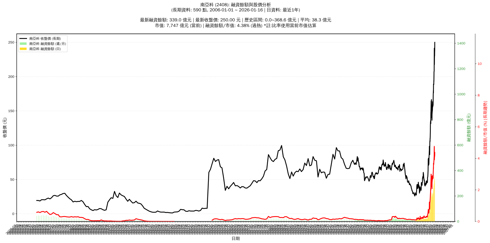

# :chart_with_upwards_trend: 南亞科 (2408) 融資餘額報告

!!! info "基本資訊"
    **:building_construction: 名稱**: 南亞科
    **:identification_card: 代號**: 2408
    **:calendar: 分析期間**: 2025-07-18 ~ 2026-01-09 (共 242 個交易日)
    **:clock3: 最新資料**: 2026-01-09
    **🕒 更新時間**: 2026-01-11 23:12:03 CST

## :moneybag: 融資餘額現況

| :chart: 指標 | :1234: 數值 | :traffic_light: 狀態 |
|:------------:|:----------:|:-------------------:|
| **最新融資餘額** | 303.4 億元 (139,511 張) | - |
| **最新收盤價** | 217.50 元 | - |
| **市值** | 6,740 億元 | - |
| **融資餘額/市值** | 4.50% | 🔴 過熱 |
| **日變化 (DoD)** | -46.3 億元 (-13.23%) | 📉 |
| **週變化 (WoW)** | -2.2 億元 (-0.72%) | 📉 |
| **月變化 (MoM)** | +93.7 億元 (+44.66%) | 📈 |

---

## :bar_chart: 歷史統計

| :chart: 指標 | :1234: 數值 |
|:------------:|:----------:|
| **歷史最高** | 368.6 億元 |
| **歷史最低** | 7.5 億元 |
| **平均值** | 67.7 億元 |
| **標準差** | 88.5 億元 |
| **當前相對位置** | 82.0% |

---

## :chart_with_upwards_trend: 融資餘額趨勢圖

    

---

## :clipboard: 詳細歷史記錄 (最近30日)

<table class="sortable-table">
<thead>
<tr>
<th>:calendar: 日期</th>
<th>:money_with_wings: 收盤價(元)</th>
<th>:chart: 漲跌(元)</th>
<th>:chart_with_upwards_trend: 漲跌(%)</th>
<th>:package: 融資餘額(億元)</th>
<th>:package: 融資餘額(張)</th>
<th>:arrow_up_down: 融資增減(張)</th>
<th>:chart: 融券餘額(張)</th>
<th>:balance_scale: 券資比(%)</th>
</tr>
</thead>
<tbody>
<tr>
<td>2026-01-09</td>
<td>217.50</td>
<td>🔻 -24.00</td>
<td>-9.94%</td>
<td>303.4</td>
<td>139,511</td>
<td>📉 -5,294</td>
<td>14,372</td>
<td>10.30%</td>
</tr>
<tr>
<td>2026-01-08</td>
<td>241.50</td>
<td>🔺 +0.50</td>
<td>+0.21%</td>
<td>349.7</td>
<td>144,805</td>
<td>📉 -8,143</td>
<td>17,217</td>
<td>11.90%</td>
</tr>
<tr>
<td>2026-01-07</td>
<td>241.00</td>
<td>🔺 +12.50</td>
<td>+5.47%</td>
<td>368.6</td>
<td>152,948</td>
<td>📉 -3,907</td>
<td>16,457</td>
<td>10.80%</td>
</tr>
<tr>
<td>2026-01-06</td>
<td>228.50</td>
<td>🔺 +20.50</td>
<td>+9.86%</td>
<td>358.4</td>
<td>156,855</td>
<td>📈 +2,226</td>
<td>17,653</td>
<td>11.30%</td>
</tr>
<tr>
<td>2026-01-05</td>
<td>208.00</td>
<td>🔺 +1.00</td>
<td>+0.48%</td>
<td>321.6</td>
<td>154,629</td>
<td>📈 +6,978</td>
<td>16,934</td>
<td>11.00%</td>
</tr>
<tr>
<td>2026-01-02</td>
<td>207.00</td>
<td>🔺 +14.00</td>
<td>+7.25%</td>
<td>305.6</td>
<td>147,651</td>
<td>📉 -4,825</td>
<td>17,122</td>
<td>11.60%</td>
</tr>
<tr>
<td>2025-12-31</td>
<td>193.00</td>
<td>🔻 -1.50</td>
<td>-0.77%</td>
<td>294.3</td>
<td>152,476</td>
<td>📈 +215</td>
<td>16,378</td>
<td>10.70%</td>
</tr>
<tr>
<td>2025-12-30</td>
<td>194.50</td>
<td>🔺 +6.00</td>
<td>+3.18%</td>
<td>296.1</td>
<td>152,261</td>
<td>📈 +2,861</td>
<td>16,752</td>
<td>11.00%</td>
</tr>
<tr>
<td>2025-12-29</td>
<td>188.50</td>
<td>🔻 -0.50</td>
<td>-0.26%</td>
<td>281.6</td>
<td>149,400</td>
<td>📈 +1,410</td>
<td>16,521</td>
<td>11.10%</td>
</tr>
<tr>
<td>2025-12-26</td>
<td>189.00</td>
<td>➖ +0.00</td>
<td>+0.00%</td>
<td>279.7</td>
<td>147,990</td>
<td>📉 -3,311</td>
<td>16,839</td>
<td>11.40%</td>
</tr>
<tr>
<td>2025-12-24</td>
<td>189.00</td>
<td>🔺 +12.50</td>
<td>+7.08%</td>
<td>286.0</td>
<td>151,301</td>
<td>📈 +3,983</td>
<td>17,052</td>
<td>11.30%</td>
</tr>
<tr>
<td>2025-12-23</td>
<td>176.50</td>
<td>🔻 -3.50</td>
<td>-1.94%</td>
<td>260.0</td>
<td>147,318</td>
<td>📈 +222</td>
<td>15,960</td>
<td>10.80%</td>
</tr>
<tr>
<td>2025-12-22</td>
<td>180.00</td>
<td>🔺 +5.50</td>
<td>+3.15%</td>
<td>264.8</td>
<td>147,096</td>
<td>📈 +8,608</td>
<td>16,255</td>
<td>11.10%</td>
</tr>
<tr>
<td>2025-12-19</td>
<td>174.50</td>
<td>🔺 +4.50</td>
<td>+2.65%</td>
<td>241.7</td>
<td>138,488</td>
<td>📉 -544</td>
<td>15,965</td>
<td>11.50%</td>
</tr>
<tr>
<td>2025-12-18</td>
<td>170.00</td>
<td>🔺 +5.50</td>
<td>+3.34%</td>
<td>236.4</td>
<td>139,032</td>
<td>📈 +1,527</td>
<td>15,808</td>
<td>11.40%</td>
</tr>
<tr>
<td>2025-12-17</td>
<td>164.50</td>
<td>🔺 +6.50</td>
<td>+4.11%</td>
<td>226.2</td>
<td>137,505</td>
<td>📈 +3,155</td>
<td>15,595</td>
<td>11.30%</td>
</tr>
<tr>
<td>2025-12-16</td>
<td>158.00</td>
<td>🔻 -4.50</td>
<td>-2.77%</td>
<td>212.3</td>
<td>134,350</td>
<td>📉 -541</td>
<td>15,249</td>
<td>11.40%</td>
</tr>
<tr>
<td>2025-12-15</td>
<td>162.50</td>
<td>🔺 +0.50</td>
<td>+0.31%</td>
<td>219.2</td>
<td>134,891</td>
<td>📉 -521</td>
<td>15,647</td>
<td>11.60%</td>
</tr>
<tr>
<td>2025-12-12</td>
<td>162.00</td>
<td>🔺 +6.00</td>
<td>+3.85%</td>
<td>219.4</td>
<td>135,412</td>
<td>📈 +1,330</td>
<td>15,694</td>
<td>11.60%</td>
</tr>
<tr>
<td>2025-12-11</td>
<td>156.00</td>
<td>➖ +0.00</td>
<td>+0.00%</td>
<td>209.2</td>
<td>134,082</td>
<td>📉 -381</td>
<td>15,912</td>
<td>11.90%</td>
</tr>
<tr>
<td>2025-12-10</td>
<td>156.00</td>
<td>🔻 -6.00</td>
<td>-3.70%</td>
<td>209.8</td>
<td>134,463</td>
<td>📉 -1,296</td>
<td>16,075</td>
<td>12.00%</td>
</tr>
<tr>
<td>2025-12-09</td>
<td>162.00</td>
<td>🔻 -1.50</td>
<td>-0.92%</td>
<td>219.9</td>
<td>135,759</td>
<td>📉 -2,268</td>
<td>16,538</td>
<td>12.20%</td>
</tr>
<tr>
<td>2025-12-08</td>
<td>163.50</td>
<td>🔺 +10.50</td>
<td>+6.86%</td>
<td>225.7</td>
<td>138,027</td>
<td>📈 +2,354</td>
<td>16,475</td>
<td>11.90%</td>
</tr>
<tr>
<td>2025-12-05</td>
<td>153.00</td>
<td>🔺 +2.00</td>
<td>+1.32%</td>
<td>207.6</td>
<td>135,673</td>
<td>📉 -10,210</td>
<td>17,753</td>
<td>13.10%</td>
</tr>
<tr>
<td>2025-12-04</td>
<td>151.00</td>
<td>➖ +0.00</td>
<td>+0.00%</td>
<td>220.3</td>
<td>145,883</td>
<td>📉 -935</td>
<td>17,139</td>
<td>11.70%</td>
</tr>
<tr>
<td>2025-12-03</td>
<td>151.00</td>
<td>🔺 +1.50</td>
<td>+1.00%</td>
<td>221.7</td>
<td>146,818</td>
<td>📈 +8,237</td>
<td>16,412</td>
<td>11.20%</td>
</tr>
<tr>
<td>2025-12-02</td>
<td>149.50</td>
<td>➖ +0.00</td>
<td>+0.00%</td>
<td>207.2</td>
<td>138,581</td>
<td>📈 +3,629</td>
<td>16,895</td>
<td>12.20%</td>
</tr>
<tr>
<td>2025-12-01</td>
<td>149.50</td>
<td>🔺 +3.50</td>
<td>+2.40%</td>
<td>201.8</td>
<td>134,952</td>
<td>📈 +2,576</td>
<td>17,082</td>
<td>12.70%</td>
</tr>
<tr>
<td>2025-11-28</td>
<td>146.00</td>
<td>➖ +0.00</td>
<td>+0.00%</td>
<td>193.3</td>
<td>132,376</td>
<td>📈 +3,203</td>
<td>16,434</td>
<td>12.40%</td>
</tr>
<tr>
<td>2025-11-27</td>
<td>146.00</td>
<td>🔺 +9.50</td>
<td>+6.96%</td>
<td>188.6</td>
<td>129,173</td>
<td>📈 +11,074</td>
<td>16,508</td>
<td>12.80%</td>
</tr>
</tbody>
</table>

---

## :information_source: 資料來源與方法

!!! note "資料來源說明"
    - **主要來源**: `raw_margin_daily.csv` (Type 13: ShowMarginChart)
    - **資料頻率**: 每日更新
    - **資料範圍**: 近1年交易日資料

!!! info "報告元資訊"
    - **報告產生時間**: 2026-01-11 23:12:03
    - **分析期間**: 242 個交易日
    - **資料來源**: Stage 1 Raw Margin Daily Data

---

:material-information-outline: **本報告僅供參考，投資決策請審慎評估**

