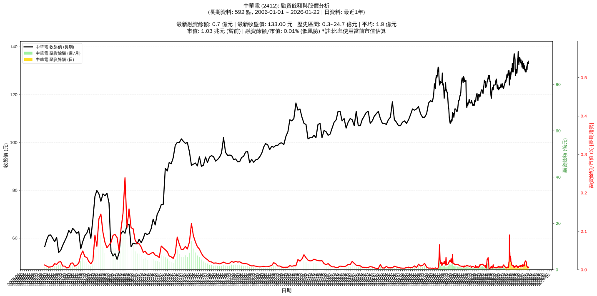

# :chart_with_upwards_trend: 中華電 (2412) 融資餘額報告

!!! info "基本資訊"
    **:building_construction: 名稱**: 中華電
    **:identification_card: 代號**: 2412
    **:calendar: 分析期間**: 2025-07-18 ~ 2026-01-09 (共 242 個交易日)
    **:clock3: 最新資料**: 2026-01-09
    **🕒 更新時間**: 2026-01-11 23:12:48 CST

## :moneybag: 融資餘額現況

| :chart: 指標 | :1234: 數值 | :traffic_light: 狀態 |
|:------------:|:----------:|:-------------------:|
| **最新融資餘額** | 0.7 億元 (507 張) | - |
| **最新收盤價** | 133.50 元 | - |
| **市值** | 1.04 兆元 | - |
| **融資餘額/市值** | 0.01% | 🟢 低風險 |
| **日變化 (DoD)** | +0.0 億元 (+2.63%) | 📈 |
| **週變化 (WoW)** | -0.2 億元 (-18.61%) | 📉 |
| **月變化 (MoM)** | -1.7 億元 (-71.04%) | 📉 |

---

## :bar_chart: 歷史統計

| :chart: 指標 | :1234: 數值 |
|:------------:|:----------:|
| **歷史最高** | 9.3 億元 |
| **歷史最低** | 0.5 億元 |
| **平均值** | 1.3 億元 |
| **標準差** | 1.0 億元 |
| **當前相對位置** | 1.9% |

---

## :chart_with_upwards_trend: 融資餘額趨勢圖

    

---

## :clipboard: 詳細歷史記錄 (最近30日)

<table class="sortable-table">
<thead>
<tr>
<th>:calendar: 日期</th>
<th>:money_with_wings: 收盤價(元)</th>
<th>:chart: 漲跌(元)</th>
<th>:chart_with_upwards_trend: 漲跌(%)</th>
<th>:package: 融資餘額(億元)</th>
<th>:package: 融資餘額(張)</th>
<th>:arrow_up_down: 融資增減(張)</th>
<th>:chart: 融券餘額(張)</th>
<th>:balance_scale: 券資比(%)</th>
</tr>
</thead>
<tbody>
<tr>
<td>2026-01-09</td>
<td>133.50</td>
<td>➖ +0.00</td>
<td>+0.00%</td>
<td>0.7</td>
<td>507</td>
<td>📈 +13</td>
<td>20</td>
<td>3.94%</td>
</tr>
<tr>
<td>2026-01-08</td>
<td>133.50</td>
<td>🔺 +0.50</td>
<td>+0.38%</td>
<td>0.7</td>
<td>494</td>
<td>📉 -21</td>
<td>20</td>
<td>4.05%</td>
</tr>
<tr>
<td>2026-01-07</td>
<td>133.00</td>
<td>🔺 +0.50</td>
<td>+0.38%</td>
<td>0.7</td>
<td>515</td>
<td>📉 -71</td>
<td>20</td>
<td>3.88%</td>
</tr>
<tr>
<td>2026-01-06</td>
<td>132.50</td>
<td>🔻 -0.50</td>
<td>-0.38%</td>
<td>0.8</td>
<td>586</td>
<td>📈 +14</td>
<td>17</td>
<td>2.90%</td>
</tr>
<tr>
<td>2026-01-05</td>
<td>133.00</td>
<td>🔺 +1.00</td>
<td>+0.76%</td>
<td>0.8</td>
<td>572</td>
<td>📉 -58</td>
<td>17</td>
<td>2.97%</td>
</tr>
<tr>
<td>2026-01-02</td>
<td>132.00</td>
<td>🔺 +1.50</td>
<td>+1.15%</td>
<td>0.8</td>
<td>630</td>
<td>📉 -78</td>
<td>17</td>
<td>2.70%</td>
</tr>
<tr>
<td>2025-12-31</td>
<td>130.50</td>
<td>🔻 -0.50</td>
<td>-0.38%</td>
<td>0.9</td>
<td>708</td>
<td>📉 -3</td>
<td>17</td>
<td>2.40%</td>
</tr>
<tr>
<td>2025-12-30</td>
<td>131.00</td>
<td>🔻 -1.00</td>
<td>-0.76%</td>
<td>0.9</td>
<td>711</td>
<td>📈 +25</td>
<td>17</td>
<td>2.39%</td>
</tr>
<tr>
<td>2025-12-29</td>
<td>132.00</td>
<td>🔺 +0.50</td>
<td>+0.38%</td>
<td>0.9</td>
<td>686</td>
<td>📉 -106</td>
<td>18</td>
<td>2.62%</td>
</tr>
<tr>
<td>2025-12-26</td>
<td>131.50</td>
<td>🔺 +1.00</td>
<td>+0.77%</td>
<td>1.0</td>
<td>792</td>
<td>📉 -64</td>
<td>18</td>
<td>2.27%</td>
</tr>
<tr>
<td>2025-12-24</td>
<td>130.50</td>
<td>➖ +0.00</td>
<td>+0.00%</td>
<td>1.1</td>
<td>856</td>
<td>📉 -333</td>
<td>17</td>
<td>1.99%</td>
</tr>
<tr>
<td>2025-12-23</td>
<td>130.50</td>
<td>➖ +0.00</td>
<td>+0.00%</td>
<td>1.6</td>
<td>1,189</td>
<td>📉 -289</td>
<td>17</td>
<td>1.43%</td>
</tr>
<tr>
<td>2025-12-22</td>
<td>130.50</td>
<td>🔻 -0.50</td>
<td>-0.38%</td>
<td>1.9</td>
<td>1,478</td>
<td>📉 -9</td>
<td>17</td>
<td>1.15%</td>
</tr>
<tr>
<td>2025-12-19</td>
<td>131.00</td>
<td>🔺 +1.00</td>
<td>+0.77%</td>
<td>1.9</td>
<td>1,487</td>
<td>📉 -158</td>
<td>17</td>
<td>1.14%</td>
</tr>
<tr>
<td>2025-12-18</td>
<td>130.00</td>
<td>🔺 +0.50</td>
<td>+0.39%</td>
<td>2.1</td>
<td>1,645</td>
<td>📉 -10</td>
<td>19</td>
<td>1.16%</td>
</tr>
<tr>
<td>2025-12-17</td>
<td>129.50</td>
<td>🔻 -1.00</td>
<td>-0.77%</td>
<td>2.1</td>
<td>1,655</td>
<td>📈 +50</td>
<td>19</td>
<td>1.15%</td>
</tr>
<tr>
<td>2025-12-16</td>
<td>130.50</td>
<td>➖ +0.00</td>
<td>+0.00%</td>
<td>2.1</td>
<td>1,605</td>
<td>📈 +21</td>
<td>19</td>
<td>1.18%</td>
</tr>
<tr>
<td>2025-12-15</td>
<td>130.50</td>
<td>➖ +0.00</td>
<td>+0.00%</td>
<td>2.1</td>
<td>1,584</td>
<td>📉 -122</td>
<td>19</td>
<td>1.20%</td>
</tr>
<tr>
<td>2025-12-12</td>
<td>130.50</td>
<td>🔺 +0.50</td>
<td>+0.38%</td>
<td>2.2</td>
<td>1,706</td>
<td>📉 -74</td>
<td>19</td>
<td>1.11%</td>
</tr>
<tr>
<td>2025-12-11</td>
<td>130.00</td>
<td>🔺 +0.50</td>
<td>+0.39%</td>
<td>2.3</td>
<td>1,780</td>
<td>📉 -25</td>
<td>20</td>
<td>1.12%</td>
</tr>
<tr>
<td>2025-12-10</td>
<td>129.50</td>
<td>🔻 -0.50</td>
<td>-0.38%</td>
<td>2.3</td>
<td>1,805</td>
<td>📈 +63</td>
<td>18</td>
<td>1.00%</td>
</tr>
<tr>
<td>2025-12-09</td>
<td>130.00</td>
<td>🔺 +0.50</td>
<td>+0.39%</td>
<td>2.3</td>
<td>1,742</td>
<td>📉 -98</td>
<td>16</td>
<td>0.92%</td>
</tr>
<tr>
<td>2025-12-08</td>
<td>129.50</td>
<td>🔻 -0.50</td>
<td>-0.38%</td>
<td>2.4</td>
<td>1,840</td>
<td>📈 +180</td>
<td>16</td>
<td>0.87%</td>
</tr>
<tr>
<td>2025-12-05</td>
<td>130.00</td>
<td>🔺 +0.50</td>
<td>+0.39%</td>
<td>2.2</td>
<td>1,660</td>
<td>📉 -50</td>
<td>16</td>
<td>0.96%</td>
</tr>
<tr>
<td>2025-12-04</td>
<td>129.50</td>
<td>🔻 -0.50</td>
<td>-0.38%</td>
<td>2.2</td>
<td>1,710</td>
<td>📉 -26</td>
<td>17</td>
<td>0.99%</td>
</tr>
<tr>
<td>2025-12-03</td>
<td>130.00</td>
<td>➖ +0.00</td>
<td>+0.00%</td>
<td>2.3</td>
<td>1,736</td>
<td>📈 +95</td>
<td>17</td>
<td>0.98%</td>
</tr>
<tr>
<td>2025-12-02</td>
<td>130.00</td>
<td>➖ +0.00</td>
<td>+0.00%</td>
<td>2.1</td>
<td>1,641</td>
<td>📉 -9</td>
<td>17</td>
<td>1.04%</td>
</tr>
<tr>
<td>2025-12-01</td>
<td>130.00</td>
<td>🔻 -0.50</td>
<td>-0.38%</td>
<td>2.1</td>
<td>1,650</td>
<td>📈 +94</td>
<td>17</td>
<td>1.03%</td>
</tr>
<tr>
<td>2025-11-28</td>
<td>130.50</td>
<td>🔻 -0.50</td>
<td>-0.38%</td>
<td>2.0</td>
<td>1,556</td>
<td>📈 +25</td>
<td>17</td>
<td>1.09%</td>
</tr>
<tr>
<td>2025-11-27</td>
<td>131.00</td>
<td>➖ +0.00</td>
<td>+0.00%</td>
<td>2.0</td>
<td>1,531</td>
<td>📈 +43</td>
<td>20</td>
<td>1.31%</td>
</tr>
</tbody>
</table>

---

## :information_source: 資料來源與方法

!!! note "資料來源說明"
    - **主要來源**: `raw_margin_daily.csv` (Type 13: ShowMarginChart)
    - **資料頻率**: 每日更新
    - **資料範圍**: 近1年交易日資料

!!! info "報告元資訊"
    - **報告產生時間**: 2026-01-11 23:12:48
    - **分析期間**: 242 個交易日
    - **資料來源**: Stage 1 Raw Margin Daily Data

---

:material-information-outline: **本報告僅供參考，投資決策請審慎評估**

