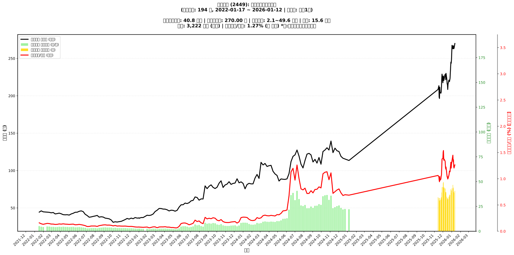

# :chart_with_upwards_trend: 京元電子 (2449) 融資餘額報告

!!! info "基本資訊"
    **:building_construction: 名稱**: 京元電子
    **:identification_card: 代號**: 2449
    **:calendar: 分析期間**: 2025-07-18 ~ 2026-01-09 (共 242 個交易日)
    **:clock3: 最新資料**: 2026-01-09
    **🕒 更新時間**: 2026-01-12 12:08:29 CST

## :moneybag: 融資餘額現況

| :chart: 指標 | :1234: 數值 | :traffic_light: 狀態 |
|:------------:|:----------:|:-------------------:|
| **最新融資餘額** | 38.8 億元 (14,736 張) | - |
| **最新收盤價** | 263.50 元 | - |
| **市值** | 3,222 億元 | - |
| **融資餘額/市值** | 1.21% | 🔴 過熱 |
| **日變化 (DoD)** | -0.9 億元 (-2.27%) | 📉 |
| **週變化 (WoW)** | -4.6 億元 (-10.59%) | 📉 |
| **月變化 (MoM)** | -0.7 億元 (-1.74%) | 📉 |

---

## :bar_chart: 歷史統計

| :chart: 指標 | :1234: 數值 |
|:------------:|:----------:|
| **歷史最高** | 49.6 億元 |
| **歷史最低** | 8.0 億元 |
| **平均值** | 25.9 億元 |
| **標準差** | 11.9 億元 |
| **當前相對位置** | 74.2% |

---

## :chart_with_upwards_trend: 融資餘額趨勢圖

    

---

## :clipboard: 詳細歷史記錄 (最近30日)

<table class="sortable-table">
<thead>
<tr>
<th>:calendar: 日期</th>
<th>:money_with_wings: 收盤價(元)</th>
<th>:chart: 漲跌(元)</th>
<th>:chart_with_upwards_trend: 漲跌(%)</th>
<th>:package: 融資餘額(億元)</th>
<th>:package: 融資餘額(張)</th>
<th>:arrow_up_down: 融資增減(張)</th>
<th>:chart: 融券餘額(張)</th>
<th>:balance_scale: 券資比(%)</th>
</tr>
</thead>
<tbody>
<tr>
<td>2026-01-09</td>
<td>263.50</td>
<td>🔺 +0.50</td>
<td>+0.19%</td>
<td>38.8</td>
<td>14,736</td>
<td>📉 -371</td>
<td>1,643</td>
<td>11.10%</td>
</tr>
<tr>
<td>2026-01-08</td>
<td>263.00</td>
<td>🔻 -3.50</td>
<td>-1.31%</td>
<td>39.7</td>
<td>15,107</td>
<td>📉 -1,368</td>
<td>1,679</td>
<td>11.10%</td>
</tr>
<tr>
<td>2026-01-07</td>
<td>266.50</td>
<td>🔻 -0.50</td>
<td>-0.19%</td>
<td>43.9</td>
<td>16,475</td>
<td>📈 +519</td>
<td>1,695</td>
<td>10.30%</td>
</tr>
<tr>
<td>2026-01-06</td>
<td>267.00</td>
<td>🔺 +4.00</td>
<td>+1.52%</td>
<td>42.6</td>
<td>15,956</td>
<td>📉 -1,796</td>
<td>1,717</td>
<td>10.80%</td>
</tr>
<tr>
<td>2026-01-05</td>
<td>263.00</td>
<td>🔻 -4.50</td>
<td>-1.68%</td>
<td>46.7</td>
<td>17,752</td>
<td>📈 +1,517</td>
<td>1,629</td>
<td>9.18%</td>
</tr>
<tr>
<td>2026-01-02</td>
<td>267.50</td>
<td>🔺 +20.00</td>
<td>+8.08%</td>
<td>43.4</td>
<td>16,235</td>
<td>📉 -352</td>
<td>1,891</td>
<td>11.60%</td>
</tr>
<tr>
<td>2025-12-31</td>
<td>247.50</td>
<td>🔺 +4.00</td>
<td>+1.64%</td>
<td>41.1</td>
<td>16,587</td>
<td>📈 +666</td>
<td>1,522</td>
<td>9.18%</td>
</tr>
<tr>
<td>2025-12-30</td>
<td>243.50</td>
<td>🔻 -1.50</td>
<td>-0.61%</td>
<td>38.8</td>
<td>15,921</td>
<td>📉 -1,368</td>
<td>1,603</td>
<td>10.10%</td>
</tr>
<tr>
<td>2025-12-29</td>
<td>245.00</td>
<td>🔺 +22.00</td>
<td>+9.87%</td>
<td>42.4</td>
<td>17,289</td>
<td>📈 +931</td>
<td>1,724</td>
<td>9.97%</td>
</tr>
<tr>
<td>2025-12-26</td>
<td>223.00</td>
<td>🔺 +4.00</td>
<td>+1.83%</td>
<td>36.5</td>
<td>16,358</td>
<td>📉 -509</td>
<td>1,515</td>
<td>9.26%</td>
</tr>
<tr>
<td>2025-12-24</td>
<td>219.00</td>
<td>🔻 -1.00</td>
<td>-0.45%</td>
<td>36.9</td>
<td>16,867</td>
<td>📈 +833</td>
<td>1,495</td>
<td>8.86%</td>
</tr>
<tr>
<td>2025-12-23</td>
<td>220.00</td>
<td>🔻 -1.00</td>
<td>-0.45%</td>
<td>35.3</td>
<td>16,034</td>
<td>📈 +517</td>
<td>1,480</td>
<td>9.23%</td>
</tr>
<tr>
<td>2025-12-22</td>
<td>221.00</td>
<td>🔺 +5.50</td>
<td>+2.55%</td>
<td>34.3</td>
<td>15,517</td>
<td>📈 +501</td>
<td>1,489</td>
<td>9.60%</td>
</tr>
<tr>
<td>2025-12-19</td>
<td>215.50</td>
<td>🔺 +7.00</td>
<td>+3.36%</td>
<td>32.4</td>
<td>15,016</td>
<td>📉 -370</td>
<td>1,500</td>
<td>9.99%</td>
</tr>
<tr>
<td>2025-12-18</td>
<td>208.50</td>
<td>🔻 -6.50</td>
<td>-3.02%</td>
<td>32.1</td>
<td>15,386</td>
<td>📉 -182</td>
<td>1,391</td>
<td>9.04%</td>
</tr>
<tr>
<td>2025-12-17</td>
<td>215.00</td>
<td>🔻 -1.00</td>
<td>-0.46%</td>
<td>33.5</td>
<td>15,568</td>
<td>📈 +172</td>
<td>1,659</td>
<td>10.70%</td>
</tr>
<tr>
<td>2025-12-16</td>
<td>216.00</td>
<td>🔻 -5.50</td>
<td>-2.48%</td>
<td>33.3</td>
<td>15,396</td>
<td>📉 -330</td>
<td>1,692</td>
<td>11.00%</td>
</tr>
<tr>
<td>2025-12-15</td>
<td>221.50</td>
<td>🔻 -8.50</td>
<td>-3.70%</td>
<td>34.8</td>
<td>15,726</td>
<td>📉 -1,411</td>
<td>1,700</td>
<td>10.80%</td>
</tr>
<tr>
<td>2025-12-12</td>
<td>230.00</td>
<td>🔺 +8.50</td>
<td>+3.84%</td>
<td>39.4</td>
<td>17,137</td>
<td>📉 -97</td>
<td>1,808</td>
<td>10.60%</td>
</tr>
<tr>
<td>2025-12-11</td>
<td>221.50</td>
<td>🔻 -7.50</td>
<td>-3.28%</td>
<td>38.2</td>
<td>17,234</td>
<td>📉 -23</td>
<td>1,728</td>
<td>10.00%</td>
</tr>
<tr>
<td>2025-12-10</td>
<td>229.00</td>
<td>🔺 +0.50</td>
<td>+0.22%</td>
<td>39.5</td>
<td>17,257</td>
<td>📉 -1,503</td>
<td>1,818</td>
<td>10.50%</td>
</tr>
<tr>
<td>2025-12-09</td>
<td>228.50</td>
<td>🔺 +0.50</td>
<td>+0.22%</td>
<td>42.9</td>
<td>18,760</td>
<td>📉 -265</td>
<td>1,821</td>
<td>9.71%</td>
</tr>
<tr>
<td>2025-12-08</td>
<td>228.00</td>
<td>🔺 +6.50</td>
<td>+2.93%</td>
<td>43.4</td>
<td>19,025</td>
<td>📉 -993</td>
<td>1,815</td>
<td>9.54%</td>
</tr>
<tr>
<td>2025-12-05</td>
<td>221.50</td>
<td>🔺 +1.00</td>
<td>+0.45%</td>
<td>44.3</td>
<td>20,018</td>
<td>📈 +233</td>
<td>1,887</td>
<td>9.43%</td>
</tr>
<tr>
<td>2025-12-04</td>
<td>220.50</td>
<td>🔻 -5.50</td>
<td>-2.43%</td>
<td>43.6</td>
<td>19,785</td>
<td>📉 -2,146</td>
<td>1,906</td>
<td>9.63%</td>
</tr>
<tr>
<td>2025-12-03</td>
<td>226.00</td>
<td>🔻 -0.50</td>
<td>-0.22%</td>
<td>49.6</td>
<td>21,931</td>
<td>📈 +443</td>
<td>2,051</td>
<td>9.35%</td>
</tr>
<tr>
<td>2025-12-02</td>
<td>226.50</td>
<td>🔺 +9.00</td>
<td>+4.14%</td>
<td>48.7</td>
<td>21,488</td>
<td>📈 +956</td>
<td>2,174</td>
<td>10.10%</td>
</tr>
<tr>
<td>2025-12-01</td>
<td>217.50</td>
<td>🔻 -11.50</td>
<td>-5.02%</td>
<td>44.7</td>
<td>20,532</td>
<td>📈 +1,151</td>
<td>1,886</td>
<td>9.19%</td>
</tr>
<tr>
<td>2025-11-28</td>
<td>229.00</td>
<td>🔺 +7.00</td>
<td>+3.15%</td>
<td>44.4</td>
<td>19,381</td>
<td>📈 +1,797</td>
<td>2,191</td>
<td>11.30%</td>
</tr>
<tr>
<td>2025-11-27</td>
<td>222.00</td>
<td>🔺 +10.00</td>
<td>+4.72%</td>
<td>39.0</td>
<td>17,584</td>
<td>📈 +1,329</td>
<td>2,268</td>
<td>12.90%</td>
</tr>
</tbody>
</table>

---

## :information_source: 資料來源與方法

!!! note "資料來源說明"
    - **主要來源**: `raw_margin_daily.csv` (Type 13: ShowMarginChart)
    - **資料頻率**: 每日更新
    - **資料範圍**: 近1年交易日資料

!!! info "報告元資訊"
    - **報告產生時間**: 2026-01-12 12:08:29
    - **分析期間**: 242 個交易日
    - **資料來源**: Stage 1 Raw Margin Daily Data

---

:material-information-outline: **本報告僅供參考，投資決策請審慎評估**

