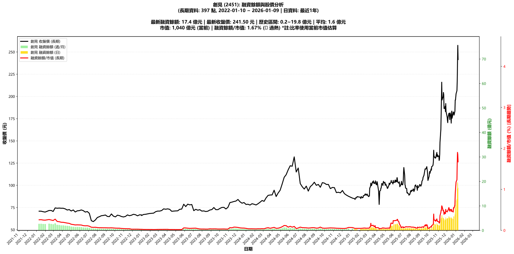

# :chart_with_upwards_trend: 創見 (2451) 融資餘額報告

!!! info "基本資訊"
    **:building_construction: 名稱**: 創見
    **:identification_card: 代號**: 2451
    **:calendar: 分析期間**: 2025-07-18 ~ 2026-01-09 (共 242 個交易日)
    **:clock3: 最新資料**: 2026-01-09
    **🕒 更新時間**: 2026-01-12 13:15:07 CST

## :moneybag: 融資餘額現況

| :chart: 指標 | :1234: 數值 | :traffic_light: 狀態 |
|:------------:|:----------:|:-------------------:|
| **最新融資餘額** | 17.4 億元 (7,200 張) | - |
| **最新收盤價** | 241.50 元 | - |
| **市值** | 1,040 億元 | - |
| **融資餘額/市值** | 1.67% | 🔴 過熱 |
| **日變化 (DoD)** | -1.9 億元 (-9.66%) | 📉 |
| **週變化 (WoW)** | +5.1 億元 (+41.39%) | 📈 |
| **月變化 (MoM)** | +12.4 億元 (+247.13%) | 📈 |

---

## :bar_chart: 歷史統計

| :chart: 指標 | :1234: 數值 |
|:------------:|:----------:|
| **歷史最高** | 19.8 億元 |
| **歷史最低** | 0.4 億元 |
| **平均值** | 2.1 億元 |
| **標準差** | 2.9 億元 |
| **當前相對位置** | 87.6% |

---

## :chart_with_upwards_trend: 融資餘額趨勢圖

    

---

## :clipboard: 詳細歷史記錄 (最近30日)

<table class="sortable-table">
<thead>
<tr>
<th markdown="span">:calendar: 日期</th>
<th markdown="span">:money_with_wings: 收盤價(元)</th>
<th markdown="span">:chart: 漲跌(元)</th>
<th markdown="span">:chart_with_upwards_trend: 漲跌(%)</th>
<th markdown="span">:package: 融資餘額(億元)</th>
<th markdown="span">:package: 融資餘額(張)</th>
<th markdown="span">:arrow_up_down: 融資增減(張)</th>
<th markdown="span">:chart: 融券餘額(張)</th>
<th markdown="span">:balance_scale: 券資比(%)</th>
</tr>
</thead>
<tbody>
<tr>
<td>2026-01-09</td>
<td>241.50</td>
<td>🔻 -16.00</td>
<td>-6.21%</td>
<td>17.4</td>
<td>7,200</td>
<td>📉 -275</td>
<td>214</td>
<td>2.97%</td>
</tr>
<tr>
<td>2026-01-08</td>
<td>257.50</td>
<td>🔺 +19.50</td>
<td>+8.19%</td>
<td>19.2</td>
<td>7,475</td>
<td>📉 -842</td>
<td>292</td>
<td>3.91%</td>
</tr>
<tr>
<td>2026-01-07</td>
<td>238.00</td>
<td>🔺 +21.50</td>
<td>+9.93%</td>
<td>19.8</td>
<td>8,317</td>
<td>📈 +490</td>
<td>263</td>
<td>3.16%</td>
</tr>
<tr>
<td>2026-01-06</td>
<td>216.50</td>
<td>🔺 +10.00</td>
<td>+4.84%</td>
<td>16.9</td>
<td>7,827</td>
<td>📈 +1,617</td>
<td>193</td>
<td>2.47%</td>
</tr>
<tr>
<td>2026-01-05</td>
<td>206.50</td>
<td>🔺 +3.50</td>
<td>+1.72%</td>
<td>12.8</td>
<td>6,210</td>
<td>📈 +152</td>
<td>175</td>
<td>2.82%</td>
</tr>
<tr>
<td>2026-01-02</td>
<td>203.00</td>
<td>🔺 +7.00</td>
<td>+3.57%</td>
<td>12.3</td>
<td>6,058</td>
<td>📈 +780</td>
<td>187</td>
<td>3.09%</td>
</tr>
<tr>
<td>2025-12-31</td>
<td>196.00</td>
<td>➖ +0.00</td>
<td>+0.00%</td>
<td>10.3</td>
<td>5,278</td>
<td>📈 +633</td>
<td>166</td>
<td>3.15%</td>
</tr>
<tr>
<td>2025-12-30</td>
<td>196.00</td>
<td>🔺 +12.50</td>
<td>+6.81%</td>
<td>9.1</td>
<td>4,645</td>
<td>📈 +1,114</td>
<td>188</td>
<td>4.05%</td>
</tr>
<tr>
<td>2025-12-29</td>
<td>183.50</td>
<td>🔺 +4.50</td>
<td>+2.51%</td>
<td>6.5</td>
<td>3,531</td>
<td>📈 +355</td>
<td>193</td>
<td>5.47%</td>
</tr>
<tr>
<td>2025-12-26</td>
<td>179.00</td>
<td>🔻 -3.50</td>
<td>-1.92%</td>
<td>5.7</td>
<td>3,176</td>
<td>📈 +25</td>
<td>150</td>
<td>4.72%</td>
</tr>
<tr>
<td>2025-12-24</td>
<td>182.50</td>
<td>➖ +0.00</td>
<td>+0.00%</td>
<td>5.8</td>
<td>3,151</td>
<td>📈 +601</td>
<td>157</td>
<td>4.98%</td>
</tr>
<tr>
<td>2025-12-23</td>
<td>182.50</td>
<td>🔺 +2.50</td>
<td>+1.39%</td>
<td>4.7</td>
<td>2,550</td>
<td>📉 -82</td>
<td>170</td>
<td>6.67%</td>
</tr>
<tr>
<td>2025-12-22</td>
<td>180.00</td>
<td>🔺 +4.50</td>
<td>+2.56%</td>
<td>4.7</td>
<td>2,632</td>
<td>📉 -167</td>
<td>160</td>
<td>6.08%</td>
</tr>
<tr>
<td>2025-12-19</td>
<td>175.50</td>
<td>🔻 -8.00</td>
<td>-4.36%</td>
<td>4.9</td>
<td>2,799</td>
<td>📈 +131</td>
<td>142</td>
<td>5.07%</td>
</tr>
<tr>
<td>2025-12-18</td>
<td>183.50</td>
<td>🔺 +3.00</td>
<td>+1.66%</td>
<td>4.9</td>
<td>2,668</td>
<td>📉 -289</td>
<td>239</td>
<td>8.96%</td>
</tr>
<tr>
<td>2025-12-17</td>
<td>180.50</td>
<td>🔺 +10.50</td>
<td>+6.18%</td>
<td>5.3</td>
<td>2,957</td>
<td>📈 +114</td>
<td>366</td>
<td>12.40%</td>
</tr>
<tr>
<td>2025-12-16</td>
<td>170.00</td>
<td>🔻 -7.50</td>
<td>-4.23%</td>
<td>4.8</td>
<td>2,843</td>
<td>📉 -78</td>
<td>301</td>
<td>10.60%</td>
</tr>
<tr>
<td>2025-12-15</td>
<td>177.50</td>
<td>🔻 -4.00</td>
<td>-2.20%</td>
<td>5.2</td>
<td>2,921</td>
<td>📉 -22</td>
<td>315</td>
<td>10.80%</td>
</tr>
<tr>
<td>2025-12-12</td>
<td>181.50</td>
<td>🔺 +7.50</td>
<td>+4.31%</td>
<td>5.3</td>
<td>2,943</td>
<td>📈 +138</td>
<td>321</td>
<td>10.90%</td>
</tr>
<tr>
<td>2025-12-11</td>
<td>174.00</td>
<td>🔻 -3.50</td>
<td>-1.97%</td>
<td>4.9</td>
<td>2,805</td>
<td>📉 -17</td>
<td>313</td>
<td>11.20%</td>
</tr>
<tr>
<td>2025-12-10</td>
<td>177.50</td>
<td>🔻 -3.50</td>
<td>-1.93%</td>
<td>5.0</td>
<td>2,822</td>
<td>📉 -218</td>
<td>397</td>
<td>14.10%</td>
</tr>
<tr>
<td>2025-12-09</td>
<td>181.00</td>
<td>➖ +0.00</td>
<td>+0.00%</td>
<td>5.5</td>
<td>3,040</td>
<td>📉 -162</td>
<td>412</td>
<td>13.60%</td>
</tr>
<tr>
<td>2025-12-08</td>
<td>181.00</td>
<td>🔺 +4.50</td>
<td>+2.55%</td>
<td>5.8</td>
<td>3,202</td>
<td>📈 +277</td>
<td>371</td>
<td>11.60%</td>
</tr>
<tr>
<td>2025-12-05</td>
<td>176.50</td>
<td>🔺 +6.00</td>
<td>+3.52%</td>
<td>5.2</td>
<td>2,925</td>
<td>📈 +27</td>
<td>391</td>
<td>13.40%</td>
</tr>
<tr>
<td>2025-12-04</td>
<td>170.50</td>
<td>🔻 -2.50</td>
<td>-1.45%</td>
<td>4.9</td>
<td>2,898</td>
<td>📈 +38</td>
<td>360</td>
<td>12.40%</td>
</tr>
<tr>
<td>2025-12-03</td>
<td>173.00</td>
<td>🔻 -3.50</td>
<td>-1.98%</td>
<td>4.9</td>
<td>2,860</td>
<td>📈 +209</td>
<td>220</td>
<td>7.69%</td>
</tr>
<tr>
<td>2025-12-02</td>
<td>176.50</td>
<td>🔻 -2.00</td>
<td>-1.12%</td>
<td>4.7</td>
<td>2,651</td>
<td>📉 -49</td>
<td>236</td>
<td>8.90%</td>
</tr>
<tr>
<td>2025-12-01</td>
<td>178.50</td>
<td>🔻 -4.50</td>
<td>-2.46%</td>
<td>4.8</td>
<td>2,700</td>
<td>📈 +55</td>
<td>234</td>
<td>8.67%</td>
</tr>
<tr>
<td>2025-11-28</td>
<td>183.00</td>
<td>🔻 -9.00</td>
<td>-4.69%</td>
<td>4.8</td>
<td>2,645</td>
<td>📉 -135</td>
<td>221</td>
<td>8.36%</td>
</tr>
<tr>
<td>2025-11-27</td>
<td>192.00</td>
<td>🔺 +9.00</td>
<td>+4.92%</td>
<td>5.3</td>
<td>2,780</td>
<td>📈 +442</td>
<td>255</td>
<td>9.17%</td>
</tr>
</tbody>
</table>

---

## :information_source: 資料來源與方法

!!! note "資料來源說明"
    - **主要來源**: `raw_margin_daily.csv` (Type 13: ShowMarginChart)
    - **資料頻率**: 每日更新
    - **資料範圍**: 近1年交易日資料

!!! info "報告元資訊"
    - **報告產生時間**: 2026-01-12 13:15:07
    - **分析期間**: 242 個交易日
    - **資料來源**: Stage 1 Raw Margin Daily Data

---

:material-information-outline: **本報告僅供參考，投資決策請審慎評估**

