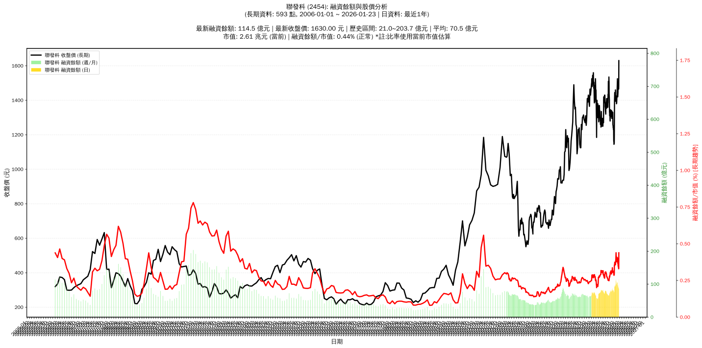

# :chart_with_upwards_trend: 聯發科 (2454) 融資餘額報告

!!! info "基本資訊"
    **:building_construction: 名稱**: 聯發科
    **:identification_card: 代號**: 2454
    **:calendar: 分析期間**: 2025-07-18 ~ 2026-01-09 (共 242 個交易日)
    **:clock3: 最新資料**: 2026-01-09
    **🕒 更新時間**: 2026-01-12 13:16:50 CST

## :moneybag: 融資餘額現況

| :chart: 指標 | :1234: 數值 | :traffic_light: 狀態 |
|:------------:|:----------:|:-------------------:|
| **最新融資餘額** | 95.8 億元 (6,746 張) | - |
| **最新收盤價** | 1420.00 元 | - |
| **市值** | 2.28 兆元 | - |
| **融資餘額/市值** | 0.42% | 🟡 正常 |
| **日變化 (DoD)** | -2.4 億元 (-2.42%) | 📉 |
| **週變化 (WoW)** | -8.8 億元 (-8.45%) | 📉 |
| **月變化 (MoM)** | -2.0 億元 (-2.01%) | 📉 |

---

## :bar_chart: 歷史統計

| :chart: 指標 | :1234: 數值 |
|:------------:|:----------:|
| **歷史最高** | 114.6 億元 |
| **歷史最低** | 52.5 億元 |
| **平均值** | 76.2 億元 |
| **標準差** | 11.5 億元 |
| **當前相對位置** | 69.7% |

---

## :chart_with_upwards_trend: 融資餘額趨勢圖

    

---

## :clipboard: 詳細歷史記錄 (最近30日)

<table class="sortable-table">
<thead>
<tr>
<th markdown="span">:calendar: 日期</th>
<th markdown="span">:money_with_wings: 收盤價(元)</th>
<th markdown="span">:chart: 漲跌(元)</th>
<th markdown="span">:chart_with_upwards_trend: 漲跌(%)</th>
<th markdown="span">:package: 融資餘額(億元)</th>
<th markdown="span">:package: 融資餘額(張)</th>
<th markdown="span">:arrow_up_down: 融資增減(張)</th>
<th markdown="span">:chart: 融券餘額(張)</th>
<th markdown="span">:balance_scale: 券資比(%)</th>
</tr>
</thead>
<tbody>
<tr>
<td>2026-01-09</td>
<td>1420.00</td>
<td>🔻 -25.00</td>
<td>-1.73%</td>
<td>95.8</td>
<td>6,746</td>
<td>📉 -48</td>
<td>21</td>
<td>0.31%</td>
</tr>
<tr>
<td>2026-01-08</td>
<td>1445.00</td>
<td>🔻 -45.00</td>
<td>-3.02%</td>
<td>98.2</td>
<td>6,794</td>
<td>📉 -83</td>
<td>9</td>
<td>0.13%</td>
</tr>
<tr>
<td>2026-01-07</td>
<td>1490.00</td>
<td>🔺 +5.00</td>
<td>+0.34%</td>
<td>102.5</td>
<td>6,877</td>
<td>📉 -172</td>
<td>22</td>
<td>0.32%</td>
</tr>
<tr>
<td>2026-01-06</td>
<td>1485.00</td>
<td>🔻 -10.00</td>
<td>-0.67%</td>
<td>104.7</td>
<td>7,049</td>
<td>📈 +122</td>
<td>14</td>
<td>0.20%</td>
</tr>
<tr>
<td>2026-01-05</td>
<td>1525.00</td>
<td>🔺 +55.00</td>
<td>+3.74%</td>
<td>105.6</td>
<td>6,927</td>
<td>📉 -191</td>
<td>0</td>
<td>0.00%</td>
</tr>
<tr>
<td>2026-01-02</td>
<td>1470.00</td>
<td>🔺 +40.00</td>
<td>+2.80%</td>
<td>104.6</td>
<td>7,118</td>
<td>📉 -329</td>
<td>0</td>
<td>0.00%</td>
</tr>
<tr>
<td>2025-12-31</td>
<td>1430.00</td>
<td>🔺 +10.00</td>
<td>+0.70%</td>
<td>106.5</td>
<td>7,447</td>
<td>📈 +35</td>
<td>0</td>
<td>0.00%</td>
</tr>
<tr>
<td>2025-12-30</td>
<td>1420.00</td>
<td>➖ +0.00</td>
<td>+0.00%</td>
<td>105.3</td>
<td>7,412</td>
<td>📈 +108</td>
<td>2</td>
<td>0.03%</td>
</tr>
<tr>
<td>2025-12-29</td>
<td>1420.00</td>
<td>🔺 +35.00</td>
<td>+2.53%</td>
<td>103.7</td>
<td>7,304</td>
<td>📈 +81</td>
<td>40</td>
<td>0.55%</td>
</tr>
<tr>
<td>2025-12-26</td>
<td>1385.00</td>
<td>🔺 +5.00</td>
<td>+0.36%</td>
<td>100.0</td>
<td>7,223</td>
<td>📈 +71</td>
<td>49</td>
<td>0.68%</td>
</tr>
<tr>
<td>2025-12-24</td>
<td>1380.00</td>
<td>🔻 -10.00</td>
<td>-0.72%</td>
<td>98.7</td>
<td>7,152</td>
<td>📈 +77</td>
<td>53</td>
<td>0.74%</td>
</tr>
<tr>
<td>2025-12-23</td>
<td>1390.00</td>
<td>🔻 -10.00</td>
<td>-0.71%</td>
<td>98.3</td>
<td>7,075</td>
<td>📉 -148</td>
<td>62</td>
<td>0.88%</td>
</tr>
<tr>
<td>2025-12-22</td>
<td>1400.00</td>
<td>🔻 -10.00</td>
<td>-0.71%</td>
<td>101.1</td>
<td>7,223</td>
<td>📉 -678</td>
<td>77</td>
<td>1.07%</td>
</tr>
<tr>
<td>2025-12-19</td>
<td>1410.00</td>
<td>🔻 -10.00</td>
<td>-0.70%</td>
<td>111.4</td>
<td>7,901</td>
<td>📉 -170</td>
<td>101</td>
<td>1.28%</td>
</tr>
<tr>
<td>2025-12-18</td>
<td>1420.00</td>
<td>🔻 -5.00</td>
<td>-0.35%</td>
<td>114.6</td>
<td>8,071</td>
<td>📈 +314</td>
<td>105</td>
<td>1.30%</td>
</tr>
<tr>
<td>2025-12-17</td>
<td>1425.00</td>
<td>🔺 +5.00</td>
<td>+0.35%</td>
<td>110.5</td>
<td>7,757</td>
<td>📈 +129</td>
<td>101</td>
<td>1.30%</td>
</tr>
<tr>
<td>2025-12-16</td>
<td>1420.00</td>
<td>➖ +0.00</td>
<td>+0.00%</td>
<td>108.3</td>
<td>7,628</td>
<td>📈 +430</td>
<td>104</td>
<td>1.36%</td>
</tr>
<tr>
<td>2025-12-15</td>
<td>1420.00</td>
<td>🔺 +15.00</td>
<td>+1.07%</td>
<td>102.2</td>
<td>7,198</td>
<td>📈 +157</td>
<td>104</td>
<td>1.44%</td>
</tr>
<tr>
<td>2025-12-12</td>
<td>1405.00</td>
<td>🔺 +10.00</td>
<td>+0.72%</td>
<td>98.9</td>
<td>7,041</td>
<td>📈 +331</td>
<td>104</td>
<td>1.48%</td>
</tr>
<tr>
<td>2025-12-11</td>
<td>1395.00</td>
<td>🔻 -65.00</td>
<td>-4.45%</td>
<td>93.6</td>
<td>6,710</td>
<td>📈 +14</td>
<td>97</td>
<td>1.45%</td>
</tr>
<tr>
<td>2025-12-10</td>
<td>1460.00</td>
<td>🔺 +40.00</td>
<td>+2.82%</td>
<td>97.8</td>
<td>6,696</td>
<td>📈 +144</td>
<td>99</td>
<td>1.48%</td>
</tr>
<tr>
<td>2025-12-09</td>
<td>1420.00</td>
<td>🔻 -20.00</td>
<td>-1.39%</td>
<td>93.0</td>
<td>6,552</td>
<td>📉 -6</td>
<td>74</td>
<td>1.13%</td>
</tr>
<tr>
<td>2025-12-08</td>
<td>1440.00</td>
<td>🔺 +15.00</td>
<td>+1.05%</td>
<td>94.4</td>
<td>6,558</td>
<td>📉 -140</td>
<td>76</td>
<td>1.16%</td>
</tr>
<tr>
<td>2025-12-05</td>
<td>1425.00</td>
<td>🔺 +20.00</td>
<td>+1.42%</td>
<td>95.4</td>
<td>6,698</td>
<td>📉 -29</td>
<td>77</td>
<td>1.15%</td>
</tr>
<tr>
<td>2025-12-04</td>
<td>1405.00</td>
<td>🔺 +5.00</td>
<td>+0.36%</td>
<td>94.5</td>
<td>6,727</td>
<td>📈 +93</td>
<td>73</td>
<td>1.09%</td>
</tr>
<tr>
<td>2025-12-03</td>
<td>1400.00</td>
<td>🔻 -15.00</td>
<td>-1.06%</td>
<td>92.9</td>
<td>6,634</td>
<td>📈 +49</td>
<td>77</td>
<td>1.16%</td>
</tr>
<tr>
<td>2025-12-02</td>
<td>1415.00</td>
<td>🔻 -30.00</td>
<td>-2.08%</td>
<td>93.2</td>
<td>6,585</td>
<td>📉 -173</td>
<td>91</td>
<td>1.38%</td>
</tr>
<tr>
<td>2025-12-01</td>
<td>1445.00</td>
<td>🔺 +50.00</td>
<td>+3.58%</td>
<td>97.7</td>
<td>6,758</td>
<td>📈 +228</td>
<td>141</td>
<td>2.09%</td>
</tr>
<tr>
<td>2025-11-28</td>
<td>1395.00</td>
<td>🔺 +55.00</td>
<td>+4.10%</td>
<td>91.1</td>
<td>6,530</td>
<td>📉 -416</td>
<td>85</td>
<td>1.30%</td>
</tr>
<tr>
<td>2025-11-27</td>
<td>1340.00</td>
<td>🔺 +40.00</td>
<td>+3.08%</td>
<td>93.1</td>
<td>6,946</td>
<td>📉 -164</td>
<td>70</td>
<td>1.01%</td>
</tr>
</tbody>
</table>

---

## :information_source: 資料來源與方法

!!! note "資料來源說明"
    - **主要來源**: `raw_margin_daily.csv` (Type 13: ShowMarginChart)
    - **資料頻率**: 每日更新
    - **資料範圍**: 近1年交易日資料

!!! info "報告元資訊"
    - **報告產生時間**: 2026-01-12 13:16:50
    - **分析期間**: 242 個交易日
    - **資料來源**: Stage 1 Raw Margin Daily Data

---

:material-information-outline: **本報告僅供參考，投資決策請審慎評估**

