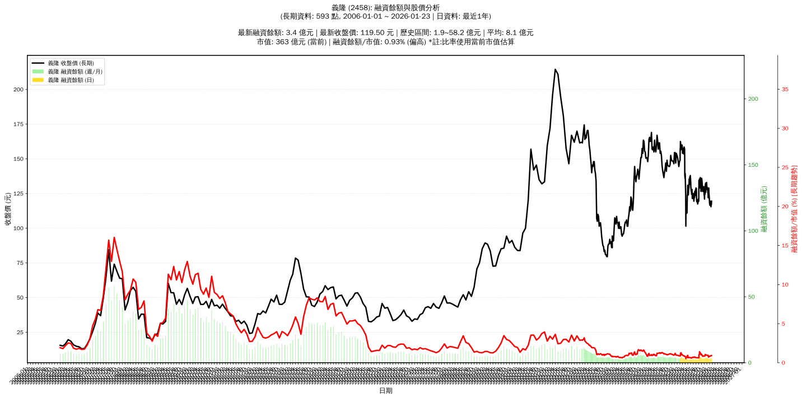

# :chart_with_upwards_trend: 義隆 (2458) 融資餘額報告

!!! info "基本資訊"
    **:building_construction: 名稱**: 義隆
    **:identification_card: 代號**: 2458
    **:calendar: 分析期間**: 2025-07-18 ~ 2026-01-09 (共 242 個交易日)
    **:clock3: 最新資料**: 2026-01-09
    **🕒 更新時間**: 2026-01-12 12:09:30 CST

## :moneybag: 融資餘額現況

| :chart: 指標 | :1234: 數值 | :traffic_light: 狀態 |
|:------------:|:----------:|:-------------------:|
| **最新融資餘額** | 3.1 億元 (2,627 張) | - |
| **最新收盤價** | 119.50 元 | - |
| **市值** | 363 億元 | - |
| **融資餘額/市值** | 0.86% | 🟠 偏高 |
| **日變化 (DoD)** | +0.1 億元 (+1.66%) | 📈 |
| **週變化 (WoW)** | +0.1 億元 (+1.93%) | 📈 |
| **月變化 (MoM)** | -0.3 億元 (-7.68%) | 📉 |

---

## :bar_chart: 歷史統計

| :chart: 指標 | :1234: 數值 |
|:------------:|:----------:|
| **歷史最高** | 5.1 億元 |
| **歷史最低** | 1.9 億元 |
| **平均值** | 3.0 億元 |
| **標準差** | 0.6 億元 |
| **當前相對位置** | 39.2% |

---

## :chart_with_upwards_trend: 融資餘額趨勢圖

    

---

## :clipboard: 詳細歷史記錄 (最近30日)

<table class="sortable-table">
<thead>
<tr>
<th>:calendar: 日期</th>
<th>:money_with_wings: 收盤價(元)</th>
<th>:chart: 漲跌(元)</th>
<th>:chart_with_upwards_trend: 漲跌(%)</th>
<th>:package: 融資餘額(億元)</th>
<th>:package: 融資餘額(張)</th>
<th>:arrow_up_down: 融資增減(張)</th>
<th>:chart: 融券餘額(張)</th>
<th>:balance_scale: 券資比(%)</th>
</tr>
</thead>
<tbody>
<tr>
<td>2026-01-09</td>
<td>119.50</td>
<td>🔺 +1.50</td>
<td>+1.27%</td>
<td>3.1</td>
<td>2,627</td>
<td>📈 +10</td>
<td>27</td>
<td>1.03%</td>
</tr>
<tr>
<td>2026-01-08</td>
<td>118.00</td>
<td>🔺 +0.50</td>
<td>+0.43%</td>
<td>3.1</td>
<td>2,617</td>
<td>📉 -49</td>
<td>31</td>
<td>1.18%</td>
</tr>
<tr>
<td>2026-01-07</td>
<td>117.50</td>
<td>🔺 +1.00</td>
<td>+0.86%</td>
<td>3.1</td>
<td>2,666</td>
<td>📈 +13</td>
<td>32</td>
<td>1.20%</td>
</tr>
<tr>
<td>2026-01-06</td>
<td>116.50</td>
<td>➖ +0.00</td>
<td>+0.00%</td>
<td>3.1</td>
<td>2,653</td>
<td>📈 +46</td>
<td>32</td>
<td>1.21%</td>
</tr>
<tr>
<td>2026-01-05</td>
<td>116.50</td>
<td>🔻 -1.00</td>
<td>-0.85%</td>
<td>3.0</td>
<td>2,607</td>
<td>📉 -14</td>
<td>32</td>
<td>1.23%</td>
</tr>
<tr>
<td>2026-01-02</td>
<td>117.50</td>
<td>🔻 -1.00</td>
<td>-0.84%</td>
<td>3.1</td>
<td>2,621</td>
<td>📈 +159</td>
<td>17</td>
<td>0.65%</td>
</tr>
<tr>
<td>2025-12-31</td>
<td>118.50</td>
<td>🔻 -1.00</td>
<td>-0.84%</td>
<td>2.9</td>
<td>2,462</td>
<td>📉 -12</td>
<td>18</td>
<td>0.73%</td>
</tr>
<tr>
<td>2025-12-30</td>
<td>119.50</td>
<td>🔻 -2.00</td>
<td>-1.65%</td>
<td>3.0</td>
<td>2,474</td>
<td>📉 -13</td>
<td>18</td>
<td>0.73%</td>
</tr>
<tr>
<td>2025-12-29</td>
<td>121.50</td>
<td>🔻 -3.00</td>
<td>-2.41%</td>
<td>3.0</td>
<td>2,487</td>
<td>📈 +129</td>
<td>23</td>
<td>0.92%</td>
</tr>
<tr>
<td>2025-12-26</td>
<td>124.50</td>
<td>🔻 -1.50</td>
<td>-1.19%</td>
<td>2.9</td>
<td>2,358</td>
<td>📈 +130</td>
<td>23</td>
<td>0.98%</td>
</tr>
<tr>
<td>2025-12-24</td>
<td>126.00</td>
<td>🔻 -3.00</td>
<td>-2.33%</td>
<td>2.8</td>
<td>2,228</td>
<td>📉 -6</td>
<td>24</td>
<td>1.08%</td>
</tr>
<tr>
<td>2025-12-23</td>
<td>129.00</td>
<td>🔺 +1.50</td>
<td>+1.18%</td>
<td>2.9</td>
<td>2,234</td>
<td>📈 +137</td>
<td>24</td>
<td>1.07%</td>
</tr>
<tr>
<td>2025-12-22</td>
<td>127.50</td>
<td>🔺 +2.00</td>
<td>+1.59%</td>
<td>2.7</td>
<td>2,097</td>
<td>📈 +9</td>
<td>23</td>
<td>1.10%</td>
</tr>
<tr>
<td>2025-12-19</td>
<td>125.50</td>
<td>🔻 -1.00</td>
<td>-0.79%</td>
<td>2.6</td>
<td>2,088</td>
<td>📈 +4</td>
<td>24</td>
<td>1.15%</td>
</tr>
<tr>
<td>2025-12-18</td>
<td>126.50</td>
<td>🔺 +3.00</td>
<td>+2.43%</td>
<td>2.6</td>
<td>2,084</td>
<td>📉 -376</td>
<td>25</td>
<td>1.20%</td>
</tr>
<tr>
<td>2025-12-17</td>
<td>123.50</td>
<td>🔺 +1.50</td>
<td>+1.23%</td>
<td>3.0</td>
<td>2,460</td>
<td>📉 -268</td>
<td>20</td>
<td>0.81%</td>
</tr>
<tr>
<td>2025-12-16</td>
<td>122.00</td>
<td>🔻 -3.50</td>
<td>-2.79%</td>
<td>3.3</td>
<td>2,728</td>
<td>📉 -2</td>
<td>22</td>
<td>0.81%</td>
</tr>
<tr>
<td>2025-12-15</td>
<td>125.50</td>
<td>➖ +0.00</td>
<td>+0.00%</td>
<td>3.4</td>
<td>2,730</td>
<td>📈 +8</td>
<td>25</td>
<td>0.92%</td>
</tr>
<tr>
<td>2025-12-12</td>
<td>125.50</td>
<td>🔻 -2.50</td>
<td>-1.95%</td>
<td>3.4</td>
<td>2,722</td>
<td>📈 +64</td>
<td>25</td>
<td>0.92%</td>
</tr>
<tr>
<td>2025-12-11</td>
<td>128.00</td>
<td>🔻 -1.00</td>
<td>-0.78%</td>
<td>3.4</td>
<td>2,658</td>
<td>📈 +22</td>
<td>30</td>
<td>1.13%</td>
</tr>
<tr>
<td>2025-12-10</td>
<td>129.00</td>
<td>🔺 +1.50</td>
<td>+1.18%</td>
<td>3.4</td>
<td>2,636</td>
<td>📉 -1</td>
<td>27</td>
<td>1.02%</td>
</tr>
<tr>
<td>2025-12-09</td>
<td>127.50</td>
<td>🔻 -1.00</td>
<td>-0.78%</td>
<td>3.4</td>
<td>2,637</td>
<td>📉 -11</td>
<td>23</td>
<td>0.87%</td>
</tr>
<tr>
<td>2025-12-08</td>
<td>128.50</td>
<td>➖ +0.00</td>
<td>+0.00%</td>
<td>3.4</td>
<td>2,648</td>
<td>📈 +9</td>
<td>23</td>
<td>0.87%</td>
</tr>
<tr>
<td>2025-12-05</td>
<td>128.50</td>
<td>🔻 -1.00</td>
<td>-0.77%</td>
<td>3.4</td>
<td>2,639</td>
<td>📉 -44</td>
<td>20</td>
<td>0.76%</td>
</tr>
<tr>
<td>2025-12-04</td>
<td>129.50</td>
<td>➖ +0.00</td>
<td>+0.00%</td>
<td>3.5</td>
<td>2,683</td>
<td>📉 -29</td>
<td>18</td>
<td>0.67%</td>
</tr>
<tr>
<td>2025-12-03</td>
<td>129.50</td>
<td>🔻 -0.50</td>
<td>-0.38%</td>
<td>3.5</td>
<td>2,712</td>
<td>📈 +32</td>
<td>17</td>
<td>0.63%</td>
</tr>
<tr>
<td>2025-12-02</td>
<td>130.00</td>
<td>➖ +0.00</td>
<td>+0.00%</td>
<td>3.5</td>
<td>2,680</td>
<td>📉 -30</td>
<td>20</td>
<td>0.75%</td>
</tr>
<tr>
<td>2025-12-01</td>
<td>130.00</td>
<td>🔻 -3.00</td>
<td>-2.26%</td>
<td>3.5</td>
<td>2,710</td>
<td>📈 +12</td>
<td>19</td>
<td>0.70%</td>
</tr>
<tr>
<td>2025-11-28</td>
<td>133.00</td>
<td>🔺 +2.00</td>
<td>+1.53%</td>
<td>3.6</td>
<td>2,698</td>
<td>📉 -59</td>
<td>19</td>
<td>0.70%</td>
</tr>
<tr>
<td>2025-11-27</td>
<td>131.00</td>
<td>🔻 -0.50</td>
<td>-0.38%</td>
<td>3.6</td>
<td>2,757</td>
<td>📈 +6</td>
<td>15</td>
<td>0.54%</td>
</tr>
</tbody>
</table>

---

## :information_source: 資料來源與方法

!!! note "資料來源說明"
    - **主要來源**: `raw_margin_daily.csv` (Type 13: ShowMarginChart)
    - **資料頻率**: 每日更新
    - **資料範圍**: 近1年交易日資料

!!! info "報告元資訊"
    - **報告產生時間**: 2026-01-12 12:09:30
    - **分析期間**: 242 個交易日
    - **資料來源**: Stage 1 Raw Margin Daily Data

---

:material-information-outline: **本報告僅供參考，投資決策請審慎評估**

