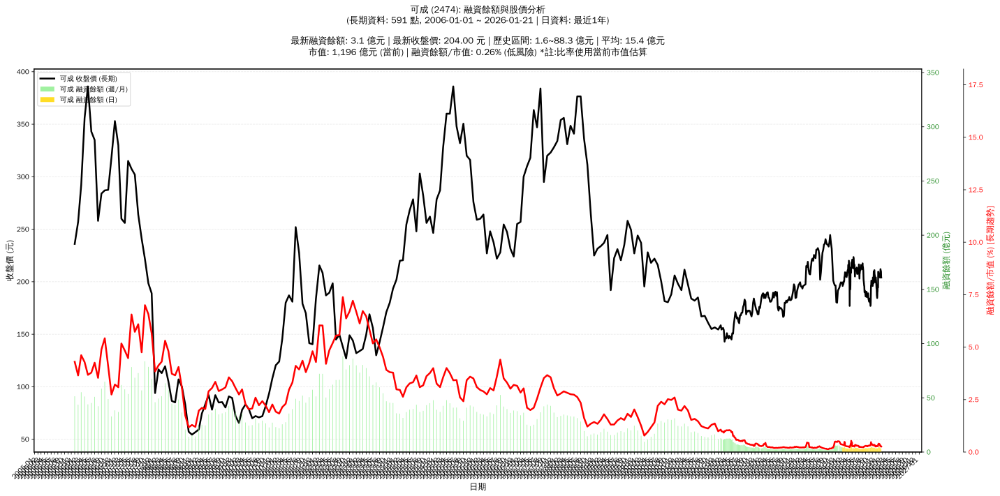

# :chart_with_upwards_trend: 可成 (2474) 融資餘額報告

!!! info "基本資訊"
    **:building_construction: 名稱**: 可成
    **:identification_card: 代號**: 2474
    **:calendar: 分析期間**: 2025-07-18 ~ 2026-01-09 (共 242 個交易日)
    **:clock3: 最新資料**: 2026-01-09
    **🕒 更新時間**: 2026-01-12 13:16:55 CST

## :moneybag: 融資餘額現況

| :chart: 指標 | :1234: 數值 | :traffic_light: 狀態 |
|:------------:|:----------:|:-------------------:|
| **最新融資餘額** | 3.9 億元 (1,912 張) | - |
| **最新收盤價** | 204.00 元 | - |
| **市值** | 1,272 億元 | - |
| **融資餘額/市值** | 0.31% | 🟡 正常 |
| **日變化 (DoD)** | -0.1 億元 (-2.41%) | 📉 |
| **週變化 (WoW)** | -0.8 億元 (-16.86%) | 📉 |
| **月變化 (MoM)** | +0.4 億元 (+12.38%) | 📈 |

---

## :bar_chart: 歷史統計

| :chart: 指標 | :1234: 數值 |
|:------------:|:----------:|
| **歷史最高** | 6.4 億元 |
| **歷史最低** | 2.7 億元 |
| **平均值** | 3.7 億元 |
| **標準差** | 0.7 億元 |
| **當前相對位置** | 32.4% |

---

## :chart_with_upwards_trend: 融資餘額趨勢圖

    

---

## :clipboard: 詳細歷史記錄 (最近30日)

<table class="sortable-table">
<thead>
<tr>
<th markdown="span">:calendar: 日期</th>
<th markdown="span">:money_with_wings: 收盤價(元)</th>
<th markdown="span">:chart: 漲跌(元)</th>
<th markdown="span">:chart_with_upwards_trend: 漲跌(%)</th>
<th markdown="span">:package: 融資餘額(億元)</th>
<th markdown="span">:package: 融資餘額(張)</th>
<th markdown="span">:arrow_up_down: 融資增減(張)</th>
<th markdown="span">:chart: 融券餘額(張)</th>
<th markdown="span">:balance_scale: 券資比(%)</th>
</tr>
</thead>
<tbody>
<tr>
<td>2026-01-09</td>
<td>204.00</td>
<td>🔻 -1.50</td>
<td>-0.73%</td>
<td>3.9</td>
<td>1,912</td>
<td>📉 -33</td>
<td>8</td>
<td>0.42%</td>
</tr>
<tr>
<td>2026-01-08</td>
<td>205.50</td>
<td>🔻 -2.00</td>
<td>-0.96%</td>
<td>4.0</td>
<td>1,945</td>
<td>📉 -69</td>
<td>16</td>
<td>0.82%</td>
</tr>
<tr>
<td>2026-01-07</td>
<td>207.50</td>
<td>🔺 +2.00</td>
<td>+0.97%</td>
<td>4.2</td>
<td>2,014</td>
<td>📉 -99</td>
<td>8</td>
<td>0.40%</td>
</tr>
<tr>
<td>2026-01-06</td>
<td>205.50</td>
<td>🔻 -1.00</td>
<td>-0.48%</td>
<td>4.3</td>
<td>2,113</td>
<td>📉 -79</td>
<td>8</td>
<td>0.38%</td>
</tr>
<tr>
<td>2026-01-05</td>
<td>206.50</td>
<td>🔺 +1.00</td>
<td>+0.49%</td>
<td>4.5</td>
<td>2,192</td>
<td>📉 -91</td>
<td>7</td>
<td>0.32%</td>
</tr>
<tr>
<td>2026-01-02</td>
<td>205.50</td>
<td>🔻 -2.50</td>
<td>-1.20%</td>
<td>4.7</td>
<td>2,283</td>
<td>📈 +111</td>
<td>7</td>
<td>0.31%</td>
</tr>
<tr>
<td>2025-12-31</td>
<td>208.00</td>
<td>🔺 +0.50</td>
<td>+0.24%</td>
<td>4.5</td>
<td>2,172</td>
<td>📉 -35</td>
<td>8</td>
<td>0.37%</td>
</tr>
<tr>
<td>2025-12-30</td>
<td>207.50</td>
<td>🔺 +1.50</td>
<td>+0.73%</td>
<td>4.6</td>
<td>2,207</td>
<td>📉 -119</td>
<td>9</td>
<td>0.41%</td>
</tr>
<tr>
<td>2025-12-29</td>
<td>206.00</td>
<td>🔻 -3.50</td>
<td>-1.67%</td>
<td>4.8</td>
<td>2,326</td>
<td>📈 +209</td>
<td>8</td>
<td>0.34%</td>
</tr>
<tr>
<td>2025-12-26</td>
<td>209.50</td>
<td>➖ +0.00</td>
<td>+0.00%</td>
<td>4.4</td>
<td>2,117</td>
<td>📈 +38</td>
<td>80</td>
<td>3.78%</td>
</tr>
<tr>
<td>2025-12-24</td>
<td>209.50</td>
<td>🔺 +15.00</td>
<td>+7.71%</td>
<td>4.4</td>
<td>2,079</td>
<td>📈 +135</td>
<td>13</td>
<td>0.63%</td>
</tr>
<tr>
<td>2025-12-23</td>
<td>194.50</td>
<td>🔺 +0.50</td>
<td>+0.26%</td>
<td>3.8</td>
<td>1,944</td>
<td>📈 +239</td>
<td>3</td>
<td>0.15%</td>
</tr>
<tr>
<td>2025-12-22</td>
<td>197.00</td>
<td>🔺 +3.00</td>
<td>+1.55%</td>
<td>3.4</td>
<td>1,705</td>
<td>📉 -27</td>
<td>0</td>
<td>0.00%</td>
</tr>
<tr>
<td>2025-12-19</td>
<td>194.00</td>
<td>🔺 +3.50</td>
<td>+1.84%</td>
<td>3.4</td>
<td>1,732</td>
<td>📉 -7</td>
<td>0</td>
<td>0.00%</td>
</tr>
<tr>
<td>2025-12-18</td>
<td>190.50</td>
<td>➖ +0.00</td>
<td>+0.00%</td>
<td>3.3</td>
<td>1,739</td>
<td>📉 -12</td>
<td>0</td>
<td>0.00%</td>
</tr>
<tr>
<td>2025-12-17</td>
<td>190.50</td>
<td>🔺 +4.00</td>
<td>+2.14%</td>
<td>3.3</td>
<td>1,751</td>
<td>📉 -36</td>
<td>0</td>
<td>0.00%</td>
</tr>
<tr>
<td>2025-12-16</td>
<td>186.50</td>
<td>🔺 +2.00</td>
<td>+1.08%</td>
<td>3.3</td>
<td>1,787</td>
<td>📉 -16</td>
<td>12</td>
<td>0.67%</td>
</tr>
<tr>
<td>2025-12-15</td>
<td>184.50</td>
<td>🔻 -2.50</td>
<td>-1.34%</td>
<td>3.3</td>
<td>1,803</td>
<td>📈 +7</td>
<td>20</td>
<td>1.11%</td>
</tr>
<tr>
<td>2025-12-12</td>
<td>187.00</td>
<td>🔻 -2.00</td>
<td>-1.06%</td>
<td>3.4</td>
<td>1,796</td>
<td>📈 +49</td>
<td>23</td>
<td>1.28%</td>
</tr>
<tr>
<td>2025-12-11</td>
<td>189.00</td>
<td>🔻 -5.00</td>
<td>-2.58%</td>
<td>3.3</td>
<td>1,747</td>
<td>📉 -42</td>
<td>23</td>
<td>1.32%</td>
</tr>
<tr>
<td>2025-12-10</td>
<td>194.00</td>
<td>🔺 +0.50</td>
<td>+0.26%</td>
<td>3.5</td>
<td>1,789</td>
<td>📉 -26</td>
<td>20</td>
<td>1.12%</td>
</tr>
<tr>
<td>2025-12-09</td>
<td>193.50</td>
<td>🔻 -2.00</td>
<td>-1.02%</td>
<td>3.5</td>
<td>1,815</td>
<td>📈 +2</td>
<td>12</td>
<td>0.66%</td>
</tr>
<tr>
<td>2025-12-08</td>
<td>195.50</td>
<td>🔻 -6.00</td>
<td>-2.98%</td>
<td>3.5</td>
<td>1,813</td>
<td>📈 +181</td>
<td>7</td>
<td>0.39%</td>
</tr>
<tr>
<td>2025-12-05</td>
<td>201.50</td>
<td>🔻 -0.50</td>
<td>-0.25%</td>
<td>3.3</td>
<td>1,632</td>
<td>📈 +66</td>
<td>8</td>
<td>0.49%</td>
</tr>
<tr>
<td>2025-12-04</td>
<td>202.00</td>
<td>🔻 -2.00</td>
<td>-0.98%</td>
<td>3.2</td>
<td>1,566</td>
<td>📈 +24</td>
<td>12</td>
<td>0.77%</td>
</tr>
<tr>
<td>2025-12-03</td>
<td>204.00</td>
<td>🔺 +4.00</td>
<td>+2.00%</td>
<td>3.1</td>
<td>1,542</td>
<td>📉 -27</td>
<td>22</td>
<td>1.43%</td>
</tr>
<tr>
<td>2025-12-02</td>
<td>200.00</td>
<td>🔻 -1.50</td>
<td>-0.74%</td>
<td>3.1</td>
<td>1,569</td>
<td>📈 +3</td>
<td>11</td>
<td>0.70%</td>
</tr>
<tr>
<td>2025-12-01</td>
<td>201.50</td>
<td>🔺 +0.50</td>
<td>+0.25%</td>
<td>3.2</td>
<td>1,566</td>
<td>📉 -102</td>
<td>14</td>
<td>0.89%</td>
</tr>
<tr>
<td>2025-11-28</td>
<td>201.00</td>
<td>🔻 -0.50</td>
<td>-0.25%</td>
<td>3.4</td>
<td>1,668</td>
<td>📉 -33</td>
<td>15</td>
<td>0.90%</td>
</tr>
<tr>
<td>2025-11-27</td>
<td>201.50</td>
<td>🔺 +2.00</td>
<td>+1.00%</td>
<td>3.4</td>
<td>1,701</td>
<td>📉 -3</td>
<td>20</td>
<td>1.18%</td>
</tr>
</tbody>
</table>

---

## :information_source: 資料來源與方法

!!! note "資料來源說明"
    - **主要來源**: `raw_margin_daily.csv` (Type 13: ShowMarginChart)
    - **資料頻率**: 每日更新
    - **資料範圍**: 近1年交易日資料

!!! info "報告元資訊"
    - **報告產生時間**: 2026-01-12 13:16:55
    - **分析期間**: 242 個交易日
    - **資料來源**: Stage 1 Raw Margin Daily Data

---

:material-information-outline: **本報告僅供參考，投資決策請審慎評估**

