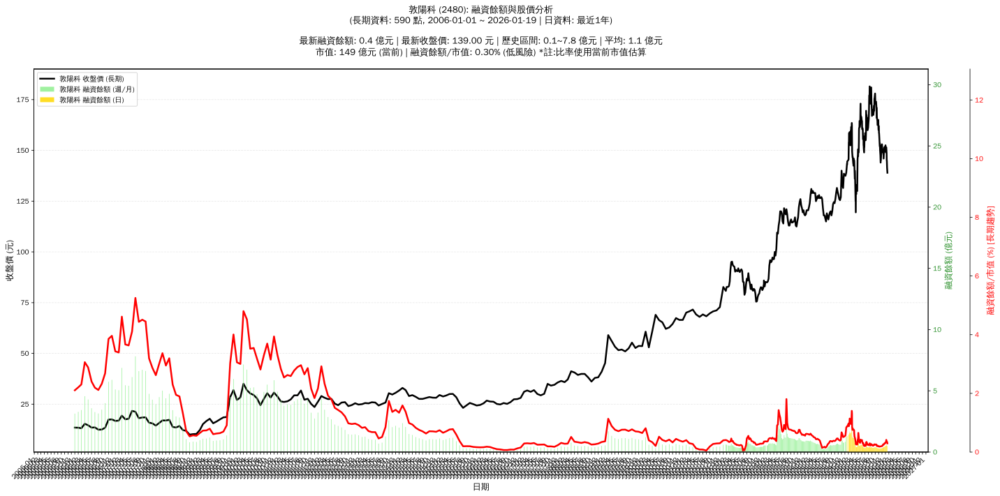

# :chart_with_upwards_trend: 敦陽科 (2480) 融資餘額報告

!!! info "基本資訊"
    **:building_construction: 名稱**: 敦陽科
    **:identification_card: 代號**: 2480
    **:calendar: 分析期間**: 2025-07-18 ~ 2026-01-09 (共 242 個交易日)
    **:clock3: 最新資料**: 2026-01-09
    **🕒 更新時間**: 2026-01-12 13:16:07 CST

## :moneybag: 融資餘額現況

| :chart: 指標 | :1234: 數值 | :traffic_light: 狀態 |
|:------------:|:----------:|:-------------------:|
| **最新融資餘額** | 0.6 億元 (407 張) | - |
| **最新收盤價** | 151.50 元 | - |
| **市值** | 161 億元 | - |
| **融資餘額/市值** | 0.38% | 🟡 正常 |
| **日變化 (DoD)** | +0.0 億元 (+6.03%) | 📈 |
| **週變化 (WoW)** | +0.1 億元 (+27.55%) | 📈 |
| **月變化 (MoM)** | +0.3 億元 (+72.57%) | 📈 |

---

## :bar_chart: 歷史統計

| :chart: 指標 | :1234: 數值 |
|:------------:|:----------:|
| **歷史最高** | 2.1 億元 |
| **歷史最低** | 0.3 億元 |
| **平均值** | 0.6 億元 |
| **標準差** | 0.4 億元 |
| **當前相對位置** | 18.8% |

---

## :chart_with_upwards_trend: 融資餘額趨勢圖

    

---

## :clipboard: 詳細歷史記錄 (最近30日)

<table class="sortable-table">
<thead>
<tr>
<th markdown="span">:calendar: 日期</th>
<th markdown="span">:money_with_wings: 收盤價(元)</th>
<th markdown="span">:chart: 漲跌(元)</th>
<th markdown="span">:chart_with_upwards_trend: 漲跌(%)</th>
<th markdown="span">:package: 融資餘額(億元)</th>
<th markdown="span">:package: 融資餘額(張)</th>
<th markdown="span">:arrow_up_down: 融資增減(張)</th>
<th markdown="span">:chart: 融券餘額(張)</th>
<th markdown="span">:balance_scale: 券資比(%)</th>
</tr>
</thead>
<tbody>
<tr>
<td>2026-01-09</td>
<td>151.50</td>
<td>🔺 +2.00</td>
<td>+1.34%</td>
<td>0.6</td>
<td>407</td>
<td>📈 +18</td>
<td>0</td>
<td>0.00%</td>
</tr>
<tr>
<td>2026-01-08</td>
<td>149.50</td>
<td>🔺 +0.50</td>
<td>+0.34%</td>
<td>0.6</td>
<td>389</td>
<td>📈 +30</td>
<td>0</td>
<td>0.00%</td>
</tr>
<tr>
<td>2026-01-07</td>
<td>149.00</td>
<td>🔻 -1.00</td>
<td>-0.67%</td>
<td>0.5</td>
<td>359</td>
<td>📈 +18</td>
<td>0</td>
<td>0.00%</td>
</tr>
<tr>
<td>2026-01-06</td>
<td>150.00</td>
<td>🔺 +1.00</td>
<td>+0.67%</td>
<td>0.5</td>
<td>341</td>
<td>📈 +13</td>
<td>0</td>
<td>0.00%</td>
</tr>
<tr>
<td>2026-01-05</td>
<td>149.00</td>
<td>🔻 -3.50</td>
<td>-2.30%</td>
<td>0.5</td>
<td>328</td>
<td>📈 +11</td>
<td>0</td>
<td>0.00%</td>
</tr>
<tr>
<td>2026-01-02</td>
<td>152.50</td>
<td>🔺 +1.50</td>
<td>+0.99%</td>
<td>0.5</td>
<td>317</td>
<td>📉 -3</td>
<td>0</td>
<td>0.00%</td>
</tr>
<tr>
<td>2025-12-31</td>
<td>151.00</td>
<td>🔻 -1.00</td>
<td>-0.66%</td>
<td>0.5</td>
<td>320</td>
<td>📈 +19</td>
<td>3</td>
<td>0.94%</td>
</tr>
<tr>
<td>2025-12-30</td>
<td>152.00</td>
<td>➖ +0.00</td>
<td>+0.00%</td>
<td>0.5</td>
<td>301</td>
<td>📈 +13</td>
<td>4</td>
<td>1.33%</td>
</tr>
<tr>
<td>2025-12-29</td>
<td>152.00</td>
<td>🔺 +2.50</td>
<td>+1.67%</td>
<td>0.4</td>
<td>288</td>
<td>➡️ +0</td>
<td>3</td>
<td>1.04%</td>
</tr>
<tr>
<td>2025-12-26</td>
<td>149.50</td>
<td>🔻 -1.00</td>
<td>-0.66%</td>
<td>0.4</td>
<td>288</td>
<td>📉 -6</td>
<td>3</td>
<td>1.04%</td>
</tr>
<tr>
<td>2025-12-24</td>
<td>150.50</td>
<td>🔻 -0.50</td>
<td>-0.33%</td>
<td>0.4</td>
<td>294</td>
<td>📈 +11</td>
<td>3</td>
<td>1.02%</td>
</tr>
<tr>
<td>2025-12-23</td>
<td>151.00</td>
<td>🔻 -0.50</td>
<td>-0.33%</td>
<td>0.4</td>
<td>283</td>
<td>📈 +2</td>
<td>3</td>
<td>1.06%</td>
</tr>
<tr>
<td>2025-12-22</td>
<td>151.50</td>
<td>🔺 +1.50</td>
<td>+1.00%</td>
<td>0.4</td>
<td>281</td>
<td>📈 +15</td>
<td>3</td>
<td>1.07%</td>
</tr>
<tr>
<td>2025-12-19</td>
<td>150.00</td>
<td>🔺 +1.50</td>
<td>+1.01%</td>
<td>0.4</td>
<td>266</td>
<td>📈 +5</td>
<td>3</td>
<td>1.13%</td>
</tr>
<tr>
<td>2025-12-18</td>
<td>148.50</td>
<td>🔺 +1.50</td>
<td>+1.02%</td>
<td>0.4</td>
<td>261</td>
<td>📈 +2</td>
<td>3</td>
<td>1.15%</td>
</tr>
<tr>
<td>2025-12-17</td>
<td>147.00</td>
<td>🔺 +1.00</td>
<td>+0.68%</td>
<td>0.4</td>
<td>259</td>
<td>📉 -6</td>
<td>3</td>
<td>1.16%</td>
</tr>
<tr>
<td>2025-12-16</td>
<td>146.00</td>
<td>🔻 -3.00</td>
<td>-2.01%</td>
<td>0.4</td>
<td>265</td>
<td>📉 -1</td>
<td>3</td>
<td>1.13%</td>
</tr>
<tr>
<td>2025-12-15</td>
<td>149.00</td>
<td>🔻 -1.50</td>
<td>-1.00%</td>
<td>0.4</td>
<td>266</td>
<td>📈 +9</td>
<td>3</td>
<td>1.13%</td>
</tr>
<tr>
<td>2025-12-12</td>
<td>150.50</td>
<td>➖ +0.00</td>
<td>+0.00%</td>
<td>0.4</td>
<td>257</td>
<td>➡️ +0</td>
<td>3</td>
<td>1.17%</td>
</tr>
<tr>
<td>2025-12-11</td>
<td>150.50</td>
<td>🔺 +1.00</td>
<td>+0.67%</td>
<td>0.4</td>
<td>257</td>
<td>📈 +18</td>
<td>3</td>
<td>1.17%</td>
</tr>
<tr>
<td>2025-12-10</td>
<td>149.50</td>
<td>🔺 +0.50</td>
<td>+0.34%</td>
<td>0.4</td>
<td>239</td>
<td>📈 +10</td>
<td>3</td>
<td>1.26%</td>
</tr>
<tr>
<td>2025-12-09</td>
<td>149.00</td>
<td>🔻 -1.00</td>
<td>-0.67%</td>
<td>0.3</td>
<td>229</td>
<td>📈 +8</td>
<td>3</td>
<td>1.31%</td>
</tr>
<tr>
<td>2025-12-08</td>
<td>150.00</td>
<td>🔻 -0.50</td>
<td>-0.33%</td>
<td>0.3</td>
<td>221</td>
<td>📈 +3</td>
<td>3</td>
<td>1.36%</td>
</tr>
<tr>
<td>2025-12-05</td>
<td>150.50</td>
<td>➖ +0.00</td>
<td>+0.00%</td>
<td>0.3</td>
<td>218</td>
<td>📈 +1</td>
<td>3</td>
<td>1.38%</td>
</tr>
<tr>
<td>2025-12-04</td>
<td>150.50</td>
<td>🔻 -0.50</td>
<td>-0.33%</td>
<td>0.3</td>
<td>217</td>
<td>➡️ +0</td>
<td>3</td>
<td>1.38%</td>
</tr>
<tr>
<td>2025-12-03</td>
<td>151.00</td>
<td>🔻 -1.50</td>
<td>-0.98%</td>
<td>0.3</td>
<td>217</td>
<td>📈 +13</td>
<td>3</td>
<td>1.38%</td>
</tr>
<tr>
<td>2025-12-02</td>
<td>152.50</td>
<td>🔻 -0.50</td>
<td>-0.33%</td>
<td>0.3</td>
<td>204</td>
<td>📈 +7</td>
<td>3</td>
<td>1.47%</td>
</tr>
<tr>
<td>2025-12-01</td>
<td>153.00</td>
<td>🔺 +0.50</td>
<td>+0.33%</td>
<td>0.3</td>
<td>197</td>
<td>📈 +1</td>
<td>3</td>
<td>1.52%</td>
</tr>
<tr>
<td>2025-11-28</td>
<td>152.50</td>
<td>🔺 +2.00</td>
<td>+1.33%</td>
<td>0.3</td>
<td>196</td>
<td>📉 -3</td>
<td>3</td>
<td>1.53%</td>
</tr>
<tr>
<td>2025-11-27</td>
<td>150.50</td>
<td>🔺 +1.50</td>
<td>+1.01%</td>
<td>0.3</td>
<td>199</td>
<td>➡️ +0</td>
<td>3</td>
<td>1.51%</td>
</tr>
</tbody>
</table>

---

## :information_source: 資料來源與方法

!!! note "資料來源說明"
    - **主要來源**: `raw_margin_daily.csv` (Type 13: ShowMarginChart)
    - **資料頻率**: 每日更新
    - **資料範圍**: 近1年交易日資料

!!! info "報告元資訊"
    - **報告產生時間**: 2026-01-12 13:16:07
    - **分析期間**: 242 個交易日
    - **資料來源**: Stage 1 Raw Margin Daily Data

---

:material-information-outline: **本報告僅供參考，投資決策請審慎評估**

