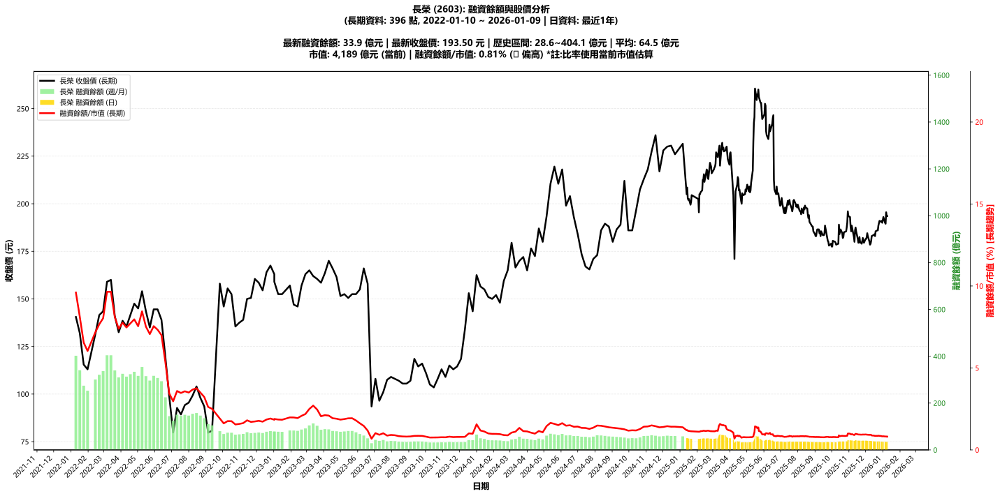

# :chart_with_upwards_trend: 長榮 (2603) 融資餘額報告

!!! info "基本資訊"
    **:building_construction: 名稱**: 長榮
    **:identification_card: 代號**: 2603
    **:calendar: 分析期間**: 2025-07-18 ~ 2026-01-09 (共 242 個交易日)
    **:clock3: 最新資料**: 2026-01-09
    **🕒 更新時間**: 2026-01-12 12:08:52 CST

## :moneybag: 融資餘額現況

| :chart: 指標 | :1234: 數值 | :traffic_light: 狀態 |
|:------------:|:----------:|:-------------------:|
| **最新融資餘額** | 33.9 億元 (17,538 張) | - |
| **最新收盤價** | 193.50 元 | - |
| **市值** | 4,189 億元 | - |
| **融資餘額/市值** | 0.81% | 🟠 偏高 |
| **日變化 (DoD)** | +0.1 億元 (+0.34%) | 📈 |
| **週變化 (WoW)** | -0.9 億元 (-2.66%) | 📉 |
| **月變化 (MoM)** | -4.5 億元 (-11.75%) | 📉 |

---

## :bar_chart: 歷史統計

| :chart: 指標 | :1234: 數值 |
|:------------:|:----------:|
| **歷史最高** | 66.2 億元 |
| **歷史最低** | 29.1 億元 |
| **平均值** | 39.6 億元 |
| **標準差** | 7.9 億元 |
| **當前相對位置** | 13.1% |

---

## :chart_with_upwards_trend: 融資餘額趨勢圖

    

---

## :clipboard: 詳細歷史記錄 (最近30日)

<table class="sortable-table">
<thead>
<tr>
<th>:calendar: 日期</th>
<th>:money_with_wings: 收盤價(元)</th>
<th>:chart: 漲跌(元)</th>
<th>:chart_with_upwards_trend: 漲跌(%)</th>
<th>:package: 融資餘額(億元)</th>
<th>:package: 融資餘額(張)</th>
<th>:arrow_up_down: 融資增減(張)</th>
<th>:chart: 融券餘額(張)</th>
<th>:balance_scale: 券資比(%)</th>
</tr>
</thead>
<tbody>
<tr>
<td>2026-01-09</td>
<td>193.50</td>
<td>➖ +0.00</td>
<td>+0.00%</td>
<td>33.9</td>
<td>17,538</td>
<td>📈 +59</td>
<td>333</td>
<td>1.90%</td>
</tr>
<tr>
<td>2026-01-08</td>
<td>193.50</td>
<td>🔻 -2.00</td>
<td>-1.02%</td>
<td>33.8</td>
<td>17,479</td>
<td>📉 -139</td>
<td>318</td>
<td>1.82%</td>
</tr>
<tr>
<td>2026-01-07</td>
<td>195.50</td>
<td>🔺 +6.00</td>
<td>+3.17%</td>
<td>34.4</td>
<td>17,618</td>
<td>📉 -398</td>
<td>320</td>
<td>1.82%</td>
</tr>
<tr>
<td>2026-01-06</td>
<td>189.50</td>
<td>🔻 -0.50</td>
<td>-0.26%</td>
<td>34.1</td>
<td>18,016</td>
<td>📉 -67</td>
<td>303</td>
<td>1.68%</td>
</tr>
<tr>
<td>2026-01-05</td>
<td>190.00</td>
<td>🔻 -3.00</td>
<td>-1.55%</td>
<td>34.4</td>
<td>18,083</td>
<td>📈 +19</td>
<td>310</td>
<td>1.71%</td>
</tr>
<tr>
<td>2026-01-02</td>
<td>193.00</td>
<td>🔺 +3.00</td>
<td>+1.58%</td>
<td>34.9</td>
<td>18,064</td>
<td>📉 -195</td>
<td>340</td>
<td>1.88%</td>
</tr>
<tr>
<td>2025-12-31</td>
<td>190.00</td>
<td>🔻 -1.00</td>
<td>-0.52%</td>
<td>34.7</td>
<td>18,259</td>
<td>📉 -35</td>
<td>359</td>
<td>1.97%</td>
</tr>
<tr>
<td>2025-12-30</td>
<td>191.00</td>
<td>🔺 +0.50</td>
<td>+0.26%</td>
<td>34.9</td>
<td>18,294</td>
<td>📉 -330</td>
<td>379</td>
<td>2.07%</td>
</tr>
<tr>
<td>2025-12-29</td>
<td>190.50</td>
<td>🔻 -0.50</td>
<td>-0.26%</td>
<td>35.5</td>
<td>18,624</td>
<td>📉 -151</td>
<td>375</td>
<td>2.01%</td>
</tr>
<tr>
<td>2025-12-26</td>
<td>191.00</td>
<td>🔺 +2.50</td>
<td>+1.33%</td>
<td>35.9</td>
<td>18,775</td>
<td>📉 -477</td>
<td>381</td>
<td>2.03%</td>
</tr>
<tr>
<td>2025-12-24</td>
<td>188.50</td>
<td>🔺 +2.50</td>
<td>+1.34%</td>
<td>36.3</td>
<td>19,252</td>
<td>📉 -36</td>
<td>362</td>
<td>1.88%</td>
</tr>
<tr>
<td>2025-12-23</td>
<td>186.00</td>
<td>➖ +0.00</td>
<td>+0.00%</td>
<td>35.9</td>
<td>19,288</td>
<td>📉 -54</td>
<td>378</td>
<td>1.96%</td>
</tr>
<tr>
<td>2025-12-22</td>
<td>186.00</td>
<td>🔺 +0.50</td>
<td>+0.27%</td>
<td>36.0</td>
<td>19,342</td>
<td>📉 -35</td>
<td>383</td>
<td>1.98%</td>
</tr>
<tr>
<td>2025-12-19</td>
<td>185.50</td>
<td>🔺 +2.50</td>
<td>+1.37%</td>
<td>35.9</td>
<td>19,377</td>
<td>📉 -170</td>
<td>394</td>
<td>2.03%</td>
</tr>
<tr>
<td>2025-12-18</td>
<td>183.00</td>
<td>🔻 -1.00</td>
<td>-0.54%</td>
<td>35.8</td>
<td>19,547</td>
<td>📉 -119</td>
<td>387</td>
<td>1.98%</td>
</tr>
<tr>
<td>2025-12-17</td>
<td>184.00</td>
<td>🔺 +0.50</td>
<td>+0.27%</td>
<td>36.2</td>
<td>19,666</td>
<td>📉 -235</td>
<td>386</td>
<td>1.96%</td>
</tr>
<tr>
<td>2025-12-16</td>
<td>183.50</td>
<td>➖ +0.00</td>
<td>+0.00%</td>
<td>36.5</td>
<td>19,901</td>
<td>📉 -101</td>
<td>396</td>
<td>1.99%</td>
</tr>
<tr>
<td>2025-12-15</td>
<td>183.50</td>
<td>🔺 +0.50</td>
<td>+0.27%</td>
<td>36.7</td>
<td>20,002</td>
<td>📉 -151</td>
<td>404</td>
<td>2.02%</td>
</tr>
<tr>
<td>2025-12-12</td>
<td>183.00</td>
<td>🔺 +2.50</td>
<td>+1.39%</td>
<td>36.9</td>
<td>20,153</td>
<td>📉 -1,131</td>
<td>418</td>
<td>2.07%</td>
</tr>
<tr>
<td>2025-12-11</td>
<td>180.50</td>
<td>🔺 +1.50</td>
<td>+0.84%</td>
<td>38.4</td>
<td>21,284</td>
<td>📉 -198</td>
<td>402</td>
<td>1.89%</td>
</tr>
<tr>
<td>2025-12-10</td>
<td>179.00</td>
<td>🔺 +0.50</td>
<td>+0.28%</td>
<td>38.5</td>
<td>21,482</td>
<td>📉 -134</td>
<td>431</td>
<td>2.01%</td>
</tr>
<tr>
<td>2025-12-09</td>
<td>178.50</td>
<td>🔻 -1.50</td>
<td>-0.83%</td>
<td>38.6</td>
<td>21,616</td>
<td>📈 +273</td>
<td>473</td>
<td>2.19%</td>
</tr>
<tr>
<td>2025-12-08</td>
<td>180.00</td>
<td>🔻 -3.00</td>
<td>-1.64%</td>
<td>38.4</td>
<td>21,343</td>
<td>📈 +170</td>
<td>468</td>
<td>2.19%</td>
</tr>
<tr>
<td>2025-12-05</td>
<td>183.00</td>
<td>🔻 -1.50</td>
<td>-0.81%</td>
<td>38.7</td>
<td>21,173</td>
<td>📈 +53</td>
<td>479</td>
<td>2.26%</td>
</tr>
<tr>
<td>2025-12-04</td>
<td>184.50</td>
<td>🔺 +2.00</td>
<td>+1.10%</td>
<td>39.0</td>
<td>21,120</td>
<td>📉 -269</td>
<td>485</td>
<td>2.30%</td>
</tr>
<tr>
<td>2025-12-03</td>
<td>182.50</td>
<td>🔺 +1.00</td>
<td>+0.55%</td>
<td>39.0</td>
<td>21,389</td>
<td>📉 -228</td>
<td>479</td>
<td>2.24%</td>
</tr>
<tr>
<td>2025-12-02</td>
<td>181.50</td>
<td>➖ +0.00</td>
<td>+0.00%</td>
<td>39.2</td>
<td>21,617</td>
<td>📉 -115</td>
<td>480</td>
<td>2.22%</td>
</tr>
<tr>
<td>2025-12-01</td>
<td>181.50</td>
<td>🔺 +2.00</td>
<td>+1.11%</td>
<td>39.4</td>
<td>21,732</td>
<td>📉 -81</td>
<td>479</td>
<td>2.20%</td>
</tr>
<tr>
<td>2025-11-28</td>
<td>179.50</td>
<td>🔻 -1.00</td>
<td>-0.55%</td>
<td>39.2</td>
<td>21,813</td>
<td>📈 +41</td>
<td>475</td>
<td>2.18%</td>
</tr>
<tr>
<td>2025-11-27</td>
<td>180.50</td>
<td>🔻 -1.50</td>
<td>-0.82%</td>
<td>39.3</td>
<td>21,772</td>
<td>📈 +152</td>
<td>504</td>
<td>2.31%</td>
</tr>
</tbody>
</table>

---

## :information_source: 資料來源與方法

!!! note "資料來源說明"
    - **主要來源**: `raw_margin_daily.csv` (Type 13: ShowMarginChart)
    - **資料頻率**: 每日更新
    - **資料範圍**: 近1年交易日資料

!!! info "報告元資訊"
    - **報告產生時間**: 2026-01-12 12:08:52
    - **分析期間**: 242 個交易日
    - **資料來源**: Stage 1 Raw Margin Daily Data

---

:material-information-outline: **本報告僅供參考，投資決策請審慎評估**

