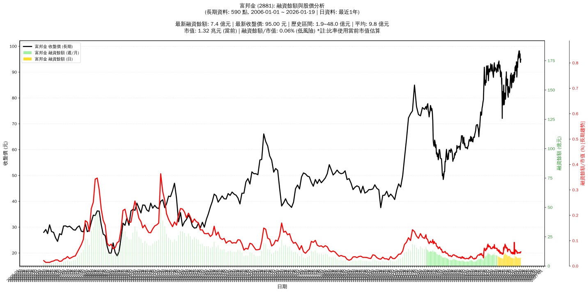

# :chart_with_upwards_trend: 富邦金 (2881) 融資餘額報告

!!! info "基本資訊"
    **:building_construction: 名稱**: 富邦金
    **:identification_card: 代號**: 2881
    **:calendar: 分析期間**: 2025-07-18 ~ 2026-01-09 (共 242 個交易日)
    **:clock3: 最新資料**: 2026-01-09
    **🕒 更新時間**: 2026-01-11 23:12:07 CST

## :moneybag: 融資餘額現況

| :chart: 指標 | :1234: 數值 | :traffic_light: 狀態 |
|:------------:|:----------:|:-------------------:|
| **最新融資餘額** | 6.9 億元 (7,183 張) | - |
| **最新收盤價** | 95.50 元 | - |
| **市值** | 1.34 兆元 | - |
| **融資餘額/市值** | 0.05% | 🟢 低風險 |
| **日變化 (DoD)** | -0.1 億元 (-1.27%) | 📉 |
| **週變化 (WoW)** | -0.2 億元 (-2.63%) | 📉 |
| **月變化 (MoM)** | -0.0 億元 (-0.65%) | 📉 |

---

## :bar_chart: 歷史統計

| :chart: 指標 | :1234: 數值 |
|:------------:|:----------:|
| **歷史最高** | 12.3 億元 |
| **歷史最低** | 6.1 億元 |
| **平均值** | 7.9 億元 |
| **標準差** | 1.3 億元 |
| **當前相對位置** | 11.8% |

---

## :chart_with_upwards_trend: 融資餘額趨勢圖

    

---

## :clipboard: 詳細歷史記錄 (最近30日)

<table class="sortable-table">
<thead>
<tr>
<th>:calendar: 日期</th>
<th>:money_with_wings: 收盤價(元)</th>
<th>:chart: 漲跌(元)</th>
<th>:chart_with_upwards_trend: 漲跌(%)</th>
<th>:package: 融資餘額(億元)</th>
<th>:package: 融資餘額(張)</th>
<th>:arrow_up_down: 融資增減(張)</th>
<th>:chart: 融券餘額(張)</th>
<th>:balance_scale: 券資比(%)</th>
</tr>
</thead>
<tbody>
<tr>
<td>2026-01-09</td>
<td>95.50</td>
<td>🔻 -1.50</td>
<td>-1.55%</td>
<td>6.9</td>
<td>7,183</td>
<td>📈 +20</td>
<td>420</td>
<td>5.85%</td>
</tr>
<tr>
<td>2026-01-08</td>
<td>97.00</td>
<td>🔺 +0.90</td>
<td>+0.94%</td>
<td>6.9</td>
<td>7,163</td>
<td>📉 -322</td>
<td>449</td>
<td>6.27%</td>
</tr>
<tr>
<td>2026-01-07</td>
<td>96.10</td>
<td>🔻 -0.30</td>
<td>-0.31%</td>
<td>7.2</td>
<td>7,485</td>
<td>📈 +79</td>
<td>443</td>
<td>5.92%</td>
</tr>
<tr>
<td>2026-01-06</td>
<td>96.40</td>
<td>🔻 -0.80</td>
<td>-0.82%</td>
<td>7.1</td>
<td>7,406</td>
<td>📈 +256</td>
<td>442</td>
<td>5.97%</td>
</tr>
<tr>
<td>2026-01-05</td>
<td>97.20</td>
<td>🔺 +1.60</td>
<td>+1.67%</td>
<td>6.9</td>
<td>7,150</td>
<td>📉 -219</td>
<td>465</td>
<td>6.50%</td>
</tr>
<tr>
<td>2026-01-02</td>
<td>95.60</td>
<td>🔻 -0.50</td>
<td>-0.52%</td>
<td>7.0</td>
<td>7,369</td>
<td>📈 +134</td>
<td>491</td>
<td>6.66%</td>
</tr>
<tr>
<td>2025-12-31</td>
<td>96.10</td>
<td>🔻 -0.90</td>
<td>-0.93%</td>
<td>7.0</td>
<td>7,235</td>
<td>📈 +155</td>
<td>497</td>
<td>6.87%</td>
</tr>
<tr>
<td>2025-12-30</td>
<td>97.00</td>
<td>🔻 -1.20</td>
<td>-1.22%</td>
<td>6.9</td>
<td>7,080</td>
<td>📈 +153</td>
<td>538</td>
<td>7.60%</td>
</tr>
<tr>
<td>2025-12-29</td>
<td>98.20</td>
<td>🔺 +1.20</td>
<td>+1.24%</td>
<td>6.8</td>
<td>6,927</td>
<td>📉 -195</td>
<td>556</td>
<td>8.03%</td>
</tr>
<tr>
<td>2025-12-26</td>
<td>97.00</td>
<td>🔻 -1.00</td>
<td>-1.02%</td>
<td>6.9</td>
<td>7,122</td>
<td>📈 +110</td>
<td>551</td>
<td>7.74%</td>
</tr>
<tr>
<td>2025-12-24</td>
<td>98.00</td>
<td>🔻 -0.10</td>
<td>-0.10%</td>
<td>6.9</td>
<td>7,012</td>
<td>📉 -94</td>
<td>569</td>
<td>8.11%</td>
</tr>
<tr>
<td>2025-12-23</td>
<td>98.10</td>
<td>🔻 -0.10</td>
<td>-0.10%</td>
<td>7.0</td>
<td>7,106</td>
<td>📉 -49</td>
<td>561</td>
<td>7.89%</td>
</tr>
<tr>
<td>2025-12-22</td>
<td>98.20</td>
<td>🔺 +0.90</td>
<td>+0.92%</td>
<td>7.0</td>
<td>7,155</td>
<td>📉 -8</td>
<td>566</td>
<td>7.91%</td>
</tr>
<tr>
<td>2025-12-19</td>
<td>97.30</td>
<td>🔺 +0.50</td>
<td>+0.52%</td>
<td>7.0</td>
<td>7,163</td>
<td>📈 +29</td>
<td>511</td>
<td>7.13%</td>
</tr>
<tr>
<td>2025-12-18</td>
<td>96.80</td>
<td>🔻 -0.50</td>
<td>-0.51%</td>
<td>6.9</td>
<td>7,134</td>
<td>📉 -29</td>
<td>492</td>
<td>6.90%</td>
</tr>
<tr>
<td>2025-12-17</td>
<td>97.30</td>
<td>🔺 +1.30</td>
<td>+1.35%</td>
<td>7.0</td>
<td>7,163</td>
<td>📉 -59</td>
<td>815</td>
<td>11.40%</td>
</tr>
<tr>
<td>2025-12-16</td>
<td>96.00</td>
<td>🔺 +0.40</td>
<td>+0.42%</td>
<td>6.9</td>
<td>7,222</td>
<td>📉 -32</td>
<td>1,799</td>
<td>24.90%</td>
</tr>
<tr>
<td>2025-12-15</td>
<td>95.60</td>
<td>🔻 -1.20</td>
<td>-1.24%</td>
<td>6.9</td>
<td>7,254</td>
<td>📈 +179</td>
<td>2,045</td>
<td>28.20%</td>
</tr>
<tr>
<td>2025-12-12</td>
<td>96.80</td>
<td>🔺 +1.70</td>
<td>+1.79%</td>
<td>6.8</td>
<td>7,075</td>
<td>📉 -190</td>
<td>2,050</td>
<td>29.00%</td>
</tr>
<tr>
<td>2025-12-11</td>
<td>95.10</td>
<td>🔻 -0.10</td>
<td>-0.11%</td>
<td>6.9</td>
<td>7,265</td>
<td>📈 +12</td>
<td>2,034</td>
<td>28.00%</td>
</tr>
<tr>
<td>2025-12-10</td>
<td>95.20</td>
<td>🔻 -1.10</td>
<td>-1.14%</td>
<td>6.9</td>
<td>7,253</td>
<td>📈 +98</td>
<td>478</td>
<td>6.59%</td>
</tr>
<tr>
<td>2025-12-09</td>
<td>96.30</td>
<td>🔺 +0.80</td>
<td>+0.84%</td>
<td>6.9</td>
<td>7,155</td>
<td>📉 -64</td>
<td>476</td>
<td>6.65%</td>
</tr>
<tr>
<td>2025-12-08</td>
<td>95.50</td>
<td>🔺 +0.60</td>
<td>+0.63%</td>
<td>6.9</td>
<td>7,219</td>
<td>📈 +35</td>
<td>412</td>
<td>5.71%</td>
</tr>
<tr>
<td>2025-12-05</td>
<td>94.90</td>
<td>🔺 +0.20</td>
<td>+0.21%</td>
<td>6.8</td>
<td>7,184</td>
<td>📈 +48</td>
<td>370</td>
<td>5.15%</td>
</tr>
<tr>
<td>2025-12-04</td>
<td>94.70</td>
<td>🔺 +1.60</td>
<td>+1.72%</td>
<td>6.8</td>
<td>7,136</td>
<td>📉 -187</td>
<td>378</td>
<td>5.30%</td>
</tr>
<tr>
<td>2025-12-03</td>
<td>93.10</td>
<td>🔺 +1.00</td>
<td>+1.09%</td>
<td>6.8</td>
<td>7,323</td>
<td>📉 -210</td>
<td>324</td>
<td>4.42%</td>
</tr>
<tr>
<td>2025-12-02</td>
<td>92.10</td>
<td>🔺 +0.30</td>
<td>+0.33%</td>
<td>6.9</td>
<td>7,533</td>
<td>📈 +140</td>
<td>454</td>
<td>6.03%</td>
</tr>
<tr>
<td>2025-12-01</td>
<td>91.80</td>
<td>🔻 -0.80</td>
<td>-0.86%</td>
<td>6.8</td>
<td>7,393</td>
<td>📈 +156</td>
<td>493</td>
<td>6.67%</td>
</tr>
<tr>
<td>2025-11-28</td>
<td>92.60</td>
<td>🔻 -1.30</td>
<td>-1.38%</td>
<td>6.7</td>
<td>7,237</td>
<td>📈 +85</td>
<td>1,498</td>
<td>20.70%</td>
</tr>
<tr>
<td>2025-11-27</td>
<td>93.90</td>
<td>🔺 +0.70</td>
<td>+0.75%</td>
<td>6.7</td>
<td>7,152</td>
<td>📉 -39</td>
<td>1,835</td>
<td>25.70%</td>
</tr>
</tbody>
</table>

---

## :information_source: 資料來源與方法

!!! note "資料來源說明"
    - **主要來源**: `raw_margin_daily.csv` (Type 13: ShowMarginChart)
    - **資料頻率**: 每日更新
    - **資料範圍**: 近1年交易日資料

!!! info "報告元資訊"
    - **報告產生時間**: 2026-01-11 23:12:07
    - **分析期間**: 242 個交易日
    - **資料來源**: Stage 1 Raw Margin Daily Data

---

:material-information-outline: **本報告僅供參考，投資決策請審慎評估**

