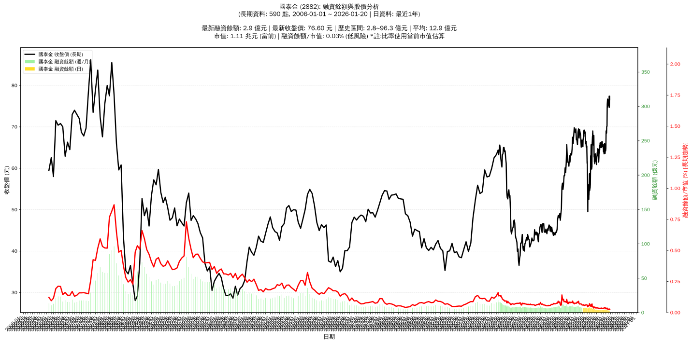

# 📈 國泰金 (2882) 融資餘額報告

!!! info "基本資訊"
    **🏗️ 名稱**: 國泰金
    **🪪 代號**: 2882
    **📅 分析期間**: 2025-07-22 ~ 2026-01-13 (共 242 個交易日)
    **🕒 最新資料**: 2026-01-13
    **🕒 更新時間**: 2026-01-14 22:38:24 CST

## 💰 融資餘額現況

| 📊 指標 | 🔢 數值 | 🚦 狀態 |
|:------------:|:----------:|:-------------------:|
| **最新融資餘額** | 2.9 億元 (3,689 張) | - |
| **最新收盤價** | 77.40 元 | - |
| **市值** | 1.10 兆元 | - |
| **融資餘額/市值** | 0.03% | 🟢 低風險 |
| **日變化 (DoD)** | -0.1 億元 (-4.41%) | 📉 |
| **週變化 (WoW)** | -0.1 億元 (-4.84%) | 📉 |
| **月變化 (MoM)** | -1.0 億元 (-26.10%) | 📉 |

---

## 📊 歷史統計

| 📊 指標 | 🔢 數值 |
|:------------:|:----------:|
| **歷史最高** | 7.9 億元 |
| **歷史最低** | 2.9 億元 |
| **平均值** | 5.0 億元 |
| **標準差** | 1.4 億元 |
| **當前相對位置** | 0.0% |

---

## 📈 融資餘額趨勢圖

{: style="max-width: 100%; height: auto;"}

---

## 📋 詳細歷史記錄 (最近30日)

<table class="sortable-table">
<thead>
<tr>
<th markdown="span">📅 日期</th>
<th markdown="span">💸 收盤價(元)</th>
<th markdown="span">📊 漲跌(元)</th>
<th markdown="span">📈 漲跌(%)</th>
<th markdown="span">📦 融資餘額(億元)</th>
<th markdown="span">📦 融資餘額(張)</th>
<th markdown="span">↕️ 融資增減(張)</th>
<th markdown="span">📊 融券餘額(張)</th>
<th markdown="span">⚖️ 券資比(%)</th>
</tr>
</thead>
<tbody>
<tr>
<td>2026-01-13</td>
<td>77.40</td>
<td>🔺 +1.30</td>
<td>+1.71%</td>
<td>2.9</td>
<td>3,689</td>
<td>📉 -236</td>
<td>880</td>
<td>23.90%</td>
</tr>
<tr>
<td>2026-01-12</td>
<td>76.10</td>
<td>🔺 +0.20</td>
<td>+0.26%</td>
<td>3.0</td>
<td>3,925</td>
<td>📉 -58</td>
<td>858</td>
<td>21.90%</td>
</tr>
<tr>
<td>2026-01-09</td>
<td>75.90</td>
<td>🔻 -0.50</td>
<td>-0.65%</td>
<td>3.0</td>
<td>3,983</td>
<td>📉 -34</td>
<td>840</td>
<td>21.10%</td>
</tr>
<tr>
<td>2026-01-08</td>
<td>76.40</td>
<td>🔺 +0.80</td>
<td>+1.06%</td>
<td>3.1</td>
<td>4,017</td>
<td>📈 +27</td>
<td>845</td>
<td>21.00%</td>
</tr>
<tr>
<td>2026-01-07</td>
<td>75.60</td>
<td>🔻 -0.40</td>
<td>-0.53%</td>
<td>3.0</td>
<td>3,990</td>
<td>📈 +42</td>
<td>844</td>
<td>21.20%</td>
</tr>
<tr>
<td>2026-01-06</td>
<td>76.00</td>
<td>🔻 -0.50</td>
<td>-0.65%</td>
<td>3.0</td>
<td>3,948</td>
<td>📈 +80</td>
<td>919</td>
<td>23.30%</td>
</tr>
<tr>
<td>2026-01-05</td>
<td>76.50</td>
<td>🔺 +1.30</td>
<td>+1.73%</td>
<td>3.0</td>
<td>3,868</td>
<td>📉 -208</td>
<td>917</td>
<td>23.70%</td>
</tr>
<tr>
<td>2026-01-02</td>
<td>75.20</td>
<td>🔻 -0.60</td>
<td>-0.79%</td>
<td>3.1</td>
<td>4,076</td>
<td>📉 -119</td>
<td>898</td>
<td>22.00%</td>
</tr>
<tr>
<td>2025-12-31</td>
<td>75.80</td>
<td>🔻 -0.40</td>
<td>-0.52%</td>
<td>3.2</td>
<td>4,195</td>
<td>📈 +221</td>
<td>953</td>
<td>22.70%</td>
</tr>
<tr>
<td>2025-12-30</td>
<td>76.20</td>
<td>🔺 +0.20</td>
<td>+0.26%</td>
<td>3.0</td>
<td>3,974</td>
<td>📉 -72</td>
<td>960</td>
<td>24.20%</td>
</tr>
<tr>
<td>2025-12-29</td>
<td>76.00</td>
<td>🔺 +1.20</td>
<td>+1.60%</td>
<td>3.1</td>
<td>4,046</td>
<td>📉 -226</td>
<td>959</td>
<td>23.70%</td>
</tr>
<tr>
<td>2025-12-26</td>
<td>74.80</td>
<td>🔻 -1.10</td>
<td>-1.45%</td>
<td>3.2</td>
<td>4,272</td>
<td>📉 -42</td>
<td>936</td>
<td>21.90%</td>
</tr>
<tr>
<td>2025-12-24</td>
<td>75.90</td>
<td>🔻 -0.80</td>
<td>-1.04%</td>
<td>3.3</td>
<td>4,314</td>
<td>📉 -32</td>
<td>1,056</td>
<td>24.50%</td>
</tr>
<tr>
<td>2025-12-23</td>
<td>76.70</td>
<td>🔺 +0.20</td>
<td>+0.26%</td>
<td>3.3</td>
<td>4,346</td>
<td>📈 +148</td>
<td>1,093</td>
<td>25.10%</td>
</tr>
<tr>
<td>2025-12-22</td>
<td>76.50</td>
<td>🔺 +1.00</td>
<td>+1.32%</td>
<td>3.2</td>
<td>4,198</td>
<td>📉 -46</td>
<td>1,083</td>
<td>25.80%</td>
</tr>
<tr>
<td>2025-12-19</td>
<td>75.50</td>
<td>🔺 +1.10</td>
<td>+1.48%</td>
<td>3.2</td>
<td>4,244</td>
<td>📉 -1,153</td>
<td>1,058</td>
<td>24.90%</td>
</tr>
<tr>
<td>2025-12-18</td>
<td>74.40</td>
<td>🔺 +1.20</td>
<td>+1.64%</td>
<td>4.0</td>
<td>5,397</td>
<td>📈 +42</td>
<td>1,101</td>
<td>20.40%</td>
</tr>
<tr>
<td>2025-12-17</td>
<td>73.20</td>
<td>🔺 +3.00</td>
<td>+4.27%</td>
<td>3.9</td>
<td>5,355</td>
<td>📈 +243</td>
<td>1,056</td>
<td>19.70%</td>
</tr>
<tr>
<td>2025-12-16</td>
<td>70.20</td>
<td>🔺 +0.10</td>
<td>+0.14%</td>
<td>3.6</td>
<td>5,112</td>
<td>📉 -298</td>
<td>867</td>
<td>17.00%</td>
</tr>
<tr>
<td>2025-12-15</td>
<td>70.10</td>
<td>➖ +0.00</td>
<td>+0.00%</td>
<td>3.8</td>
<td>5,410</td>
<td>📉 -102</td>
<td>1,290</td>
<td>23.80%</td>
</tr>
<tr>
<td>2025-12-12</td>
<td>70.10</td>
<td>🔺 +0.90</td>
<td>+1.30%</td>
<td>3.9</td>
<td>5,512</td>
<td>📈 +252</td>
<td>1,273</td>
<td>23.10%</td>
</tr>
<tr>
<td>2025-12-11</td>
<td>69.20</td>
<td>🔺 +0.70</td>
<td>+1.02%</td>
<td>3.6</td>
<td>5,260</td>
<td>📉 -4</td>
<td>1,274</td>
<td>24.20%</td>
</tr>
<tr>
<td>2025-12-10</td>
<td>68.50</td>
<td>🔻 -0.70</td>
<td>-1.01%</td>
<td>3.6</td>
<td>5,264</td>
<td>📈 +193</td>
<td>613</td>
<td>11.60%</td>
</tr>
<tr>
<td>2025-12-09</td>
<td>69.20</td>
<td>🔺 +0.20</td>
<td>+0.29%</td>
<td>3.5</td>
<td>5,071</td>
<td>📉 -183</td>
<td>729</td>
<td>14.40%</td>
</tr>
<tr>
<td>2025-12-08</td>
<td>69.00</td>
<td>🔺 +0.30</td>
<td>+0.44%</td>
<td>3.6</td>
<td>5,254</td>
<td>📉 -473</td>
<td>697</td>
<td>13.30%</td>
</tr>
<tr>
<td>2025-12-05</td>
<td>68.70</td>
<td>🔻 -0.30</td>
<td>-0.43%</td>
<td>3.9</td>
<td>5,727</td>
<td>📈 +53</td>
<td>698</td>
<td>12.20%</td>
</tr>
<tr>
<td>2025-12-04</td>
<td>69.00</td>
<td>🔺 +1.40</td>
<td>+2.07%</td>
<td>3.9</td>
<td>5,674</td>
<td>📈 +719</td>
<td>1,318</td>
<td>23.20%</td>
</tr>
<tr>
<td>2025-12-03</td>
<td>67.60</td>
<td>🔺 +1.00</td>
<td>+1.50%</td>
<td>3.3</td>
<td>4,955</td>
<td>📉 -178</td>
<td>1,622</td>
<td>32.70%</td>
</tr>
<tr>
<td>2025-12-02</td>
<td>66.60</td>
<td>🔺 +1.80</td>
<td>+2.78%</td>
<td>3.4</td>
<td>5,133</td>
<td>📉 -1,014</td>
<td>1,569</td>
<td>30.60%</td>
</tr>
<tr>
<td>2025-12-01</td>
<td>64.80</td>
<td>🔺 +0.60</td>
<td>+0.93%</td>
<td>4.0</td>
<td>6,147</td>
<td>📉 -213</td>
<td>1,522</td>
<td>24.80%</td>
</tr>
</tbody>
</table>

---

## ℹ️ 資料來源與方法

!!! note "資料來源說明"
    - **主要來源**: `raw_margin_daily.csv` (Type 13: ShowMarginChart)
    - **資料頻率**: 每日更新
    - **資料範圍**: 近1年交易日資料

!!! info "報告元資訊"
    - **報告產生時間**: 2026-01-14 22:38:24
    - **分析期間**: 242 個交易日
    - **資料來源**: Stage 1 Raw Margin Daily Data

---

:material-information-outline: **本報告僅供參考，投資決策請審慎評估**

