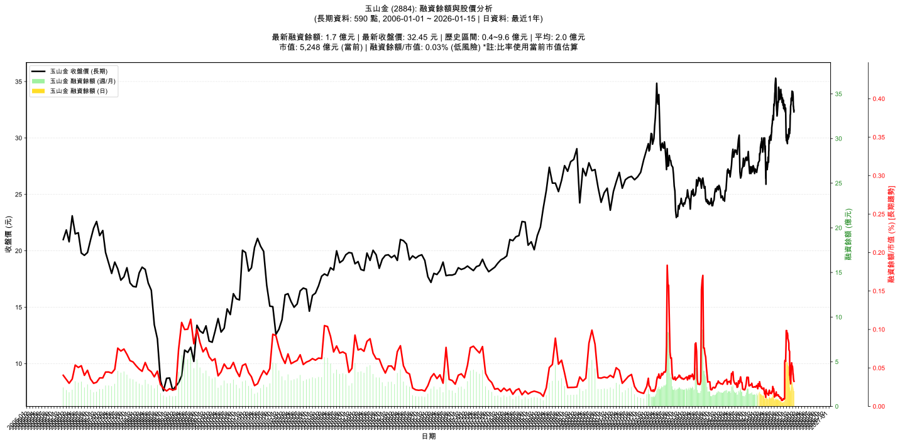

# 📈 玉山金 (2884) 融資餘額報告

!!! info "基本資訊"
    **🏗️ 名稱**: 玉山金
    **🪪 代號**: 2884
    **📅 分析期間**: 2025-07-18 ~ 2026-01-09 (共 242 個交易日)
    **🕒 最新資料**: 2026-01-09
    **🕒 更新時間**: 2026-01-12 20:31:27 CST

## 💰 融資餘額現況

| 📊 指標 | 🔢 數值 | 🚦 狀態 |
|:------------:|:----------:|:-------------------:|
| **最新融資餘額** | 1.9 億元 (5,875 張) | - |
| **最新收盤價** | 32.85 元 | - |
| **市值** | 5,313 億元 | - |
| **融資餘額/市值** | 0.04% | 🟢 低風險 |
| **日變化 (DoD)** | -0.1 億元 (-3.02%) | 📉 |
| **週變化 (WoW)** | -0.6 億元 (-24.36%) | 📉 |
| **月變化 (MoM)** | +0.2 億元 (+9.17%) | 📈 |

---

## 📊 歷史統計

| 📊 指標 | 🔢 數值 |
|:------------:|:----------:|
| **歷史最高** | 5.2 億元 |
| **歷史最低** | 0.4 億元 |
| **平均值** | 1.5 億元 |
| **標準差** | 1.2 億元 |
| **當前相對位置** | 32.0% |

---

## 📈 融資餘額趨勢圖

{: style="max-width: 100%; height: auto;"}

---

## 📋 詳細歷史記錄 (最近30日)

<table class="sortable-table">
<thead>
<tr>
<th markdown="span">📅 日期</th>
<th markdown="span">💸 收盤價(元)</th>
<th markdown="span">📊 漲跌(元)</th>
<th markdown="span">📈 漲跌(%)</th>
<th markdown="span">📦 融資餘額(億元)</th>
<th markdown="span">📦 融資餘額(張)</th>
<th markdown="span">↕️ 融資增減(張)</th>
<th markdown="span">📊 融券餘額(張)</th>
<th markdown="span">⚖️ 券資比(%)</th>
</tr>
</thead>
<tbody>
<tr>
<td>2026-01-09</td>
<td>32.85</td>
<td>🔺 +0.05</td>
<td>+0.15%</td>
<td>1.9</td>
<td>5,875</td>
<td>📉 -192</td>
<td>337</td>
<td>5.74%</td>
</tr>
<tr>
<td>2026-01-08</td>
<td>32.80</td>
<td>🔻 -0.45</td>
<td>-1.35%</td>
<td>2.0</td>
<td>6,067</td>
<td>📉 -300</td>
<td>353</td>
<td>5.82%</td>
</tr>
<tr>
<td>2026-01-07</td>
<td>33.25</td>
<td>🔻 -0.45</td>
<td>-1.34%</td>
<td>2.1</td>
<td>6,367</td>
<td>📉 -261</td>
<td>352</td>
<td>5.53%</td>
</tr>
<tr>
<td>2026-01-06</td>
<td>33.70</td>
<td>🔻 -0.15</td>
<td>-0.44%</td>
<td>2.2</td>
<td>6,628</td>
<td>📈 +223</td>
<td>424</td>
<td>6.40%</td>
</tr>
<tr>
<td>2026-01-05</td>
<td>33.85</td>
<td>🔻 -0.25</td>
<td>-0.73%</td>
<td>2.2</td>
<td>6,405</td>
<td>📉 -1,077</td>
<td>484</td>
<td>7.56%</td>
</tr>
<tr>
<td>2026-01-02</td>
<td>34.10</td>
<td>🔺 +0.35</td>
<td>+1.04%</td>
<td>2.6</td>
<td>7,482</td>
<td>📉 -472</td>
<td>586</td>
<td>7.83%</td>
</tr>
<tr>
<td>2025-12-31</td>
<td>33.75</td>
<td>🔻 -0.10</td>
<td>-0.30%</td>
<td>2.7</td>
<td>7,954</td>
<td>📉 -165</td>
<td>325</td>
<td>4.09%</td>
</tr>
<tr>
<td>2025-12-30</td>
<td>33.85</td>
<td>🔺 +0.20</td>
<td>+0.59%</td>
<td>2.7</td>
<td>8,119</td>
<td>📈 +393</td>
<td>319</td>
<td>3.93%</td>
</tr>
<tr>
<td>2025-12-29</td>
<td>33.65</td>
<td>🔻 -0.50</td>
<td>-1.46%</td>
<td>2.6</td>
<td>7,726</td>
<td>📉 -203</td>
<td>327</td>
<td>4.23%</td>
</tr>
<tr>
<td>2025-12-26</td>
<td>34.15</td>
<td>🔺 +0.20</td>
<td>+0.59%</td>
<td>2.7</td>
<td>7,929</td>
<td>📉 -358</td>
<td>553</td>
<td>6.97%</td>
</tr>
<tr>
<td>2025-12-24</td>
<td>33.95</td>
<td>🔺 +0.40</td>
<td>+1.19%</td>
<td>2.8</td>
<td>8,287</td>
<td>📉 -461</td>
<td>1,163</td>
<td>14.00%</td>
</tr>
<tr>
<td>2025-12-23</td>
<td>33.55</td>
<td>🔺 +0.25</td>
<td>+0.75%</td>
<td>2.9</td>
<td>8,748</td>
<td>📉 -183</td>
<td>379</td>
<td>4.33%</td>
</tr>
<tr>
<td>2025-12-22</td>
<td>33.30</td>
<td>🔻 -0.25</td>
<td>-0.75%</td>
<td>3.0</td>
<td>8,931</td>
<td>📈 +479</td>
<td>92</td>
<td>1.03%</td>
</tr>
<tr>
<td>2025-12-19</td>
<td>33.55</td>
<td>🔺 +0.30</td>
<td>+0.90%</td>
<td>2.8</td>
<td>8,452</td>
<td>📈 +132</td>
<td>102</td>
<td>1.21%</td>
</tr>
<tr>
<td>2025-12-18</td>
<td>33.25</td>
<td>🔻 -0.25</td>
<td>-0.75%</td>
<td>2.8</td>
<td>8,320</td>
<td>📈 +566</td>
<td>116</td>
<td>1.39%</td>
</tr>
<tr>
<td>2025-12-17</td>
<td>33.50</td>
<td>🔺 +0.55</td>
<td>+1.67%</td>
<td>2.6</td>
<td>7,754</td>
<td>📈 +1,260</td>
<td>120</td>
<td>1.55%</td>
</tr>
<tr>
<td>2025-12-16</td>
<td>32.95</td>
<td>🔻 -0.05</td>
<td>-0.15%</td>
<td>2.1</td>
<td>6,494</td>
<td>📈 +638</td>
<td>121</td>
<td>1.86%</td>
</tr>
<tr>
<td>2025-12-15</td>
<td>33.00</td>
<td>🔺 +0.20</td>
<td>+0.61%</td>
<td>1.9</td>
<td>5,856</td>
<td>📈 +1,164</td>
<td>153</td>
<td>2.61%</td>
</tr>
<tr>
<td>2025-12-12</td>
<td>32.80</td>
<td>🔺 +0.45</td>
<td>+1.39%</td>
<td>1.5</td>
<td>4,692</td>
<td>📉 -462</td>
<td>162</td>
<td>3.45%</td>
</tr>
<tr>
<td>2025-12-11</td>
<td>32.35</td>
<td>🔺 +0.25</td>
<td>+0.78%</td>
<td>1.7</td>
<td>5,154</td>
<td>📉 -353</td>
<td>165</td>
<td>3.20%</td>
</tr>
<tr>
<td>2025-12-10</td>
<td>32.10</td>
<td>➖ +0.00</td>
<td>+0.00%</td>
<td>1.8</td>
<td>5,507</td>
<td>📉 -28</td>
<td>157</td>
<td>2.85%</td>
</tr>
<tr>
<td>2025-12-09</td>
<td>32.10</td>
<td>🔺 +0.10</td>
<td>+0.31%</td>
<td>1.8</td>
<td>5,535</td>
<td>📉 -57</td>
<td>156</td>
<td>2.82%</td>
</tr>
<tr>
<td>2025-12-08</td>
<td>32.00</td>
<td>🔺 +1.35</td>
<td>+4.40%</td>
<td>1.8</td>
<td>5,592</td>
<td>📉 -1,318</td>
<td>150</td>
<td>2.68%</td>
</tr>
<tr>
<td>2025-12-05</td>
<td>30.65</td>
<td>🔻 -0.15</td>
<td>-0.49%</td>
<td>2.1</td>
<td>6,910</td>
<td>📈 +78</td>
<td>127</td>
<td>1.84%</td>
</tr>
<tr>
<td>2025-12-04</td>
<td>30.80</td>
<td>🔺 +0.40</td>
<td>+1.32%</td>
<td>2.1</td>
<td>6,832</td>
<td>📉 -167</td>
<td>131</td>
<td>1.92%</td>
</tr>
<tr>
<td>2025-12-03</td>
<td>30.40</td>
<td>🔻 -0.45</td>
<td>-1.46%</td>
<td>2.1</td>
<td>6,999</td>
<td>📉 -5,113</td>
<td>129</td>
<td>1.84%</td>
</tr>
<tr>
<td>2025-12-02</td>
<td>30.85</td>
<td>🔺 +0.30</td>
<td>+0.98%</td>
<td>3.7</td>
<td>12,112</td>
<td>📉 -215</td>
<td>129</td>
<td>1.07%</td>
</tr>
<tr>
<td>2025-12-01</td>
<td>30.55</td>
<td>🔺 +0.20</td>
<td>+0.66%</td>
<td>3.8</td>
<td>12,327</td>
<td>📉 -217</td>
<td>130</td>
<td>1.05%</td>
</tr>
<tr>
<td>2025-11-28</td>
<td>30.35</td>
<td>🔻 -0.05</td>
<td>-0.16%</td>
<td>3.8</td>
<td>12,544</td>
<td>📉 -97</td>
<td>130</td>
<td>1.04%</td>
</tr>
<tr>
<td>2025-11-27</td>
<td>30.40</td>
<td>🔻 -0.10</td>
<td>-0.33%</td>
<td>3.8</td>
<td>12,641</td>
<td>📉 -1</td>
<td>127</td>
<td>1.00%</td>
</tr>
</tbody>
</table>

---

## ℹ️ 資料來源與方法

!!! note "資料來源說明"
    - **主要來源**: `raw_margin_daily.csv` (Type 13: ShowMarginChart)
    - **資料頻率**: 每日更新
    - **資料範圍**: 近1年交易日資料

!!! info "報告元資訊"
    - **報告產生時間**: 2026-01-12 20:31:27
    - **分析期間**: 242 個交易日
    - **資料來源**: Stage 1 Raw Margin Daily Data

---

:material-information-outline: **本報告僅供參考，投資決策請審慎評估**

