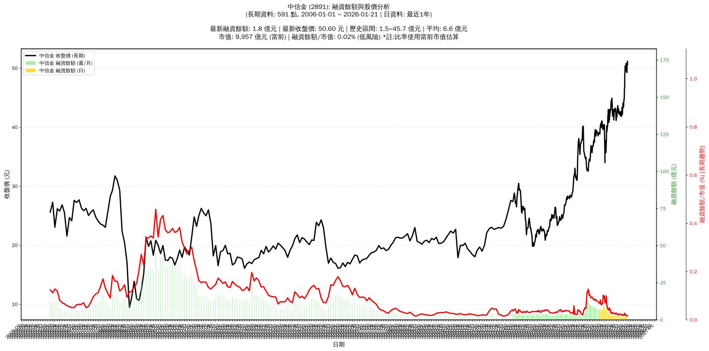

# :chart_with_upwards_trend: 中信金 (2891) 融資餘額報告

!!! info "基本資訊"
    **:building_construction: 名稱**: 中信金
    **:identification_card: 代號**: 2891
    **:calendar: 分析期間**: 2025-07-18 ~ 2026-01-09 (共 242 個交易日)
    **:clock3: 最新資料**: 2026-01-09
    **🕒 更新時間**: 2026-01-11 23:12:57 CST

## :moneybag: 融資餘額現況

| :chart: 指標 | :1234: 數值 | :traffic_light: 狀態 |
|:------------:|:----------:|:-------------------:|
| **最新融資餘額** | 1.7 億元 (3,428 張) | - |
| **最新收盤價** | 49.70 元 | - |
| **市值** | 9,766 億元 | - |
| **融資餘額/市值** | 0.02% | 🟢 低風險 |
| **日變化 (DoD)** | +0.0 億元 (+0.01%) | 📈 |
| **週變化 (WoW)** | +0.0 億元 (+0.17%) | 📈 |
| **月變化 (MoM)** | -0.3 億元 (-14.64%) | 📉 |

---

## :bar_chart: 歷史統計

| :chart: 指標 | :1234: 數值 |
|:------------:|:----------:|
| **歷史最高** | 10.2 億元 |
| **歷史最低** | 1.7 億元 |
| **平均值** | 4.2 億元 |
| **標準差** | 2.4 億元 |
| **當前相對位置** | 0.2% |

---

## :chart_with_upwards_trend: 融資餘額趨勢圖

    

---

## :clipboard: 詳細歷史記錄 (最近30日)

<table class="sortable-table">
<thead>
<tr>
<th>:calendar: 日期</th>
<th>:money_with_wings: 收盤價(元)</th>
<th>:chart: 漲跌(元)</th>
<th>:chart_with_upwards_trend: 漲跌(%)</th>
<th>:package: 融資餘額(億元)</th>
<th>:package: 融資餘額(張)</th>
<th>:arrow_up_down: 融資增減(張)</th>
<th>:chart: 融券餘額(張)</th>
<th>:balance_scale: 券資比(%)</th>
</tr>
</thead>
<tbody>
<tr>
<td>2026-01-09</td>
<td>49.70</td>
<td>🔺 +0.35</td>
<td>+0.71%</td>
<td>1.7</td>
<td>3,428</td>
<td>📉 -24</td>
<td>397</td>
<td>11.60%</td>
</tr>
<tr>
<td>2026-01-08</td>
<td>49.35</td>
<td>➖ +0.00</td>
<td>+0.00%</td>
<td>1.7</td>
<td>3,452</td>
<td>📈 +30</td>
<td>395</td>
<td>11.40%</td>
</tr>
<tr>
<td>2026-01-07</td>
<td>49.35</td>
<td>🔻 -0.50</td>
<td>-1.00%</td>
<td>1.7</td>
<td>3,422</td>
<td>📉 -72</td>
<td>394</td>
<td>11.50%</td>
</tr>
<tr>
<td>2026-01-06</td>
<td>49.85</td>
<td>🔻 -0.05</td>
<td>-0.10%</td>
<td>1.7</td>
<td>3,494</td>
<td>📈 +25</td>
<td>444</td>
<td>12.70%</td>
</tr>
<tr>
<td>2026-01-05</td>
<td>49.90</td>
<td>🔻 -0.90</td>
<td>-1.77%</td>
<td>1.7</td>
<td>3,469</td>
<td>📈 +121</td>
<td>456</td>
<td>13.10%</td>
</tr>
<tr>
<td>2026-01-02</td>
<td>50.80</td>
<td>🔺 +0.60</td>
<td>+1.20%</td>
<td>1.7</td>
<td>3,348</td>
<td>📉 -156</td>
<td>480</td>
<td>14.30%</td>
</tr>
<tr>
<td>2025-12-31</td>
<td>50.20</td>
<td>➖ +0.00</td>
<td>+0.00%</td>
<td>1.8</td>
<td>3,504</td>
<td>📉 -181</td>
<td>467</td>
<td>13.30%</td>
</tr>
<tr>
<td>2025-12-30</td>
<td>50.20</td>
<td>🔻 -0.20</td>
<td>-0.40%</td>
<td>1.8</td>
<td>3,685</td>
<td>📉 -161</td>
<td>455</td>
<td>12.30%</td>
</tr>
<tr>
<td>2025-12-29</td>
<td>50.40</td>
<td>🔺 +0.60</td>
<td>+1.20%</td>
<td>1.9</td>
<td>3,846</td>
<td>📉 -106</td>
<td>460</td>
<td>12.00%</td>
</tr>
<tr>
<td>2025-12-26</td>
<td>49.80</td>
<td>🔻 -0.50</td>
<td>-0.99%</td>
<td>2.0</td>
<td>3,952</td>
<td>📉 -433</td>
<td>450</td>
<td>11.40%</td>
</tr>
<tr>
<td>2025-12-24</td>
<td>50.30</td>
<td>🔻 -0.10</td>
<td>-0.20%</td>
<td>2.2</td>
<td>4,385</td>
<td>📉 -64</td>
<td>497</td>
<td>11.30%</td>
</tr>
<tr>
<td>2025-12-23</td>
<td>50.40</td>
<td>➖ +0.00</td>
<td>+0.00%</td>
<td>2.2</td>
<td>4,449</td>
<td>📉 -433</td>
<td>505</td>
<td>11.40%</td>
</tr>
<tr>
<td>2025-12-22</td>
<td>50.40</td>
<td>🔺 +0.90</td>
<td>+1.82%</td>
<td>2.5</td>
<td>4,882</td>
<td>📈 +50</td>
<td>500</td>
<td>10.20%</td>
</tr>
<tr>
<td>2025-12-19</td>
<td>49.50</td>
<td>🔺 +0.15</td>
<td>+0.30%</td>
<td>2.4</td>
<td>4,832</td>
<td>📉 -381</td>
<td>476</td>
<td>9.85%</td>
</tr>
<tr>
<td>2025-12-18</td>
<td>49.35</td>
<td>🔺 +0.40</td>
<td>+0.82%</td>
<td>2.6</td>
<td>5,213</td>
<td>📉 -448</td>
<td>490</td>
<td>9.40%</td>
</tr>
<tr>
<td>2025-12-17</td>
<td>48.95</td>
<td>🔺 +2.30</td>
<td>+4.93%</td>
<td>2.8</td>
<td>5,661</td>
<td>📈 +134</td>
<td>472</td>
<td>8.34%</td>
</tr>
<tr>
<td>2025-12-16</td>
<td>46.65</td>
<td>🔻 -0.10</td>
<td>-0.21%</td>
<td>2.6</td>
<td>5,527</td>
<td>📈 +36</td>
<td>395</td>
<td>7.15%</td>
</tr>
<tr>
<td>2025-12-15</td>
<td>46.75</td>
<td>🔺 +0.25</td>
<td>+0.54%</td>
<td>2.6</td>
<td>5,491</td>
<td>📈 +239</td>
<td>581</td>
<td>10.60%</td>
</tr>
<tr>
<td>2025-12-12</td>
<td>46.50</td>
<td>🔺 +1.45</td>
<td>+3.22%</td>
<td>2.4</td>
<td>5,252</td>
<td>📈 +528</td>
<td>565</td>
<td>10.80%</td>
</tr>
<tr>
<td>2025-12-11</td>
<td>45.05</td>
<td>🔺 +0.25</td>
<td>+0.56%</td>
<td>2.1</td>
<td>4,724</td>
<td>📈 +269</td>
<td>543</td>
<td>11.50%</td>
</tr>
<tr>
<td>2025-12-10</td>
<td>44.80</td>
<td>🔻 -0.15</td>
<td>-0.33%</td>
<td>2.0</td>
<td>4,455</td>
<td>📉 -161</td>
<td>339</td>
<td>7.61%</td>
</tr>
<tr>
<td>2025-12-09</td>
<td>44.95</td>
<td>🔺 +0.40</td>
<td>+0.90%</td>
<td>2.1</td>
<td>4,616</td>
<td>📈 +26</td>
<td>322</td>
<td>6.98%</td>
</tr>
<tr>
<td>2025-12-08</td>
<td>44.55</td>
<td>➖ +0.00</td>
<td>+0.00%</td>
<td>2.0</td>
<td>4,590</td>
<td>📉 -27</td>
<td>290</td>
<td>6.32%</td>
</tr>
<tr>
<td>2025-12-05</td>
<td>44.55</td>
<td>🔺 +0.20</td>
<td>+0.45%</td>
<td>2.1</td>
<td>4,617</td>
<td>📈 +222</td>
<td>290</td>
<td>6.28%</td>
</tr>
<tr>
<td>2025-12-04</td>
<td>44.35</td>
<td>🔺 +0.65</td>
<td>+1.49%</td>
<td>1.9</td>
<td>4,395</td>
<td>📉 -209</td>
<td>279</td>
<td>6.35%</td>
</tr>
<tr>
<td>2025-12-03</td>
<td>43.70</td>
<td>🔻 -0.40</td>
<td>-0.91%</td>
<td>2.0</td>
<td>4,604</td>
<td>📈 +310</td>
<td>220</td>
<td>4.78%</td>
</tr>
<tr>
<td>2025-12-02</td>
<td>44.10</td>
<td>🔺 +0.70</td>
<td>+1.61%</td>
<td>1.9</td>
<td>4,294</td>
<td>📉 -158</td>
<td>231</td>
<td>5.38%</td>
</tr>
<tr>
<td>2025-12-01</td>
<td>43.40</td>
<td>🔻 -0.05</td>
<td>-0.12%</td>
<td>1.9</td>
<td>4,452</td>
<td>📉 -29</td>
<td>178</td>
<td>4.00%</td>
</tr>
<tr>
<td>2025-11-28</td>
<td>43.45</td>
<td>🔻 -0.55</td>
<td>-1.25%</td>
<td>1.9</td>
<td>4,481</td>
<td>📈 +58</td>
<td>188</td>
<td>4.20%</td>
</tr>
<tr>
<td>2025-11-27</td>
<td>44.00</td>
<td>🔺 +0.60</td>
<td>+1.38%</td>
<td>1.9</td>
<td>4,423</td>
<td>📉 -331</td>
<td>213</td>
<td>4.82%</td>
</tr>
</tbody>
</table>

---

## :information_source: 資料來源與方法

!!! note "資料來源說明"
    - **主要來源**: `raw_margin_daily.csv` (Type 13: ShowMarginChart)
    - **資料頻率**: 每日更新
    - **資料範圍**: 近1年交易日資料

!!! info "報告元資訊"
    - **報告產生時間**: 2026-01-11 23:12:57
    - **分析期間**: 242 個交易日
    - **資料來源**: Stage 1 Raw Margin Daily Data

---

:material-information-outline: **本報告僅供參考，投資決策請審慎評估**

