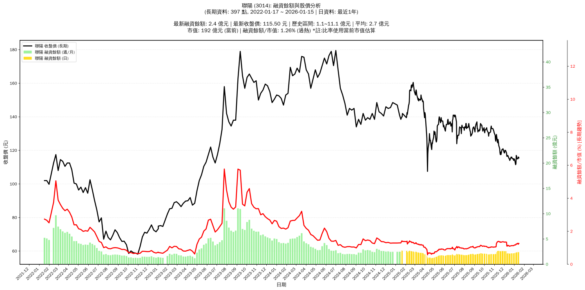

# :chart_with_upwards_trend: 聯陽 (3014) 融資餘額報告

!!! info "基本資訊"
    **:building_construction: 名稱**: 聯陽
    **:identification_card: 代號**: 3014
    **:calendar: 分析期間**: 2025-07-18 ~ 2026-01-09 (共 242 個交易日)
    **:clock3: 最新資料**: 2026-01-09
    **🕒 更新時間**: 2026-01-11 23:11:51 CST

## :moneybag: 融資餘額現況

| :chart: 指標 | :1234: 數值 | :traffic_light: 狀態 |
|:------------:|:----------:|:-------------------:|
| **最新融資餘額** | 2.4 億元 (2,069 張) | - |
| **最新收盤價** | 115.00 元 | - |
| **市值** | 191 億元 | - |
| **融資餘額/市值** | 1.25% | 🔴 過熱 |
| **日變化 (DoD)** | +0.0 億元 (+1.81%) | 📈 |
| **週變化 (WoW)** | +0.1 億元 (+5.59%) | 📈 |
| **月變化 (MoM)** | +0.3 億元 (+12.16%) | 📈 |

---

## :bar_chart: 歷史統計

| :chart: 指標 | :1234: 數值 |
|:------------:|:----------:|
| **歷史最高** | 2.7 億元 |
| **歷史最低** | 1.1 億元 |
| **平均值** | 2.0 億元 |
| **標準差** | 0.4 億元 |
| **當前相對位置** | 78.9% |

---

## :chart_with_upwards_trend: 融資餘額趨勢圖

    

---

## :clipboard: 詳細歷史記錄 (最近30日)

<table class="sortable-table">
<thead>
<tr>
<th>:calendar: 日期</th>
<th>:money_with_wings: 收盤價(元)</th>
<th>:chart: 漲跌(元)</th>
<th>:chart_with_upwards_trend: 漲跌(%)</th>
<th>:package: 融資餘額(億元)</th>
<th>:package: 融資餘額(張)</th>
<th>:arrow_up_down: 融資增減(張)</th>
<th>:chart: 融券餘額(張)</th>
<th>:balance_scale: 券資比(%)</th>
</tr>
</thead>
<tbody>
<tr>
<td>2026-01-09</td>
<td>115.00</td>
<td>🔻 -1.50</td>
<td>-1.29%</td>
<td>2.4</td>
<td>2,069</td>
<td>📈 +63</td>
<td>2</td>
<td>0.10%</td>
</tr>
<tr>
<td>2026-01-08</td>
<td>116.50</td>
<td>🔻 -0.50</td>
<td>-0.43%</td>
<td>2.3</td>
<td>2,006</td>
<td>📉 -17</td>
<td>3</td>
<td>0.15%</td>
</tr>
<tr>
<td>2026-01-07</td>
<td>117.00</td>
<td>🔺 +5.00</td>
<td>+4.46%</td>
<td>2.4</td>
<td>2,023</td>
<td>📉 -52</td>
<td>3</td>
<td>0.15%</td>
</tr>
<tr>
<td>2026-01-06</td>
<td>112.00</td>
<td>🔺 +0.50</td>
<td>+0.45%</td>
<td>2.3</td>
<td>2,075</td>
<td>📈 +60</td>
<td>14</td>
<td>0.67%</td>
</tr>
<tr>
<td>2026-01-05</td>
<td>111.50</td>
<td>🔻 -3.00</td>
<td>-2.62%</td>
<td>2.2</td>
<td>2,015</td>
<td>📈 +47</td>
<td>14</td>
<td>0.69%</td>
</tr>
<tr>
<td>2026-01-02</td>
<td>114.50</td>
<td>🔻 -0.50</td>
<td>-0.43%</td>
<td>2.3</td>
<td>1,968</td>
<td>📈 +59</td>
<td>14</td>
<td>0.71%</td>
</tr>
<tr>
<td>2025-12-31</td>
<td>115.00</td>
<td>🔺 +1.00</td>
<td>+0.88%</td>
<td>2.2</td>
<td>1,909</td>
<td>📈 +5</td>
<td>14</td>
<td>0.73%</td>
</tr>
<tr>
<td>2025-12-30</td>
<td>114.00</td>
<td>🔻 -1.00</td>
<td>-0.87%</td>
<td>2.2</td>
<td>1,904</td>
<td>📈 +16</td>
<td>14</td>
<td>0.74%</td>
</tr>
<tr>
<td>2025-12-29</td>
<td>115.00</td>
<td>➖ +0.00</td>
<td>+0.00%</td>
<td>2.2</td>
<td>1,888</td>
<td>📈 +3</td>
<td>14</td>
<td>0.74%</td>
</tr>
<tr>
<td>2025-12-26</td>
<td>115.00</td>
<td>🔻 -1.00</td>
<td>-0.86%</td>
<td>2.2</td>
<td>1,885</td>
<td>📈 +13</td>
<td>14</td>
<td>0.74%</td>
</tr>
<tr>
<td>2025-12-24</td>
<td>116.00</td>
<td>🔺 +0.50</td>
<td>+0.43%</td>
<td>2.2</td>
<td>1,872</td>
<td>📉 -3</td>
<td>13</td>
<td>0.69%</td>
</tr>
<tr>
<td>2025-12-23</td>
<td>115.50</td>
<td>🔻 -0.50</td>
<td>-0.43%</td>
<td>2.2</td>
<td>1,875</td>
<td>📈 +18</td>
<td>13</td>
<td>0.69%</td>
</tr>
<tr>
<td>2025-12-22</td>
<td>116.00</td>
<td>🔺 +1.50</td>
<td>+1.31%</td>
<td>2.2</td>
<td>1,857</td>
<td>📈 +5</td>
<td>13</td>
<td>0.70%</td>
</tr>
<tr>
<td>2025-12-19</td>
<td>114.50</td>
<td>🔺 +0.50</td>
<td>+0.44%</td>
<td>2.1</td>
<td>1,852</td>
<td>➡️ +0</td>
<td>14</td>
<td>0.76%</td>
</tr>
<tr>
<td>2025-12-18</td>
<td>114.00</td>
<td>🔻 -1.00</td>
<td>-0.87%</td>
<td>2.1</td>
<td>1,852</td>
<td>📈 +25</td>
<td>13</td>
<td>0.70%</td>
</tr>
<tr>
<td>2025-12-17</td>
<td>115.00</td>
<td>➖ +0.00</td>
<td>+0.00%</td>
<td>2.1</td>
<td>1,827</td>
<td>📉 -6</td>
<td>14</td>
<td>0.77%</td>
</tr>
<tr>
<td>2025-12-16</td>
<td>115.00</td>
<td>🔻 -0.50</td>
<td>-0.43%</td>
<td>2.1</td>
<td>1,833</td>
<td>📉 -56</td>
<td>13</td>
<td>0.71%</td>
</tr>
<tr>
<td>2025-12-15</td>
<td>115.50</td>
<td>🔻 -1.50</td>
<td>-1.28%</td>
<td>2.2</td>
<td>1,889</td>
<td>📈 +7</td>
<td>14</td>
<td>0.74%</td>
</tr>
<tr>
<td>2025-12-12</td>
<td>117.00</td>
<td>🔺 +0.50</td>
<td>+0.43%</td>
<td>2.2</td>
<td>1,882</td>
<td>📈 +60</td>
<td>14</td>
<td>0.74%</td>
</tr>
<tr>
<td>2025-12-11</td>
<td>116.50</td>
<td>➖ +0.00</td>
<td>+0.00%</td>
<td>2.1</td>
<td>1,822</td>
<td>📈 +1</td>
<td>14</td>
<td>0.77%</td>
</tr>
<tr>
<td>2025-12-10</td>
<td>116.50</td>
<td>➖ +0.00</td>
<td>+0.00%</td>
<td>2.1</td>
<td>1,821</td>
<td>📈 +4</td>
<td>14</td>
<td>0.77%</td>
</tr>
<tr>
<td>2025-12-09</td>
<td>116.50</td>
<td>🔻 -2.00</td>
<td>-1.69%</td>
<td>2.1</td>
<td>1,817</td>
<td>📉 -354</td>
<td>14</td>
<td>0.77%</td>
</tr>
<tr>
<td>2025-12-08</td>
<td>118.50</td>
<td>🔻 -1.50</td>
<td>-1.25%</td>
<td>2.6</td>
<td>2,171</td>
<td>📈 +21</td>
<td>15</td>
<td>0.69%</td>
</tr>
<tr>
<td>2025-12-05</td>
<td>120.00</td>
<td>➖ +0.00</td>
<td>+0.00%</td>
<td>2.6</td>
<td>2,150</td>
<td>📉 -8</td>
<td>15</td>
<td>0.70%</td>
</tr>
<tr>
<td>2025-12-04</td>
<td>120.00</td>
<td>➖ +0.00</td>
<td>+0.00%</td>
<td>2.6</td>
<td>2,158</td>
<td>📉 -8</td>
<td>15</td>
<td>0.70%</td>
</tr>
<tr>
<td>2025-12-03</td>
<td>120.00</td>
<td>🔺 +1.50</td>
<td>+1.27%</td>
<td>2.6</td>
<td>2,166</td>
<td>📉 -8</td>
<td>15</td>
<td>0.69%</td>
</tr>
<tr>
<td>2025-12-02</td>
<td>118.50</td>
<td>➖ +0.00</td>
<td>+0.00%</td>
<td>2.6</td>
<td>2,174</td>
<td>📈 +2</td>
<td>15</td>
<td>0.69%</td>
</tr>
<tr>
<td>2025-12-01</td>
<td>118.50</td>
<td>🔻 -2.00</td>
<td>-1.66%</td>
<td>2.6</td>
<td>2,172</td>
<td>📈 +2</td>
<td>15</td>
<td>0.69%</td>
</tr>
<tr>
<td>2025-11-28</td>
<td>120.50</td>
<td>🔻 -0.50</td>
<td>-0.41%</td>
<td>2.6</td>
<td>2,170</td>
<td>📈 +1</td>
<td>12</td>
<td>0.55%</td>
</tr>
<tr>
<td>2025-11-27</td>
<td>121.00</td>
<td>🔺 +0.50</td>
<td>+0.41%</td>
<td>2.6</td>
<td>2,169</td>
<td>📉 -2</td>
<td>13</td>
<td>0.60%</td>
</tr>
</tbody>
</table>

---

## :information_source: 資料來源與方法

!!! note "資料來源說明"
    - **主要來源**: `raw_margin_daily.csv` (Type 13: ShowMarginChart)
    - **資料頻率**: 每日更新
    - **資料範圍**: 近1年交易日資料

!!! info "報告元資訊"
    - **報告產生時間**: 2026-01-11 23:11:51
    - **分析期間**: 242 個交易日
    - **資料來源**: Stage 1 Raw Margin Daily Data

---

:material-information-outline: **本報告僅供參考，投資決策請審慎評估**

