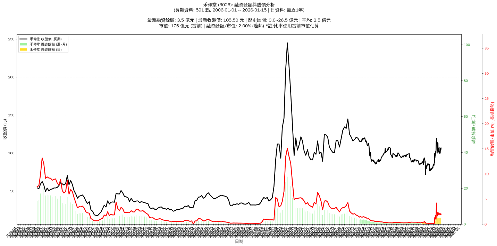

# :chart_with_upwards_trend: 禾伸堂 (3026) 融資餘額報告

!!! info "基本資訊"
    **:building_construction: 名稱**: 禾伸堂
    **:identification_card: 代號**: 3026
    **:calendar: 分析期間**: 2025-07-18 ~ 2026-01-09 (共 242 個交易日)
    **:clock3: 最新資料**: 2026-01-09
    **🕒 更新時間**: 2026-01-11 23:12:20 CST

## :moneybag: 融資餘額現況

| :chart: 指標 | :1234: 數值 | :traffic_light: 狀態 |
|:------------:|:----------:|:-------------------:|
| **最新融資餘額** | 3.3 億元 (3,190 張) | - |
| **最新收盤價** | 104.00 元 | - |
| **市值** | 173 億元 | - |
| **融資餘額/市值** | 1.92% | 🔴 過熱 |
| **日變化 (DoD)** | -0.0 億元 (-1.01%) | 📉 |
| **週變化 (WoW)** | -0.3 億元 (-8.91%) | 📉 |
| **月變化 (MoM)** | -0.4 億元 (-11.01%) | 📉 |

---

## :bar_chart: 歷史統計

| :chart: 指標 | :1234: 數值 |
|:------------:|:----------:|
| **歷史最高** | 7.4 億元 |
| **歷史最低** | 0.2 億元 |
| **平均值** | 1.3 億元 |
| **標準差** | 1.5 億元 |
| **當前相對位置** | 43.3% |

---

## :chart_with_upwards_trend: 融資餘額趨勢圖

{: style="max-width: 100%; height: auto;"}

---

## :clipboard: 詳細歷史記錄 (最近30日)

<table class="sortable-table">
<thead>
<tr>
<th>:calendar: 日期</th>
<th>:money_with_wings: 收盤價(元)</th>
<th>:chart: 漲跌(元)</th>
<th>:chart_with_upwards_trend: 漲跌(%)</th>
<th>:package: 融資餘額(億元)</th>
<th>:package: 融資餘額(張)</th>
<th>:arrow_up_down: 融資增減(張)</th>
<th>:chart: 融券餘額(張)</th>
<th>:balance_scale: 券資比(%)</th>
</tr>
</thead>
<tbody>
<tr>
<td>2026-01-09</td>
<td>104.00</td>
<td>🔻 -0.50</td>
<td>-0.48%</td>
<td>3.3</td>
<td>3,190</td>
<td>📉 -17</td>
<td>9</td>
<td>0.28%</td>
</tr>
<tr>
<td>2026-01-08</td>
<td>104.50</td>
<td>🔻 -1.50</td>
<td>-1.42%</td>
<td>3.4</td>
<td>3,207</td>
<td>📉 -124</td>
<td>10</td>
<td>0.31%</td>
</tr>
<tr>
<td>2026-01-07</td>
<td>106.00</td>
<td>➖ +0.00</td>
<td>+0.00%</td>
<td>3.5</td>
<td>3,331</td>
<td>➡️ +0</td>
<td>10</td>
<td>0.30%</td>
</tr>
<tr>
<td>2026-01-06</td>
<td>106.00</td>
<td>🔺 +2.00</td>
<td>+1.92%</td>
<td>3.5</td>
<td>3,331</td>
<td>📉 -38</td>
<td>9</td>
<td>0.27%</td>
</tr>
<tr>
<td>2026-01-05</td>
<td>104.00</td>
<td>🔻 -2.00</td>
<td>-1.89%</td>
<td>3.5</td>
<td>3,369</td>
<td>📉 -67</td>
<td>9</td>
<td>0.27%</td>
</tr>
<tr>
<td>2026-01-02</td>
<td>106.00</td>
<td>🔺 +4.00</td>
<td>+3.92%</td>
<td>3.6</td>
<td>3,436</td>
<td>📈 +151</td>
<td>9</td>
<td>0.26%</td>
</tr>
<tr>
<td>2025-12-31</td>
<td>102.00</td>
<td>🔺 +2.00</td>
<td>+2.00%</td>
<td>3.4</td>
<td>3,285</td>
<td>📉 -52</td>
<td>10</td>
<td>0.30%</td>
</tr>
<tr>
<td>2025-12-30</td>
<td>100.00</td>
<td>➖ +0.00</td>
<td>+0.00%</td>
<td>3.3</td>
<td>3,337</td>
<td>📉 -34</td>
<td>10</td>
<td>0.30%</td>
</tr>
<tr>
<td>2025-12-29</td>
<td>100.00</td>
<td>🔻 -0.50</td>
<td>-0.50%</td>
<td>3.4</td>
<td>3,371</td>
<td>📉 -27</td>
<td>10</td>
<td>0.30%</td>
</tr>
<tr>
<td>2025-12-26</td>
<td>100.50</td>
<td>🔺 +0.70</td>
<td>+0.70%</td>
<td>3.4</td>
<td>3,398</td>
<td>📉 -5</td>
<td>11</td>
<td>0.32%</td>
</tr>
<tr>
<td>2025-12-24</td>
<td>99.80</td>
<td>🔻 -1.20</td>
<td>-1.19%</td>
<td>3.4</td>
<td>3,403</td>
<td>📉 -57</td>
<td>15</td>
<td>0.44%</td>
</tr>
<tr>
<td>2025-12-23</td>
<td>101.00</td>
<td>🔻 -1.00</td>
<td>-0.98%</td>
<td>3.5</td>
<td>3,460</td>
<td>📈 +4</td>
<td>17</td>
<td>0.49%</td>
</tr>
<tr>
<td>2025-12-22</td>
<td>102.00</td>
<td>🔺 +2.00</td>
<td>+2.00%</td>
<td>3.5</td>
<td>3,456</td>
<td>📉 -55</td>
<td>15</td>
<td>0.43%</td>
</tr>
<tr>
<td>2025-12-19</td>
<td>100.00</td>
<td>➖ +0.00</td>
<td>+0.00%</td>
<td>3.5</td>
<td>3,511</td>
<td>📉 -6</td>
<td>16</td>
<td>0.46%</td>
</tr>
<tr>
<td>2025-12-18</td>
<td>100.00</td>
<td>🔻 -0.50</td>
<td>-0.50%</td>
<td>3.5</td>
<td>3,517</td>
<td>📉 -14</td>
<td>15</td>
<td>0.43%</td>
</tr>
<tr>
<td>2025-12-17</td>
<td>100.50</td>
<td>➖ +0.00</td>
<td>+0.00%</td>
<td>3.5</td>
<td>3,531</td>
<td>📉 -11</td>
<td>18</td>
<td>0.51%</td>
</tr>
<tr>
<td>2025-12-16</td>
<td>100.50</td>
<td>🔻 -1.50</td>
<td>-1.47%</td>
<td>3.6</td>
<td>3,542</td>
<td>📉 -56</td>
<td>15</td>
<td>0.42%</td>
</tr>
<tr>
<td>2025-12-15</td>
<td>102.00</td>
<td>🔻 -1.00</td>
<td>-0.97%</td>
<td>3.7</td>
<td>3,598</td>
<td>📈 +30</td>
<td>13</td>
<td>0.36%</td>
</tr>
<tr>
<td>2025-12-12</td>
<td>103.00</td>
<td>🔻 -1.50</td>
<td>-1.44%</td>
<td>3.7</td>
<td>3,568</td>
<td>📈 +62</td>
<td>16</td>
<td>0.45%</td>
</tr>
<tr>
<td>2025-12-11</td>
<td>104.50</td>
<td>🔻 -3.50</td>
<td>-3.24%</td>
<td>3.7</td>
<td>3,506</td>
<td>📈 +54</td>
<td>18</td>
<td>0.51%</td>
</tr>
<tr>
<td>2025-12-10</td>
<td>108.00</td>
<td>🔺 +2.00</td>
<td>+1.89%</td>
<td>3.7</td>
<td>3,452</td>
<td>📈 +237</td>
<td>21</td>
<td>0.61%</td>
</tr>
<tr>
<td>2025-12-09</td>
<td>106.00</td>
<td>🔺 +1.00</td>
<td>+0.95%</td>
<td>3.4</td>
<td>3,215</td>
<td>📉 -86</td>
<td>18</td>
<td>0.56%</td>
</tr>
<tr>
<td>2025-12-08</td>
<td>105.00</td>
<td>🔺 +1.50</td>
<td>+1.45%</td>
<td>3.5</td>
<td>3,301</td>
<td>📉 -49</td>
<td>18</td>
<td>0.55%</td>
</tr>
<tr>
<td>2025-12-05</td>
<td>103.50</td>
<td>➖ +0.00</td>
<td>+0.00%</td>
<td>3.5</td>
<td>3,350</td>
<td>📉 -21</td>
<td>18</td>
<td>0.54%</td>
</tr>
<tr>
<td>2025-12-04</td>
<td>103.50</td>
<td>🔺 +0.50</td>
<td>+0.49%</td>
<td>3.5</td>
<td>3,371</td>
<td>📉 -4</td>
<td>20</td>
<td>0.59%</td>
</tr>
<tr>
<td>2025-12-03</td>
<td>103.00</td>
<td>🔺 +1.50</td>
<td>+1.48%</td>
<td>3.5</td>
<td>3,375</td>
<td>📉 -13</td>
<td>20</td>
<td>0.59%</td>
</tr>
<tr>
<td>2025-12-02</td>
<td>101.50</td>
<td>🔻 -1.00</td>
<td>-0.98%</td>
<td>3.4</td>
<td>3,388</td>
<td>📈 +40</td>
<td>20</td>
<td>0.59%</td>
</tr>
<tr>
<td>2025-12-01</td>
<td>102.50</td>
<td>🔻 -2.50</td>
<td>-2.38%</td>
<td>3.4</td>
<td>3,348</td>
<td>📉 -70</td>
<td>23</td>
<td>0.69%</td>
</tr>
<tr>
<td>2025-11-28</td>
<td>105.00</td>
<td>🔻 -1.50</td>
<td>-1.41%</td>
<td>3.6</td>
<td>3,418</td>
<td>📈 +98</td>
<td>22</td>
<td>0.64%</td>
</tr>
<tr>
<td>2025-11-27</td>
<td>106.50</td>
<td>🔺 +1.50</td>
<td>+1.43%</td>
<td>3.5</td>
<td>3,320</td>
<td>📉 -124</td>
<td>32</td>
<td>0.96%</td>
</tr>
</tbody>
</table>

---

## :information_source: 資料來源與方法

!!! note "資料來源說明"
    - **主要來源**: `raw_margin_daily.csv` (Type 13: ShowMarginChart)
    - **資料頻率**: 每日更新
    - **資料範圍**: 近1年交易日資料

!!! info "報告元資訊"
    - **報告產生時間**: 2026-01-11 23:12:20
    - **分析期間**: 242 個交易日
    - **資料來源**: Stage 1 Raw Margin Daily Data

---

:material-information-outline: **本報告僅供參考，投資決策請審慎評估**

