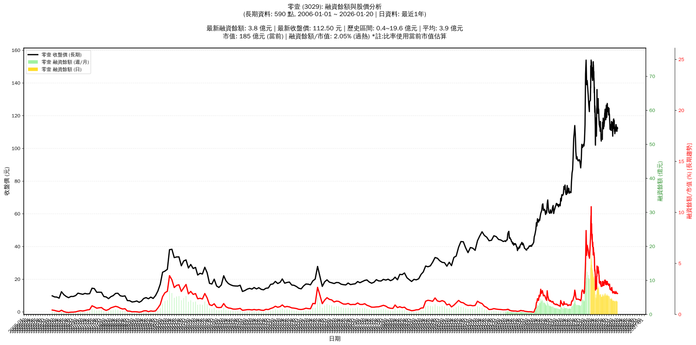

# :chart_with_upwards_trend: 零壹 (3029) 融資餘額報告

!!! info "基本資訊"
    **:building_construction: 名稱**: 零壹
    **:identification_card: 代號**: 3029
    **:calendar: 分析期間**: 2025-07-18 ~ 2026-01-09 (共 242 個交易日)
    **:clock3: 最新資料**: 2026-01-09
    **🕒 更新時間**: 2026-01-12 13:16:46 CST

## :moneybag: 融資餘額現況

| :chart: 指標 | :1234: 數值 | :traffic_light: 狀態 |
|:------------:|:----------:|:-------------------:|
| **最新融資餘額** | 3.9 億元 (3,491 張) | - |
| **最新收盤價** | 112.50 元 | - |
| **市值** | 188 億元 | - |
| **融資餘額/市值** | 2.09% | 🔴 過熱 |
| **日變化 (DoD)** | +0.0 億元 (+0.49%) | 📈 |
| **週變化 (WoW)** | -0.1 億元 (-3.27%) | 📉 |
| **月變化 (MoM)** | +0.1 億元 (+1.84%) | 📈 |

---

## :bar_chart: 歷史統計

| :chart: 指標 | :1234: 數值 |
|:------------:|:----------:|
| **歷史最高** | 19.6 億元 |
| **歷史最低** | 3.8 億元 |
| **平均值** | 6.9 億元 |
| **標準差** | 3.3 億元 |
| **當前相對位置** | 0.8% |

---

## :chart_with_upwards_trend: 融資餘額趨勢圖

    

---

## :clipboard: 詳細歷史記錄 (最近30日)

<table class="sortable-table">
<thead>
<tr>
<th markdown="span">:calendar: 日期</th>
<th markdown="span">:money_with_wings: 收盤價(元)</th>
<th markdown="span">:chart: 漲跌(元)</th>
<th markdown="span">:chart_with_upwards_trend: 漲跌(%)</th>
<th markdown="span">:package: 融資餘額(億元)</th>
<th markdown="span">:package: 融資餘額(張)</th>
<th markdown="span">:arrow_up_down: 融資增減(張)</th>
<th markdown="span">:chart: 融券餘額(張)</th>
<th markdown="span">:balance_scale: 券資比(%)</th>
</tr>
</thead>
<tbody>
<tr>
<td>2026-01-09</td>
<td>112.50</td>
<td>➖ +0.00</td>
<td>+0.00%</td>
<td>3.9</td>
<td>3,491</td>
<td>📈 +17</td>
<td>27</td>
<td>0.77%</td>
</tr>
<tr>
<td>2026-01-08</td>
<td>112.50</td>
<td>🔺 +1.00</td>
<td>+0.90%</td>
<td>3.9</td>
<td>3,474</td>
<td>📉 -67</td>
<td>18</td>
<td>0.52%</td>
</tr>
<tr>
<td>2026-01-07</td>
<td>111.50</td>
<td>🔺 +0.50</td>
<td>+0.45%</td>
<td>3.9</td>
<td>3,541</td>
<td>📉 -16</td>
<td>19</td>
<td>0.54%</td>
</tr>
<tr>
<td>2026-01-06</td>
<td>111.00</td>
<td>🔻 -1.00</td>
<td>-0.89%</td>
<td>3.9</td>
<td>3,557</td>
<td>📈 +33</td>
<td>20</td>
<td>0.56%</td>
</tr>
<tr>
<td>2026-01-05</td>
<td>112.00</td>
<td>🔻 -2.50</td>
<td>-2.18%</td>
<td>3.9</td>
<td>3,524</td>
<td>📉 -22</td>
<td>22</td>
<td>0.62%</td>
</tr>
<tr>
<td>2026-01-02</td>
<td>114.50</td>
<td>🔺 +1.50</td>
<td>+1.33%</td>
<td>4.1</td>
<td>3,546</td>
<td>📈 +12</td>
<td>24</td>
<td>0.68%</td>
</tr>
<tr>
<td>2025-12-31</td>
<td>113.00</td>
<td>🔺 +0.50</td>
<td>+0.44%</td>
<td>4.0</td>
<td>3,534</td>
<td>📉 -18</td>
<td>22</td>
<td>0.62%</td>
</tr>
<tr>
<td>2025-12-30</td>
<td>112.50</td>
<td>🔻 -2.00</td>
<td>-1.75%</td>
<td>4.0</td>
<td>3,552</td>
<td>📉 -94</td>
<td>23</td>
<td>0.65%</td>
</tr>
<tr>
<td>2025-12-29</td>
<td>114.50</td>
<td>🔺 +4.00</td>
<td>+3.62%</td>
<td>4.2</td>
<td>3,646</td>
<td>📈 +203</td>
<td>27</td>
<td>0.74%</td>
</tr>
<tr>
<td>2025-12-26</td>
<td>110.50</td>
<td>🔻 -1.00</td>
<td>-0.90%</td>
<td>3.8</td>
<td>3,443</td>
<td>📉 -34</td>
<td>25</td>
<td>0.73%</td>
</tr>
<tr>
<td>2025-12-24</td>
<td>111.50</td>
<td>🔻 -1.00</td>
<td>-0.89%</td>
<td>3.9</td>
<td>3,477</td>
<td>📉 -7</td>
<td>25</td>
<td>0.72%</td>
</tr>
<tr>
<td>2025-12-23</td>
<td>112.50</td>
<td>🔻 -0.50</td>
<td>-0.44%</td>
<td>3.9</td>
<td>3,484</td>
<td>📉 -18</td>
<td>24</td>
<td>0.69%</td>
</tr>
<tr>
<td>2025-12-22</td>
<td>113.00</td>
<td>🔺 +2.00</td>
<td>+1.80%</td>
<td>4.0</td>
<td>3,502</td>
<td>📉 -23</td>
<td>24</td>
<td>0.69%</td>
</tr>
<tr>
<td>2025-12-19</td>
<td>111.00</td>
<td>🔺 +1.50</td>
<td>+1.37%</td>
<td>3.9</td>
<td>3,525</td>
<td>📈 +3</td>
<td>24</td>
<td>0.68%</td>
</tr>
<tr>
<td>2025-12-18</td>
<td>109.50</td>
<td>🔻 -1.00</td>
<td>-0.90%</td>
<td>3.9</td>
<td>3,522</td>
<td>📉 -4</td>
<td>23</td>
<td>0.65%</td>
</tr>
<tr>
<td>2025-12-17</td>
<td>110.50</td>
<td>🔺 +1.50</td>
<td>+1.38%</td>
<td>3.9</td>
<td>3,526</td>
<td>📈 +14</td>
<td>23</td>
<td>0.65%</td>
</tr>
<tr>
<td>2025-12-16</td>
<td>109.00</td>
<td>🔻 -1.50</td>
<td>-1.36%</td>
<td>3.8</td>
<td>3,512</td>
<td>📈 +14</td>
<td>24</td>
<td>0.68%</td>
</tr>
<tr>
<td>2025-12-15</td>
<td>110.50</td>
<td>➖ +0.00</td>
<td>+0.00%</td>
<td>3.9</td>
<td>3,498</td>
<td>➡️ +0</td>
<td>22</td>
<td>0.63%</td>
</tr>
<tr>
<td>2025-12-12</td>
<td>110.50</td>
<td>➖ +0.00</td>
<td>+0.00%</td>
<td>3.9</td>
<td>3,498</td>
<td>📈 +6</td>
<td>13</td>
<td>0.37%</td>
</tr>
<tr>
<td>2025-12-11</td>
<td>110.50</td>
<td>🔻 -2.00</td>
<td>-1.78%</td>
<td>3.9</td>
<td>3,492</td>
<td>📈 +64</td>
<td>12</td>
<td>0.34%</td>
</tr>
<tr>
<td>2025-12-10</td>
<td>112.50</td>
<td>🔻 -0.50</td>
<td>-0.44%</td>
<td>3.9</td>
<td>3,428</td>
<td>📉 -3</td>
<td>16</td>
<td>0.47%</td>
</tr>
<tr>
<td>2025-12-09</td>
<td>113.00</td>
<td>🔻 -4.00</td>
<td>-3.42%</td>
<td>3.9</td>
<td>3,431</td>
<td>📉 -131</td>
<td>17</td>
<td>0.50%</td>
</tr>
<tr>
<td>2025-12-08</td>
<td>117.00</td>
<td>🔺 +0.50</td>
<td>+0.43%</td>
<td>4.2</td>
<td>3,562</td>
<td>📈 +126</td>
<td>39</td>
<td>1.09%</td>
</tr>
<tr>
<td>2025-12-05</td>
<td>116.50</td>
<td>🔻 -1.00</td>
<td>-0.85%</td>
<td>4.0</td>
<td>3,436</td>
<td>📉 -11</td>
<td>39</td>
<td>1.14%</td>
</tr>
<tr>
<td>2025-12-04</td>
<td>117.50</td>
<td>➖ +0.00</td>
<td>+0.00%</td>
<td>4.1</td>
<td>3,447</td>
<td>📈 +23</td>
<td>37</td>
<td>1.07%</td>
</tr>
<tr>
<td>2025-12-03</td>
<td>117.50</td>
<td>🔻 -0.50</td>
<td>-0.42%</td>
<td>4.0</td>
<td>3,424</td>
<td>📈 +21</td>
<td>37</td>
<td>1.08%</td>
</tr>
<tr>
<td>2025-12-02</td>
<td>118.00</td>
<td>➖ +0.00</td>
<td>+0.00%</td>
<td>4.0</td>
<td>3,403</td>
<td>📉 -34</td>
<td>37</td>
<td>1.09%</td>
</tr>
<tr>
<td>2025-12-01</td>
<td>118.00</td>
<td>🔺 +0.50</td>
<td>+0.43%</td>
<td>4.1</td>
<td>3,437</td>
<td>📉 -20</td>
<td>39</td>
<td>1.13%</td>
</tr>
<tr>
<td>2025-11-28</td>
<td>117.50</td>
<td>🔺 +2.00</td>
<td>+1.73%</td>
<td>4.1</td>
<td>3,457</td>
<td>📉 -63</td>
<td>42</td>
<td>1.21%</td>
</tr>
<tr>
<td>2025-11-27</td>
<td>115.50</td>
<td>➖ +0.00</td>
<td>+0.00%</td>
<td>4.1</td>
<td>3,520</td>
<td>📉 -37</td>
<td>40</td>
<td>1.14%</td>
</tr>
</tbody>
</table>

---

## :information_source: 資料來源與方法

!!! note "資料來源說明"
    - **主要來源**: `raw_margin_daily.csv` (Type 13: ShowMarginChart)
    - **資料頻率**: 每日更新
    - **資料範圍**: 近1年交易日資料

!!! info "報告元資訊"
    - **報告產生時間**: 2026-01-12 13:16:46
    - **分析期間**: 242 個交易日
    - **資料來源**: Stage 1 Raw Margin Daily Data

---

:material-information-outline: **本報告僅供參考，投資決策請審慎評估**

