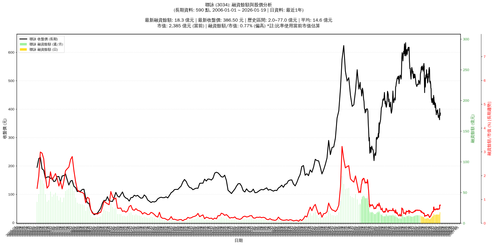

# :chart_with_upwards_trend: 聯詠 (3034) 融資餘額報告

!!! info "基本資訊"
    **:building_construction: 名稱**: 聯詠
    **:identification_card: 代號**: 3034
    **:calendar: 分析期間**: 2025-07-18 ~ 2026-01-09 (共 242 個交易日)
    **:clock3: 最新資料**: 2026-01-09
    **🕒 更新時間**: 2026-01-11 20:28:46 CST

## :moneybag: 融資餘額現況

| :chart: 指標 | :1234: 數值 | :traffic_light: 狀態 |
|:------------:|:----------:|:-------------------:|
| **最新融資餘額** | 17.6 億元 (4,631 張) | - |
| **最新收盤價** | 380.00 元 | - |
| **市值** | 2,312 億元 | - |
| **融資餘額/市值** | 0.76% | 🟠 偏高 |
| **日變化 (DoD)** | -0.2 億元 (-1.17%) | 📉 |
| **週變化 (WoW)** | +2.9 億元 (+19.73%) | 📈 |
| **月變化 (MoM)** | +3.4 億元 (+24.21%) | 📈 |

---

## :bar_chart: 歷史統計

| :chart: 指標 | :1234: 數值 |
|:------------:|:----------:|
| **歷史最高** | 18.2 億元 |
| **歷史最低** | 5.8 億元 |
| **平均值** | 10.8 億元 |
| **標準差** | 2.9 億元 |
| **當前相對位置** | 94.8% |

---

## :chart_with_upwards_trend: 融資餘額趨勢圖

    

---

## :clipboard: 詳細歷史記錄 (最近30日)

<table class="sortable-table">
<thead>
<tr>
<th>:calendar: 日期</th>
<th>:money_with_wings: 收盤價(元)</th>
<th>:chart: 漲跌(元)</th>
<th>:chart_with_upwards_trend: 漲跌(%)</th>
<th>:package: 融資餘額(億元)</th>
<th>:package: 融資餘額(張)</th>
<th>:arrow_up_down: 融資增減(張)</th>
<th>:chart: 融券餘額(張)</th>
<th>:balance_scale: 券資比(%)</th>
</tr>
</thead>
<tbody>
<tr>
<td>2026-01-09</td>
<td>380.00</td>
<td>🔻 -5.00</td>
<td>-1.30%</td>
<td>17.6</td>
<td>4,631</td>
<td>📈 +6</td>
<td>16</td>
<td>0.35%</td>
</tr>
<tr>
<td>2026-01-08</td>
<td>385.00</td>
<td>🔻 -17.00</td>
<td>-4.23%</td>
<td>17.8</td>
<td>4,625</td>
<td>📈 +86</td>
<td>16</td>
<td>0.35%</td>
</tr>
<tr>
<td>2026-01-07</td>
<td>402.00</td>
<td>🔺 +24.00</td>
<td>+6.35%</td>
<td>18.2</td>
<td>4,539</td>
<td>📈 +625</td>
<td>20</td>
<td>0.44%</td>
</tr>
<tr>
<td>2026-01-06</td>
<td>378.00</td>
<td>🔺 +15.00</td>
<td>+4.13%</td>
<td>14.8</td>
<td>3,914</td>
<td>📉 -90</td>
<td>24</td>
<td>0.61%</td>
</tr>
<tr>
<td>2026-01-05</td>
<td>363.00</td>
<td>🔻 -4.00</td>
<td>-1.09%</td>
<td>14.5</td>
<td>4,004</td>
<td>📉 -1</td>
<td>36</td>
<td>0.90%</td>
</tr>
<tr>
<td>2026-01-02</td>
<td>367.00</td>
<td>🔻 -7.00</td>
<td>-1.87%</td>
<td>14.7</td>
<td>4,005</td>
<td>📈 +112</td>
<td>33</td>
<td>0.82%</td>
</tr>
<tr>
<td>2025-12-31</td>
<td>374.00</td>
<td>🔻 -0.50</td>
<td>-0.13%</td>
<td>14.6</td>
<td>3,893</td>
<td>📈 +90</td>
<td>33</td>
<td>0.85%</td>
</tr>
<tr>
<td>2025-12-30</td>
<td>374.50</td>
<td>🔻 -2.00</td>
<td>-0.53%</td>
<td>14.2</td>
<td>3,803</td>
<td>📈 +25</td>
<td>84</td>
<td>2.21%</td>
</tr>
<tr>
<td>2025-12-29</td>
<td>376.50</td>
<td>🔺 +3.00</td>
<td>+0.80%</td>
<td>14.2</td>
<td>3,778</td>
<td>📉 -42</td>
<td>47</td>
<td>1.24%</td>
</tr>
<tr>
<td>2025-12-26</td>
<td>373.50</td>
<td>🔻 -3.50</td>
<td>-0.93%</td>
<td>14.3</td>
<td>3,820</td>
<td>📈 +28</td>
<td>47</td>
<td>1.23%</td>
</tr>
<tr>
<td>2025-12-24</td>
<td>377.00</td>
<td>🔺 +2.50</td>
<td>+0.67%</td>
<td>14.3</td>
<td>3,792</td>
<td>📉 -15</td>
<td>53</td>
<td>1.40%</td>
</tr>
<tr>
<td>2025-12-23</td>
<td>374.50</td>
<td>🔻 -2.50</td>
<td>-0.66%</td>
<td>14.3</td>
<td>3,807</td>
<td>📉 -6</td>
<td>52</td>
<td>1.37%</td>
</tr>
<tr>
<td>2025-12-22</td>
<td>377.00</td>
<td>🔺 +1.00</td>
<td>+0.27%</td>
<td>14.4</td>
<td>3,813</td>
<td>📈 +19</td>
<td>50</td>
<td>1.31%</td>
</tr>
<tr>
<td>2025-12-19</td>
<td>376.00</td>
<td>🔻 -1.50</td>
<td>-0.40%</td>
<td>14.3</td>
<td>3,794</td>
<td>📈 +8</td>
<td>53</td>
<td>1.40%</td>
</tr>
<tr>
<td>2025-12-18</td>
<td>377.50</td>
<td>🔺 +0.50</td>
<td>+0.13%</td>
<td>14.3</td>
<td>3,786</td>
<td>📉 -2</td>
<td>49</td>
<td>1.29%</td>
</tr>
<tr>
<td>2025-12-17</td>
<td>377.00</td>
<td>🔺 +2.50</td>
<td>+0.67%</td>
<td>14.3</td>
<td>3,788</td>
<td>📈 +51</td>
<td>146</td>
<td>3.85%</td>
</tr>
<tr>
<td>2025-12-16</td>
<td>374.50</td>
<td>🔺 +3.50</td>
<td>+0.94%</td>
<td>14.0</td>
<td>3,737</td>
<td>📉 -33</td>
<td>147</td>
<td>3.93%</td>
</tr>
<tr>
<td>2025-12-15</td>
<td>371.00</td>
<td>🔻 -2.00</td>
<td>-0.54%</td>
<td>14.0</td>
<td>3,770</td>
<td>📉 -5</td>
<td>178</td>
<td>4.72%</td>
</tr>
<tr>
<td>2025-12-12</td>
<td>373.00</td>
<td>🔻 -4.50</td>
<td>-1.19%</td>
<td>14.1</td>
<td>3,775</td>
<td>📈 +48</td>
<td>177</td>
<td>4.69%</td>
</tr>
<tr>
<td>2025-12-11</td>
<td>377.50</td>
<td>🔻 -5.00</td>
<td>-1.31%</td>
<td>14.1</td>
<td>3,727</td>
<td>📈 +23</td>
<td>178</td>
<td>4.78%</td>
</tr>
<tr>
<td>2025-12-10</td>
<td>382.50</td>
<td>🔺 +3.00</td>
<td>+0.79%</td>
<td>14.2</td>
<td>3,704</td>
<td>📉 -16</td>
<td>155</td>
<td>4.18%</td>
</tr>
<tr>
<td>2025-12-09</td>
<td>379.50</td>
<td>🔻 -5.50</td>
<td>-1.43%</td>
<td>14.1</td>
<td>3,720</td>
<td>📈 +33</td>
<td>156</td>
<td>4.19%</td>
</tr>
<tr>
<td>2025-12-08</td>
<td>385.00</td>
<td>🔻 -2.00</td>
<td>-0.52%</td>
<td>14.2</td>
<td>3,687</td>
<td>📉 -45</td>
<td>136</td>
<td>3.69%</td>
</tr>
<tr>
<td>2025-12-05</td>
<td>387.00</td>
<td>🔺 +2.50</td>
<td>+0.65%</td>
<td>14.4</td>
<td>3,732</td>
<td>📉 -17</td>
<td>135</td>
<td>3.62%</td>
</tr>
<tr>
<td>2025-12-04</td>
<td>384.50</td>
<td>🔻 -5.50</td>
<td>-1.41%</td>
<td>14.4</td>
<td>3,749</td>
<td>📈 +14</td>
<td>135</td>
<td>3.60%</td>
</tr>
<tr>
<td>2025-12-03</td>
<td>390.00</td>
<td>🔻 -8.00</td>
<td>-2.01%</td>
<td>14.6</td>
<td>3,735</td>
<td>📈 +61</td>
<td>134</td>
<td>3.59%</td>
</tr>
<tr>
<td>2025-12-02</td>
<td>398.00</td>
<td>🔺 +5.50</td>
<td>+1.40%</td>
<td>14.6</td>
<td>3,674</td>
<td>📈 +1</td>
<td>139</td>
<td>3.78%</td>
</tr>
<tr>
<td>2025-12-01</td>
<td>392.50</td>
<td>🔺 +3.00</td>
<td>+0.77%</td>
<td>14.4</td>
<td>3,673</td>
<td>📉 -17</td>
<td>47</td>
<td>1.28%</td>
</tr>
<tr>
<td>2025-11-28</td>
<td>389.50</td>
<td>🔻 -4.00</td>
<td>-1.02%</td>
<td>14.4</td>
<td>3,690</td>
<td>📈 +14</td>
<td>47</td>
<td>1.27%</td>
</tr>
<tr>
<td>2025-11-27</td>
<td>393.50</td>
<td>🔻 -2.50</td>
<td>-0.63%</td>
<td>14.5</td>
<td>3,676</td>
<td>📈 +45</td>
<td>44</td>
<td>1.20%</td>
</tr>
</tbody>
</table>

---

## :information_source: 資料來源與方法

!!! note "資料來源說明"
    - **主要來源**: `raw_margin_daily.csv` (Type 13: ShowMarginChart)
    - **資料頻率**: 每日更新
    - **資料範圍**: 近1年交易日資料

!!! info "報告元資訊"
    - **報告產生時間**: 2026-01-11 20:28:46
    - **分析期間**: 242 個交易日
    - **資料來源**: Stage 1 Raw Margin Daily Data

---

:material-information-outline: **本報告僅供參考，投資決策請審慎評估**

