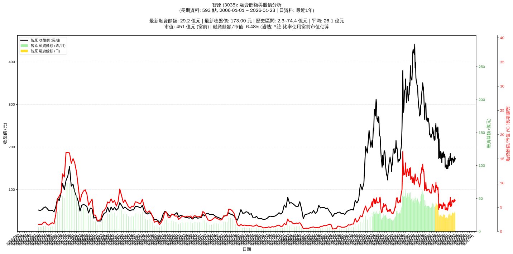

# :chart_with_upwards_trend: 智原 (3035) 融資餘額報告

!!! info "基本資訊"
    **:building_construction: 名稱**: 智原
    **:identification_card: 代號**: 3035
    **:calendar: 分析期間**: 2025-07-18 ~ 2026-01-09 (共 242 個交易日)
    **:clock3: 最新資料**: 2026-01-09
    **🕒 更新時間**: 2026-01-11 20:29:32 CST

## :moneybag: 融資餘額現況

| :chart: 指標 | :1234: 數值 | :traffic_light: 狀態 |
|:------------:|:----------:|:-------------------:|
| **最新融資餘額** | 28.7 億元 (17,142 張) | - |
| **最新收盤價** | 167.50 元 | - |
| **市值** | 436 億元 | - |
| **融資餘額/市值** | 6.58% | 🔴 過熱 |
| **日變化 (DoD)** | -0.5 億元 (-1.77%) | 📉 |
| **週變化 (WoW)** | +0.6 億元 (+2.11%) | 📈 |
| **月變化 (MoM)** | -0.3 億元 (-0.94%) | 📉 |

---

## :bar_chart: 歷史統計

| :chart: 指標 | :1234: 數值 |
|:------------:|:----------:|
| **歷史最高** | 45.8 億元 |
| **歷史最低** | 19.8 億元 |
| **平均值** | 27.6 億元 |
| **標準差** | 6.7 億元 |
| **當前相對位置** | 34.3% |

---

## :chart_with_upwards_trend: 融資餘額趨勢圖

    

---

## :clipboard: 詳細歷史記錄 (最近30日)

<table class="sortable-table">
<thead>
<tr>
<th>:calendar: 日期</th>
<th>:money_with_wings: 收盤價(元)</th>
<th>:chart: 漲跌(元)</th>
<th>:chart_with_upwards_trend: 漲跌(%)</th>
<th>:package: 融資餘額(億元)</th>
<th>:package: 融資餘額(張)</th>
<th>:arrow_up_down: 融資增減(張)</th>
<th>:chart: 融券餘額(張)</th>
<th>:balance_scale: 券資比(%)</th>
</tr>
</thead>
<tbody>
<tr>
<td>2026-01-09</td>
<td>167.50</td>
<td>🔻 -3.00</td>
<td>-1.76%</td>
<td>28.7</td>
<td>17,142</td>
<td>📉 -2</td>
<td>552</td>
<td>3.22%</td>
</tr>
<tr>
<td>2026-01-08</td>
<td>170.50</td>
<td>🔻 -6.50</td>
<td>-3.67%</td>
<td>29.2</td>
<td>17,144</td>
<td>📈 +205</td>
<td>606</td>
<td>3.53%</td>
</tr>
<tr>
<td>2026-01-07</td>
<td>177.00</td>
<td>🔺 +6.00</td>
<td>+3.51%</td>
<td>30.0</td>
<td>16,939</td>
<td>📈 +360</td>
<td>613</td>
<td>3.62%</td>
</tr>
<tr>
<td>2026-01-06</td>
<td>171.00</td>
<td>🔺 +2.50</td>
<td>+1.48%</td>
<td>28.4</td>
<td>16,579</td>
<td>📈 +58</td>
<td>607</td>
<td>3.66%</td>
</tr>
<tr>
<td>2026-01-05</td>
<td>168.50</td>
<td>🔻 -2.00</td>
<td>-1.17%</td>
<td>27.8</td>
<td>16,521</td>
<td>📈 +29</td>
<td>604</td>
<td>3.66%</td>
</tr>
<tr>
<td>2026-01-02</td>
<td>170.50</td>
<td>➖ +0.00</td>
<td>+0.00%</td>
<td>28.1</td>
<td>16,492</td>
<td>📈 +84</td>
<td>606</td>
<td>3.67%</td>
</tr>
<tr>
<td>2025-12-31</td>
<td>170.50</td>
<td>🔺 +2.00</td>
<td>+1.19%</td>
<td>28.0</td>
<td>16,408</td>
<td>📉 -130</td>
<td>607</td>
<td>3.70%</td>
</tr>
<tr>
<td>2025-12-30</td>
<td>168.50</td>
<td>🔺 +4.00</td>
<td>+2.43%</td>
<td>27.9</td>
<td>16,538</td>
<td>📈 +16</td>
<td>600</td>
<td>3.63%</td>
</tr>
<tr>
<td>2025-12-29</td>
<td>164.50</td>
<td>🔻 -0.50</td>
<td>-0.30%</td>
<td>27.2</td>
<td>16,522</td>
<td>📉 -120</td>
<td>667</td>
<td>4.04%</td>
</tr>
<tr>
<td>2025-12-26</td>
<td>165.00</td>
<td>🔺 +0.50</td>
<td>+0.30%</td>
<td>27.5</td>
<td>16,642</td>
<td>📈 +1</td>
<td>669</td>
<td>4.02%</td>
</tr>
<tr>
<td>2025-12-24</td>
<td>164.50</td>
<td>🔺 +0.50</td>
<td>+0.30%</td>
<td>27.4</td>
<td>16,641</td>
<td>📉 -94</td>
<td>689</td>
<td>4.14%</td>
</tr>
<tr>
<td>2025-12-23</td>
<td>164.00</td>
<td>🔻 -1.50</td>
<td>-0.91%</td>
<td>27.4</td>
<td>16,735</td>
<td>📉 -70</td>
<td>681</td>
<td>4.07%</td>
</tr>
<tr>
<td>2025-12-22</td>
<td>165.50</td>
<td>🔻 -0.50</td>
<td>-0.30%</td>
<td>27.8</td>
<td>16,805</td>
<td>📈 +102</td>
<td>741</td>
<td>4.41%</td>
</tr>
<tr>
<td>2025-12-19</td>
<td>166.00</td>
<td>🔻 -2.00</td>
<td>-1.19%</td>
<td>27.7</td>
<td>16,703</td>
<td>📉 -200</td>
<td>751</td>
<td>4.50%</td>
</tr>
<tr>
<td>2025-12-18</td>
<td>168.00</td>
<td>🔻 -1.00</td>
<td>-0.59%</td>
<td>28.4</td>
<td>16,903</td>
<td>📉 -56</td>
<td>750</td>
<td>4.44%</td>
</tr>
<tr>
<td>2025-12-17</td>
<td>169.00</td>
<td>🔻 -3.00</td>
<td>-1.74%</td>
<td>28.7</td>
<td>16,959</td>
<td>📈 +32</td>
<td>716</td>
<td>4.22%</td>
</tr>
<tr>
<td>2025-12-16</td>
<td>172.00</td>
<td>🔺 +2.50</td>
<td>+1.47%</td>
<td>29.1</td>
<td>16,927</td>
<td>📈 +277</td>
<td>535</td>
<td>3.16%</td>
</tr>
<tr>
<td>2025-12-15</td>
<td>169.50</td>
<td>🔻 -1.00</td>
<td>-0.59%</td>
<td>28.2</td>
<td>16,650</td>
<td>📉 -92</td>
<td>532</td>
<td>3.20%</td>
</tr>
<tr>
<td>2025-12-12</td>
<td>170.50</td>
<td>➖ +0.00</td>
<td>+0.00%</td>
<td>28.5</td>
<td>16,742</td>
<td>📉 -112</td>
<td>526</td>
<td>3.14%</td>
</tr>
<tr>
<td>2025-12-11</td>
<td>170.50</td>
<td>🔻 -3.50</td>
<td>-2.01%</td>
<td>28.7</td>
<td>16,854</td>
<td>📈 +195</td>
<td>551</td>
<td>3.27%</td>
</tr>
<tr>
<td>2025-12-10</td>
<td>174.00</td>
<td>🔺 +3.00</td>
<td>+1.75%</td>
<td>29.0</td>
<td>16,659</td>
<td>📈 +84</td>
<td>556</td>
<td>3.34%</td>
</tr>
<tr>
<td>2025-12-09</td>
<td>171.00</td>
<td>🔻 -1.50</td>
<td>-0.87%</td>
<td>28.3</td>
<td>16,575</td>
<td>📈 +68</td>
<td>553</td>
<td>3.34%</td>
</tr>
<tr>
<td>2025-12-08</td>
<td>172.50</td>
<td>🔻 -0.50</td>
<td>-0.29%</td>
<td>28.5</td>
<td>16,507</td>
<td>📈 +9</td>
<td>688</td>
<td>4.17%</td>
</tr>
<tr>
<td>2025-12-05</td>
<td>173.00</td>
<td>🔺 +3.50</td>
<td>+2.06%</td>
<td>28.5</td>
<td>16,498</td>
<td>📈 +17</td>
<td>675</td>
<td>4.09%</td>
</tr>
<tr>
<td>2025-12-04</td>
<td>169.50</td>
<td>🔻 -0.50</td>
<td>-0.29%</td>
<td>27.9</td>
<td>16,481</td>
<td>📉 -33</td>
<td>730</td>
<td>4.43%</td>
</tr>
<tr>
<td>2025-12-03</td>
<td>170.00</td>
<td>🔻 -2.00</td>
<td>-1.16%</td>
<td>28.1</td>
<td>16,514</td>
<td>📈 +24</td>
<td>733</td>
<td>4.44%</td>
</tr>
<tr>
<td>2025-12-02</td>
<td>172.00</td>
<td>🔻 -0.50</td>
<td>-0.29%</td>
<td>28.4</td>
<td>16,490</td>
<td>📉 -229</td>
<td>741</td>
<td>4.49%</td>
</tr>
<tr>
<td>2025-12-01</td>
<td>172.50</td>
<td>🔻 -1.50</td>
<td>-0.86%</td>
<td>28.8</td>
<td>16,719</td>
<td>📈 +320</td>
<td>741</td>
<td>4.43%</td>
</tr>
<tr>
<td>2025-11-28</td>
<td>174.00</td>
<td>🔺 +2.00</td>
<td>+1.16%</td>
<td>28.5</td>
<td>16,399</td>
<td>📈 +148</td>
<td>755</td>
<td>4.60%</td>
</tr>
<tr>
<td>2025-11-27</td>
<td>172.00</td>
<td>🔺 +0.50</td>
<td>+0.29%</td>
<td>28.0</td>
<td>16,251</td>
<td>📈 +220</td>
<td>670</td>
<td>4.12%</td>
</tr>
</tbody>
</table>

---

## :information_source: 資料來源與方法

!!! note "資料來源說明"
    - **主要來源**: `raw_margin_daily.csv` (Type 13: ShowMarginChart)
    - **資料頻率**: 每日更新
    - **資料範圍**: 近1年交易日資料

!!! info "報告元資訊"
    - **報告產生時間**: 2026-01-11 20:29:32
    - **分析期間**: 242 個交易日
    - **資料來源**: Stage 1 Raw Margin Daily Data

---

:material-information-outline: **本報告僅供參考，投資決策請審慎評估**

