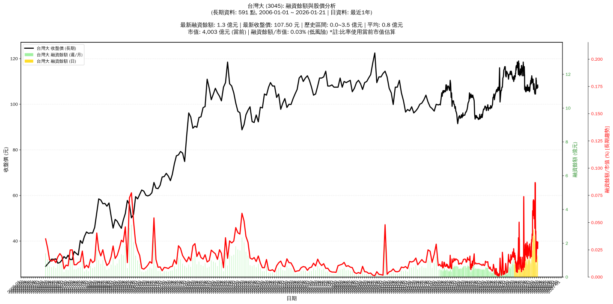

# 📈 台灣大 (3045) 融資餘額報告

!!! info "基本資訊"
    **🏗️ 名稱**: 台灣大
    **🪪 代號**: 3045
    **📅 分析期間**: 2025-07-21 ~ 2026-01-12 (共 243 個交易日)
    **🕒 最新資料**: 2026-01-12
    **🕒 更新時間**: 2026-01-13 11:58:33 CST

## 💰 融資餘額現況

| 📊 指標 | 🔢 數值 | 🚦 狀態 |
|:------------:|:----------:|:-------------------:|
| **最新融資餘額** | 1.3 億元 (1,170 張) | - |
| **最新收盤價** | 107.50 元 | - |
| **市值** | 4,003 億元 | - |
| **融資餘額/市值** | 0.03% | 🟢 低風險 |
| **日變化 (DoD)** | +0.0 億元 (+4.00%) | 📈 |
| **週變化 (WoW)** | +0.1 億元 (+4.21%) | 📈 |
| **月變化 (MoM)** | -2.2 億元 (-63.45%) | 📉 |

---

## 📊 歷史統計

| 📊 指標 | 🔢 數值 |
|:------------:|:----------:|
| **歷史最高** | 3.5 億元 |
| **歷史最低** | 0.2 億元 |
| **平均值** | 1.1 億元 |
| **標準差** | 0.7 億元 |
| **當前相對位置** | 33.0% |

---

## 📈 融資餘額趨勢圖

{: style="max-width: 100%; height: auto;"}

---

## 📋 詳細歷史記錄 (最近30日)

<table class="sortable-table">
<thead>
<tr>
<th markdown="span">📅 日期</th>
<th markdown="span">💸 收盤價(元)</th>
<th markdown="span">📊 漲跌(元)</th>
<th markdown="span">📈 漲跌(%)</th>
<th markdown="span">📦 融資餘額(億元)</th>
<th markdown="span">📦 融資餘額(張)</th>
<th markdown="span">↕️ 融資增減(張)</th>
<th markdown="span">📊 融券餘額(張)</th>
<th markdown="span">⚖️ 券資比(%)</th>
</tr>
</thead>
<tbody>
<tr>
<td>2026-01-12</td>
<td>107.50</td>
<td>➖ +0.00</td>
<td>+0.00%</td>
<td>1.3</td>
<td>1,170</td>
<td>📈 +45</td>
<td>7</td>
<td>0.60%</td>
</tr>
<tr>
<td>2026-01-09</td>
<td>107.50</td>
<td>🔺 +0.50</td>
<td>+0.47%</td>
<td>1.2</td>
<td>1,125</td>
<td>📉 -95</td>
<td>29</td>
<td>2.58%</td>
</tr>
<tr>
<td>2026-01-08</td>
<td>107.00</td>
<td>➖ +0.00</td>
<td>+0.00%</td>
<td>1.3</td>
<td>1,220</td>
<td>📈 +54</td>
<td>29</td>
<td>2.38%</td>
</tr>
<tr>
<td>2026-01-07</td>
<td>107.00</td>
<td>➖ +0.00</td>
<td>+0.00%</td>
<td>1.2</td>
<td>1,166</td>
<td>📉 -7</td>
<td>29</td>
<td>2.49%</td>
</tr>
<tr>
<td>2026-01-06</td>
<td>107.00</td>
<td>➖ +0.00</td>
<td>+0.00%</td>
<td>1.3</td>
<td>1,173</td>
<td>📈 +45</td>
<td>29</td>
<td>2.47%</td>
</tr>
<tr>
<td>2026-01-05</td>
<td>107.00</td>
<td>🔻 -1.00</td>
<td>-0.93%</td>
<td>1.2</td>
<td>1,128</td>
<td>📈 +254</td>
<td>109</td>
<td>9.66%</td>
</tr>
<tr>
<td>2026-01-02</td>
<td>108.00</td>
<td>🔻 -0.50</td>
<td>-0.46%</td>
<td>0.9</td>
<td>874</td>
<td>📈 +185</td>
<td>149</td>
<td>17.00%</td>
</tr>
<tr>
<td>2025-12-31</td>
<td>108.50</td>
<td>🔻 -2.00</td>
<td>-1.81%</td>
<td>0.7</td>
<td>689</td>
<td>📈 +94</td>
<td>168</td>
<td>24.40%</td>
</tr>
<tr>
<td>2025-12-30</td>
<td>110.50</td>
<td>🔺 +1.00</td>
<td>+0.91%</td>
<td>0.7</td>
<td>595</td>
<td>📉 -92</td>
<td>199</td>
<td>33.40%</td>
</tr>
<tr>
<td>2025-12-29</td>
<td>109.50</td>
<td>🔻 -2.00</td>
<td>-1.79%</td>
<td>0.8</td>
<td>687</td>
<td>📈 +184</td>
<td>587</td>
<td>85.40%</td>
</tr>
<tr>
<td>2025-12-26</td>
<td>111.50</td>
<td>🔺 +3.00</td>
<td>+2.76%</td>
<td>0.6</td>
<td>503</td>
<td>📉 -382</td>
<td>1,254</td>
<td>249.00%</td>
</tr>
<tr>
<td>2025-12-24</td>
<td>108.50</td>
<td>🔺 +2.00</td>
<td>+1.88%</td>
<td>1.0</td>
<td>885</td>
<td>📉 -700</td>
<td>144</td>
<td>16.30%</td>
</tr>
<tr>
<td>2025-12-23</td>
<td>106.50</td>
<td>🔻 -0.50</td>
<td>-0.47%</td>
<td>1.7</td>
<td>1,585</td>
<td>📈 +138</td>
<td>24</td>
<td>1.51%</td>
</tr>
<tr>
<td>2025-12-22</td>
<td>107.00</td>
<td>🔺 +1.00</td>
<td>+0.94%</td>
<td>1.5</td>
<td>1,447</td>
<td>📉 -85</td>
<td>36</td>
<td>2.49%</td>
</tr>
<tr>
<td>2025-12-19</td>
<td>106.00</td>
<td>🔺 +1.50</td>
<td>+1.44%</td>
<td>1.6</td>
<td>1,532</td>
<td>📉 -384</td>
<td>39</td>
<td>2.55%</td>
</tr>
<tr>
<td>2025-12-18</td>
<td>104.50</td>
<td>➖ +0.00</td>
<td>+0.00%</td>
<td>2.0</td>
<td>1,916</td>
<td>📉 -152</td>
<td>37</td>
<td>1.93%</td>
</tr>
<tr>
<td>2025-12-17</td>
<td>104.50</td>
<td>🔻 -0.50</td>
<td>-0.48%</td>
<td>2.2</td>
<td>2,068</td>
<td>📉 -1,182</td>
<td>37</td>
<td>1.79%</td>
</tr>
<tr>
<td>2025-12-16</td>
<td>105.00</td>
<td>➖ +0.00</td>
<td>+0.00%</td>
<td>3.4</td>
<td>3,250</td>
<td>📉 -50</td>
<td>46</td>
<td>1.42%</td>
</tr>
<tr>
<td>2025-12-15</td>
<td>105.00</td>
<td>🔻 -0.50</td>
<td>-0.47%</td>
<td>3.5</td>
<td>3,300</td>
<td>📈 +7</td>
<td>55</td>
<td>1.67%</td>
</tr>
<tr>
<td>2025-12-12</td>
<td>105.50</td>
<td>🔻 -0.50</td>
<td>-0.47%</td>
<td>3.5</td>
<td>3,293</td>
<td>📈 +47</td>
<td>54</td>
<td>1.64%</td>
</tr>
<tr>
<td>2025-12-11</td>
<td>106.00</td>
<td>🔺 +1.50</td>
<td>+1.44%</td>
<td>3.4</td>
<td>3,246</td>
<td>📈 +1,367</td>
<td>132</td>
<td>4.07%</td>
</tr>
<tr>
<td>2025-12-10</td>
<td>104.50</td>
<td>➖ +0.00</td>
<td>+0.00%</td>
<td>2.0</td>
<td>1,879</td>
<td>📈 +43</td>
<td>55</td>
<td>2.93%</td>
</tr>
<tr>
<td>2025-12-09</td>
<td>104.50</td>
<td>🔻 -0.50</td>
<td>-0.48%</td>
<td>1.9</td>
<td>1,836</td>
<td>📈 +132</td>
<td>40</td>
<td>2.18%</td>
</tr>
<tr>
<td>2025-12-08</td>
<td>105.00</td>
<td>➖ +0.00</td>
<td>+0.00%</td>
<td>1.8</td>
<td>1,704</td>
<td>📉 -673</td>
<td>25</td>
<td>1.47%</td>
</tr>
<tr>
<td>2025-12-05</td>
<td>105.00</td>
<td>🔻 -0.50</td>
<td>-0.47%</td>
<td>2.5</td>
<td>2,377</td>
<td>📈 +41</td>
<td>24</td>
<td>1.01%</td>
</tr>
<tr>
<td>2025-12-04</td>
<td>105.50</td>
<td>🔻 -0.50</td>
<td>-0.47%</td>
<td>2.5</td>
<td>2,336</td>
<td>📈 +44</td>
<td>24</td>
<td>1.03%</td>
</tr>
<tr>
<td>2025-12-03</td>
<td>106.00</td>
<td>🔻 -0.50</td>
<td>-0.47%</td>
<td>2.4</td>
<td>2,292</td>
<td>📈 +114</td>
<td>34</td>
<td>1.48%</td>
</tr>
<tr>
<td>2025-12-02</td>
<td>106.50</td>
<td>🔻 -0.50</td>
<td>-0.47%</td>
<td>2.3</td>
<td>2,178</td>
<td>📈 +56</td>
<td>23</td>
<td>1.06%</td>
</tr>
<tr>
<td>2025-12-01</td>
<td>107.00</td>
<td>🔻 -1.00</td>
<td>-0.93%</td>
<td>2.3</td>
<td>2,122</td>
<td>📈 +81</td>
<td>24</td>
<td>1.13%</td>
</tr>
<tr>
<td>2025-11-28</td>
<td>108.00</td>
<td>🔻 -0.50</td>
<td>-0.46%</td>
<td>2.2</td>
<td>2,041</td>
<td>📈 +66</td>
<td>24</td>
<td>1.18%</td>
</tr>
</tbody>
</table>

---

## ℹ️ 資料來源與方法

!!! note "資料來源說明"
    - **主要來源**: `raw_margin_daily.csv` (Type 13: ShowMarginChart)
    - **資料頻率**: 每日更新
    - **資料範圍**: 近1年交易日資料

!!! info "報告元資訊"
    - **報告產生時間**: 2026-01-13 11:58:33
    - **分析期間**: 243 個交易日
    - **資料來源**: Stage 1 Raw Margin Daily Data

---

:material-information-outline: **本報告僅供參考，投資決策請審慎評估**

