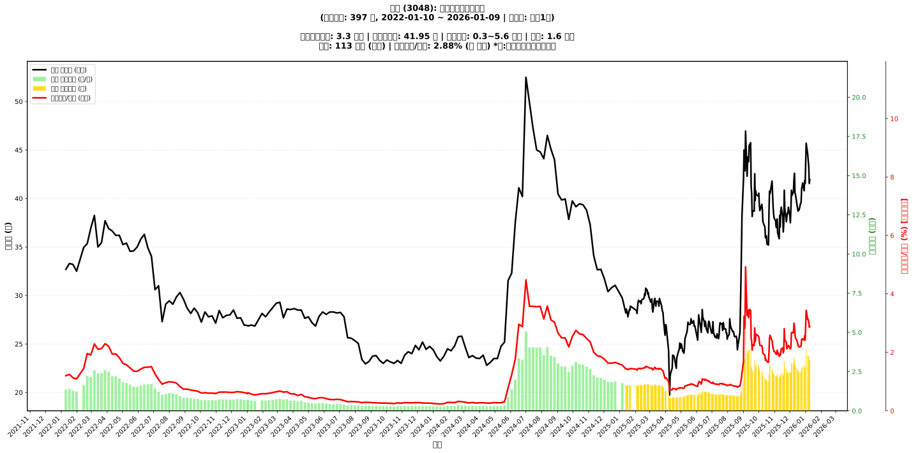

# :chart_with_upwards_trend: 益登 (3048) 融資餘額報告

!!! info "基本資訊"
    **:building_construction: 名稱**: 益登
    **:identification_card: 代號**: 3048
    **:calendar: 分析期間**: 2025-07-18 ~ 2026-01-09 (共 242 個交易日)
    **:clock3: 最新資料**: 2026-01-09
    **🕒 更新時間**: 2026-01-11 23:11:19 CST

## :moneybag: 融資餘額現況

| :chart: 指標 | :1234: 數值 | :traffic_light: 狀態 |
|:------------:|:----------:|:-------------------:|
| **最新融資餘額** | 3.3 億元 (7,778 張) | - |
| **最新收盤價** | 41.95 元 | - |
| **市值** | 113 億元 | - |
| **融資餘額/市值** | 2.88% | 🔴 過熱 |
| **日變化 (DoD)** | +0.0 億元 (+0.79%) | 📈 |
| **週變化 (WoW)** | -0.6 億元 (-16.07%) | 📉 |
| **月變化 (MoM)** | +0.1 億元 (+1.64%) | 📈 |

---

## :bar_chart: 歷史統計

| :chart: 指標 | :1234: 數值 |
|:------------:|:----------:|
| **歷史最高** | 5.6 億元 |
| **歷史最低** | 0.8 億元 |
| **平均值** | 1.8 億元 |
| **標準差** | 0.9 億元 |
| **當前相對位置** | 51.9% |

---

## :chart_with_upwards_trend: 融資餘額趨勢圖

    

---

## :clipboard: 詳細歷史記錄 (最近30日)

<table class="sortable-table">
<thead>
<tr>
<th>:calendar: 日期</th>
<th>:money_with_wings: 收盤價(元)</th>
<th>:chart: 漲跌(元)</th>
<th>:chart_with_upwards_trend: 漲跌(%)</th>
<th>:package: 融資餘額(億元)</th>
<th>:package: 融資餘額(張)</th>
<th>:arrow_up_down: 融資增減(張)</th>
<th>:chart: 融券餘額(張)</th>
<th>:balance_scale: 券資比(%)</th>
</tr>
</thead>
<tbody>
<tr>
<td>2026-01-09</td>
<td>41.95</td>
<td>🔺 +0.40</td>
<td>+0.96%</td>
<td>3.3</td>
<td>7,778</td>
<td>📉 -13</td>
<td>141</td>
<td>1.81%</td>
</tr>
<tr>
<td>2026-01-08</td>
<td>41.55</td>
<td>🔻 -1.75</td>
<td>-4.04%</td>
<td>3.2</td>
<td>7,791</td>
<td>📉 -159</td>
<td>137</td>
<td>1.76%</td>
</tr>
<tr>
<td>2026-01-07</td>
<td>43.30</td>
<td>🔻 -0.65</td>
<td>-1.48%</td>
<td>3.4</td>
<td>7,950</td>
<td>📉 -102</td>
<td>156</td>
<td>1.96%</td>
</tr>
<tr>
<td>2026-01-06</td>
<td>43.95</td>
<td>🔻 -0.60</td>
<td>-1.35%</td>
<td>3.5</td>
<td>8,052</td>
<td>📈 +122</td>
<td>185</td>
<td>2.30%</td>
</tr>
<tr>
<td>2026-01-05</td>
<td>44.55</td>
<td>🔻 -1.15</td>
<td>-2.52%</td>
<td>3.5</td>
<td>7,930</td>
<td>📉 -577</td>
<td>206</td>
<td>2.60%</td>
</tr>
<tr>
<td>2026-01-02</td>
<td>45.70</td>
<td>🔺 +4.15</td>
<td>+9.99%</td>
<td>3.9</td>
<td>8,507</td>
<td>📈 +1,913</td>
<td>346</td>
<td>4.07%</td>
</tr>
<tr>
<td>2025-12-31</td>
<td>41.55</td>
<td>🔻 -0.30</td>
<td>-0.72%</td>
<td>2.7</td>
<td>6,594</td>
<td>📉 -347</td>
<td>223</td>
<td>3.38%</td>
</tr>
<tr>
<td>2025-12-30</td>
<td>41.85</td>
<td>🔺 +1.05</td>
<td>+2.57%</td>
<td>2.9</td>
<td>6,941</td>
<td>📈 +247</td>
<td>147</td>
<td>2.12%</td>
</tr>
<tr>
<td>2025-12-29</td>
<td>40.80</td>
<td>🔻 -0.80</td>
<td>-1.92%</td>
<td>2.7</td>
<td>6,694</td>
<td>📉 -3</td>
<td>130</td>
<td>1.94%</td>
</tr>
<tr>
<td>2025-12-26</td>
<td>41.60</td>
<td>🔺 +0.65</td>
<td>+1.59%</td>
<td>2.8</td>
<td>6,697</td>
<td>📉 -69</td>
<td>157</td>
<td>2.34%</td>
</tr>
<tr>
<td>2025-12-24</td>
<td>40.95</td>
<td>🔺 +1.40</td>
<td>+3.54%</td>
<td>2.8</td>
<td>6,766</td>
<td>📈 +418</td>
<td>153</td>
<td>2.26%</td>
</tr>
<tr>
<td>2025-12-23</td>
<td>39.55</td>
<td>🔺 +0.05</td>
<td>+0.13%</td>
<td>2.5</td>
<td>6,348</td>
<td>📈 +54</td>
<td>120</td>
<td>1.89%</td>
</tr>
<tr>
<td>2025-12-22</td>
<td>39.50</td>
<td>🔺 +0.70</td>
<td>+1.80%</td>
<td>2.5</td>
<td>6,294</td>
<td>📉 -74</td>
<td>117</td>
<td>1.86%</td>
</tr>
<tr>
<td>2025-12-19</td>
<td>38.80</td>
<td>➖ +0.00</td>
<td>+0.00%</td>
<td>2.5</td>
<td>6,368</td>
<td>📉 -95</td>
<td>116</td>
<td>1.82%</td>
</tr>
<tr>
<td>2025-12-18</td>
<td>38.80</td>
<td>🔺 +0.10</td>
<td>+0.26%</td>
<td>2.5</td>
<td>6,463</td>
<td>📉 -62</td>
<td>120</td>
<td>1.86%</td>
</tr>
<tr>
<td>2025-12-17</td>
<td>38.70</td>
<td>🔻 -0.30</td>
<td>-0.77%</td>
<td>2.5</td>
<td>6,525</td>
<td>📉 -256</td>
<td>114</td>
<td>1.75%</td>
</tr>
<tr>
<td>2025-12-16</td>
<td>39.00</td>
<td>🔻 -0.35</td>
<td>-0.89%</td>
<td>2.6</td>
<td>6,781</td>
<td>📉 -115</td>
<td>124</td>
<td>1.83%</td>
</tr>
<tr>
<td>2025-12-15</td>
<td>39.35</td>
<td>🔻 -1.05</td>
<td>-2.60%</td>
<td>2.7</td>
<td>6,896</td>
<td>📉 -79</td>
<td>137</td>
<td>1.99%</td>
</tr>
<tr>
<td>2025-12-12</td>
<td>40.40</td>
<td>🔻 -0.15</td>
<td>-0.37%</td>
<td>2.8</td>
<td>6,975</td>
<td>📉 -356</td>
<td>153</td>
<td>2.19%</td>
</tr>
<tr>
<td>2025-12-11</td>
<td>40.55</td>
<td>🔻 -2.05</td>
<td>-4.81%</td>
<td>3.0</td>
<td>7,331</td>
<td>📉 -205</td>
<td>156</td>
<td>2.13%</td>
</tr>
<tr>
<td>2025-12-10</td>
<td>42.60</td>
<td>🔺 +0.65</td>
<td>+1.55%</td>
<td>3.2</td>
<td>7,536</td>
<td>📉 -552</td>
<td>232</td>
<td>3.08%</td>
</tr>
<tr>
<td>2025-12-09</td>
<td>41.95</td>
<td>🔺 +1.25</td>
<td>+3.07%</td>
<td>3.4</td>
<td>8,088</td>
<td>📈 +677</td>
<td>213</td>
<td>2.63%</td>
</tr>
<tr>
<td>2025-12-08</td>
<td>40.70</td>
<td>🔺 +0.40</td>
<td>+0.99%</td>
<td>3.0</td>
<td>7,411</td>
<td>📉 -132</td>
<td>186</td>
<td>2.51%</td>
</tr>
<tr>
<td>2025-12-05</td>
<td>40.30</td>
<td>🔻 -0.55</td>
<td>-1.35%</td>
<td>3.0</td>
<td>7,543</td>
<td>📈 +146</td>
<td>191</td>
<td>2.53%</td>
</tr>
<tr>
<td>2025-12-04</td>
<td>40.85</td>
<td>🔺 +1.90</td>
<td>+4.88%</td>
<td>3.0</td>
<td>7,397</td>
<td>📈 +1,082</td>
<td>235</td>
<td>3.18%</td>
</tr>
<tr>
<td>2025-12-03</td>
<td>38.95</td>
<td>🔺 +1.45</td>
<td>+3.87%</td>
<td>2.5</td>
<td>6,315</td>
<td>📉 -64</td>
<td>157</td>
<td>2.49%</td>
</tr>
<tr>
<td>2025-12-02</td>
<td>37.50</td>
<td>🔻 -0.65</td>
<td>-1.70%</td>
<td>2.4</td>
<td>6,379</td>
<td>📉 -8</td>
<td>129</td>
<td>2.02%</td>
</tr>
<tr>
<td>2025-12-01</td>
<td>38.15</td>
<td>🔻 -0.95</td>
<td>-2.43%</td>
<td>2.4</td>
<td>6,387</td>
<td>📉 -79</td>
<td>140</td>
<td>2.19%</td>
</tr>
<tr>
<td>2025-11-28</td>
<td>39.10</td>
<td>🔺 +0.60</td>
<td>+1.56%</td>
<td>2.5</td>
<td>6,466</td>
<td>📈 +67</td>
<td>167</td>
<td>2.58%</td>
</tr>
<tr>
<td>2025-11-27</td>
<td>38.50</td>
<td>➖ +0.00</td>
<td>+0.00%</td>
<td>2.5</td>
<td>6,399</td>
<td>📈 +85</td>
<td>162</td>
<td>2.53%</td>
</tr>
</tbody>
</table>

---

## :information_source: 資料來源與方法

!!! note "資料來源說明"
    - **主要來源**: `raw_margin_daily.csv` (Type 13: ShowMarginChart)
    - **資料頻率**: 每日更新
    - **資料範圍**: 近1年交易日資料

!!! info "報告元資訊"
    - **報告產生時間**: 2026-01-11 23:11:19
    - **分析期間**: 242 個交易日
    - **資料來源**: Stage 1 Raw Margin Daily Data

---

:material-information-outline: **本報告僅供參考，投資決策請審慎評估**

