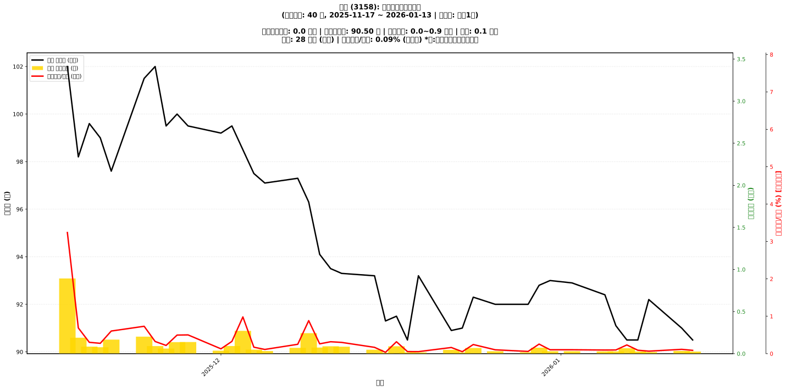

# 📈 嘉實 (3158) 融資餘額報告

!!! info "基本資訊"
    **🏗️ 名稱**: 嘉實
    **🪪 代號**: 3158
    **📅 分析期間**: 2025-11-17 ~ 2026-01-14 (共 41 個交易日)
    **🕒 最新資料**: 2026-01-14
    **🕒 更新時間**: 2026-01-15 12:55:59 CST

## 💰 融資餘額現況

| 📊 指標 | 🔢 數值 | 🚦 狀態 |
|:------------:|:----------:|:-------------------:|
| **最新融資餘額** | 0.0 億元 (43 張) | - |
| **最新收盤價** | 90.30 元 | - |
| **市值** | 28 億元 | - |
| **融資餘額/市值** | 0.14% | 🟢 低風險 |
| **日變化 (DoD)** | +0.0 億元 (+58.91%) | 📈 |
| **週變化 (WoW)** | -0.0 億元 (-39.57%) | 📉 |
| **月變化 (MoM)** | -0.0 億元 (-16.68%) | 📉 |

---

## 📊 歷史統計

| 📊 指標 | 🔢 數值 |
|:------------:|:----------:|
| **歷史最高** | 0.9 億元 |
| **歷史最低** | 0.0 億元 |
| **平均值** | 0.1 億元 |
| **標準差** | 0.1 億元 |
| **當前相對位置** | 3.3% |

---

## 📈 融資餘額趨勢圖

{: style="max-width: 100%; height: auto;"}

---

## 📋 詳細歷史記錄 (最近30日)

<table class="sortable-table">
<thead>
<tr>
<th markdown="span">📅 日期</th>
<th markdown="span">💸 收盤價(元)</th>
<th markdown="span">📊 漲跌(元)</th>
<th markdown="span">📈 漲跌(%)</th>
<th markdown="span">📦 融資餘額(億元)</th>
<th markdown="span">📦 融資餘額(張)</th>
<th markdown="span">↕️ 融資增減(張)</th>
<th markdown="span">📊 融券餘額(張)</th>
<th markdown="span">⚖️ 券資比(%)</th>
</tr>
</thead>
<tbody>
<tr>
<td>2026-01-14</td>
<td>90.30</td>
<td>🔺 +90.80</td>
<td>+90.30%</td>
<td>0.0</td>
<td>43</td>
<td>📈 +32</td>
<td>15</td>
<td>nan%</td>
</tr>
<tr>
<td>2026-01-13</td>
<td>90.50</td>
<td>🔺 +90.50</td>
<td>+90.30%</td>
<td>0.0</td>
<td>27</td>
<td>📈 +24</td>
<td>2</td>
<td>nan%</td>
</tr>
<tr>
<td>2026-01-12</td>
<td>91.00</td>
<td>🔺 +91.50</td>
<td>+90.20%</td>
<td>0.0</td>
<td>35</td>
<td>📈 +40</td>
<td>9</td>
<td>nan%</td>
</tr>
<tr>
<td>2026-01-09</td>
<td>92.20</td>
<td>🔺 +92.20</td>
<td>+90.00%</td>
<td>0.0</td>
<td>20</td>
<td>📈 +10</td>
<td>nan</td>
<td>nan%</td>
</tr>
<tr>
<td>2026-01-08</td>
<td>90.50</td>
<td>🔺 +90.50</td>
<td>+90.00%</td>
<td>0.0</td>
<td>28</td>
<td>📈 +34</td>
<td>nan</td>
<td>nan%</td>
</tr>
<tr>
<td>2026-01-07</td>
<td>90.50</td>
<td>🔺 +91.00</td>
<td>+89.90%</td>
<td>0.1</td>
<td>71</td>
<td>📈 +65</td>
<td>-13</td>
<td>nan%</td>
</tr>
<tr>
<td>2026-01-06</td>
<td>91.10</td>
<td>🔺 +91.50</td>
<td>+91.00%</td>
<td>0.0</td>
<td>30</td>
<td>📈 +14</td>
<td>-2</td>
<td>nan%</td>
</tr>
<tr>
<td>2026-01-05</td>
<td>92.40</td>
<td>🔺 +92.40</td>
<td>+91.50%</td>
<td>0.0</td>
<td>29</td>
<td>📈 +19</td>
<td>nan</td>
<td>nan%</td>
</tr>
<tr>
<td>2026-01-02</td>
<td>92.90</td>
<td>🔺 +93.10</td>
<td>+92.00%</td>
<td>0.0</td>
<td>31</td>
<td>📈 +42</td>
<td>4</td>
<td>nan%</td>
</tr>
<tr>
<td>2025-12-31</td>
<td>93.00</td>
<td>🔺 +93.00</td>
<td>+92.00%</td>
<td>0.0</td>
<td>31</td>
<td>📈 +31</td>
<td>1</td>
<td>nan%</td>
</tr>
<tr>
<td>2025-12-30</td>
<td>92.80</td>
<td>🔺 +95.00</td>
<td>+92.50%</td>
<td>0.1</td>
<td>76</td>
<td>📈 +14</td>
<td>nan</td>
<td>nan%</td>
</tr>
<tr>
<td>2025-12-29</td>
<td>92.00</td>
<td>🔺 +92.50</td>
<td>+92.00%</td>
<td>0.0</td>
<td>18</td>
<td>📈 +7</td>
<td>nan</td>
<td>nan%</td>
</tr>
<tr>
<td>2025-12-26</td>
<td>92.00</td>
<td>🔺 +92.50</td>
<td>+91.70%</td>
<td>0.0</td>
<td>31</td>
<td>📈 +30</td>
<td>3</td>
<td>nan%</td>
</tr>
<tr>
<td>2025-12-24</td>
<td>92.30</td>
<td>🔺 +92.30</td>
<td>+91.60%</td>
<td>0.1</td>
<td>73</td>
<td>📈 +5</td>
<td>nan</td>
<td>nan%</td>
</tr>
<tr>
<td>2025-12-23</td>
<td>91.00</td>
<td>🔺 +92.90</td>
<td>+91.00%</td>
<td>0.0</td>
<td>16</td>
<td>📈 +10</td>
<td>nan</td>
<td>nan%</td>
</tr>
<tr>
<td>2025-12-22</td>
<td>90.90</td>
<td>🔺 +92.40</td>
<td>+90.70%</td>
<td>0.0</td>
<td>50</td>
<td>📈 +26</td>
<td>6</td>
<td>nan%</td>
</tr>
<tr>
<td>2025-12-19</td>
<td>93.20</td>
<td>🔺 +93.20</td>
<td>+90.80%</td>
<td>0.0</td>
<td>16</td>
<td>📈 +8</td>
<td>nan</td>
<td>nan%</td>
</tr>
<tr>
<td>2025-12-18</td>
<td>90.50</td>
<td>🔺 +90.60</td>
<td>+90.40%</td>
<td>0.0</td>
<td>17</td>
<td>📈 +10</td>
<td>1</td>
<td>nan%</td>
</tr>
<tr>
<td>2025-12-17</td>
<td>91.50</td>
<td>🔺 +91.50</td>
<td>+90.00%</td>
<td>0.1</td>
<td>96</td>
<td>📈 +82</td>
<td>-24</td>
<td>nan%</td>
</tr>
<tr>
<td>2025-12-16</td>
<td>91.30</td>
<td>🔺 +91.80</td>
<td>+91.20%</td>
<td>0.0</td>
<td>11</td>
<td>📈 +9</td>
<td>-2</td>
<td>nan%</td>
</tr>
<tr>
<td>2025-12-15</td>
<td>93.20</td>
<td>🔺 +93.20</td>
<td>+91.00%</td>
<td>0.0</td>
<td>50</td>
<td>📈 +29</td>
<td>-1</td>
<td>nan%</td>
</tr>
<tr>
<td>2025-12-12</td>
<td>93.30</td>
<td>🔺 +93.60</td>
<td>+92.00%</td>
<td>0.1</td>
<td>89</td>
<td>📈 +63</td>
<td>8</td>
<td>nan%</td>
</tr>
<tr>
<td>2025-12-11</td>
<td>93.50</td>
<td>🔺 +96.00</td>
<td>+93.00%</td>
<td>0.1</td>
<td>94</td>
<td>📈 +87</td>
<td>22</td>
<td>nan%</td>
</tr>
<tr>
<td>2025-12-10</td>
<td>94.10</td>
<td>🔺 +94.20</td>
<td>+93.10%</td>
<td>0.1</td>
<td>77</td>
<td>📈 +46</td>
<td>4</td>
<td>nan%</td>
</tr>
<tr>
<td>2025-12-09</td>
<td>96.30</td>
<td>🔺 +96.30</td>
<td>+94.00%</td>
<td>0.2</td>
<td>253</td>
<td>📈 +72</td>
<td>-20</td>
<td>nan%</td>
</tr>
<tr>
<td>2025-12-08</td>
<td>97.30</td>
<td>🔺 +97.40</td>
<td>+96.10%</td>
<td>0.1</td>
<td>71</td>
<td>📈 +41</td>
<td>-4</td>
<td>nan%</td>
</tr>
<tr>
<td>2025-12-05</td>
<td>97.10</td>
<td>🔺 +97.30</td>
<td>+97.10%</td>
<td>0.0</td>
<td>32</td>
<td>📈 +6</td>
<td>-1</td>
<td>nan%</td>
</tr>
<tr>
<td>2025-12-04</td>
<td>97.50</td>
<td>🔺 +97.50</td>
<td>+97.20%</td>
<td>0.0</td>
<td>49</td>
<td>📈 +19</td>
<td>nan</td>
<td>nan%</td>
</tr>
<tr>
<td>2025-12-03</td>
<td>98.50</td>
<td>🔺 +99.10</td>
<td>+97.60%</td>
<td>0.3</td>
<td>275</td>
<td>📈 +74</td>
<td>-10</td>
<td>nan%</td>
</tr>
<tr>
<td>2025-12-02</td>
<td>99.50</td>
<td>🔺 +99.60</td>
<td>+98.50%</td>
<td>0.1</td>
<td>91</td>
<td>📈 +57</td>
<td>nan</td>
<td>nan%</td>
</tr>
</tbody>
</table>

---

## ℹ️ 資料來源與方法

!!! note "資料來源說明"
    - **主要來源**: `raw_margin_daily.csv` (Type 13: ShowMarginChart)
    - **資料頻率**: 每日更新
    - **資料範圍**: 近1年交易日資料

!!! info "報告元資訊"
    - **報告產生時間**: 2026-01-15 12:55:59
    - **分析期間**: 41 個交易日
    - **資料來源**: Stage 1 Raw Margin Daily Data

---

:material-information-outline: **本報告僅供參考，投資決策請審慎評估**

