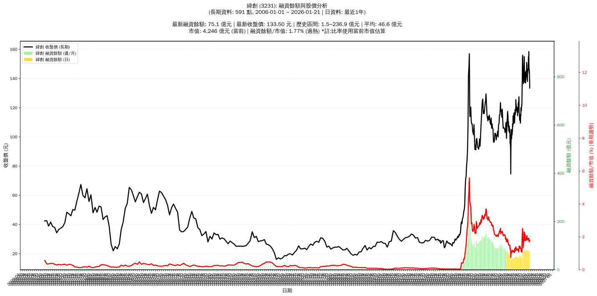

# :chart_with_upwards_trend: 緯創 (3231) 融資餘額報告

!!! info "基本資訊"
    **:building_construction: 名稱**: 緯創
    **:identification_card: 代號**: 3231
    **:calendar: 分析期間**: 2025-07-18 ~ 2026-01-09 (共 242 個交易日)
    **:clock3: 最新資料**: 2026-01-09
    **🕒 更新時間**: 2026-01-11 23:12:44 CST

## :moneybag: 融資餘額現況

| :chart: 指標 | :1234: 數值 | :traffic_light: 狀態 |
|:------------:|:----------:|:-------------------:|
| **最新融資餘額** | 74.8 億元 (50,191 張) | - |
| **最新收盤價** | 149.00 元 | - |
| **市值** | 4,739 億元 | - |
| **融資餘額/市值** | 1.58% | 🔴 過熱 |
| **日變化 (DoD)** | -0.1 億元 (-0.15%) | 📉 |
| **週變化 (WoW)** | -6.4 億元 (-7.90%) | 📉 |
| **月變化 (MoM)** | -9.3 億元 (-11.04%) | 📉 |

---

## :bar_chart: 歷史統計

| :chart: 指標 | :1234: 數值 |
|:------------:|:----------:|
| **歷史最高** | 106.3 億元 |
| **歷史最低** | 31.8 億元 |
| **平均值** | 63.3 億元 |
| **標準差** | 14.9 億元 |
| **當前相對位置** | 57.7% |

---

## :chart_with_upwards_trend: 融資餘額趨勢圖

    

---

## :clipboard: 詳細歷史記錄 (最近30日)

<table class="sortable-table">
<thead>
<tr>
<th>:calendar: 日期</th>
<th>:money_with_wings: 收盤價(元)</th>
<th>:chart: 漲跌(元)</th>
<th>:chart_with_upwards_trend: 漲跌(%)</th>
<th>:package: 融資餘額(億元)</th>
<th>:package: 融資餘額(張)</th>
<th>:arrow_up_down: 融資增減(張)</th>
<th>:chart: 融券餘額(張)</th>
<th>:balance_scale: 券資比(%)</th>
</tr>
</thead>
<tbody>
<tr>
<td>2026-01-09</td>
<td>149.00</td>
<td>🔻 -2.00</td>
<td>-1.32%</td>
<td>74.8</td>
<td>50,191</td>
<td>📈 +592</td>
<td>1,673</td>
<td>3.33%</td>
</tr>
<tr>
<td>2026-01-08</td>
<td>151.00</td>
<td>🔻 -7.50</td>
<td>-4.73%</td>
<td>74.9</td>
<td>49,599</td>
<td>📉 -1,635</td>
<td>1,699</td>
<td>3.43%</td>
</tr>
<tr>
<td>2026-01-07</td>
<td>158.50</td>
<td>🔺 +4.00</td>
<td>+2.59%</td>
<td>81.2</td>
<td>51,234</td>
<td>📈 +1,019</td>
<td>1,891</td>
<td>3.69%</td>
</tr>
<tr>
<td>2026-01-06</td>
<td>154.50</td>
<td>🔻 -0.50</td>
<td>-0.32%</td>
<td>77.6</td>
<td>50,215</td>
<td>📈 +591</td>
<td>1,789</td>
<td>3.56%</td>
</tr>
<tr>
<td>2026-01-05</td>
<td>155.00</td>
<td>➖ +0.00</td>
<td>+0.00%</td>
<td>76.9</td>
<td>49,624</td>
<td>📉 -2,765</td>
<td>1,798</td>
<td>3.62%</td>
</tr>
<tr>
<td>2026-01-02</td>
<td>155.00</td>
<td>🔺 +4.50</td>
<td>+2.99%</td>
<td>81.2</td>
<td>52,389</td>
<td>📉 -596</td>
<td>1,781</td>
<td>3.40%</td>
</tr>
<tr>
<td>2025-12-31</td>
<td>150.50</td>
<td>🔺 +3.50</td>
<td>+2.38%</td>
<td>79.7</td>
<td>52,985</td>
<td>📉 -894</td>
<td>1,721</td>
<td>3.25%</td>
</tr>
<tr>
<td>2025-12-30</td>
<td>147.00</td>
<td>🔺 +1.00</td>
<td>+0.68%</td>
<td>79.2</td>
<td>53,879</td>
<td>📉 -507</td>
<td>1,674</td>
<td>3.11%</td>
</tr>
<tr>
<td>2025-12-29</td>
<td>146.00</td>
<td>🔻 -0.50</td>
<td>-0.34%</td>
<td>79.4</td>
<td>54,386</td>
<td>📉 -137</td>
<td>1,676</td>
<td>3.08%</td>
</tr>
<tr>
<td>2025-12-26</td>
<td>146.50</td>
<td>🔺 +1.00</td>
<td>+0.69%</td>
<td>79.9</td>
<td>54,523</td>
<td>📉 -103</td>
<td>1,666</td>
<td>3.06%</td>
</tr>
<tr>
<td>2025-12-24</td>
<td>145.50</td>
<td>🔺 +0.50</td>
<td>+0.34%</td>
<td>79.5</td>
<td>54,626</td>
<td>📉 -356</td>
<td>1,659</td>
<td>3.04%</td>
</tr>
<tr>
<td>2025-12-23</td>
<td>145.00</td>
<td>🔻 -1.50</td>
<td>-1.02%</td>
<td>79.7</td>
<td>54,982</td>
<td>📉 -413</td>
<td>1,651</td>
<td>3.00%</td>
</tr>
<tr>
<td>2025-12-22</td>
<td>146.50</td>
<td>🔺 +2.50</td>
<td>+1.74%</td>
<td>81.2</td>
<td>55,395</td>
<td>📉 -241</td>
<td>1,664</td>
<td>3.00%</td>
</tr>
<tr>
<td>2025-12-19</td>
<td>144.00</td>
<td>🔺 +4.50</td>
<td>+3.23%</td>
<td>80.1</td>
<td>55,636</td>
<td>📉 -1,298</td>
<td>1,612</td>
<td>2.90%</td>
</tr>
<tr>
<td>2025-12-18</td>
<td>139.50</td>
<td>🔺 +1.50</td>
<td>+1.09%</td>
<td>79.4</td>
<td>56,934</td>
<td>📈 +479</td>
<td>1,581</td>
<td>2.78%</td>
</tr>
<tr>
<td>2025-12-17</td>
<td>138.00</td>
<td>🔻 -1.00</td>
<td>-0.72%</td>
<td>77.9</td>
<td>56,455</td>
<td>📈 +987</td>
<td>1,580</td>
<td>2.80%</td>
</tr>
<tr>
<td>2025-12-16</td>
<td>139.00</td>
<td>🔻 -2.50</td>
<td>-1.77%</td>
<td>77.1</td>
<td>55,468</td>
<td>📈 +172</td>
<td>1,585</td>
<td>2.86%</td>
</tr>
<tr>
<td>2025-12-15</td>
<td>141.50</td>
<td>🔻 -2.00</td>
<td>-1.39%</td>
<td>78.2</td>
<td>55,296</td>
<td>📉 -271</td>
<td>1,626</td>
<td>2.94%</td>
</tr>
<tr>
<td>2025-12-12</td>
<td>143.50</td>
<td>🔻 -0.50</td>
<td>-0.35%</td>
<td>79.7</td>
<td>55,567</td>
<td>📉 -466</td>
<td>1,643</td>
<td>2.96%</td>
</tr>
<tr>
<td>2025-12-11</td>
<td>144.00</td>
<td>🔻 -3.50</td>
<td>-2.37%</td>
<td>80.7</td>
<td>56,033</td>
<td>📉 -963</td>
<td>1,692</td>
<td>3.02%</td>
</tr>
<tr>
<td>2025-12-10</td>
<td>147.50</td>
<td>🔻 -2.00</td>
<td>-1.34%</td>
<td>84.1</td>
<td>56,996</td>
<td>📉 -2,012</td>
<td>1,787</td>
<td>3.14%</td>
</tr>
<tr>
<td>2025-12-09</td>
<td>149.50</td>
<td>🔺 +0.50</td>
<td>+0.34%</td>
<td>88.2</td>
<td>59,008</td>
<td>📈 +1,129</td>
<td>1,752</td>
<td>2.97%</td>
</tr>
<tr>
<td>2025-12-08</td>
<td>149.00</td>
<td>🔻 -2.00</td>
<td>-1.32%</td>
<td>86.2</td>
<td>57,879</td>
<td>📈 +827</td>
<td>1,766</td>
<td>3.05%</td>
</tr>
<tr>
<td>2025-12-05</td>
<td>151.00</td>
<td>🔺 +5.00</td>
<td>+3.42%</td>
<td>86.1</td>
<td>57,052</td>
<td>📈 +1,118</td>
<td>1,833</td>
<td>3.21%</td>
</tr>
<tr>
<td>2025-12-04</td>
<td>146.00</td>
<td>🔺 +1.00</td>
<td>+0.69%</td>
<td>81.7</td>
<td>55,934</td>
<td>📈 +880</td>
<td>1,746</td>
<td>3.12%</td>
</tr>
<tr>
<td>2025-12-03</td>
<td>145.00</td>
<td>🔺 +2.00</td>
<td>+1.40%</td>
<td>79.8</td>
<td>55,054</td>
<td>📉 -983</td>
<td>1,720</td>
<td>3.12%</td>
</tr>
<tr>
<td>2025-12-02</td>
<td>143.00</td>
<td>🔺 +2.00</td>
<td>+1.42%</td>
<td>80.1</td>
<td>56,037</td>
<td>📈 +259</td>
<td>1,708</td>
<td>3.05%</td>
</tr>
<tr>
<td>2025-12-01</td>
<td>141.00</td>
<td>🔻 -3.50</td>
<td>-2.42%</td>
<td>78.6</td>
<td>55,778</td>
<td>📈 +73</td>
<td>1,697</td>
<td>3.04%</td>
</tr>
<tr>
<td>2025-11-28</td>
<td>144.50</td>
<td>🔻 -1.00</td>
<td>-0.69%</td>
<td>80.5</td>
<td>55,705</td>
<td>📈 +1,278</td>
<td>1,743</td>
<td>3.13%</td>
</tr>
<tr>
<td>2025-11-27</td>
<td>145.50</td>
<td>🔺 +3.00</td>
<td>+2.11%</td>
<td>79.2</td>
<td>54,427</td>
<td>📉 -724</td>
<td>1,813</td>
<td>3.33%</td>
</tr>
</tbody>
</table>

---

## :information_source: 資料來源與方法

!!! note "資料來源說明"
    - **主要來源**: `raw_margin_daily.csv` (Type 13: ShowMarginChart)
    - **資料頻率**: 每日更新
    - **資料範圍**: 近1年交易日資料

!!! info "報告元資訊"
    - **報告產生時間**: 2026-01-11 23:12:44
    - **分析期間**: 242 個交易日
    - **資料來源**: Stage 1 Raw Margin Daily Data

---

:material-information-outline: **本報告僅供參考，投資決策請審慎評估**

