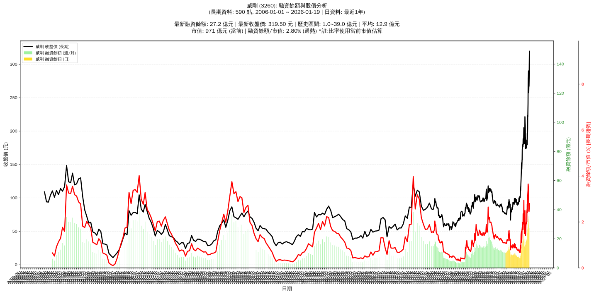

# :chart_with_upwards_trend: 威剛 (3260) 融資餘額報告

!!! info "基本資訊"
    **:building_construction: 名稱**: 威剛
    **:identification_card: 代號**: 3260
    **:calendar: 分析期間**: 2025-07-18 ~ 2026-01-09 (共 242 個交易日)
    **:clock3: 最新資料**: 2026-01-09
    **🕒 更新時間**: 2026-01-11 23:12:23 CST

## :moneybag: 融資餘額現況

| :chart: 指標 | :1234: 數值 | :traffic_light: 狀態 |
|:------------:|:----------:|:-------------------:|
| **最新融資餘額** | 24.0 億元 (9,339 張) | - |
| **最新收盤價** | 257.50 元 | - |
| **市值** | 839 億元 | - |
| **融資餘額/市值** | 2.87% | 🔴 過熱 |
| **日變化 (DoD)** | -5.2 億元 (-17.82%) | 📉 |
| **週變化 (WoW)** | -10.6 億元 (-30.68%) | 📉 |
| **月變化 (MoM)** | +4.5 億元 (+22.77%) | 📈 |

---

## :bar_chart: 歷史統計

| :chart: 指標 | :1234: 數值 |
|:------------:|:----------:|
| **歷史最高** | 35.5 億元 |
| **歷史最低** | 6.5 億元 |
| **平均值** | 13.1 億元 |
| **標準差** | 6.4 億元 |
| **當前相對位置** | 60.6% |

---

## :chart_with_upwards_trend: 融資餘額趨勢圖

{: style="max-width: 100%; height: auto;"}

---

## :clipboard: 詳細歷史記錄 (最近30日)

<table class="sortable-table">
<thead>
<tr>
<th>:calendar: 日期</th>
<th>:money_with_wings: 收盤價(元)</th>
<th>:chart: 漲跌(元)</th>
<th>:chart_with_upwards_trend: 漲跌(%)</th>
<th>:package: 融資餘額(億元)</th>
<th>:package: 融資餘額(張)</th>
<th>:arrow_up_down: 融資增減(張)</th>
<th>:chart: 融券餘額(張)</th>
<th>:balance_scale: 券資比(%)</th>
</tr>
</thead>
<tbody>
<tr>
<td>2026-01-09</td>
<td>257.50</td>
<td>🔻 -28.50</td>
<td>-9.97%</td>
<td>24.0</td>
<td>9,339</td>
<td>📉 -893</td>
<td>1,995</td>
<td>21.40%</td>
</tr>
<tr>
<td>2026-01-08</td>
<td>286.00</td>
<td>🔻 -4.00</td>
<td>-1.38%</td>
<td>29.3</td>
<td>10,232</td>
<td>📉 -256</td>
<td>2,461</td>
<td>24.10%</td>
</tr>
<tr>
<td>2026-01-07</td>
<td>290.00</td>
<td>🔺 +1.00</td>
<td>+0.35%</td>
<td>30.4</td>
<td>10,488</td>
<td>📉 -556</td>
<td>2,567</td>
<td>24.50%</td>
</tr>
<tr>
<td>2026-01-06</td>
<td>289.00</td>
<td>🔻 -1.00</td>
<td>-0.34%</td>
<td>31.9</td>
<td>11,044</td>
<td>📉 -513</td>
<td>2,931</td>
<td>26.50%</td>
</tr>
<tr>
<td>2026-01-05</td>
<td>290.00</td>
<td>🔺 +9.50</td>
<td>+3.39%</td>
<td>33.5</td>
<td>11,557</td>
<td>📉 -810</td>
<td>2,677</td>
<td>23.20%</td>
</tr>
<tr>
<td>2026-01-02</td>
<td>280.50</td>
<td>🔺 +1.00</td>
<td>+0.36%</td>
<td>34.7</td>
<td>12,367</td>
<td>📉 -318</td>
<td>2,393</td>
<td>19.30%</td>
</tr>
<tr>
<td>2025-12-31</td>
<td>279.50</td>
<td>🔺 +19.00</td>
<td>+7.29%</td>
<td>35.5</td>
<td>12,685</td>
<td>📉 -919</td>
<td>2,916</td>
<td>23.00%</td>
</tr>
<tr>
<td>2025-12-30</td>
<td>260.50</td>
<td>🔺 +19.50</td>
<td>+8.09%</td>
<td>35.4</td>
<td>13,604</td>
<td>📉 -48</td>
<td>2,554</td>
<td>18.80%</td>
</tr>
<tr>
<td>2025-12-29</td>
<td>241.00</td>
<td>🔺 +19.50</td>
<td>+8.80%</td>
<td>32.9</td>
<td>13,652</td>
<td>📉 -600</td>
<td>2,378</td>
<td>17.40%</td>
</tr>
<tr>
<td>2025-12-26</td>
<td>221.50</td>
<td>🔻 -2.00</td>
<td>-0.89%</td>
<td>31.6</td>
<td>14,252</td>
<td>📈 +593</td>
<td>2,120</td>
<td>14.90%</td>
</tr>
<tr>
<td>2025-12-24</td>
<td>223.50</td>
<td>🔺 +20.00</td>
<td>+9.83%</td>
<td>30.5</td>
<td>13,659</td>
<td>📉 -89</td>
<td>2,214</td>
<td>16.20%</td>
</tr>
<tr>
<td>2025-12-23</td>
<td>203.50</td>
<td>🔺 +3.50</td>
<td>+1.75%</td>
<td>28.0</td>
<td>13,748</td>
<td>📈 +568</td>
<td>1,639</td>
<td>11.90%</td>
</tr>
<tr>
<td>2025-12-22</td>
<td>200.00</td>
<td>🔺 +11.50</td>
<td>+6.10%</td>
<td>26.4</td>
<td>13,180</td>
<td>📈 +474</td>
<td>1,816</td>
<td>13.80%</td>
</tr>
<tr>
<td>2025-12-19</td>
<td>188.50</td>
<td>🔻 -3.00</td>
<td>-1.57%</td>
<td>24.0</td>
<td>12,706</td>
<td>📈 +501</td>
<td>1,753</td>
<td>13.80%</td>
</tr>
<tr>
<td>2025-12-18</td>
<td>191.50</td>
<td>🔻 -5.00</td>
<td>-2.54%</td>
<td>23.4</td>
<td>12,205</td>
<td>📉 -1,487</td>
<td>1,861</td>
<td>15.20%</td>
</tr>
<tr>
<td>2025-12-17</td>
<td>196.50</td>
<td>🔺 +17.00</td>
<td>+9.47%</td>
<td>26.9</td>
<td>13,692</td>
<td>📈 +441</td>
<td>1,915</td>
<td>14.00%</td>
</tr>
<tr>
<td>2025-12-16</td>
<td>179.50</td>
<td>🔻 -6.50</td>
<td>-3.49%</td>
<td>23.8</td>
<td>13,251</td>
<td>📉 -27</td>
<td>1,168</td>
<td>8.81%</td>
</tr>
<tr>
<td>2025-12-15</td>
<td>186.00</td>
<td>🔺 +0.50</td>
<td>+0.27%</td>
<td>24.7</td>
<td>13,278</td>
<td>📈 +435</td>
<td>1,119</td>
<td>8.43%</td>
</tr>
<tr>
<td>2025-12-12</td>
<td>185.50</td>
<td>🔺 +3.50</td>
<td>+1.92%</td>
<td>23.8</td>
<td>12,843</td>
<td>📈 +2,134</td>
<td>1,078</td>
<td>8.39%</td>
</tr>
<tr>
<td>2025-12-11</td>
<td>182.00</td>
<td>🔺 +1.50</td>
<td>+0.83%</td>
<td>19.5</td>
<td>10,709</td>
<td>📉 -143</td>
<td>1,071</td>
<td>10.00%</td>
</tr>
<tr>
<td>2025-12-10</td>
<td>180.50</td>
<td>🔻 -6.00</td>
<td>-3.22%</td>
<td>19.6</td>
<td>10,852</td>
<td>📈 +325</td>
<td>1,120</td>
<td>10.30%</td>
</tr>
<tr>
<td>2025-12-09</td>
<td>186.50</td>
<td>🔺 +5.50</td>
<td>+3.04%</td>
<td>19.6</td>
<td>10,527</td>
<td>📈 +60</td>
<td>1,078</td>
<td>10.20%</td>
</tr>
<tr>
<td>2025-12-08</td>
<td>181.00</td>
<td>🔺 +4.00</td>
<td>+2.26%</td>
<td>18.9</td>
<td>10,467</td>
<td>📉 -92</td>
<td>997</td>
<td>9.53%</td>
</tr>
<tr>
<td>2025-12-05</td>
<td>177.00</td>
<td>🔺 +1.00</td>
<td>+0.57%</td>
<td>18.7</td>
<td>10,559</td>
<td>📉 -90</td>
<td>1,006</td>
<td>9.53%</td>
</tr>
<tr>
<td>2025-12-04</td>
<td>176.00</td>
<td>🔺 +1.50</td>
<td>+0.86%</td>
<td>18.7</td>
<td>10,649</td>
<td>📉 -381</td>
<td>1,022</td>
<td>9.60%</td>
</tr>
<tr>
<td>2025-12-03</td>
<td>174.50</td>
<td>🔻 -1.50</td>
<td>-0.85%</td>
<td>19.2</td>
<td>11,030</td>
<td>📈 +362</td>
<td>965</td>
<td>8.75%</td>
</tr>
<tr>
<td>2025-12-02</td>
<td>176.00</td>
<td>🔺 +1.00</td>
<td>+0.57%</td>
<td>18.8</td>
<td>10,668</td>
<td>📈 +20</td>
<td>971</td>
<td>9.10%</td>
</tr>
<tr>
<td>2025-12-01</td>
<td>175.00</td>
<td>🔻 -2.50</td>
<td>-1.41%</td>
<td>18.6</td>
<td>10,648</td>
<td>📈 +382</td>
<td>993</td>
<td>9.33%</td>
</tr>
<tr>
<td>2025-11-28</td>
<td>177.50</td>
<td>🔺 +1.50</td>
<td>+0.85%</td>
<td>18.2</td>
<td>10,266</td>
<td>📈 +226</td>
<td>1,015</td>
<td>9.89%</td>
</tr>
<tr>
<td>2025-11-27</td>
<td>176.00</td>
<td>🔺 +1.50</td>
<td>+0.86%</td>
<td>17.7</td>
<td>10,040</td>
<td>📈 +1,025</td>
<td>1,002</td>
<td>9.98%</td>
</tr>
</tbody>
</table>

---

## :information_source: 資料來源與方法

!!! note "資料來源說明"
    - **主要來源**: `raw_margin_daily.csv` (Type 13: ShowMarginChart)
    - **資料頻率**: 每日更新
    - **資料範圍**: 近1年交易日資料

!!! info "報告元資訊"
    - **報告產生時間**: 2026-01-11 23:12:23
    - **分析期間**: 242 個交易日
    - **資料來源**: Stage 1 Raw Margin Daily Data

---

:material-information-outline: **本報告僅供參考，投資決策請審慎評估**

