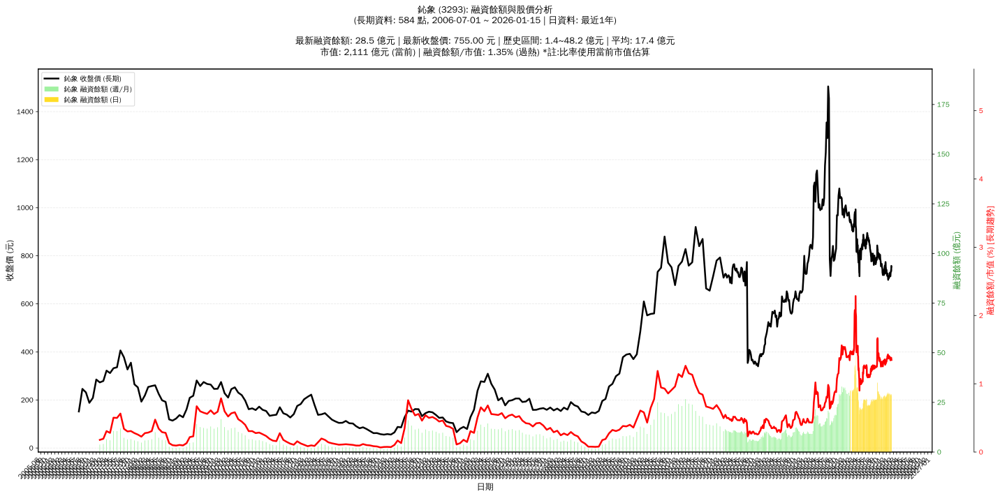

# :chart_with_upwards_trend: 鈊象 (3293) 融資餘額報告

!!! info "基本資訊"
    **:building_construction: 名稱**: 鈊象
    **:identification_card: 代號**: 3293
    **:calendar: 分析期間**: 2025-07-18 ~ 2026-01-09 (共 242 個交易日)
    **:clock3: 最新資料**: 2026-01-09
    **🕒 更新時間**: 2026-01-12 12:09:41 CST

## :moneybag: 融資餘額現況

| :chart: 指標 | :1234: 數值 | :traffic_light: 狀態 |
|:------------:|:----------:|:-------------------:|
| **最新融資餘額** | 28.9 億元 (3,956 張) | - |
| **最新收盤價** | 731.00 元 | - |
| **市值** | 2,060 億元 | - |
| **融資餘額/市值** | 1.40% | 🔴 過熱 |
| **日變化 (DoD)** | -0.1 億元 (-0.47%) | 📉 |
| **週變化 (WoW)** | +0.1 億元 (+0.49%) | 📈 |
| **月變化 (MoM)** | -0.7 億元 (-2.51%) | 📉 |

---

## :bar_chart: 歷史統計

| :chart: 指標 | :1234: 數值 |
|:------------:|:----------:|
| **歷史最高** | 48.2 億元 |
| **歷史最低** | 19.0 億元 |
| **平均值** | 27.7 億元 |
| **標準差** | 4.3 億元 |
| **當前相對位置** | 33.9% |

---

## :chart_with_upwards_trend: 融資餘額趨勢圖

    

---

## :clipboard: 詳細歷史記錄 (最近30日)

<table class="sortable-table">
<thead>
<tr>
<th>:calendar: 日期</th>
<th>:money_with_wings: 收盤價(元)</th>
<th>:chart: 漲跌(元)</th>
<th>:chart_with_upwards_trend: 漲跌(%)</th>
<th>:package: 融資餘額(億元)</th>
<th>:package: 融資餘額(張)</th>
<th>:arrow_up_down: 融資增減(張)</th>
<th>:chart: 融券餘額(張)</th>
<th>:balance_scale: 券資比(%)</th>
</tr>
</thead>
<tbody>
<tr>
<td>2026-01-09</td>
<td>731.00</td>
<td>🔺 +1.00</td>
<td>+0.14%</td>
<td>28.9</td>
<td>3,956</td>
<td>📉 -24</td>
<td>4</td>
<td>0.10%</td>
</tr>
<tr>
<td>2026-01-08</td>
<td>730.00</td>
<td>🔺 +6.00</td>
<td>+0.83%</td>
<td>29.1</td>
<td>3,980</td>
<td>📉 -18</td>
<td>6</td>
<td>0.15%</td>
</tr>
<tr>
<td>2026-01-07</td>
<td>724.00</td>
<td>🔺 +9.00</td>
<td>+1.26%</td>
<td>28.9</td>
<td>3,998</td>
<td>📈 +30</td>
<td>4</td>
<td>0.10%</td>
</tr>
<tr>
<td>2026-01-06</td>
<td>715.00</td>
<td>🔻 -2.00</td>
<td>-0.28%</td>
<td>28.4</td>
<td>3,968</td>
<td>📉 -16</td>
<td>4</td>
<td>0.10%</td>
</tr>
<tr>
<td>2026-01-05</td>
<td>717.00</td>
<td>🔻 -13.00</td>
<td>-1.78%</td>
<td>28.6</td>
<td>3,984</td>
<td>📈 +42</td>
<td>6</td>
<td>0.15%</td>
</tr>
<tr>
<td>2026-01-02</td>
<td>730.00</td>
<td>🔺 +9.00</td>
<td>+1.25%</td>
<td>28.8</td>
<td>3,942</td>
<td>📉 -136</td>
<td>13</td>
<td>0.33%</td>
</tr>
<tr>
<td>2025-12-31</td>
<td>721.00</td>
<td>🔻 -1.00</td>
<td>-0.14%</td>
<td>29.4</td>
<td>4,078</td>
<td>📉 -5</td>
<td>13</td>
<td>0.32%</td>
</tr>
<tr>
<td>2025-12-30</td>
<td>722.00</td>
<td>🔻 -5.00</td>
<td>-0.69%</td>
<td>29.5</td>
<td>4,083</td>
<td>📈 +78</td>
<td>12</td>
<td>0.29%</td>
</tr>
<tr>
<td>2025-12-29</td>
<td>727.00</td>
<td>🔺 +18.00</td>
<td>+2.54%</td>
<td>29.1</td>
<td>4,005</td>
<td>📉 -134</td>
<td>13</td>
<td>0.32%</td>
</tr>
<tr>
<td>2025-12-26</td>
<td>709.00</td>
<td>🔻 -2.00</td>
<td>-0.28%</td>
<td>29.3</td>
<td>4,139</td>
<td>📉 -18</td>
<td>5</td>
<td>0.12%</td>
</tr>
<tr>
<td>2025-12-24</td>
<td>711.00</td>
<td>🔺 +1.00</td>
<td>+0.14%</td>
<td>29.6</td>
<td>4,157</td>
<td>📉 -31</td>
<td>5</td>
<td>0.12%</td>
</tr>
<tr>
<td>2025-12-23</td>
<td>710.00</td>
<td>🔺 +4.00</td>
<td>+0.57%</td>
<td>29.7</td>
<td>4,188</td>
<td>📈 +53</td>
<td>5</td>
<td>0.12%</td>
</tr>
<tr>
<td>2025-12-22</td>
<td>706.00</td>
<td>🔻 -2.00</td>
<td>-0.28%</td>
<td>29.2</td>
<td>4,135</td>
<td>📈 +8</td>
<td>5</td>
<td>0.12%</td>
</tr>
<tr>
<td>2025-12-19</td>
<td>708.00</td>
<td>🔺 +5.00</td>
<td>+0.71%</td>
<td>29.2</td>
<td>4,127</td>
<td>📈 +8</td>
<td>5</td>
<td>0.12%</td>
</tr>
<tr>
<td>2025-12-18</td>
<td>703.00</td>
<td>🔺 +3.00</td>
<td>+0.43%</td>
<td>29.0</td>
<td>4,119</td>
<td>📉 -10</td>
<td>4</td>
<td>0.10%</td>
</tr>
<tr>
<td>2025-12-17</td>
<td>700.00</td>
<td>🔻 -5.00</td>
<td>-0.71%</td>
<td>28.9</td>
<td>4,129</td>
<td>📉 -18</td>
<td>4</td>
<td>0.10%</td>
</tr>
<tr>
<td>2025-12-16</td>
<td>705.00</td>
<td>🔻 -11.00</td>
<td>-1.54%</td>
<td>29.2</td>
<td>4,147</td>
<td>📉 -66</td>
<td>3</td>
<td>0.07%</td>
</tr>
<tr>
<td>2025-12-15</td>
<td>716.00</td>
<td>🔻 -1.00</td>
<td>-0.14%</td>
<td>30.2</td>
<td>4,213</td>
<td>📈 +95</td>
<td>4</td>
<td>0.09%</td>
</tr>
<tr>
<td>2025-12-12</td>
<td>717.00</td>
<td>🔻 -2.00</td>
<td>-0.28%</td>
<td>29.5</td>
<td>4,118</td>
<td>📈 +22</td>
<td>4</td>
<td>0.10%</td>
</tr>
<tr>
<td>2025-12-11</td>
<td>719.00</td>
<td>🔻 -8.00</td>
<td>-1.10%</td>
<td>29.5</td>
<td>4,096</td>
<td>📈 +16</td>
<td>4</td>
<td>0.10%</td>
</tr>
<tr>
<td>2025-12-10</td>
<td>727.00</td>
<td>🔺 +11.00</td>
<td>+1.54%</td>
<td>29.7</td>
<td>4,080</td>
<td>📈 +28</td>
<td>4</td>
<td>0.10%</td>
</tr>
<tr>
<td>2025-12-09</td>
<td>716.00</td>
<td>🔻 -3.00</td>
<td>-0.42%</td>
<td>29.0</td>
<td>4,052</td>
<td>📈 +24</td>
<td>4</td>
<td>0.10%</td>
</tr>
<tr>
<td>2025-12-08</td>
<td>719.00</td>
<td>🔻 -6.00</td>
<td>-0.83%</td>
<td>29.0</td>
<td>4,028</td>
<td>📈 +48</td>
<td>6</td>
<td>0.15%</td>
</tr>
<tr>
<td>2025-12-05</td>
<td>725.00</td>
<td>🔻 -1.00</td>
<td>-0.14%</td>
<td>28.9</td>
<td>3,980</td>
<td>📈 +52</td>
<td>8</td>
<td>0.20%</td>
</tr>
<tr>
<td>2025-12-04</td>
<td>726.00</td>
<td>🔻 -15.00</td>
<td>-2.02%</td>
<td>28.5</td>
<td>3,928</td>
<td>📈 +145</td>
<td>21</td>
<td>0.53%</td>
</tr>
<tr>
<td>2025-12-03</td>
<td>741.00</td>
<td>🔺 +2.00</td>
<td>+0.27%</td>
<td>28.0</td>
<td>3,783</td>
<td>📉 -2</td>
<td>9</td>
<td>0.24%</td>
</tr>
<tr>
<td>2025-12-02</td>
<td>739.00</td>
<td>➖ +0.00</td>
<td>+0.00%</td>
<td>28.0</td>
<td>3,785</td>
<td>📈 +13</td>
<td>9</td>
<td>0.24%</td>
</tr>
<tr>
<td>2025-12-01</td>
<td>739.00</td>
<td>🔻 -4.00</td>
<td>-0.54%</td>
<td>27.9</td>
<td>3,772</td>
<td>📈 +47</td>
<td>8</td>
<td>0.21%</td>
</tr>
<tr>
<td>2025-11-28</td>
<td>743.00</td>
<td>🔻 -8.00</td>
<td>-1.07%</td>
<td>27.7</td>
<td>3,725</td>
<td>📈 +53</td>
<td>7</td>
<td>0.19%</td>
</tr>
<tr>
<td>2025-11-27</td>
<td>751.00</td>
<td>🔺 +1.00</td>
<td>+0.13%</td>
<td>27.6</td>
<td>3,672</td>
<td>📈 +25</td>
<td>9</td>
<td>0.25%</td>
</tr>
</tbody>
</table>

---

## :information_source: 資料來源與方法

!!! note "資料來源說明"
    - **主要來源**: `raw_margin_daily.csv` (Type 13: ShowMarginChart)
    - **資料頻率**: 每日更新
    - **資料範圍**: 近1年交易日資料

!!! info "報告元資訊"
    - **報告產生時間**: 2026-01-12 12:09:41
    - **分析期間**: 242 個交易日
    - **資料來源**: Stage 1 Raw Margin Daily Data

---

:material-information-outline: **本報告僅供參考，投資決策請審慎評估**

