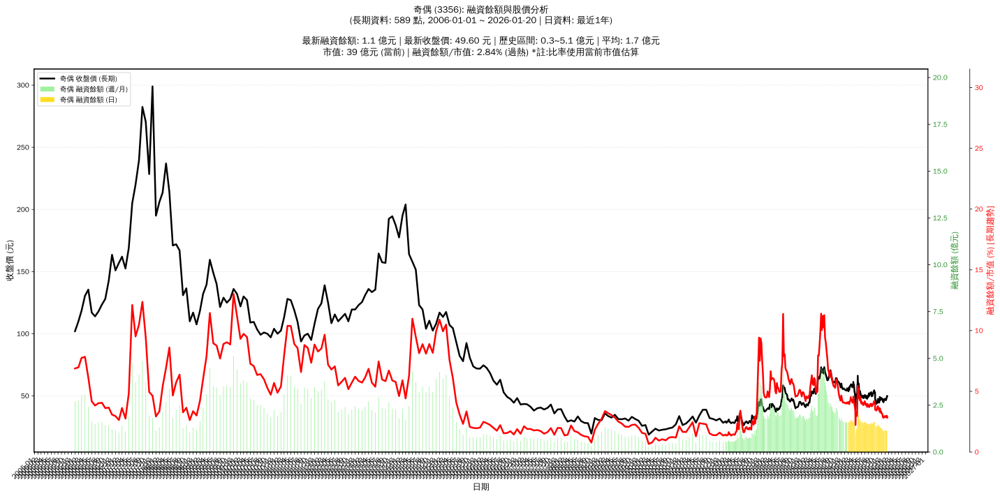

# :chart_with_upwards_trend: 奇偶 (3356) 融資餘額報告

!!! info "基本資訊"
    **:building_construction: 名稱**: 奇偶
    **:identification_card: 代號**: 3356
    **:calendar: 分析期間**: 2025-07-18 ~ 2026-01-09 (共 242 個交易日)
    **:clock3: 最新資料**: 2026-01-09
    **🕒 更新時間**: 2026-01-11 23:11:25 CST

## :moneybag: 融資餘額現況

| :chart: 指標 | :1234: 數值 | :traffic_light: 狀態 |
|:------------:|:----------:|:-------------------:|
| **最新融資餘額** | 1.1 億元 (2,424 張) | - |
| **最新收盤價** | 46.55 元 | - |
| **市值** | 37 億元 | - |
| **融資餘額/市值** | 3.03% | 🔴 過熱 |
| **日變化 (DoD)** | +0.0 億元 (+0.30%) | 📈 |
| **週變化 (WoW)** | -0.0 億元 (-1.91%) | 📉 |
| **月變化 (MoM)** | -0.0 億元 (-3.16%) | 📉 |

---

## :bar_chart: 歷史統計

| :chart: 指標 | :1234: 數值 |
|:------------:|:----------:|
| **歷史最高** | 2.1 億元 |
| **歷史最低** | 0.9 億元 |
| **平均值** | 1.5 億元 |
| **標準差** | 0.2 億元 |
| **當前相對位置** | 20.1% |

---

## :chart_with_upwards_trend: 融資餘額趨勢圖

    

---

## :clipboard: 詳細歷史記錄 (最近30日)

<table class="sortable-table">
<thead>
<tr>
<th>:calendar: 日期</th>
<th>:money_with_wings: 收盤價(元)</th>
<th>:chart: 漲跌(元)</th>
<th>:chart_with_upwards_trend: 漲跌(%)</th>
<th>:package: 融資餘額(億元)</th>
<th>:package: 融資餘額(張)</th>
<th>:arrow_up_down: 融資增減(張)</th>
<th>:chart: 融券餘額(張)</th>
<th>:balance_scale: 券資比(%)</th>
</tr>
</thead>
<tbody>
<tr>
<td>2026-01-09</td>
<td>46.55</td>
<td>🔻 -0.15</td>
<td>-0.32%</td>
<td>1.1</td>
<td>2,424</td>
<td>📈 +15</td>
<td>2</td>
<td>0.08%</td>
</tr>
<tr>
<td>2026-01-08</td>
<td>46.70</td>
<td>🔻 -0.80</td>
<td>-1.68%</td>
<td>1.1</td>
<td>2,409</td>
<td>📈 +5</td>
<td>2</td>
<td>0.08%</td>
</tr>
<tr>
<td>2026-01-07</td>
<td>47.50</td>
<td>🔺 +0.40</td>
<td>+0.85%</td>
<td>1.1</td>
<td>2,404</td>
<td>📉 -25</td>
<td>3</td>
<td>0.12%</td>
</tr>
<tr>
<td>2026-01-06</td>
<td>47.10</td>
<td>🔻 -0.15</td>
<td>-0.32%</td>
<td>1.1</td>
<td>2,429</td>
<td>📉 -26</td>
<td>3</td>
<td>0.12%</td>
</tr>
<tr>
<td>2026-01-05</td>
<td>47.25</td>
<td>🔻 -0.05</td>
<td>-0.11%</td>
<td>1.2</td>
<td>2,455</td>
<td>📈 +23</td>
<td>3</td>
<td>0.12%</td>
</tr>
<tr>
<td>2026-01-02</td>
<td>47.30</td>
<td>🔺 +0.30</td>
<td>+0.64%</td>
<td>1.2</td>
<td>2,432</td>
<td>📉 -14</td>
<td>3</td>
<td>0.12%</td>
</tr>
<tr>
<td>2025-12-31</td>
<td>47.00</td>
<td>🔺 +0.25</td>
<td>+0.53%</td>
<td>1.1</td>
<td>2,446</td>
<td>📉 -26</td>
<td>4</td>
<td>0.16%</td>
</tr>
<tr>
<td>2025-12-30</td>
<td>46.75</td>
<td>🔻 -0.85</td>
<td>-1.79%</td>
<td>1.2</td>
<td>2,472</td>
<td>📈 +27</td>
<td>4</td>
<td>0.16%</td>
</tr>
<tr>
<td>2025-12-29</td>
<td>47.60</td>
<td>🔺 +1.15</td>
<td>+2.48%</td>
<td>1.2</td>
<td>2,445</td>
<td>📈 +7</td>
<td>4</td>
<td>0.16%</td>
</tr>
<tr>
<td>2025-12-26</td>
<td>46.45</td>
<td>🔻 -0.55</td>
<td>-1.17%</td>
<td>1.1</td>
<td>2,439</td>
<td>📈 +15</td>
<td>4</td>
<td>0.16%</td>
</tr>
<tr>
<td>2025-12-24</td>
<td>47.00</td>
<td>🔻 -0.45</td>
<td>-0.95%</td>
<td>1.1</td>
<td>2,424</td>
<td>📈 +23</td>
<td>5</td>
<td>0.21%</td>
</tr>
<tr>
<td>2025-12-23</td>
<td>47.45</td>
<td>🔺 +0.55</td>
<td>+1.17%</td>
<td>1.1</td>
<td>2,401</td>
<td>📉 -58</td>
<td>10</td>
<td>0.42%</td>
</tr>
<tr>
<td>2025-12-22</td>
<td>46.90</td>
<td>🔺 +1.55</td>
<td>+3.42%</td>
<td>1.2</td>
<td>2,459</td>
<td>📉 -17</td>
<td>10</td>
<td>0.41%</td>
</tr>
<tr>
<td>2025-12-19</td>
<td>45.35</td>
<td>🔺 +0.45</td>
<td>+1.00%</td>
<td>1.1</td>
<td>2,476</td>
<td>📈 +10</td>
<td>6</td>
<td>0.24%</td>
</tr>
<tr>
<td>2025-12-18</td>
<td>44.90</td>
<td>🔻 -0.35</td>
<td>-0.77%</td>
<td>1.1</td>
<td>2,466</td>
<td>📈 +5</td>
<td>6</td>
<td>0.24%</td>
</tr>
<tr>
<td>2025-12-17</td>
<td>45.25</td>
<td>🔺 +0.25</td>
<td>+0.56%</td>
<td>1.1</td>
<td>2,461</td>
<td>📉 -6</td>
<td>6</td>
<td>0.24%</td>
</tr>
<tr>
<td>2025-12-16</td>
<td>45.00</td>
<td>🔻 -0.50</td>
<td>-1.10%</td>
<td>1.1</td>
<td>2,467</td>
<td>📈 +4</td>
<td>4</td>
<td>0.16%</td>
</tr>
<tr>
<td>2025-12-15</td>
<td>45.50</td>
<td>🔻 -0.20</td>
<td>-0.44%</td>
<td>1.1</td>
<td>2,463</td>
<td>📉 -10</td>
<td>5</td>
<td>0.20%</td>
</tr>
<tr>
<td>2025-12-12</td>
<td>45.70</td>
<td>🔺 +0.10</td>
<td>+0.22%</td>
<td>1.1</td>
<td>2,473</td>
<td>📉 -11</td>
<td>5</td>
<td>0.20%</td>
</tr>
<tr>
<td>2025-12-11</td>
<td>45.60</td>
<td>🔻 -0.60</td>
<td>-1.30%</td>
<td>1.1</td>
<td>2,484</td>
<td>📉 -38</td>
<td>5</td>
<td>0.20%</td>
</tr>
<tr>
<td>2025-12-10</td>
<td>46.20</td>
<td>🔻 -0.45</td>
<td>-0.96%</td>
<td>1.2</td>
<td>2,522</td>
<td>📉 -7</td>
<td>4</td>
<td>0.16%</td>
</tr>
<tr>
<td>2025-12-09</td>
<td>46.65</td>
<td>🔻 -0.80</td>
<td>-1.69%</td>
<td>1.2</td>
<td>2,529</td>
<td>📉 -27</td>
<td>6</td>
<td>0.24%</td>
</tr>
<tr>
<td>2025-12-08</td>
<td>47.45</td>
<td>🔺 +0.55</td>
<td>+1.17%</td>
<td>1.2</td>
<td>2,558</td>
<td>📉 -45</td>
<td>6</td>
<td>0.23%</td>
</tr>
<tr>
<td>2025-12-05</td>
<td>46.90</td>
<td>🔻 -1.10</td>
<td>-2.29%</td>
<td>1.2</td>
<td>2,604</td>
<td>📉 -2</td>
<td>8</td>
<td>0.31%</td>
</tr>
<tr>
<td>2025-12-04</td>
<td>48.00</td>
<td>🔺 +0.05</td>
<td>+0.10%</td>
<td>1.3</td>
<td>2,606</td>
<td>📉 -10</td>
<td>9</td>
<td>0.35%</td>
</tr>
<tr>
<td>2025-12-03</td>
<td>47.95</td>
<td>➖ +0.00</td>
<td>+0.00%</td>
<td>1.3</td>
<td>2,616</td>
<td>📉 -9</td>
<td>9</td>
<td>0.34%</td>
</tr>
<tr>
<td>2025-12-02</td>
<td>47.95</td>
<td>🔺 +0.35</td>
<td>+0.74%</td>
<td>1.3</td>
<td>2,625</td>
<td>📉 -1</td>
<td>9</td>
<td>0.34%</td>
</tr>
<tr>
<td>2025-12-01</td>
<td>47.60</td>
<td>🔻 -0.60</td>
<td>-1.24%</td>
<td>1.3</td>
<td>2,628</td>
<td>📉 -18</td>
<td>8</td>
<td>0.30%</td>
</tr>
<tr>
<td>2025-11-28</td>
<td>48.20</td>
<td>🔻 -0.10</td>
<td>-0.21%</td>
<td>1.3</td>
<td>2,646</td>
<td>📉 -8</td>
<td>8</td>
<td>0.30%</td>
</tr>
<tr>
<td>2025-11-27</td>
<td>48.30</td>
<td>🔻 -0.10</td>
<td>-0.21%</td>
<td>1.3</td>
<td>2,654</td>
<td>📉 -71</td>
<td>11</td>
<td>0.41%</td>
</tr>
</tbody>
</table>

---

## :information_source: 資料來源與方法

!!! note "資料來源說明"
    - **主要來源**: `raw_margin_daily.csv` (Type 13: ShowMarginChart)
    - **資料頻率**: 每日更新
    - **資料範圍**: 近1年交易日資料

!!! info "報告元資訊"
    - **報告產生時間**: 2026-01-11 23:11:25
    - **分析期間**: 242 個交易日
    - **資料來源**: Stage 1 Raw Margin Daily Data

---

:material-information-outline: **本報告僅供參考，投資決策請審慎評估**

