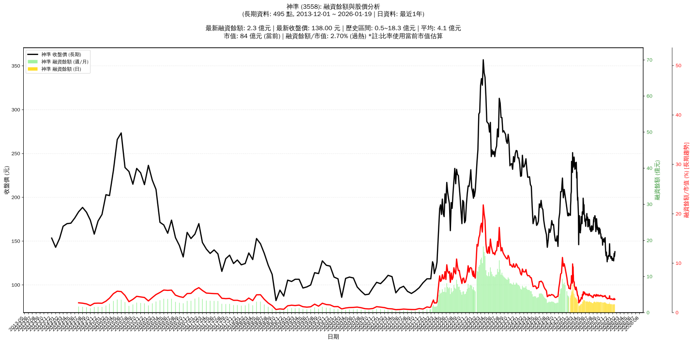

# :chart_with_upwards_trend: 神準 (3558) 融資餘額報告

!!! info "基本資訊"
    **:building_construction: 名稱**: 神準
    **:identification_card: 代號**: 3558
    **:calendar: 分析期間**: 2025-07-18 ~ 2026-01-09 (共 242 個交易日)
    **:clock3: 最新資料**: 2026-01-09
    **🕒 更新時間**: 2026-01-11 23:12:51 CST

## :moneybag: 融資餘額現況

| :chart: 指標 | :1234: 數值 | :traffic_light: 狀態 |
|:------------:|:----------:|:-------------------:|
| **最新融資餘額** | 2.3 億元 (1,774 張) | - |
| **最新收盤價** | 127.50 元 | - |
| **市值** | 75 億元 | - |
| **融資餘額/市值** | 3.00% | 🔴 過熱 |
| **日變化 (DoD)** | +0.0 億元 (+1.85%) | 📈 |
| **週變化 (WoW)** | +0.0 億元 (+0.25%) | 📈 |
| **月變化 (MoM)** | -0.2 億元 (-6.41%) | 📉 |

---

## :bar_chart: 歷史統計

| :chart: 指標 | :1234: 數值 |
|:------------:|:----------:|
| **歷史最高** | 8.3 億元 |
| **歷史最低** | 1.7 億元 |
| **平均值** | 3.2 億元 |
| **標準差** | 1.0 億元 |
| **當前相對位置** | 9.1% |

---

## :chart_with_upwards_trend: 融資餘額趨勢圖

    

---

## :clipboard: 詳細歷史記錄 (最近30日)

<table class="sortable-table">
<thead>
<tr>
<th>:calendar: 日期</th>
<th>:money_with_wings: 收盤價(元)</th>
<th>:chart: 漲跌(元)</th>
<th>:chart_with_upwards_trend: 漲跌(%)</th>
<th>:package: 融資餘額(億元)</th>
<th>:package: 融資餘額(張)</th>
<th>:arrow_up_down: 融資增減(張)</th>
<th>:chart: 融券餘額(張)</th>
<th>:balance_scale: 券資比(%)</th>
</tr>
</thead>
<tbody>
<tr>
<td>2026-01-09</td>
<td>127.50</td>
<td>🔻 -0.50</td>
<td>-0.39%</td>
<td>2.3</td>
<td>1,774</td>
<td>📈 +39</td>
<td>1</td>
<td>0.06%</td>
</tr>
<tr>
<td>2026-01-08</td>
<td>128.00</td>
<td>🔻 -0.50</td>
<td>-0.39%</td>
<td>2.2</td>
<td>1,735</td>
<td>📉 -3</td>
<td>1</td>
<td>0.06%</td>
</tr>
<tr>
<td>2026-01-07</td>
<td>128.50</td>
<td>🔻 -0.50</td>
<td>-0.39%</td>
<td>2.2</td>
<td>1,738</td>
<td>📉 -25</td>
<td>1</td>
<td>0.06%</td>
</tr>
<tr>
<td>2026-01-06</td>
<td>129.00</td>
<td>➖ +0.00</td>
<td>+0.00%</td>
<td>2.3</td>
<td>1,763</td>
<td>📉 -5</td>
<td>2</td>
<td>0.11%</td>
</tr>
<tr>
<td>2026-01-05</td>
<td>129.00</td>
<td>➖ +0.00</td>
<td>+0.00%</td>
<td>2.3</td>
<td>1,768</td>
<td>📈 +19</td>
<td>2</td>
<td>0.11%</td>
</tr>
<tr>
<td>2026-01-02</td>
<td>129.00</td>
<td>🔻 -1.50</td>
<td>-1.15%</td>
<td>2.3</td>
<td>1,749</td>
<td>📉 -9</td>
<td>1</td>
<td>0.06%</td>
</tr>
<tr>
<td>2025-12-31</td>
<td>130.50</td>
<td>🔺 +0.50</td>
<td>+0.38%</td>
<td>2.3</td>
<td>1,758</td>
<td>📉 -4</td>
<td>2</td>
<td>0.11%</td>
</tr>
<tr>
<td>2025-12-30</td>
<td>130.00</td>
<td>🔺 +2.00</td>
<td>+1.56%</td>
<td>2.3</td>
<td>1,762</td>
<td>📉 -2</td>
<td>2</td>
<td>0.11%</td>
</tr>
<tr>
<td>2025-12-29</td>
<td>128.00</td>
<td>🔻 -1.50</td>
<td>-1.16%</td>
<td>2.3</td>
<td>1,764</td>
<td>📉 -8</td>
<td>1</td>
<td>0.06%</td>
</tr>
<tr>
<td>2025-12-26</td>
<td>129.50</td>
<td>🔻 -2.00</td>
<td>-1.52%</td>
<td>2.3</td>
<td>1,772</td>
<td>📉 -2</td>
<td>1</td>
<td>0.06%</td>
</tr>
<tr>
<td>2025-12-24</td>
<td>131.50</td>
<td>🔻 -1.00</td>
<td>-0.75%</td>
<td>2.3</td>
<td>1,774</td>
<td>📉 -2</td>
<td>1</td>
<td>0.06%</td>
</tr>
<tr>
<td>2025-12-23</td>
<td>132.50</td>
<td>🔺 +0.50</td>
<td>+0.38%</td>
<td>2.4</td>
<td>1,776</td>
<td>📈 +9</td>
<td>1</td>
<td>0.06%</td>
</tr>
<tr>
<td>2025-12-22</td>
<td>132.00</td>
<td>🔺 +1.50</td>
<td>+1.15%</td>
<td>2.3</td>
<td>1,767</td>
<td>📈 +2</td>
<td>1</td>
<td>0.06%</td>
</tr>
<tr>
<td>2025-12-19</td>
<td>130.50</td>
<td>➖ +0.00</td>
<td>+0.00%</td>
<td>2.3</td>
<td>1,765</td>
<td>📈 +6</td>
<td>1</td>
<td>0.06%</td>
</tr>
<tr>
<td>2025-12-18</td>
<td>130.50</td>
<td>🔻 -2.00</td>
<td>-1.51%</td>
<td>2.3</td>
<td>1,759</td>
<td>📉 -6</td>
<td>1</td>
<td>0.06%</td>
</tr>
<tr>
<td>2025-12-17</td>
<td>132.50</td>
<td>🔺 +0.50</td>
<td>+0.38%</td>
<td>2.3</td>
<td>1,765</td>
<td>📉 -3</td>
<td>1</td>
<td>0.06%</td>
</tr>
<tr>
<td>2025-12-16</td>
<td>132.00</td>
<td>🔻 -0.50</td>
<td>-0.38%</td>
<td>2.3</td>
<td>1,768</td>
<td>➡️ +0</td>
<td>1</td>
<td>0.06%</td>
</tr>
<tr>
<td>2025-12-15</td>
<td>132.50</td>
<td>🔻 -0.50</td>
<td>-0.38%</td>
<td>2.3</td>
<td>1,768</td>
<td>📈 +4</td>
<td>2</td>
<td>0.11%</td>
</tr>
<tr>
<td>2025-12-12</td>
<td>133.00</td>
<td>🔻 -1.00</td>
<td>-0.75%</td>
<td>2.3</td>
<td>1,764</td>
<td>📉 -3</td>
<td>2</td>
<td>0.11%</td>
</tr>
<tr>
<td>2025-12-11</td>
<td>134.00</td>
<td>🔻 -3.00</td>
<td>-2.19%</td>
<td>2.4</td>
<td>1,767</td>
<td>📈 +3</td>
<td>4</td>
<td>0.23%</td>
</tr>
<tr>
<td>2025-12-10</td>
<td>137.00</td>
<td>🔻 -6.00</td>
<td>-4.20%</td>
<td>2.4</td>
<td>1,764</td>
<td>📉 -196</td>
<td>3</td>
<td>0.17%</td>
</tr>
<tr>
<td>2025-12-09</td>
<td>143.00</td>
<td>🔻 -4.00</td>
<td>-2.72%</td>
<td>2.8</td>
<td>1,960</td>
<td>📈 +13</td>
<td>5</td>
<td>0.26%</td>
</tr>
<tr>
<td>2025-12-08</td>
<td>147.00</td>
<td>🔺 +13.00</td>
<td>+9.70%</td>
<td>2.9</td>
<td>1,947</td>
<td>📈 +147</td>
<td>4</td>
<td>0.21%</td>
</tr>
<tr>
<td>2025-12-05</td>
<td>134.00</td>
<td>➖ +0.00</td>
<td>+0.00%</td>
<td>2.4</td>
<td>1,800</td>
<td>📉 -1</td>
<td>4</td>
<td>0.22%</td>
</tr>
<tr>
<td>2025-12-04</td>
<td>134.00</td>
<td>➖ +0.00</td>
<td>+0.00%</td>
<td>2.4</td>
<td>1,801</td>
<td>📉 -3</td>
<td>4</td>
<td>0.22%</td>
</tr>
<tr>
<td>2025-12-03</td>
<td>134.00</td>
<td>🔺 +1.50</td>
<td>+1.13%</td>
<td>2.4</td>
<td>1,804</td>
<td>📉 -9</td>
<td>3</td>
<td>0.17%</td>
</tr>
<tr>
<td>2025-12-02</td>
<td>132.50</td>
<td>🔻 -0.50</td>
<td>-0.38%</td>
<td>2.4</td>
<td>1,813</td>
<td>📉 -8</td>
<td>3</td>
<td>0.17%</td>
</tr>
<tr>
<td>2025-12-01</td>
<td>133.00</td>
<td>🔻 -0.50</td>
<td>-0.37%</td>
<td>2.4</td>
<td>1,821</td>
<td>📉 -4</td>
<td>3</td>
<td>0.16%</td>
</tr>
<tr>
<td>2025-11-28</td>
<td>133.50</td>
<td>🔺 +0.50</td>
<td>+0.38%</td>
<td>2.4</td>
<td>1,825</td>
<td>📉 -5</td>
<td>3</td>
<td>0.16%</td>
</tr>
<tr>
<td>2025-11-27</td>
<td>133.00</td>
<td>🔺 +0.50</td>
<td>+0.38%</td>
<td>2.4</td>
<td>1,830</td>
<td>📉 -1</td>
<td>3</td>
<td>0.16%</td>
</tr>
</tbody>
</table>

---

## :information_source: 資料來源與方法

!!! note "資料來源說明"
    - **主要來源**: `raw_margin_daily.csv` (Type 13: ShowMarginChart)
    - **資料頻率**: 每日更新
    - **資料範圍**: 近1年交易日資料

!!! info "報告元資訊"
    - **報告產生時間**: 2026-01-11 23:12:51
    - **分析期間**: 242 個交易日
    - **資料來源**: Stage 1 Raw Margin Daily Data

---

:material-information-outline: **本報告僅供參考，投資決策請審慎評估**

