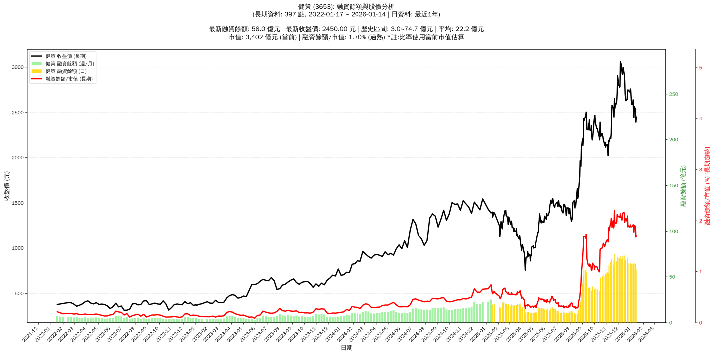

# :chart_with_upwards_trend: 健策 (3653) 融資餘額報告

!!! info "基本資訊"
    **:building_construction: 名稱**: 健策
    **:identification_card: 代號**: 3653
    **:calendar: 分析期間**: 2025-07-18 ~ 2026-01-09 (共 242 個交易日)
    **:clock3: 最新資料**: 2026-01-09
    **🕒 更新時間**: 2026-01-12 12:08:44 CST

## :moneybag: 融資餘額現況

| :chart: 指標 | :1234: 數值 | :traffic_light: 狀態 |
|:------------:|:----------:|:-------------------:|
| **最新融資餘額** | 65.1 億元 (2,537 張) | - |
| **最新收盤價** | 2565.00 元 | - |
| **市值** | 3,666 億元 | - |
| **融資餘額/市值** | 1.78% | 🔴 過熱 |
| **日變化 (DoD)** | +4.6 億元 (+7.67%) | 📈 |
| **週變化 (WoW)** | +1.1 億元 (+1.76%) | 📈 |
| **月變化 (MoM)** | -5.2 億元 (-7.41%) | 📉 |

---

## :bar_chart: 歷史統計

| :chart: 指標 | :1234: 數值 |
|:------------:|:----------:|
| **歷史最高** | 74.7 億元 |
| **歷史最低** | 9.4 億元 |
| **平均值** | 30.4 億元 |
| **標準差** | 21.7 億元 |
| **當前相對位置** | 85.2% |

---

## :chart_with_upwards_trend: 融資餘額趨勢圖

    

---

## :clipboard: 詳細歷史記錄 (最近30日)

<table class="sortable-table">
<thead>
<tr>
<th>:calendar: 日期</th>
<th>:money_with_wings: 收盤價(元)</th>
<th>:chart: 漲跌(元)</th>
<th>:chart_with_upwards_trend: 漲跌(%)</th>
<th>:package: 融資餘額(億元)</th>
<th>:package: 融資餘額(張)</th>
<th>:arrow_up_down: 融資增減(張)</th>
<th>:chart: 融券餘額(張)</th>
<th>:balance_scale: 券資比(%)</th>
</tr>
</thead>
<tbody>
<tr>
<td>2026-01-09</td>
<td>2565.00</td>
<td>🔺 +120.00</td>
<td>+4.91%</td>
<td>65.1</td>
<td>2,537</td>
<td>📈 +65</td>
<td>86</td>
<td>3.39%</td>
</tr>
<tr>
<td>2026-01-08</td>
<td>2445.00</td>
<td>🔻 -40.00</td>
<td>-1.61%</td>
<td>60.4</td>
<td>2,472</td>
<td>📉 -89</td>
<td>81</td>
<td>3.28%</td>
</tr>
<tr>
<td>2026-01-07</td>
<td>2485.00</td>
<td>🔻 -155.00</td>
<td>-5.87%</td>
<td>63.6</td>
<td>2,561</td>
<td>📈 +84</td>
<td>78</td>
<td>3.05%</td>
</tr>
<tr>
<td>2026-01-06</td>
<td>2640.00</td>
<td>🔺 +50.00</td>
<td>+1.93%</td>
<td>65.4</td>
<td>2,477</td>
<td>📉 -9</td>
<td>76</td>
<td>3.07%</td>
</tr>
<tr>
<td>2026-01-05</td>
<td>2590.00</td>
<td>➖ +0.00</td>
<td>+0.00%</td>
<td>64.4</td>
<td>2,486</td>
<td>📈 +17</td>
<td>76</td>
<td>3.06%</td>
</tr>
<tr>
<td>2026-01-02</td>
<td>2590.00</td>
<td>🔻 -155.00</td>
<td>-5.65%</td>
<td>63.9</td>
<td>2,469</td>
<td>📈 +137</td>
<td>79</td>
<td>3.20%</td>
</tr>
<tr>
<td>2025-12-31</td>
<td>2745.00</td>
<td>🔻 -15.00</td>
<td>-0.54%</td>
<td>64.0</td>
<td>2,332</td>
<td>📉 -32</td>
<td>86</td>
<td>3.69%</td>
</tr>
<tr>
<td>2025-12-30</td>
<td>2760.00</td>
<td>🔺 +35.00</td>
<td>+1.28%</td>
<td>65.2</td>
<td>2,364</td>
<td>📈 +25</td>
<td>90</td>
<td>3.81%</td>
</tr>
<tr>
<td>2025-12-29</td>
<td>2725.00</td>
<td>🔻 -15.00</td>
<td>-0.55%</td>
<td>63.7</td>
<td>2,339</td>
<td>📉 -19</td>
<td>93</td>
<td>3.98%</td>
</tr>
<tr>
<td>2025-12-26</td>
<td>2740.00</td>
<td>🔻 -10.00</td>
<td>-0.36%</td>
<td>64.6</td>
<td>2,358</td>
<td>📈 +35</td>
<td>111</td>
<td>4.71%</td>
</tr>
<tr>
<td>2025-12-24</td>
<td>2750.00</td>
<td>🔺 +35.00</td>
<td>+1.29%</td>
<td>63.9</td>
<td>2,323</td>
<td>📉 -299</td>
<td>117</td>
<td>5.04%</td>
</tr>
<tr>
<td>2025-12-23</td>
<td>2715.00</td>
<td>🔺 +70.00</td>
<td>+2.65%</td>
<td>71.2</td>
<td>2,622</td>
<td>📈 +67</td>
<td>118</td>
<td>4.50%</td>
</tr>
<tr>
<td>2025-12-22</td>
<td>2645.00</td>
<td>🔺 +15.00</td>
<td>+0.57%</td>
<td>67.6</td>
<td>2,555</td>
<td>📉 -95</td>
<td>114</td>
<td>4.46%</td>
</tr>
<tr>
<td>2025-12-19</td>
<td>2630.00</td>
<td>🔻 -25.00</td>
<td>-0.94%</td>
<td>69.7</td>
<td>2,650</td>
<td>📈 +69</td>
<td>113</td>
<td>4.26%</td>
</tr>
<tr>
<td>2025-12-18</td>
<td>2655.00</td>
<td>🔻 -50.00</td>
<td>-1.85%</td>
<td>68.5</td>
<td>2,581</td>
<td>📈 +29</td>
<td>143</td>
<td>5.54%</td>
</tr>
<tr>
<td>2025-12-17</td>
<td>2705.00</td>
<td>🔻 -135.00</td>
<td>-4.75%</td>
<td>69.0</td>
<td>2,552</td>
<td>📈 +196</td>
<td>163</td>
<td>6.39%</td>
</tr>
<tr>
<td>2025-12-16</td>
<td>2840.00</td>
<td>🔻 -75.00</td>
<td>-2.57%</td>
<td>66.9</td>
<td>2,356</td>
<td>📉 -157</td>
<td>184</td>
<td>7.81%</td>
</tr>
<tr>
<td>2025-12-15</td>
<td>2915.00</td>
<td>🔻 -80.00</td>
<td>-2.67%</td>
<td>73.3</td>
<td>2,513</td>
<td>📈 +63</td>
<td>193</td>
<td>7.68%</td>
</tr>
<tr>
<td>2025-12-12</td>
<td>2995.00</td>
<td>🔺 +65.00</td>
<td>+2.22%</td>
<td>73.4</td>
<td>2,450</td>
<td>📉 -34</td>
<td>201</td>
<td>8.20%</td>
</tr>
<tr>
<td>2025-12-11</td>
<td>2930.00</td>
<td>🔺 +10.00</td>
<td>+0.34%</td>
<td>72.8</td>
<td>2,484</td>
<td>📈 +77</td>
<td>201</td>
<td>8.09%</td>
</tr>
<tr>
<td>2025-12-10</td>
<td>2920.00</td>
<td>🔻 -30.00</td>
<td>-1.02%</td>
<td>70.3</td>
<td>2,407</td>
<td>📈 +87</td>
<td>211</td>
<td>8.77%</td>
</tr>
<tr>
<td>2025-12-09</td>
<td>2950.00</td>
<td>🔻 -70.00</td>
<td>-2.32%</td>
<td>68.4</td>
<td>2,320</td>
<td>📈 +27</td>
<td>189</td>
<td>8.15%</td>
</tr>
<tr>
<td>2025-12-08</td>
<td>3020.00</td>
<td>🔻 -40.00</td>
<td>-1.31%</td>
<td>69.2</td>
<td>2,293</td>
<td>📉 -79</td>
<td>215</td>
<td>9.38%</td>
</tr>
<tr>
<td>2025-12-05</td>
<td>3060.00</td>
<td>🔺 +275.00</td>
<td>+9.87%</td>
<td>72.6</td>
<td>2,372</td>
<td>📉 -145</td>
<td>254</td>
<td>10.70%</td>
</tr>
<tr>
<td>2025-12-04</td>
<td>2785.00</td>
<td>🔺 +5.00</td>
<td>+0.18%</td>
<td>70.1</td>
<td>2,517</td>
<td>📉 -14</td>
<td>182</td>
<td>7.23%</td>
</tr>
<tr>
<td>2025-12-03</td>
<td>2780.00</td>
<td>🔻 -20.00</td>
<td>-0.71%</td>
<td>70.4</td>
<td>2,531</td>
<td>➡️ +0</td>
<td>181</td>
<td>7.15%</td>
</tr>
<tr>
<td>2025-12-02</td>
<td>2800.00</td>
<td>➖ +0.00</td>
<td>+0.00%</td>
<td>70.9</td>
<td>2,531</td>
<td>📈 +8</td>
<td>203</td>
<td>8.02%</td>
</tr>
<tr>
<td>2025-12-01</td>
<td>2800.00</td>
<td>🔻 -105.00</td>
<td>-3.61%</td>
<td>70.6</td>
<td>2,523</td>
<td>📈 +61</td>
<td>202</td>
<td>8.01%</td>
</tr>
<tr>
<td>2025-11-28</td>
<td>2905.00</td>
<td>🔺 +190.00</td>
<td>+7.00%</td>
<td>71.5</td>
<td>2,462</td>
<td>📉 -197</td>
<td>222</td>
<td>9.02%</td>
</tr>
<tr>
<td>2025-11-27</td>
<td>2715.00</td>
<td>🔺 +80.00</td>
<td>+3.04%</td>
<td>72.2</td>
<td>2,659</td>
<td>📈 +110</td>
<td>229</td>
<td>8.61%</td>
</tr>
</tbody>
</table>

---

## :information_source: 資料來源與方法

!!! note "資料來源說明"
    - **主要來源**: `raw_margin_daily.csv` (Type 13: ShowMarginChart)
    - **資料頻率**: 每日更新
    - **資料範圍**: 近1年交易日資料

!!! info "報告元資訊"
    - **報告產生時間**: 2026-01-12 12:08:44
    - **分析期間**: 242 個交易日
    - **資料來源**: Stage 1 Raw Margin Daily Data

---

:material-information-outline: **本報告僅供參考，投資決策請審慎評估**

